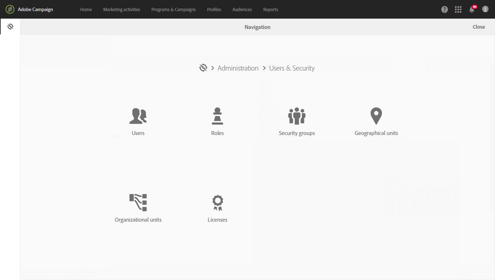

# About access management

About access management

Adobe Campaign allows you to define and manage the permissions assigned to different users. Permissions are a set of rights and restrictions that authorize or deny access to certain functionalities or objects in the interface. These permissions are based on two concepts:

* **Geographical and Organizational units**: These allow you to define a hierarchy of permissions on the different objects of the platform (emails, workflows, templates, users, profiles, etc.). Refer to the [Organizational and geographical units](../../administration/using/organizational-and-geographical-units.md) section.
* **Roles**: A set of unitary rights that allow you to define the authorizations assigned to users and user groups. Refer to the [List of roles](../../administration/using/list-of-roles.md) section.

Roles, groups, and geographical and organizational units can be managed by the functional administrator of the platform, under the **Administration > Users & Security** menu. 

Users are managed in the Admin console (refer to the [Managing groups and users](../../administration/using/managing-groups-and-users.md) section or the [Admin console documentation](https://helpx.adobe.com/enterprise/managing/user-guide.html)).

>[!CAUTION]
>
>Only users with administration rights have access to user management.

**Related topics**

* [Organizational and geographical units](../../administration/using/organizational-and-geographical-units.md)
* [List of roles](../../administration/using/list-of-roles.md)
* [Managing groups and users](../../administration/using/managing-groups-and-users.md)

