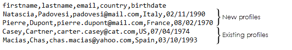
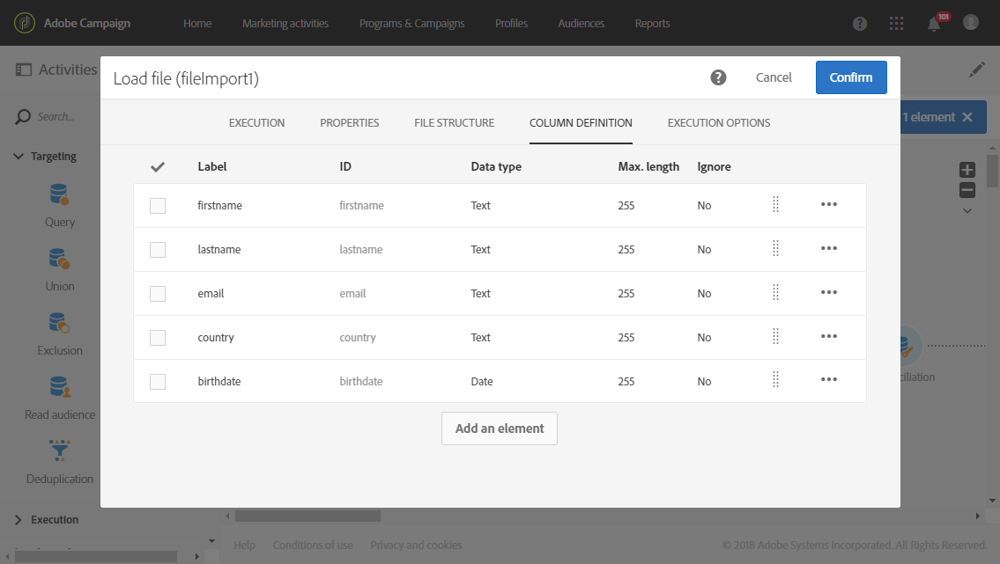
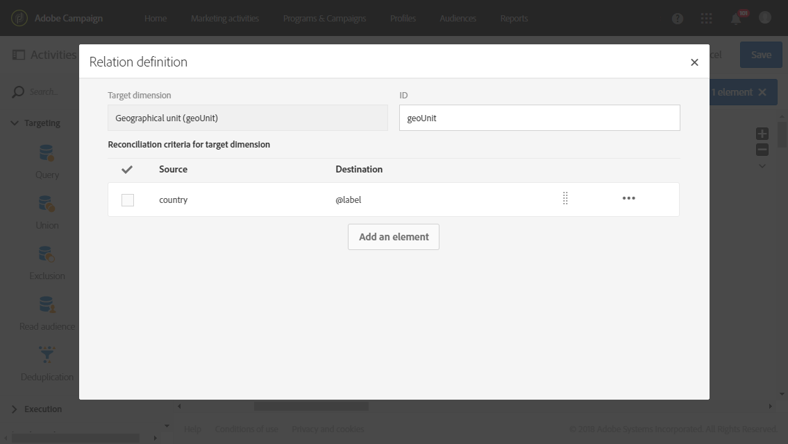
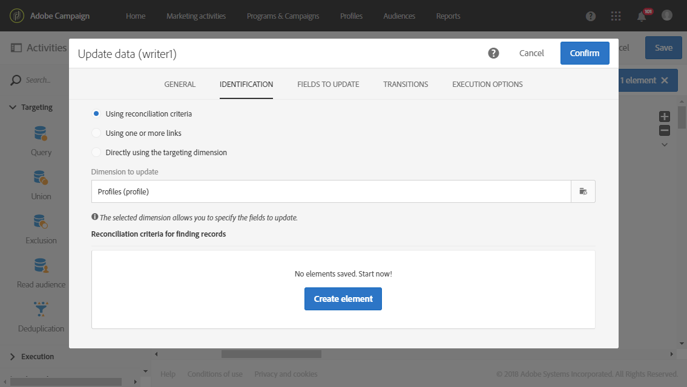
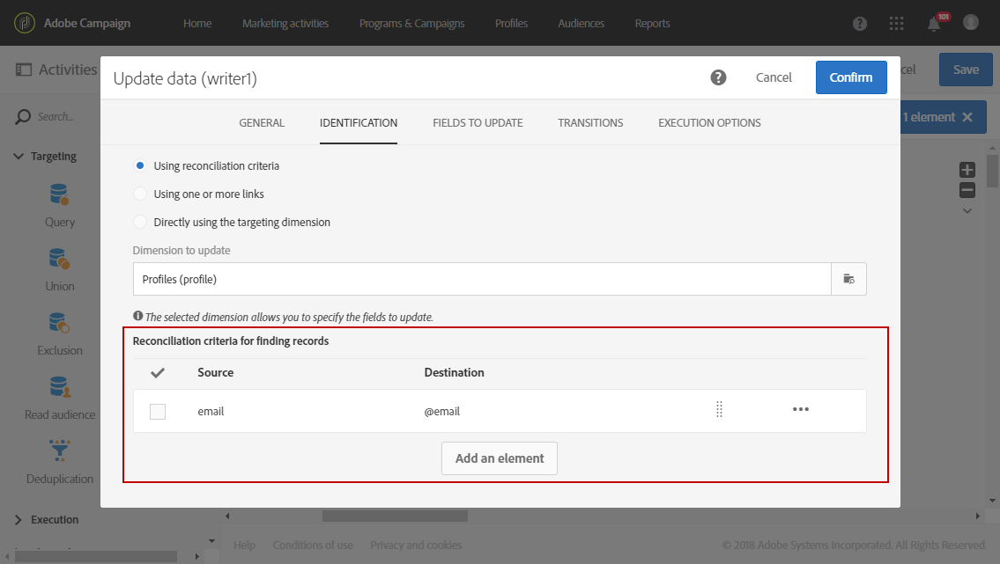
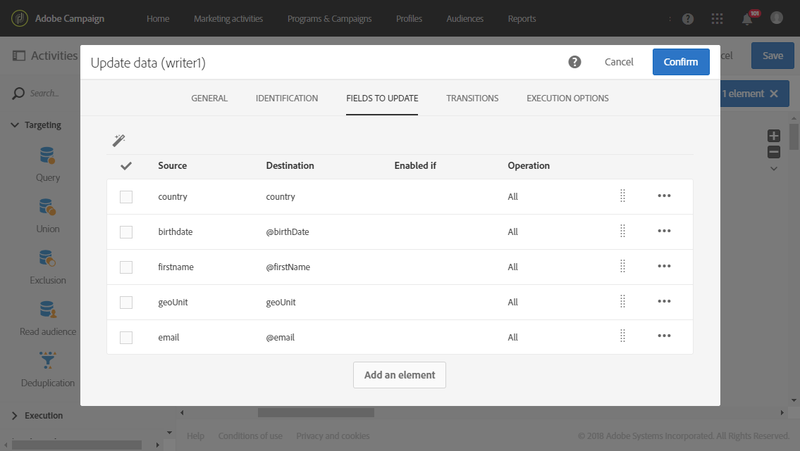
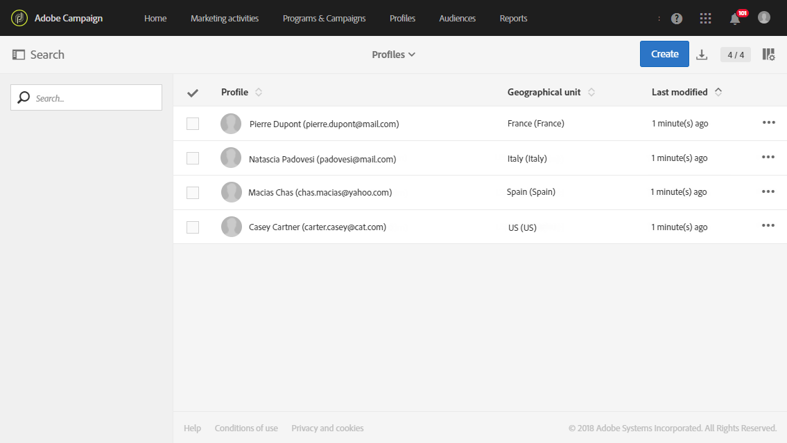

# Organizational and geographical units

Organizational and geographical units

## About units

Each object and user of the platform is linked to a geographical and organizational unit. These units allow a hierarchical structure to be defined in order to give users a filtered view. A user's unit defines their access level for different platform objects.

>[!CAUTION]
>
>If a user is not linked to any unit, that user will not be able to connect to Adobe Campaign. If you would like to restrict access for a particular user or group of users, do not link it to the **All** unit.

A user has read-only access to all of the objects in the parent units. He has read and write access to all objects of his unit and child units. A user does not have access to objects in parallel branches.

By default, only the **All** units are available.

When the user is assigned geographical and organizational units, these units will always be applied to the objects the user created.

If we take a user linked to the NAM geographical unit (North America). This user has read-only access to objects linked to the Americas and ALL units. He also has read and write access to the objects linked to his unit and child units: NAM, Canada, US, and Mexico. The user does not have access to other branches in the hierarchy (LATAM, EMEA, APAC).

>[!NOTE]
>
>When a user is in several groups linked to different units, certain rules are applied. For more information, refer to the [Managing groups and users](../../administration/using/managing-groups-and-users.md) section.

## Creating and managing units

>[!CAUTION]
>
>Note that new Campaign Standard instances, as well as existing instances with no geographical units created, cannot have the geographical unit capability implemented starting 18.7 release.

Geographical and organizational units allow you to filter your tenant depending on the country or organization your users are linked to.

Here, we previously created security groups with different roles to two users: one user is assigned the security groups Administrators and Europe, the other user belongs to the security groups Standard user and France. See [Creating a security group and assigning users](../../administration/using/managing-groups-and-users.md#creating-a-security-group-and-assigning-users) for the full example.

We now need to create the geographical and organizational units for the France and Europe security groups:

1. From Adobe campaign advanced menu, select **Administration** > **Users & security** > **Geographical units**.
1. Click **Create **to start configuring your geographical unit.

   

1. Change the default **Label** and **ID** to Europe.
1. Then, link this unit to a parent unit. Here, we chose **All**.

   

1. Finally, click **Create** to start assigning your new geographical unit to security group.
1. Follow the same procedure for the France unit, except that its parent unit has to be the previously created unit, Europe.

   

To see the impact of assigning different units to different security group, the user assigned to the Administrator and Europe groups will create two email templates to see what the other user assigned to Standard User and France can or cannot access.

1. From the advanced menu, select **Resources** > **Templates** > **Delivery Templates**.
1. Duplicate an existing template and personalize it as needed. For more on this, refer to the [About templates](../../start/using/about-templates.md) section.
1. When the template is created, select the **Edit properties** icon to assign units to your template.

   

1. In the **Access authorization** drop down menu, select the geographical and organizational unit.

   Here we are going to create one template with the previously created geographical unit Europe.

   

1. Follow the same procedures to create the second template assigned to the previously created France geographical unit.

The user assigned to the Standard User and France groups will be able to see both templates. Because of the hierarchical structure of the geographical units, he will have read and write access to the template linked to the France unit and only read-only access to the template linked to the Europe unit.

Since the France unit is a child unit of Europe, the following message appears when the user tries to modify the Europe template: 

Geographical and organizational units can restrict the access to different products such as profiles. For example, if our France user access the Profiles tab, he will be able to fully access and modify the profiles with the France geographical unit.

Whereas the profiles with the Europe geographical unit will be read only, the following error will appear if our user tries to modify one profile: You do not have the rights needed to modify the 'profile' resource of ID.

## Partitioning profiles

If your organization needs to isolate the profiles contacted by each of your different brands, you can partition your profiles by their organizational or geographical units.

By default, the organizational or geographical unit fields are not available on your profiles and need to be added.

Profiles with no organizational or geographical units cannot be accessed by users.

>[!CAUTION]
>
>We recommend adding this option before importing any profiles. If you have already imported your customer database, an update is necessary in order to set the organizational and geographical unit values on the already imported Profiles.

1. From the advanced menu, via the Adobe Campaign logo, select **Administration > Development > Custom resources**.
1. Select **Profile** or create a new custom resource to extend the profiles.
1. Check the **Add access authorization management fields** box to add the organizational and geographical units in the **Profile** extension.

   

1. Click **Save**.
1. Update the structure by re-publishing the custom resources. For more information about the publication process, refer to [Updating the structure](../../developing/using/data-model-concepts.md) section.

The organizational and geographical unit fields are added to your profiles in the **Access authorization** section. 

**Related topics**:

* [About units](../../administration/using/organizational-and-geographical-units.md#about-units)
* [About access management](../../administration/using/about-access-management.md)

## Example: Add or update a profile's geographical unit with an import workflow

In this example, we want to add new profiles but also update existing ones and reconcile their countries with the corresponding geographical units in Adobe Campaign.

To do so, we will import in a **Load file** activity, a file containing new or existing profiles with the following information: first name, last name, email, country and birthdate. The profiles will then be added or updated with the **Update data** activity.

>[!NOTE]
>
>This example assumes that all needed geographical units are already configured in Adobe Campaign.

Here, in the imported file, four profiles are detailed: two new profiles and two existing ones which will be updated with their respective geographical units.

1. From the **Marketing activities** tab, create a workflow. For more on this, refer to this page.
1. Drag and drop a **Load file** activity to your workflow and open it to select your file to import.
1. Select **Use the last uploaded file** and check in the **Column definition** tab that your values were correctly added.

   

1. Drag and drop a **Reconciliation** activity. This query allows you to reconcile the country value from your file with the geographical units from Adobe Campaign.
1. In the **Relations** tab of your activity, click **Create element**. Here we are targeting the geographical unit dimension.
1. In the **Reconciliation criteria for target dimension** field, click **Create Element**.

   In our case, the **Source** corresponds to the country value of the imported file which matches with the **Label** field of the geographical unit. 

   

1. Drag and drop an **Update data** activity to add your new profiles or update your existing profiles.
1. In the **Identification** tab of your activity, select **Using reconciliation criteria** and the value **Profiles** as **Dimension to update**.

   

1. Click the **Create element** button in the **Reconciliation criteria for finding records** field. Here, we choose the email as a reconciliation criterion of existing profiles.

   

1. Use the  

   icon to automatically detect the fields from the imported file.

   >[!NOTE]
   >
   >In this example, the **Country** field has been automatically detected but needs to be deleted since it is only used to update our profiles' geographical units.

   

1. Start your workflow.

The new profiles have been added with geographical units corresponding to their countries and existing profiles have been updated with the corresponding geographical units.

