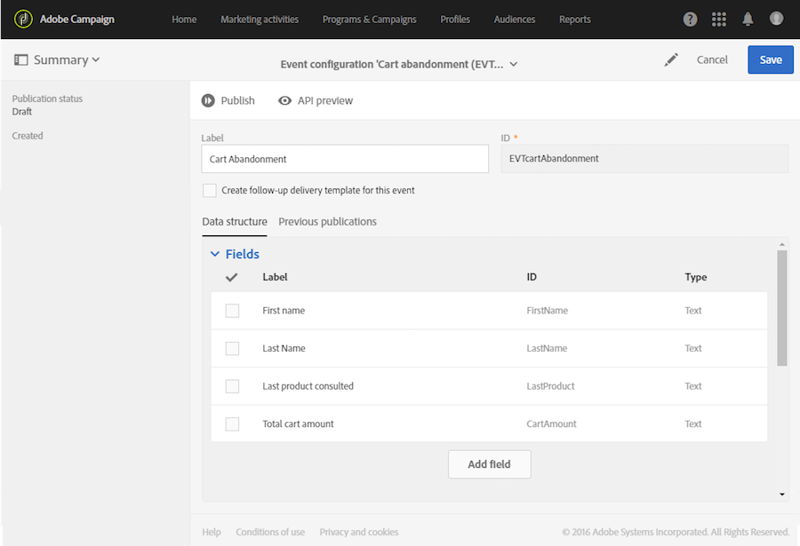
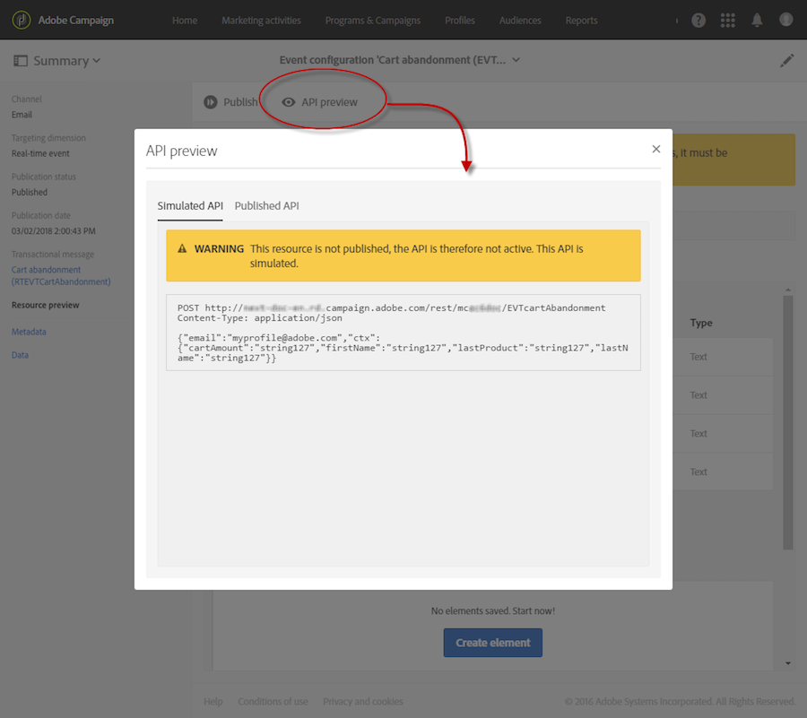
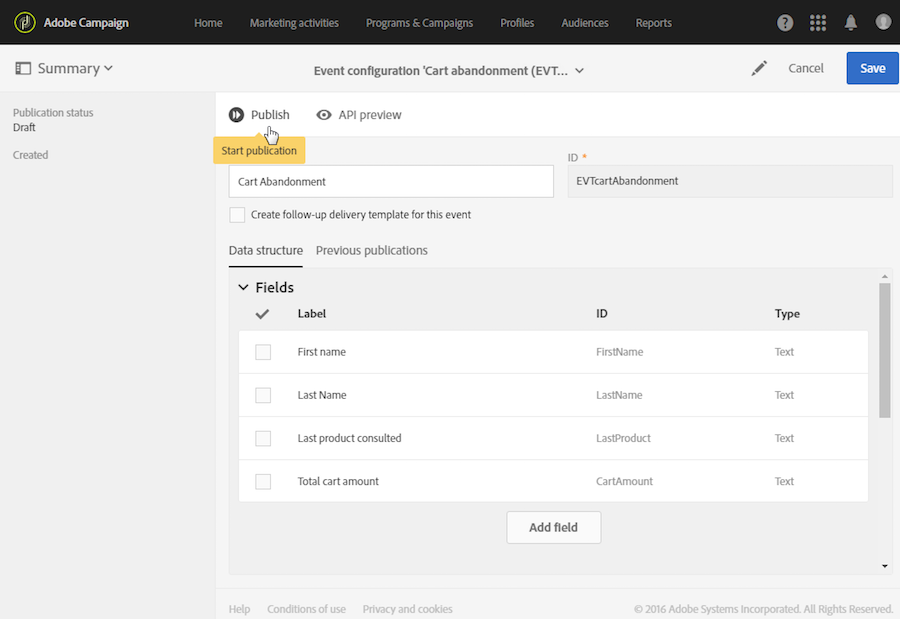
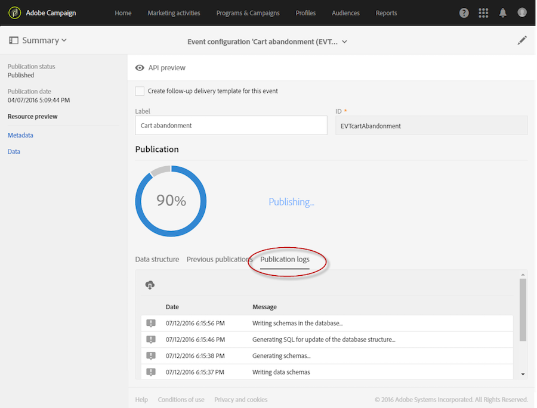
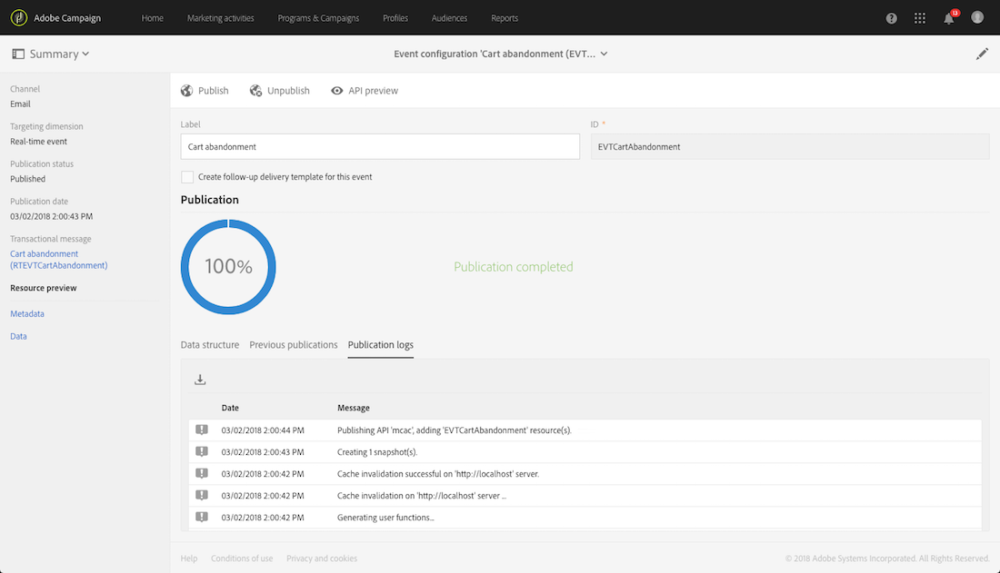
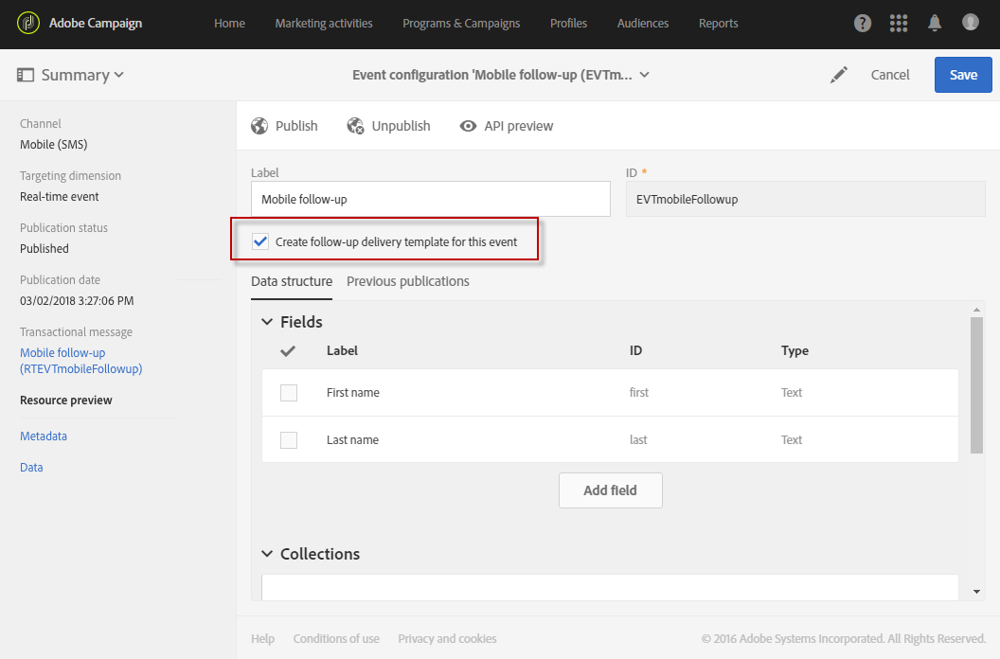

# Transactional messaging configuration

Transactional messaging configuration

To send a transactional message with Adobe Campaign, your first need to describe the structure of the event data. This step must be performed by an **administrator** in the Adobe Campaign interface.

Depending on the type of transactional message you want to send, the configuration can vary. See [About transactional messaging](../../channels/using/about-transactional-messaging.md).

## Configuring an event to send an event transactional message

To send an event-based transactional message, you first need to create and configure an event targeting the data contained in the event itself. The corresponding steps are presented below.

Publishing this event configuration automatically creates a transactional message. See [Event transactional messages](../../channels/using/event-transactional-messages.md).

### Creating an event

Start by configuring the event corresponding to your needs. In the example described in the [Transactional messaging operating principle](../../channels/using/about-transactional-messaging.md#transactional-messaging-operating-principle) section, you want to create a cart abandonment event that will trigger the sending of a transactional message.

1. Click the **Adobe Campaign** logo, in the top left corner, then select **Marketing plans** > **Transactional messages** > **Event configuration**.
1. Click the **Create** button.

   

1. In this example, name your event "Cart abandonment" and use "EVTcartAbandonment" as the ID. If you do not use the EVT prefix in your ID, it is automatically added once you click **Create**. The **ID** field is mandatory.
1. Select the channel that will be used to send your transactional messages: **Email**, **Mobile (SMS)** or **Mobile application** (push notification). In this example, select **Email**.

   For more information on the **Mobile application** channel, see [Configuring an event to send a transactional push notification](../../administration/using/transactional-messaging-configuration.md#configuring-an-event-to-send-a-transactional-push-notification).

   >[!NOTE]
   >
   >Only one channel can be used for each event configuration. Once the event is created, you cannot change the channel.

1. To create an event-based transactional message, select the **Real-time event** targeting dimension and click **Create**.

The event configuration is created.

### Defining event attributes

In the **Fields** section, define the attributes that will be integrated into the event content and will then be able to be used to personalize the transactional message.

The steps for adding and modifying fields are the same as for [custom resources](../../developing/using/data-model-concepts.md).

In this example, we have added the following fields:

* Last name
* First name
* Last product consulted
* Total cart amount

>[!NOTE]
>
>If you want to create a multilingual transactional message, define an additional event attribute with the **AC_language** ID. This only applies to event transactional messages. After the event is published, the steps for editing the content of a multilingual transactional message are the same as for a multilingual standard email. See [Creating a multilingual email](../../channels/using/creating-a-multilingual-email.md).

### Enriching the transactional message content

Event-based transactional messaging is supposed to use only the data that are in the sent event to define the recipient and the message content personalization. However, you can enrich the content of your transactional message using information from the Adobe Campaign marketing database.

From the last name and first name of each of your recipients, for example, you can recover data such as their title in order to personalize the information that is sent to them.

1. In the **Enrichment** section, click the **Create element** button and select the resource with which you want to link your message.

   

1. In our example, select the **Profile** table.

   

1. Use the **Create element** button to link a field in the **Profile** table to one of the fields that you just created (see [Defining event attributes](../../administration/using/transactional-messaging-configuration.md#defining-event-attributes)).

   

1. In this example, reconcile the **Last name** and the **First name** fields with the corresponding fields in the **Profile** table.

   

Once the event and the message are published, the link with the **Profile** table allows you to enrich the content of the transactional message. See [Personalizing a transactional message](../../channels/using/event-transactional-messages.md#personalizing-a-transactional-message).

### Previewing and publishing the event

Before being able to use the event, you must preview and publish it.

1. Click the **API preview** button to see a simulation of the REST API that will be used by your website developer before it is published.

   Once the event is published, this button also allows you to see a preview of the API in production. See [Site integration](../../administration/using/transactional-messaging-configuration.md#site-integration).

   

   The REST API varies according to the selected channel:

    * It contains the "email" attribute if you selected the **Email** channel.
    * It contains the "mobilePhone" attribute if you selected the **Mobile (SMS)** channel.
    * It contains the "registrationToken", the "application" and the "pushPlatform" attributes if you selected the **Mobile application** channel. See [Configuring an event to send a transactional push notification](../../administration/using/transactional-messaging-configuration.md#configuring-an-event-to-send-a-transactional-push-notification).

1. Click **Publish** to start publication.

   

1. You can view the publication logs by selecting the corresponding tab.

   

   You can also consult the previous publications by selecting the corresponding tab.

   

>[!NOTE]
>
>Each time you modify the event, you must click **Publish** again to generate the updated REST API that will be used by your website developer.

Once the event has been published, a transactional message linked to the new event is automatically created. In order for this event to trigger sending a transactional message, you must modify and publish the message that was just created. See [Event transactional messages](../../channels/using/event-transactional-messages.md).

You also have to integrate this trigger event into your website. See [Site integration](../../administration/using/transactional-messaging-configuration.md#site-integration).

### Unpublishing an event

The **Unpublish** button lets you cancel the publication of the event, which deletes from the REST API the resource corresponding to the event that you previously created. Now, even if the event is triggered through your website, the corresponding messages are not sent anymore and they are not stored in the database.

>[!NOTE]
>
>If you have already published the corresponding transactional message, the transactional message publication is also canceled. See [Unpublishing a transactional message](../../channels/using/event-transactional-messages.md#unpublishing-a-transactional-message).

Click the **Publish** button to generate a new REST API.

## Configuring an event to send a profile transactional message

To send a profile-based transactional message, you first need to create and configure an event targeting the Adobe Campaign database. The corresponding steps are presented below.

Publishing this event configuration automatically creates a transactional message. See [Profile transactional messages](../../channels/using/profile-transactional-messages.md).

1. Create an event configuration. See [Creating an event](../../administration/using/transactional-messaging-configuration.md#creating-an-event).

   In the **Configure an event** window, select the **Profile** targeting dimension to create an profile-based transactional message.

   

1. In this example, create three fields in the **Fields** section: **Email**, **Last name** and **Offer**. Note that **Email** and **Last name** will be used for reconciliation with the **Profile** table.

   For more information on defining the event configuration's fields, see [Defining event attributes](../../administration/using/transactional-messaging-configuration.md#defining-event-attributes).

1. To link the event to the **Profile** table, create an enrichment. See [Enriching the transactional message content](../../administration/using/transactional-messaging-configuration.md#enriching-the-transactional-message-content).

   

   >[!NOTE]
   >
   >Creating an enrichment is mandatory when using a **Profile** targeting dimension.

1. In the **New enrichment** window, select **Profile** as the target resource.

   In this example, reconcile the **Email** and the **Last name** fields with the corresponding fields from the **Profile** table. Click **Confirm**.

   

1. In the **Targeting enrichment** section, you can now select the enrichment that will be used as the message target during the delivery execution. In this example, select **Profile**.

   

   >[!NOTE]
   >
   >A targeting enrichment must be selected.

1. Click the **API preview** button. Note that the REST API does not contain an attribute specifying the email address as it will be retrieved from the **Profile** table.

   

1. Save your changes and publish the event configuration. See [Previewing and publishing the event](../../administration/using/transactional-messaging-configuration.md#previewing-and-publishing-the-event).

Once the event has been published, a transactional message linked to the new event is automatically created. To modify and publish the message that was just created, see [Sending a profile transactional message](../../channels/using/profile-transactional-messages.md#sending-a-profile-transactional-message).

## Configuring an event to send a transactional push notification

To be able to send transactional push notifications, you need to configure Adobe Campaign accordingly. See [Push configuration](../../administration/using/push-configuration.md).

### Transactional push notification targeting an event

To send an anonymous transactional push notification to all users who have opted in to receive notifications from your mobile application, you first need to create and configure an event targeting the data contained in the event itself. The corresponding steps are presented below.

Publishing this event configuration automatically creates a transactional message. See [Transactional push notifications targeting an event](../../channels/using/transactional-push-notifications.md#transactional-push-notifications-targeting-an-event).

The event must contain the three following elements:

* A **registration token**, which is the user ID for one mobile application and one device. It may not correspond to any profile from the Adobe Campaign database.
* A **mobile application name** (one for all devices - Android and iOS). This is the ID of the mobile application configured in Adobe Campaign that will be used to receive push notifications on the users' devices. For more on this, see [Setting up a mobile application in Adobe Campaign](../../administration/using/transactional-messaging-configuration.md#setting-up-a-mobile-application-in-adobe-campaign).
* A **push platform** ("gcm" for Android or "apns" for iOS).

1. Create an event configuration. See [Creating an event](../../administration/using/transactional-messaging-configuration.md#creating-an-event).
1. In the **Configure an event** window, select the **Mobile application** channel and the **Real-time event** targeting dimension.

   

1. In this example, create three fields: **Email**, **Last name** and **Gate number**.

   

   For more information on defining the event configuration's fields, see [Defining event attributes](../../administration/using/transactional-messaging-configuration.md#defining-event-attributes).

1. Click the **API preview** button to see a simulation of the REST API.

   

   It contains the "registrationToken", the "application" and the "pushPlatform" attributes that will be used to target the delivery.

1. Save your changes and publish the event configuration. See [Previewing and publishing the event](../../administration/using/transactional-messaging-configuration.md#previewing-and-publishing-the-event).

Once the event has been published, a transactional push notification linked to the new event is automatically created. To modify and publish the message that was just created, see [Sending a transactional push notification targeting an event](../../channels/using/transactional-push-notifications.md#sending-a-transactional-push-notification-targeting-an-event).

### Transactional push notification targeting a profile

To send a transactional push notification to the Adobe Campaign profiles who have subscribed to your mobile application, you first need to create and configure an event targeting the Adobe Campaign database. The corresponding steps are presented below.

Publishing this event configuration automatically creates a transactional message. See [Transactional push notifications targeting a profile](../../channels/using/transactional-push-notifications.md#transactional-push-notifications-targeting-a-profile).

1. Create an event configuration.

   See [Configuring an event to send an event transactional message](../../administration/using/transactional-messaging-configuration.md#configuring-an-event-to-send-an-event-transactional-message).

1. In the **Configure an event** window, select the **Mobile application** channel and the **Profile** targeting dimension.

   

1. In this example, only create two fields: **Email** and **Gate number**. Note that **Email** will be used for reconciliation with the **Profile** table.

   

   >[!NOTE]
   >
   >You do not need to create fields such as **First name** and **Last name** as you will be able to use personalization fields from the Adobe Campaign database.

   For more information on defining the event configuration's fields, see [Defining event attributes](../../administration/using/transactional-messaging-configuration.md#defining-event-attributes).

1. To link the event to the **Profile** table, create an enrichment. Use the email as the join definition. For more on this, see [Enriching the transactional message content](../../administration/using/transactional-messaging-configuration.md#enriching-the-transactional-message-content).

   

1. Click the **API preview** button. Note that the REST API does not contain an attribute specifying the registration token, the application name and the push platform as they will be retrieved from the **Profile** table.

   

1. Save your changes and publish the event configuration. See [Previewing and publishing the event](../../administration/using/transactional-messaging-configuration.md#previewing-and-publishing-the-event).

Once the event has been published, a transactional push notification linked to the new event is automatically created. To modify and publish the message that was just created, see [Sending a transactional push notification targeting a profile](../../channels/using/transactional-push-notifications.md#sending-a-transactional-push-notification-targeting-a-profile).

## Configuring an event to send a follow-up message

A follow-up message can be sent to the recipients of a specific transactional message. For more on this, see [Follow-up messages](../../channels/using/follow-up-messages.md).

1. Use the same event configuration that you created to send an event transactional message. See [Configuring an event to send an event transactional message](../../administration/using/transactional-messaging-configuration.md#configuring-an-event-to-send-an-event-transactional-message).
1. When configuring your event, check the **Create follow-up delivery template for this event** box before publishing the event.

   

1. Publish the event.

This creates a transactional message, but also a follow-up delivery template. For more on using follow-up messages, see [Sending a follow-up message](../../channels/using/follow-up-messages.md#sending-a-follow-up-message).

## Site integration

Once you have created an event, you will have to integrate the triggering of this event into your website.

In the example described in the [Transactional messaging operating principle](../../channels/using/about-transactional-messaging.md#transactional-messaging-operating-principle) section, you want a "Cart abandonment" event to be triggered whenever one of your clients leaves your website before purchasing the products in their cart. To do this, your website web developer must use the Adobe Campaign Standard REST API.

See the [REST API Documentation](https://docs.campaign.adobe.com/doc/standard/en/api/ACS_API.html) (**Transactional Messages API** section).
