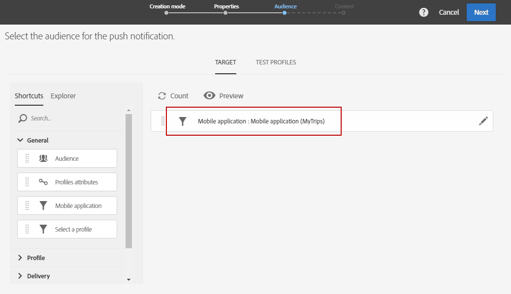

# Creating a multilingual push notification

Creating a multilingual push notification

## About multilingual push notification

Personalize your push notification content by sending messages based on your users' preferred languages and regions. You can directly import multilingual push notification content variants in the content editor and send a multilingual push notification in a single delivery.

This feature leverages either preferred languages specified in recipients' profiles or system language preference for Mobile App Subscribers depending on the delivery template used for push notification. If language preference is not populated for a particular user, the system will use the default variant that is defined while creating a multilingual push notification. For more information on how to manage your profiles and subscribers, refer to this [guide](../../audiences/using/about-profiles-and-audiences.md).

To use multilingual content variants for your push notification delivery, follow these steps:

1. [Step 1: Upload multilingual content variant](../../channels/using/creating-a-multilingual-push-notification.md#step-1--upload-multilingual-content-variant)
1. [Step 2: Preview and finalize a push notification using multilingual content variants](../../channels/using/creating-a-multilingual-push-notification.md#step-2--preview-and-finalize-a-push-notification-using-multilingual-content-variants)
1. [Step 3: Send and analyze multilingual push notification delivery](../../channels/using/creating-a-multilingual-push-notification.md#step-3--send-and-analyze-multilingual-push-notification-delivery)

## Step 1: Upload multilingual content variant

Before personalizing your multilingual push notification, we first need to upload the content variants in a multilingual delivery template and create the delivery.

>[!NOTE]
>
>You can also skip this step if you want to create a variant manually for each language variant.

1. In the **Marketing activities**, click the **Create** button then select **Mobile app notification**.
1. Select the template **Send multilingual push to Campaign profiles** if you want to target the Adobe Campaign profiles who have subscribed to your mobile application or the template** Send multilingual push to app subscriber** to send a push notification to all users who have opted in to receive notifications from your mobile application.

   

1. Enter the push notification properties such as the label, description, etc.
1. In the **Audiences** windows, drag and drop queries to fine tune your audience.

   The queries added depend on the chosen template: if you chose the **Send multilingual push to Campaign profiles** template you can query known recipients of your mobile application. Whereas if you chose the **Send multilingual push to app subscriber** template, you can query all subscribers of a particular app who have opted in.

   

1. In the **Manage Content Variants** window, drag and drop your file or select a file from your computer.

   The file has to be UTF8 encoded and must have a specific layout which can be found by clicking the **Download the sample file** option. You should also use the proper syntax for locale values. For more information regarding the file format and the supported locales, refer to this [technote](http://helpx.adobe.com/campaign/kb/acs-generate-csv-multilingual-push.html).

   

1. After uploading your file, the language variants are automatically populated in the **Variants** tab. Note that you can provide a **Default variant** in the file which will be your default content variant if no preferred language is specified for the targeted user.

   

1. The **Variant selection** tab will provide a script to determine which language preference to take into account depending on the delivery template. This is an out-of-the-box script that does not require you to make any changes.
1. If you want to add more variants not present in the imported file, you can do so by clicking the **Add an element** button and add as many new language variants as needed.

   By adding variants other than the ones uploaded from the file, no content will be linked to this language. You will have to edit the content directly in the delivery dashboard.

   

1. Click **Create** when the configuration is done. You can always come back to the **Content variant** window and make some changes from your delivery dashboard.

   

You can now start personalizing your multilingual push notification.

## Step 2: Preview and finalize a push notification using multilingual content variants

After uploading the file containing content variants, you can now preview the different variants from your push notification delivery.

It is also possible to create and edit more variants in addition to the ones uploaded from the file.

1. In the **Content** window from the delivery dashboard, the drop-down allows you to preview your push notification content depending on the chosen language.

   

1. If a content variant is not specified for a particular language, click the bell icon underneath the preview to start adding content to this language variant.

   By clicking the **Content** window, the push notification represents the content from the language selected in the drop down. Changes made in this window will only impact one language.

1. You can also click on a content variant to further customize it for example with personalization fields.

   For more information on how to customize your push notification, refer to this [section](../../channels/using/customizing-a-push-notification.md).

   

1. Click the **Content variant** window if you want to add or delete language variants.

   Please note that by adding a new language, you will have to manually add content to the push notification linked to the added language.

   

Your multilingual push notification delivery is now ready to be sent.

## Step 3: Send and analyze multilingual push notification delivery

Your multilingual content variant push notifications are now ready to be sent to your users.

1. To start preparing the send, click the **Prepare** button.
1. When the preparation is finished with no warnings, you can click the **Confirm** button to start sending your multilingual push.

   

1. After successfully sending your push notification, click the **Reports** icon then **Dynamic reports** to analyze the success of your delivery.

   

1. Select **Push notification report**.
1. Drag and drop the **Variant** dimension to your panel to start filtering your data.

   

You can now measure the impact of your multilingual push notification delivery on your recipients.
