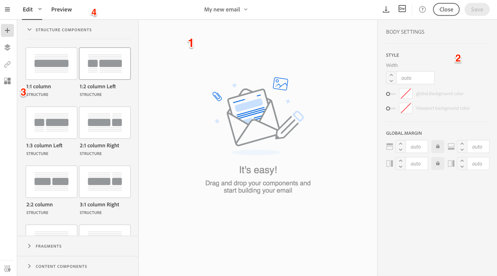
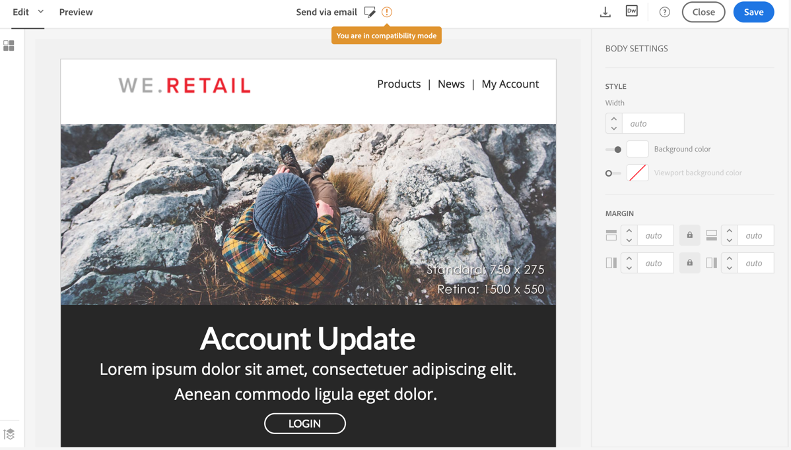

# About email content design

About email content design

Adobe Campaign provides you with two editors that allow you to design content for your emails.

* The new [Creative Designer](../../designing/using/about-email-content-design.md#using-the-creative-designer) enables you to smoothly edit the content of your emails in a variety of ways.
* You can still use the [content editor](../../designing/using/about-email-content-design.md#using-the-email-content-editor) to modify your emails. It also enables you to customize landing pages, SMS messages and push notifications.

>[!NOTE]
>
>To modify email content, Adobe recommends leveraging the extended functionality of the new Creative Designer which is user-friendly, powerful and faster.

The Creative Designer offers extended functionalities compared to the default content editor. However, it does not support yet the following features:

* The use of dynamic images from Adobe Target. See [Working with Campaign and Target](../../integrating/using/about-campaign-target-integration.md).
* The ability to retrieve content from a URL automatically at preparation time. See [this section](../../designing/using/importing-content-from-a-url.md#retrieving-content-from-a-url-automatically-at-preparation-time).
* Fully compliant out-of-the box content templates. To create compatible templates, see [this section](../../designing/using/editing-existing-contents-with-the-creative-designer.md).

## 
Using the Creative Designer

The Creative Designer allows you to create email content and email content templates. It is compatible with simple emails, transactional emails, A/B test emails, multilingual emails, and recurring emails.

When creating an email, choose the **Use the Creative Designer** option. When editing the content of an email, click **Content** in the email dashboard. The Creative Designer opens by default.

If you wish to use the simple content editor, click **Use the default editor**. For more on the content editor, see [this section](../../designing/using/about-email-content-design.md#using-the-email-content-editor).

>[!NOTE]
>
>The Creative Designer is currently in Beta mode. To use it, you have to agree with the Terms and Conditions displayed when selecting this editor in the interface. To help us improve it, you can provide feedback on the [Adobe dedicated forum](https://forums.adobe.com/community/experience-cloud/marketing-cloud/campaign/creative-designer-email-beta).

Check out this [introduction video](https://www.youtube.com/watch?time_continue=1&v=5S_6A4fsfms).

### 
About the Creative Designer interface

The Creative Designer provides many options that allow you to create, edit and customize every aspect of your content.

The interface is composed of several areas offering different functionalities:

From the elements available in the **Palette** (3), drag and drop structure components and content fragments in the main **Workspace** (1). Select a component or element in the **Workspace** (1) and customize its main styling and display characteristics from the **Settings** pane (2).

Access more general options and settings from the main **Toolbar** (4).

>[!NOTE]
>
>The **Settings** pane can move to the left according to your screen resolution and display.

The **Contextual toolbar** of the editor interface offers various functionalities depending on the zone selected. It contains action buttons and buttons that allow you to change the style of the text. The modifications carried out always apply to the zone selected.

### 
General recommendations for using the Creative Designer

To make proper use of the Creative Designer and create the best emails as simply as possible, we recommend applying the following principles:

* Use inline styling rather than a separate CSS and CSS in the section of the HTML. By using inline styling, you can optimize content fragment save and reuse.

  See [Adding inline styling attributes in the Creative Designer](../../designing/using/editing-email-styles.md#adding-inline-styling-attributes-in-the-creative-designer).

* Settle your branding easily by creating and reusing content fragments to keep consistency across your marketing campaigns.

  See [Creating a content fragment](../../designing/using/defining-the-email-structure.md#creating-a-content-fragment).

Also check the [general best practices for content design](../../designing/using/content-design-best-practices.md).

### 
Example: Designing an email content from scratch

To design an email from scratch, follow the instructions of [this video](https://www.youtube.com/watch?time_continue=1&v=5S_6A4fsfms).

To summarize, here are the main steps to create an email content from scratch using the Creative Designer:

1. Create an email and open its content.
1. Add structure components to shape the email. See [Editing the email structure with the Creative Designer](../../designing/using/defining-the-email-structure.md#editing-the-email-structure-with-the-creative-designer).
1. Insert content components and fragments in the structure components. See [Adding fragments and content components with the Creative Designer](../../designing/using/defining-the-email-structure.md#adding-fragments-and-content-components-with-the-creative-designer).
1. Add images and edit the text of the email. See [Inserting images](../../designing/using/inserting-images.md).
1. Personalize your email by adding personalization fields, links, and so on. See [Inserting a personalization field](../../designing/using/inserting-a-personalization-field.md), [Inserting a link](../../designing/using/inserting-a-link.md) and [Defining dynamic content in an email](../../designing/using/defining-dynamic-content-in-an-email.md).
1. Define the subject line of your email. See [Personalizing the subject line of an email](../../designing/using/personalizing-the-subject-line-of-an-email.md).
1. Preview your email.
1. Save your content, and proceed with your delivery after making sure that you have defined an audience and properly scheduled the sending.

**Related topics**:

* [Creating an email](../../channels/using/creating-an-email.md)
* [Previewing messages](../../sending/using/previewing-messages.md)
* [Email rendering](../../sending/using/email-rendering.md)
* [Selecting an audience in a message](../../audiences/using/selecting-an-audience-in-a-message.md)
* [Scheduling messages](../../sending/using/about-scheduling-messages.md)

### 
About the Creative Designer compatibility mode

When you upload a content, it must contain specific tagging to be fully compliant and editable with the WYSIWYG editor of the Creative Designer. If all or part of the uploaded HTML is not compliant with the expected tagging, the content is then loaded in 'compatibility mode', which limits the edition possibilities through the UI.

When a content is loaded in compatibility mode, you can still perform the following modifications through the interface (unavailable actions are hidden):

* Changing the text or changing an image
* Inserting links and personalization fields
* Edit some styling options on the selected HTML block
* Defining conditional content

>[!NOTE]
>
>Default content templates are not fully compatible with the Creative Designer. You can still use them in compatibility mode or create your own content templates from the Creative Designer.

Other modifications such as adding new sections to your email or advanced styling must be done directly in the source code of the email via the HTML mode.

If you want to reuse an Adobe Campaign template or an existing external content and make it fully compliant with the Creative Designer, refer to [this section](../../designing/using/editing-existing-contents-with-the-creative-designer.md).

### 
Generating a text version of the email

By default, the **Plain text** version of your email is automatically generated and synchronized with the HTML version.

You can disable this synchronization by clicking the **Sync with HTML** switch from the Plain text view of your email.

Personalization fields added to the HTML version are also synchronized with the plain text version.

### 
Editing an email content source in HTML

For the most advanced users and debugging, you can view and edit the email content directly in HTML.

You have two ways to edit the HTML version of the email:

* Select **Edit** > **HTML** to open the HTML version of the entire email.

  

* From the WYSIWYG interface, select an element and click the **Source code** icon.

  Only the source of the selected element is displayed. You can edit the source code if the selected element is a **HTML** content component. Other components are in read-only mode, but can still be edited in the full HTML version of the email.

  

If you modify the HTML the code, the responsiveness of the email could be broken. Make sure to test it using the **Preview** button. See [Previewing messages with the Creative Designer](../../sending/using/previewing-messages.md#previewing-messages-with-the-creative-designer).

## 
Using the email content editor

The content editor allows you to easily define, modify, and personalize content in Adobe Campaign. You can access it by clicking the **Content** block in an email dashboard.

>[!NOTE]
>
>Adobe recommends leveraging the Creative Designer, which enables to quickly create captivating personalized emails. See [Using the Creative Designer](../../designing/using/about-email-content-design.md#using-the-creative-designer). The content editor also enables you to customize landing pages, SMS messages and push notifications.

**Related topics:**

* [Creating an email](../../channels/using/creating-an-email.md)

### 
Email content editor interface

The content editor is organized into three different sections. These sections allow you to view and edit the content.

1. The **palette** on the left-hand side of the screen allows you to modify the general options linked to a selected block. The options that can be modified are: background color, border, text alignment, visibility condition, etc. See [Inserting a personalization field](../../designing/using/inserting-a-personalization-field.md).
1. The **action bar** contains the general options for the page. You can select a template, change the display mode or preview the email from here. See [Email content editor action bar](../../designing/using/about-email-content-design.md#email-content-editor-action-bar).
1. The **editing zone** on the right-hand side of the screen allows you to directly interact with the content using the contextual toolbar: insert a link into an image, change the font, delete a field, etc. See [Email content editor toolbar](../../designing/using/about-email-content-design.md#email-content-editor-toolbar).

#### 
Email content editor action bar

The action bar contains different buttons that allow you to interact with the content that is being created.

<table> 
 <thead> 
  <tr> 
   <th> Icon  </th> 
   <th> Button name  </th> 
   <th> Channel  </th> 
   <th> Description  </th> 
  </tr> 
 </thead> 
 <tbody> 
  <tr> 
   <td> </td> 
   <td> <strong>Change content</strong>  </td> 
   <td> Landing page and email  </td> 
   <td> Allows you to select out-of-the-box content or import your own HTML content. Refer to <a href="../../designing/using/selecting-an-existing-content.md">Loading an existing content</a>.  </td> 
  </tr> 
  <tr> 
   <td> </td> 
   <td> <strong>Tracked URLs</strong>  </td> 
   <td> Email  </td> 
   <td> Displays the list of each URL. You can enable or disable the tracking separately for each URL in the message.   </td> 
  </tr> 
  <tr> 
   <td> </td> 
   <td> <strong>Preview</strong>  </td> 
   <td> Email and SMS  </td> 
   <td> Allows you to view how the email is rendered for a recipient. Refer to <a href="../../sending/using/previewing-messages.md">Previewing messages</a>.  </td> 
  </tr> 
  <tr> 
   <td> </td> 
   <td> <strong>Expand content editor</strong>  </td> 
   <td> Email  </td> 
   <td> Hides the palette and expands the content editor.  </td> 
  </tr> 
  <tr> 
   <td> </td> 
   <td> <strong>Undo</strong>  </td> 
   <td> All  </td> 
   <td> Cancels the last action carried out.  </td> 
  </tr> 
  <tr> 
   <td> </td> 
   <td> <strong>Redo</strong>  </td> 
   <td> All  </td> 
   <td> Redoes the last action that you canceled.  </td> 
  </tr> 
  <tr> 
   <td> </td> 
   <td> <strong>Show blocks</strong>  </td> 
   <td> Landing page and email  </td> 
   <td> Allows you to show the boxes around the content blocks (corresponds to the <strong></strong>
    

     <strong></strong> HTML tag).
       
    
</td> 
  </tr> 
  <tr> 
   <td> </td> 
   <td> <strong>Show source</strong>  </td> 
   <td> Landing page and email  </td> 
   <td> Allows you to show the HTML source code of the page.  </td> 
  </tr> 
  <tr> 
   <td> </td> 
   <td> <strong>Dreamweaver</strong>  </td> 
   <td> Email  </td> 
   <td> Allows you to edit email content in the Dreamweaver interface. </td> 
  </tr> 
 </tbody> 
</table>

#### 
Email content editor toolbar

The toolbar is a **contextual element** of the editor interface that offers various functionalities depending on the zone selected. It contains action buttons and buttons that allow you to change the style of the text. The modifications carried out always apply to the zone selected. Once you select a block, you can delete or duplicate it for example. After selecting the text inside a block, you can turn it into a link or make it bold.

>[!CAUTION]
>
>Certain toolbar functions let you format the HTML content. However, if the page contains a CSS style sheet, the **instructions** from the style sheet may prove to take **priority** over the instructions specified via the toolbar.

<table> 
 <thead> 
  <tr> 
   <th> Icon  </th> 
   <th> Button name  </th> 
   <th> Context  </th> 
   <th> Description  </th> 
  </tr> 
 </thead> 
 <tbody> 
  <tr> 
   <td> </td> 
   <td> <strong>Link to an external URL</strong>  </td> 
   <td> Any element  </td> 
   <td> Allows you to add a link to a URL. Details of how to configure a link are presented in the <a href="../../designing/using/inserting-a-link.md">Inserting a link</a> section.  </td> 
  </tr> 
  <tr> 
   <td> </td> 
   <td> <strong>Link to a landing page</strong>  </td> 
   <td> Any element  </td> 
   <td> Allows access to an Adobe Campaign landing page. Details of how to configure a link are presented in the <a href="../../designing/using/inserting-a-link.md">Inserting a link</a> section.  </td> 
  </tr> 
  <tr> 
   <td> </td> 
   <td> <strong>Subscription link</strong>  </td> 
   <td> Any element  </td> 
   <td> Allows you to insert a service subscription link. Details of how to configure a link are presented in the <a href="../../designing/using/inserting-a-link.md">Inserting a link</a> section.  </td> 
  </tr> 
  <tr> 
   <td> </td> 
   <td> <strong>Unsubscription link</strong>  </td> 
   <td> Any element  </td> 
   <td> Allows you to insert a service unsubscription link. Details of how to configure a link are presented in the <a href="../../designing/using/inserting-a-link.md">Inserting a link</a> section.  </td> 
  </tr> 
  <tr> 
   <td> </td> 
   <td> <strong>Remove link</strong>  </td> 
   <td> Link  </td> 
   <td> Allows you to delete the link, as well as all the configurations linked to it, after confirming.  </td> 
  </tr> 
  <tr> 
   <td> </td> 
   <td> <strong>Insert a personalization field</strong>  </td> 
   <td> Text element  </td> 
   <td> Allows you to add a field from the database to the content. Refer to <a href="../../designing/using/inserting-a-personalization-field.md">Inserting a personalization field</a>.  </td> 
  </tr> 
  <tr> 
   <td> </td> 
   <td> <strong>Insert a content block</strong>  </td> 
   <td> Text element  </td> 
   <td> Allows you to add a personalization block to the content. Refer to <a href="../../designing/using/adding-a-content-block.md">Adding a content block</a>.  </td> 
  </tr> 
  <tr> 
   <td>   </td> 
   <td> <strong>Enable dynamic content</strong>  </td> 
   <td> Text element  </td> 
   <td> Allows you to insert dynamic content in the content. Refer to <a href="../../designing/using/defining-dynamic-content-in-a-landing-page.md">Defining dynamic content</a>.  </td> 
  </tr> 
  <tr> 
   <td>   </td> 
   <td> <strong>Disable dynamic content</strong>  </td> 
   <td> Text element  </td> 
   <td> Allows you to delete dynamic content.  </td> 
  </tr> 
  <tr> 
   <td> </td> 
   <td> <strong>Enlarge font</strong>  </td> 
   <td> Text element  </td> 
   <td> Increases the size of the selected text (adds ).  </td> 
  </tr> 
  <tr> 
   <td> </td> 
   <td> <strong>Reduce font</strong>  </td> 
   <td> Text element  </td> 
   <td> Reduces the size of the selected text (adds ).   </td> 
  </tr> 
  <tr> 
   <td> </td> 
   <td> <strong>Bold</strong>  </td> 
   <td> Text element  </td> 
   <td> Adds the bold style to the selected text (wraps the text with the <strong></strong> tags).   </td> 
  </tr> 
  <tr> 
   <td> </td> 
   <td> <strong>Italic</strong>  </td> 
   <td> Text element  </td> 
   <td> Adds the italic style to the selected text (wraps the text with the <em></em> tags).   </td> 
  </tr> 
  <tr> 
   <td> </td> 
   <td> <strong>Underline</strong>  </td> 
   <td> Text element  </td> 
   <td> Underlines the selected text (wraps the selected text with the  tag).   </td> 
  </tr> 
  <tr> 
   <td> </td> 
   <td> <strong>Change background color</strong>  </td> 
   <td> Text element  </td> 
   <td> Allows you to change the background color of the block selected (adds style="background-color: rgba(170, 86, 255, 0.87)).   </td> 
  </tr> 
  <tr> 
   <td> </td> 
   <td> <strong>Change font color</strong>  </td> 
   <td> Text element  </td> 
   <td> Allows you to change the color of all the text in the block or just the text selected in the block ().   </td> 
  </tr> 
  <tr> 
   <td> </td> 
   <td> <strong>Image</strong>  </td> 
   <td> Block containing an image  </td> 
   <td> Allows you to insert an image from a file saved locally.   </td> 
  </tr> 
  <tr> 
   <td> </td> 
   <td> <strong>Delete</strong>  </td> 
   <td> Any block  </td> 
   <td> Deletes the block and its content.   </td> 
  </tr> 
  <tr> 
   <td> </td> 
   <td> <strong>Duplicate</strong>  </td> 
   <td> Any block  </td> 
   <td> Duplicates the block including any styles linked to it.   </td> 
  </tr> 
 </tbody> 
</table>

### 
Default edition modes

The content editor lets you edit your email's content in two different formats: HTML and text format.

#### 
HTML Mode

The HTML mode is a WYSIWYG editor where you can easily see and modify the general display of your message, as well as interact with the content, including images.

This mode makes it easy to select blocks of content to duplicate or edit them.

The HTML functionalities allow you to:

* Define a visibility condition 
* Add a border and a frame
* Edit image properties
* Add links
* Add personalization fields
* Add content blocks
* Edit the text style

#### 
Text mode

Text mode in the editor offers the following functionalities:

* Enter text.
* Add a personalization field. See [this section](../../designing/using/inserting-a-personalization-field.md).
* Add a content block. See [this section](../../designing/using/adding-a-content-block.md).
* Add dynamic text. See [this section](../../designing/using/defining-dynamic-text.md).

The editor operates in text mode in the same way as it does in HTML mode.

>[!NOTE]
>
>This editing mode is used for the **Subject** and **From** fields, and for the **Text** tab in the email content.

## 
Designing through Adobe Campaign integrations

### 
Editing content in Dreamweaver

The Adobe Campaign Standard integration with Dreamweaver lets you edit an email's content in the Dreamweaver interface. You have access to the powerful interface of Dreamweaver to design and develop responsive email content.

This feature is detailed in the Dreamweaver Documentation accessible [here](https://helpx.adobe.com/dreamweaver/using/working-with-dreamweaver-and-campaign.html). A demonstration [video](https://docs.campaign.adobe.com/doc/standard/en/Videos/ACS_Dreamweaver.mp4) is also available.

### 
Editing content in Experience Manager

Email content can be edited in Experience Manager and then used for one or several email deliveries in Adobe Campaign. Refer to [this document](../../integrating/using/integrating-with-experience-manager.md).
