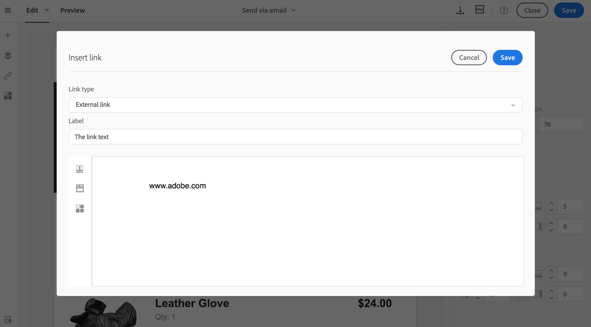
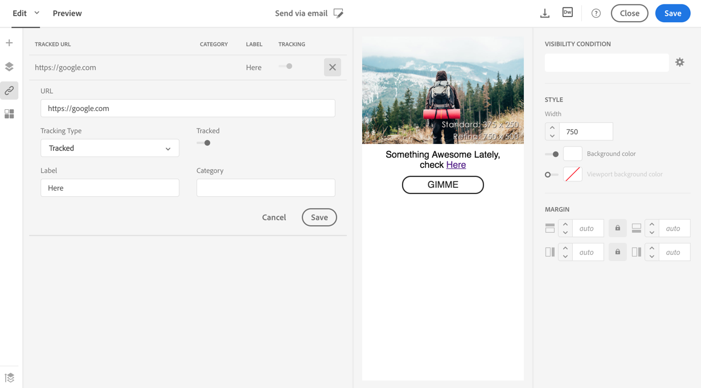

# Adding links and URL tracking

Adding links and URL tracking

The editor allows you to personalize your email by inserting links into the HTML content elements. A menu summarizes all the URLs of your email that will be tracked.

## 
Inserting a link

You can insert a link into any page element: image, word, group of words, block of text, etc.

1. Select **Link** in the toolbar.
1. Choose the type of link you want to create:

    * Link to an external URL: allows you to add a link to a URL.
    * Link to a landing page: allows you to access an Adobe Campaign landing page.
    * Subscription link: allows you to insert a link to subscribe to an Adobe Campaign service.
    * Unsubscription link: allows you to insert a link to unsubscribe from an Adobe Campaign service.

1. Enter the link parameters:

    * Label: text displayed to the profile.
    * Link target: URL, action, landing page, or service

   

1. Validate the link creation.

Once the link is created, you can still modify it by selecting it and re-opening the link popup, by editing the link target directly in the settings of the element displayed next to the email, or from the **Tracked URLs** overview, as described below.

## 
About tracked URLs

The **Tracked URLs** icon in the action bar automatically displays the list of all the URLs included in the content.

Tracking is activated by default.

>[!NOTE]
>
>This functionality is only available if tracking has been activated in Adobe Campaign.

The label, category, URL and tracking type of each link can be modified directly from this list.

For each tracked URL you can activate or deactivate tracking.

>[!NOTE]
>
>The URLs are detected by Adobe Campaign if they start with: "&lt;%@" "&lt;!--" "[protocol]://"

You can regroup your URLs by editing the **Category** field, depending on the URLs used in the delivery. 
