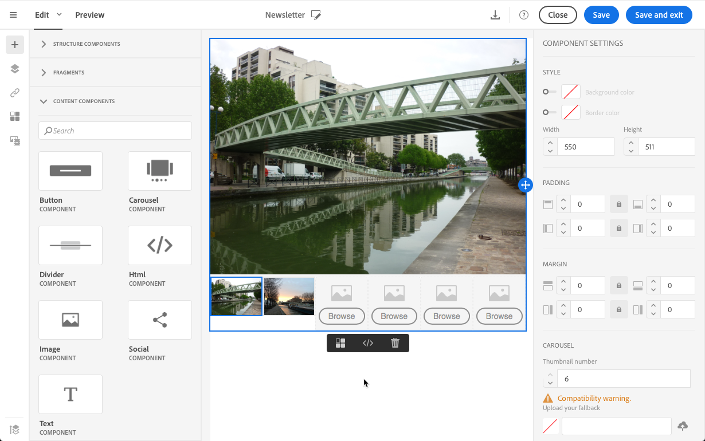
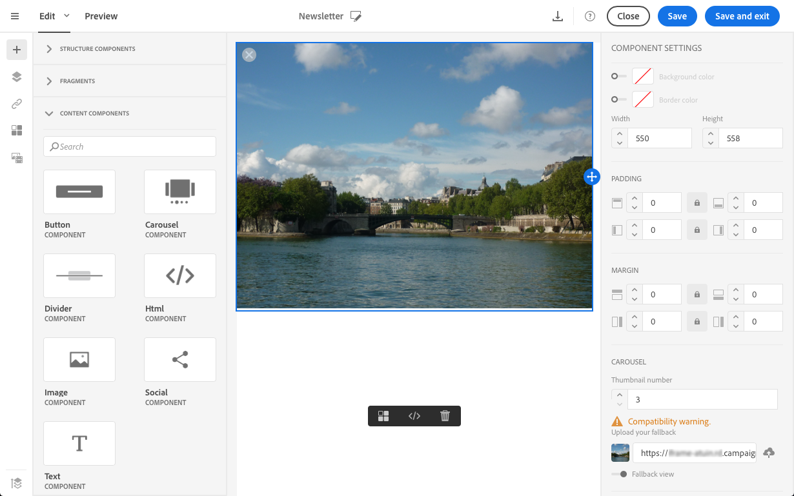
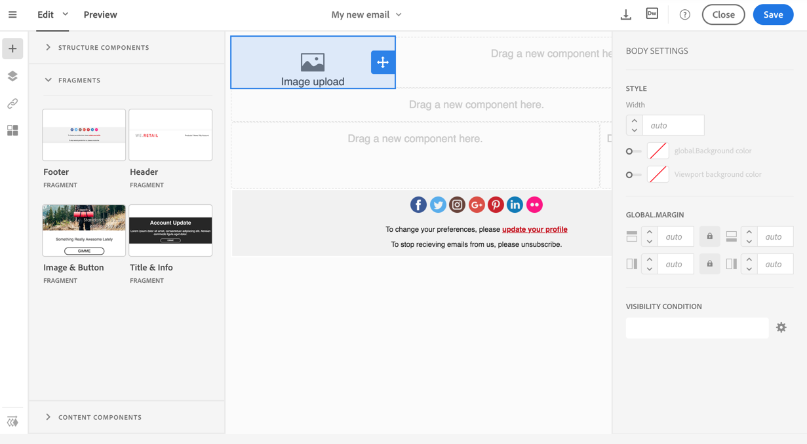
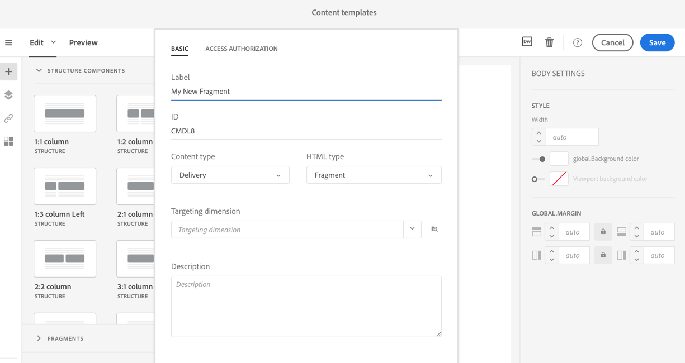
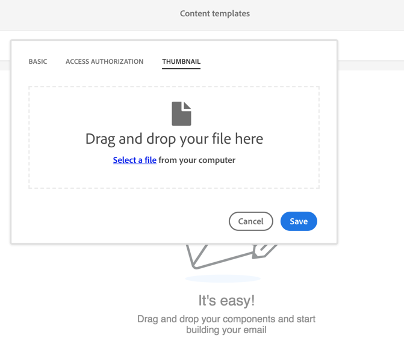

# Defining the email structure

Defining the email structure

## Editing the email structure with the Creative Designer

The Creative Designer allows you to easily define the structure of your email. By adding and moving structural elements with simple drag & drop actions, you can design the shape of your email within seconds.

1. Open an existing content or create a new email content.
1. Access the **Structure components** by selecting the **+** icon on the left.
1. Drag and drop the structure components you need to shape your email.

   A blue line materializes the exact location of the structure components before you drop it. You can drop it above, between or below any other component, but not inside.

   >[!NOTE]
   >
   >Once placed in the email, you cannot move nor remove your components unless there is already a content/fragment placed inside.

Once the structure is defined, you are able to add content fragments and components to your email.

## Adding fragments and content components with the Creative Designer

With the Creative Designer, after adding structure components to your email, you can define their content. To do that, you need to add elements inside each structure component.

There are two categories of content elements that you can use: **fragments** and **content components**.

### About fragments

A fragment is a reusable component that can be referenced in one or more emails.

To make the best use of fragments in the Creative Designer:

* Create your own fragments. See [Creating a content fragment](../../designing/using/defining-the-email-structure.md#creating-a-content-fragment).
* Use them as many times as needed in your emails. See [Inserting elements into an email](../../designing/using/defining-the-email-structure.md#inserting-elements-into-an-email).
* When you edit a fragment, the changes are synchronized: they are automatically propagated to all emails (provided they have not been prepared or sent yet) containing that fragment.

When added to an email, fragments are locked by default. If you want to modify a fragment for a specific email, you can break the synchronization with the original fragment by unlocking it in the email where it is used. The changes will not be synchronized anymore.

To unlock a fragment inside an email, select it and click the lock icon from the contextual toolbar.

That fragment becomes a standalone component that is not linked anymore to the original fragment. It can then be edited as any other content component. See [About content components](../../designing/using/defining-the-email-structure.md#about-content-components).

### About content components

Content components are raw, empty components that you can edit once placed in an email.

You can add as many content components as you want in a structure component. You can also move them inside the structure component or to another structure component.

Here is the list of the available components in the Creative Designer:

* **Button**
* **Carousel**

  To use this component, follow the steps below.

    1. Drag and drop the **Carousel** component inside a structure component.
    1. Browse to select images from your computer.
    
       

    1. From the **Settings** pane, set the number of thumbnails that you want in the carousel.
    1. Select a fallback image from your computer.
    
           
    
       The carousel component is not compatible with all email programs. Upload a fallback to display an image instead when the carousel is not supported in the email.

       >[!NOTE]
       >
       >The carousel component is compatible with the following email platforms: Apple Mail 7, Apple Mail 8, Outlook 2011 for Mac, Outlook 2016 for Mac, Mozilla Thunderbird, iPad and iPad mini iOS, iPhone iOS, Android, AOL (Chrome, Firefox and Safari).

    1. Select **Fallback view** to display the fallback image in the Creative Designer.

* **Divider**
* **Html**

  Use this component to copy-past the different parts of your existing HTML. This enables you to create free modular HTML components.

  >[!NOTE]
  >
  >A free HTML component is editable with limited options. If all styles are not inlined, make sure to add the proper CSS in the section of the HTML code, otherwise the email will not be responsive. Use the **Preview** button to test the responsiveness of your content. See [Previewing messages with the Creative Designer](../../sending/using/previewing-messages.md#previewing-messages-with-the-creative-designer).

* **Image**
* **Social**
* **Text**

### Inserting elements into an email

To define the content of your email, you can add content elements in the structure components you have placed beforehand. See [Editing the email structure with the Creative Designer](../../designing/using/defining-the-email-structure.md#editing-the-email-structure-with-the-creative-designer).

1. Access the content elements by selecting the **+** icon on the left. Select [Fragments](../../designing/using/defining-the-email-structure.md#about-fragments) or [Content components](../../designing/using/defining-the-email-structure.md#about-content-components).
1. If you already know the label or part of the label of the fragment you want to add, you can search for it.

   

1. Drag and drop a fragment or content component from the palette to a structure component of the email.

   

   Once an element is added to the email, it can be moved inside the structure component or to another structure component in the email.

   

1. Edit the element to match the exact needs of this email. You can add text, links, images, and so on.

   >[!NOTE]
   >
   >Fragments are locked by default when added to an email. You can break the synchronization with the original fragment if you want to modify the fragment for a specific email, or make your change directly in the fragment. See [About fragments](../../designing/using/defining-the-email-structure.md#about-fragments).

1. Repeat this procedure for all elements you need to add to your email.
1. Save your email.

Now that your email structure is populated, you can edit the style of each content element. See [Editing an element with the Creative Designer](../../designing/using/editing-email-styles.md#editing-an-element-with-the-creative-designer).

>[!NOTE]
>
>If a fragment is modified, the changes are automatically propagated in the emails where it is used. For more on this, see [About fragments](../../designing/using/defining-the-email-structure.md#about-fragments).

### Creating a content fragment

You can create your own content fragments to reuse later in other emails.

1. Go to **Resources** > **Content templates & fragments** and click **Create**.
1. If you are offered a choice, choose to use the new email editor.
1. Click the fragment title to access its properties.
1. Specify a recognizable label and select the following parameters to be able to find the fragment later in new emails:

    * **Content type**: 'Delivery'. Content fragments are only compatible with emails.
    * **HTML type**: 'Fragment'. Selecting 'Fragment' here indicates that the content created in this template is a fragment and will be utilized as such in future email contents.

   

1. If needed, define a thumbnail for the fragment. This thumbnail will be displayed next to the fragment's name when editing an email.

   Select the **Thumbnail** tab of the template properties. From this tab, you can select an image that will be used as thumbnail for the fragment.

   

1. Save the properties to return to the main editing area.
1. Define one fragment by adding a structural component and a default fragment that you can customize.
1. Once edited, save your fragment.

The fragment can now be used in emails. It appears under the **Fragments** section of the editor's palette.

>[!NOTE]
>
>You cannot insert personalization fields inside a fragment unless it is used in an email. To do this, you need to unlock this fragment. See [About fragments](../../designing/using/defining-the-email-structure.md#about-fragments).

## Managing email structure with the content editor

Managing the structure of an email within the content editor is similar to what can be done in a landing page. See [About fragments](../../designing/using/defining-the-email-structure.md#about-fragments).
