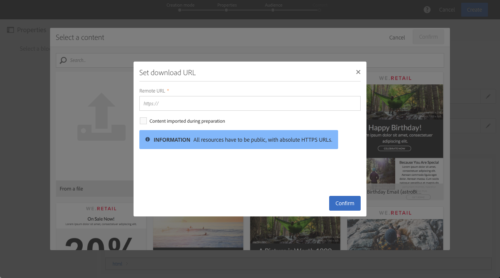
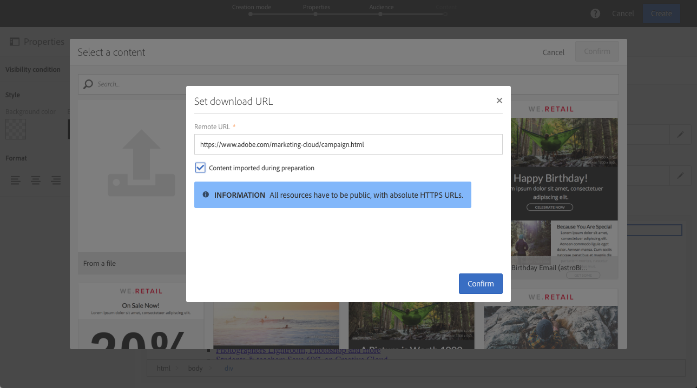
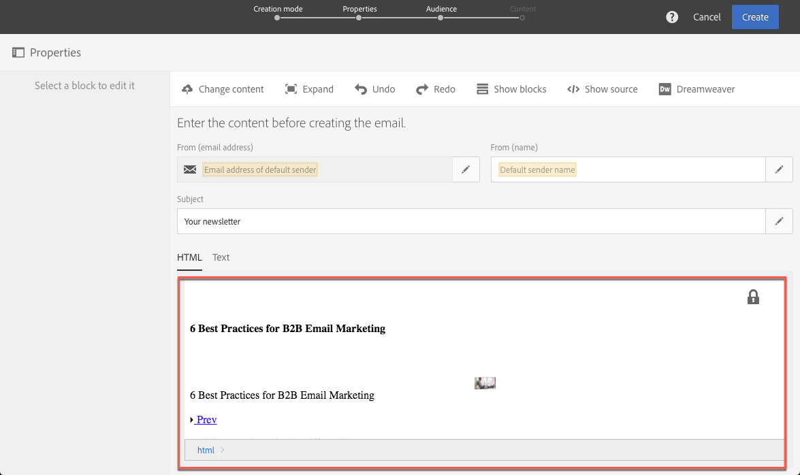
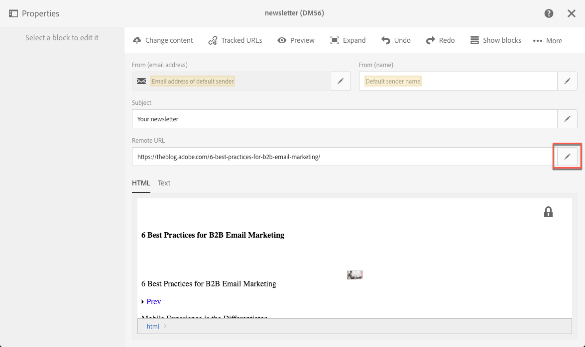
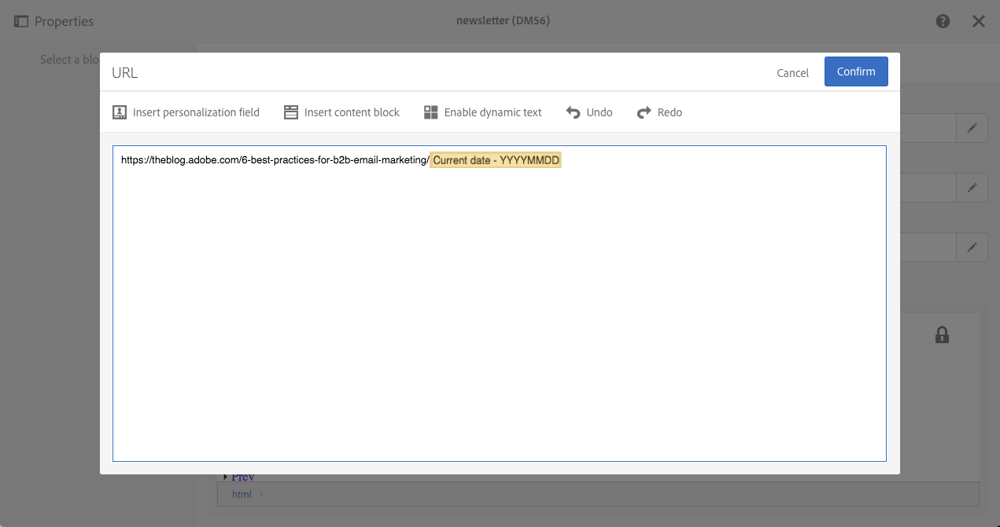

# Importing content from a URL

Importing content from a URL

Before importing content from a URL, make sure it follows the requirements below:

* The content needs to be publicly available via this URL.
* For security reasons, only URLs beginning with **https** are allowed.
* Make sure that all resources (images, CSS) are set in absolute links and in HTTPS. Otherwise, after sending the email, the mirror page would be displayed without its resources. Here is an example of an absolute link definition:

  ```
  <a href="https://www.mywebsite.com/images/myimage.png">
  ```

To retrieve existing content form a URL, follow the steps below:

1. Click the **From URL** element.
1. Define the URL from which the content will be retrieved, then confirm.

   

## Retrieving content from a URL automatically at preparation time

Importing content from a URL at the delivery preparation phase enables you to retrieve the latest HTML content each time the delivery is prepared. This way, the content of recurring emails is always up-to-date at the time of their sending. This feature also enables you to create a delivery scheduled at a specific date, even if the content is not ready yet.

>[!NOTE]
>
>This feature is only available for now in email deliveries that are created within the [content editor](../../designing/using/about-email-content-design.md#using-the-email-content-editor). It is not yet available in the [Creative Designer](../../designing/using/about-email-content-design.md#using-the-creative-designer).

To retrieve content at the delivery preparation phase, follow the steps below:

1. Select the **Content imported during preparation** option.

   

1. The URL content displays in the editor as read-only.

   

   >[!CAUTION]
   >
   >At this step, the HTML display in the content editor should not be taken into account. It will be retrieved at the delivery preparation phase.

1. To preview the URL content that has been retrieved, open the delivery once it is created then click the **Preview** button.

It is possible to personalize the remote URL from which the content will be retrieved. To do this, follow the steps below:

1. Click the **Remote URL** field button.

   

1. Insert the desired personalization field, content block or dynamic text then click **Confirm**.

   The **Current date - YYYYMMDD** content block, for example, enables you to insert the date of the day.

   >[!NOTE]
   >
   >The available personalization fields are linked to **Delivery** attributes only (delivery creation date, status, campaign label...).

   

