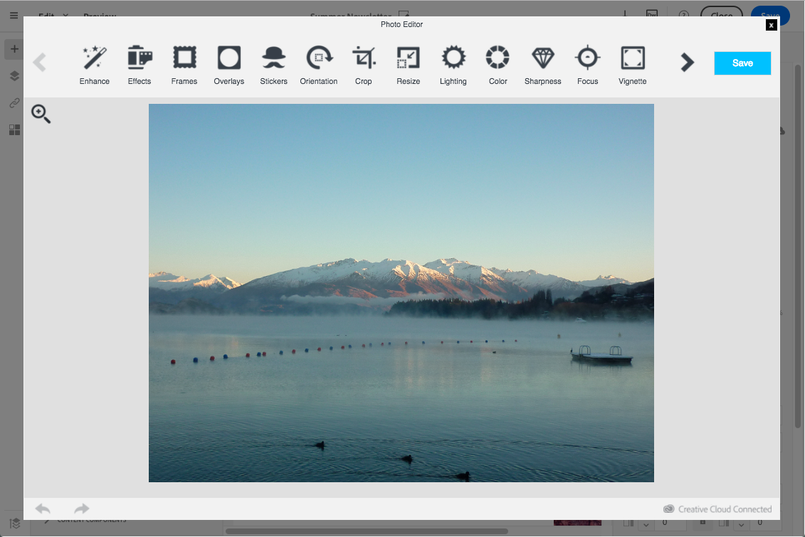

# Inserting and editing images

Inserting and editing images

1. Add a structure component and an **Image** content fragment.
1. Select the content fragment you just added. Several upload options are available, depending on your configuration:

    * local images,
    * assets shared from Adobe Experience Cloud - refer to [Working with Campaign and Assets Core Service](../../integrating/using/working-with-campaign-and-assets-core-service.md) / Assets On Demand,

1. Check the image properties and adjust them if needed.
1. If enabled, you can modify images with the Adobe Creative SDK.

>[!CAUTION]
>
>If you choose to add an image directly by editing the HTML version of the email, you must not call up **external files in a &lt;script&gt; tag** of the HTML page. These files will not be imported onto the Adobe Campaign server.

## 
Setting up image properties

When you select a block that contains an image, the following properties are offered in the palette:

* **Enable personalization** allows you to customize the image source. For more information, refer to the [Personalizing an image source](../../designing/using/inserting-images.md#personalizing-an-image-source) section.
* **Image Title** lets you define a title for the image.
* **Alt text** lets you define the caption linked to the image (corresponds to the **alt** HTML attribute).
* **Style** lets you specify the image size, background, and border.

## 
Modifying images with Adobe Creative SDK

You can edit images and use a complete set of features powered by the Adobe Creative SDK to enhance your images directly in the content editor when editing emails or landing pages.

The image editor offers a powerful, full-featured image editing UI component that allows you to edit images and apply effects and frames, original high-quality stickers, beautiful overlays, fun features like tilt shift and color splash, pro-level adjustments and more.

To modify an image with Adobe Creative SDK:

1. Select the image.
1. In the toolbar, click the Creative Cloud icon.
1. Select the tool you want to use through the icons on the top of the window to modify the image.

   

1. Click **Save** when modifications are done. The updated image is saved on Adobe Campaign server and ready to be used.

>[!NOTE]
>
>Tools offered in the image editor cannot be customized.

## 
Personalizing an image source

Adobe Campaign allows you to personalize one or several images in your delivery according to a particular criterion or to use tracking. This is done by inserting personalization fields, content blocks, or dynamic content into the image source. To do this:

1. Insert an image into the content of your delivery, or select an image that is already present.
1. In the image properties palette, check the **Enable personalization** option.

   The **Source** field is displayed on the screen and the image selected is shown as **personalized** in the editor.

1. Click the **Source** field button to access the personalization options.
1. After having added the image source, add the personalization fields, content blocks, and dynamic contents that you like.

   >[!NOTE]
   >
   >The domain name (http://mydomain.com) cannot be personalized, it has to be entered manually. The rest of the URL can be personalized. For example: http://mydomain.com/[Gender].jpg

1. Confirm your changes.

