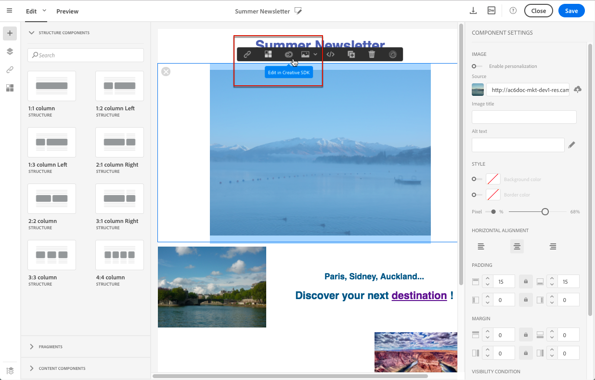

# Modifying images with the Adobe Creative SDK

Modifying images with the Adobe Creative SDK

You can edit images and use a complete set of features powered by the Adobe Creative SDK to enhance your images directly in the content editor when editing emails or landing pages.

The image editor offers a powerful, full-featured image editing UI component that allows you to edit images and apply effects and frames, original high-quality stickers, beautiful overlays, fun features like tilt shift and color splash, pro-level adjustments and more.

To modify an image with the Adobe Creative SDK:

1. Select the image.
1. In the toolbar, click the Creative Cloud icon.

   

1. Select the tool you want to use through the icons on the top of the window to modify the image.

   

1. Click **Save** when modifications are done. The updated image is saved on Adobe Campaign server and ready to be used.

>[!NOTE]
>
>Tools offered in the image editor cannot be customized.

