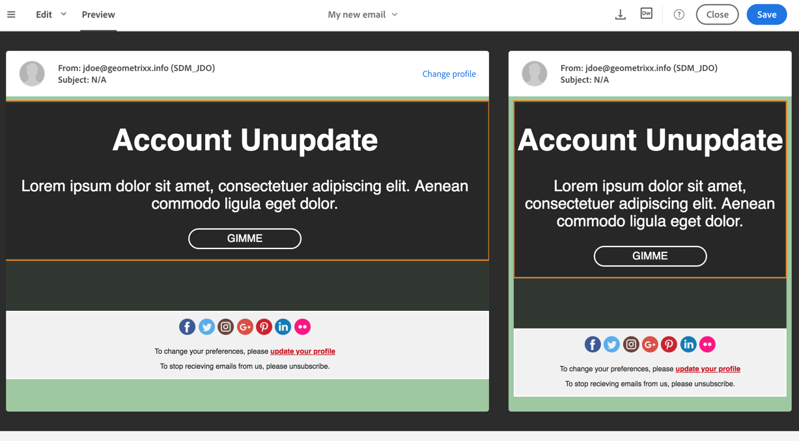

# Previewing and inbox rendering

Previewing and inbox rendering

Once the content of your email is ready, you can preview it. The preview mode offers different views of the email: web and mobile versions.

To perform and inbox rendering using Litmus, refer to [this document](../../sending/using/email-rendering.md).

1. Select **Preview** to access the preview mode of the content.
1. Select a test profile if you want to test the personalization and dynamic content display.

   Dynamic content fragments are highlighted in orange.

1. To exit the **Preview** mode, select **Edit** in the top bar of the editor.

