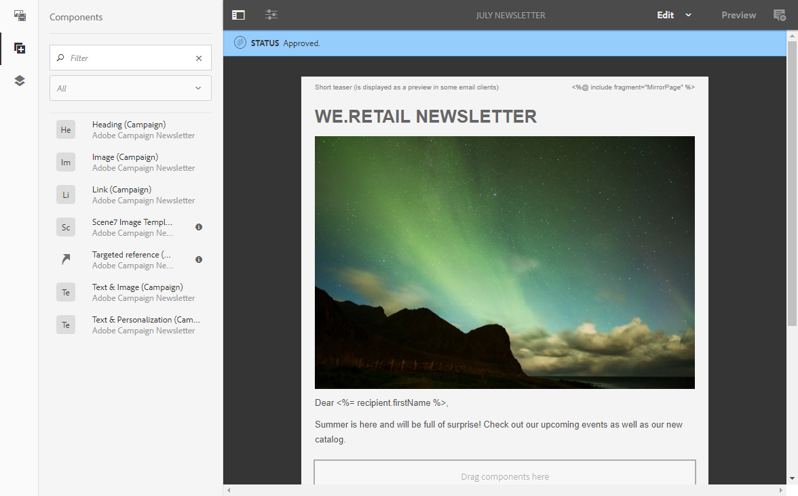
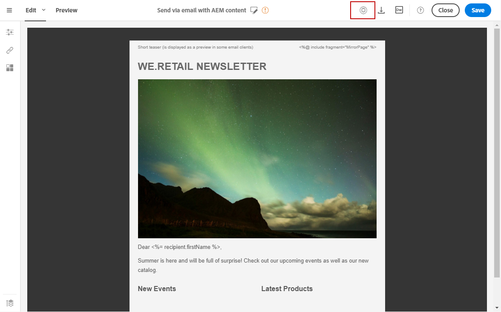

# Integrating with Experience Manager 6.1 or 6.2

Integrating with Experience Manager 6.1 or 6.2

This integration between Adobe Campaign Standard and Adobe Experience Manager allows you to use content created in Adobe Experience Manager in your Adobe Campaign emails.

You can therefore make the most of the Adobe Experience Manager content editing functionalities as well as Adobe Campaign's delivery and data management capabilities.

>[!NOTE]
>
>You cannot perform A/B tests for contents imported from Adobe Experience Manager.

Adobe Campaign Standard is compatible with Adobe Experience Manager 6.1 and 6.2. The following sections present an overview of the actions you can execute. For more information, refer to the sections dedicated to [configuration](https://docs.adobe.com/docs/en/aem/6-2/administer/integration/marketing-cloud/campaign/campaignstandard.html) and the [use](https://docs.adobe.com/docs/en/aem/6-2/author/personalization/adobe-campaign.html) of the integration.

## 
Prerequisites

You should make sure you have the following elements beforehand:

* An Adobe Experience Manager **authoring** instance
* An Adobe Experience Manager **publishing** instance
* An Adobe Campaign instance

## 
Use case

To create an email content in Adobe Experience Manager:

1. Create an email content using a template created specifically for Adobe Campaign.
1. In the content properties, select the **Cloud Service** corresponding to your Adobe Campaign instance.
1. Edit the content by inserting text, images, personalization, etc.
1. Validate the content.

For more information, refer to the [detailed documentation](https://docs.adobe.com/docs/en/aem/6-2/author/personalization/adobe-campaign/campaign.html).

To retrieve the content in Adobe Campaign:

1. Create an email based on an Adobe Experience Manager type content template.
1. Link a content created with Adobe Experience Manager using the Adobe Campaign email content definition screen.

## 
Configuration

To use these two solutions together, you must configure them to connect to one another.

1. Configure Adobe Campaign. To do this:

    * Configure an Adobe Experience Manager type external account.
    * Configure the **AEMResourceTypeFilter** option, which recognizes the content types created in Adobe Experience Manager for Adobe Campaign.
    * Create an email template specifying that it is Adobe Experience Manager content and link the previously created external account to this template.

1. Configure Adobe Experience Manager. To do this:

    * Configure the replication between the Adobe Experience Manager authoring and publishing instances.
    * Connect Adobe Experience Manager to Adobe Campaign by configuring a dedicated **Cloud Service**.

