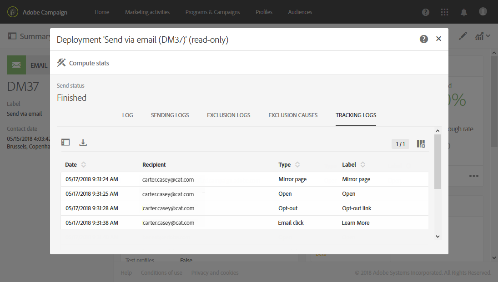

# Tracking messages

Tracking messages

## About tracking

Thanks to its tracking functionalities, Adobe Campaign enables you to track the behavior of your delivery recipients. To do this, Adobe Campaign uses session cookies and permanent cookies.

You can inform users that your sites are equipped with web tracking tools via an authorization request (that comes up over the page, for example) with a checkbox to authorize the use of cookies, or add a banner at the top of the first page they land on, etc. Pop-up windows should be avoided as they are often blocked by browsers.

Adobe Campaign uses two types of cookies:

* A session cookie (nlid). This contains the identifier of the email sent to the contact (broadlogId) and the identifier of the message template (deliveryId). It is added when the contact clicks a URL included in an email sent by Adobe Campaign and enables you to track their behavior on the web. This session cookie is erased automatically when the browser is closed. The contact can configure their browser to refuse cookies.
* A cookie shared between Adobe Experience Cloud solutions. This enables you to identify the users who interact with the Experience Cloud solutions when they visit a website. The description of this cookie is available here: [https://marketing.adobe.com/resources/help/en_US/whitepapers/cookies/cookies_mc.html](https://marketing.adobe.com/resources/help/en_US/whitepapers/cookies/cookies_mc.html).

Tracking information are available for each contact of your database into **integrated customer profiles**. For more on this, refer to [this section](../../audiences/using/integrated-customer-profile.md).

## Tracking logs

The **Tracking logs** tab lists the tracking history for this delivery. This tab displays the tracking information for the sent messages, such as all the URLs which have been tracked by Adobe Campaign. Tracking information in this tab is updated every 10 minutes.

>[!NOTE]
>
>If tracking is not enabled for a delivery, this tab is not displayed. Tracking logs are available for the **email** and **push notification** channels only.

In the example above, the recipient:

* Opened the message.
* Clicked on the "LEARN MORE" custom link.
* Clicked on the unsubscription and the mirror page link.

In the **Type** column, the possible values are:

* **Email click**: the recipients clicked on a custom link. 
* **Mirror page**: the recipient clicked on a link to the mirror page. 
* **Open**: the recipient opened the email.
* **Opt-out**: the recipient clicked on an unsubscription link.

>[!NOTE]
>
>For the **push notification** channel, only clicks on mobile notifications are tracked. In that case, the value will be **Click on mobile notification**.

For more on how to insert tracking links, refer to [this page](../../designing/using/inserting-a-link.md).

## Tracked URLs

The **Tracked URLs** tab regroups the URLs contained in the sent message, including their URL type and their source URL.

For more on tracking links, refer to [this section](../../designing/using/about-tracked-urls.md).
