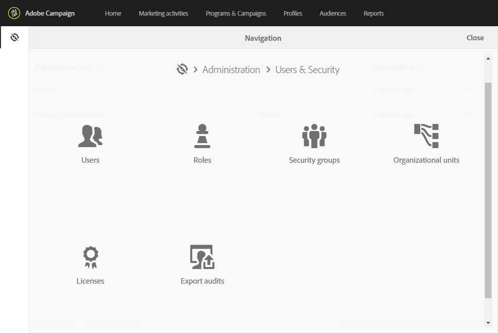
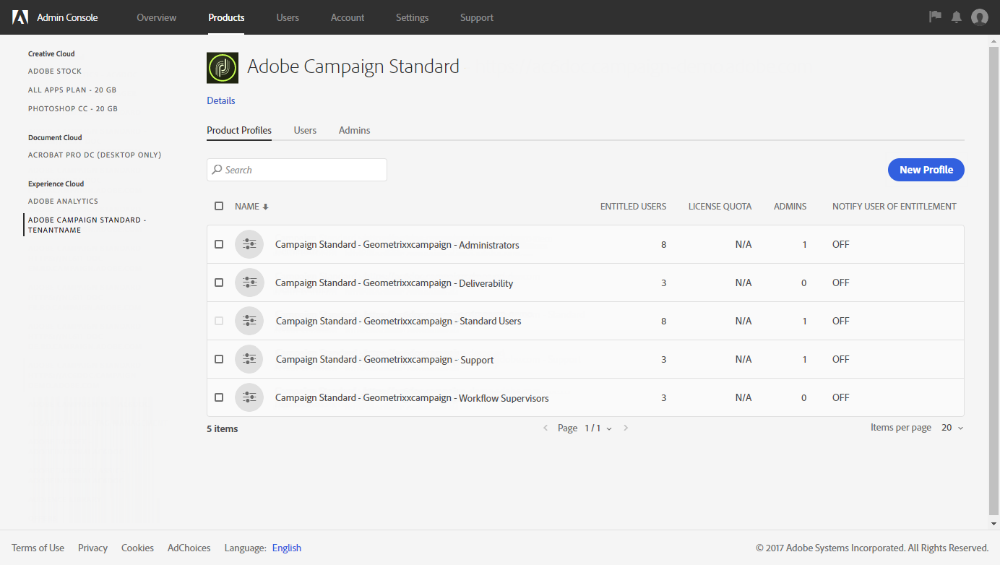

# About access management{#about-access-management}

Adobe Campaign allows you to define and manage the permissions assigned to different users. Permissions are a set of rights and restrictions that authorize or deny access to certain functionalities or objects in the interface. These permissions are based on two concepts:

* **Organizational units**: These allow you to define a hierarchy of permissions on the different objects of the platform (emails, workflows, templates, users, profiles, etc.). Refer to the [Organizational units](../../administration/using/organizational-units.md) section.
* **Roles**: A set of unitary rights that allow you to define the authorizations assigned to users and user groups. Refer to the [List of roles](../../administration/using/list-of-roles.md) section.

  Combined with organizational units, roles give users a filtered view of the interface and define their access to the different features. For more on this, refer to the [Authorizations table](../../administration/using/list-of-roles.md).

>[!IMPORTANT]
>
>Note that the geographical unit capability has been deprecated. For more on this, refer to this [page](../../rn/using/deprecated-features.md).

Roles, groups, and organizational units can be managed by the functional administrator of the platform, under the **[!UICONTROL Administration > Users & Security]** menu. 

Users are managed in the Admin console (refer to the [Managing groups and users](../../administration/using/managing-groups-and-users.md) section or the [Admin console documentation](https://helpx.adobe.com/enterprise/managing/user-guide.html)).

>[!IMPORTANT]
>
>Only users with administration rights have access to user management.

**Related topics**

* [Organizational units](../../administration/using/organizational-units.md)
* [List of roles](../../administration/using/list-of-roles.md)
* [Managing groups and users](../../administration/using/managing-groups-and-users.md)

