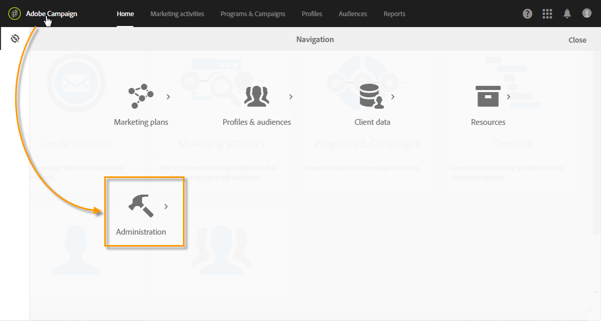

# About Administrating Adobe Campaign{#about-administrating-adobe-campaign}

About Administrating Adobe Campaign

As a cloud-based solution, Adobe Campaign offers administrators different ways to configure the application. Though the infrastructure configuration is performed by Adobe, functional administrators can:

* Invite users to access the application and manage groups of users as well as their rights and roles.
* Configure external accounts, which are used to connect Adobe Campaign to external servers.
* Adjust and configure routing parameters for all communication channels.
* Monitor the platform by accessing technical workflows.
* Import and export packages as well as extend the data model to add new fields or resources.

>[!NOTE]
>
>If you have questions or requests about implementation and configuration matters, contact your Adobe account executive.

The different Adobe Campaign admin operations are carried out via the **[!UICONTROL Administration]** menu. This part of the interface can only be accessed by functional administrators of the platform.

To access this menu, click the **[!UICONTROL Adobe Campaign]** logo, in the top left-hand corner, then click **[!UICONTROL Administration]** .

The different menus available are:

* [Users & Security](../../administration/using/about-access-management.md): This menu allows you to manage access to the platform (users, roles, security groups, units). 
* [Channels](../../administration/using/about-channel-configuration.md): This menu regroups the technical parameters linked to the different platform channels (Email, SMS) as well as typology and quarantine management. 
* [Application settings](../../administration/using/external-accounts.md): This menu allows you to configure different application elements (external accounts, options, technical workflows).
* [Development](../../developing/using/data-model-concepts.md): This menu allows you to manage your custom resources and access diagnostic tools.
* [Instance settings](../../administration/using/branding.md): This menu is where you define your different brands and configure their settings (logo, manage tracking, URL domain to access the landing pages, etc.).
* [Deployment](../../automating/using/managing-packages.md): This menu regroups the package import and export options.
* [Customer metrics](../../audiences/using/active-profiles.md): Adobe Campaign provides a report that displays the number of active profiles. This report is only informative, it doesn't have a direct impact on billing. 
* [Privacy Tools](https://docs.campaign.adobe.com/doc/standard/getting_started/en/ACS_GDPR.html): This menu allows you to create GDPR access and delete requests and track their evolution.

