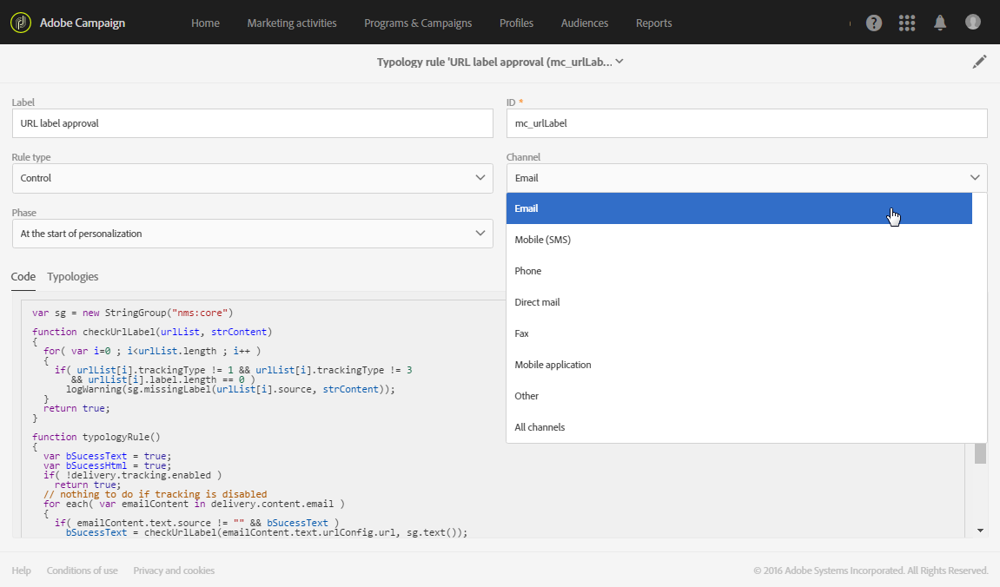

# About typology rules{#about-typology-rules}

About typology rules

A typology is a set of rules, executed during the message analysis phase, which allow the target, the content, and the configuration of the following elements to be validated: the subject, URL, images, unsubscription link, proof size, etc.

In Adobe Campaign, each message contains a link to a typology. This link is defined in the advanced parameters of the delivery template's properties (for more on this, refer to the [Preparation](../../administration/using/configuring-email-channel.md#preparation) section).

>[!NOTE]
>
>Each message can only be assigned a single typology.

For each typology, the **[!UICONTROL Typology rules]** section lists the set of rules for this typology.

## Managing typologies {#managing-typologies}

Several typologies are present by default in the application. Based on your needs, you can create your own typologies or modify existing ones.

1. Access the **[!UICONTROL List of typologies]** from the **[!UICONTROL Administration]** > **[!UICONTROL Channels]** > **[!UICONTROL Typologies]** menu.
1. Select a typology to modify its content and properties or create a new one.

   

1. Define the type of the typology. Typologies can be either Standard or Filtering typologies.
1. Add the typology rules you need using the **[!UICONTROL Add an element]** button or remove the ones you do not want to use.

   You can modify the order in which the rules are applied for a given typology. To do this, move the elements to modify the order in which they appear on the screen. The numbers corresponding to the execution order are then automatically recalculated. The rule application mode is presented in the [Typology rules execution order](../../administration/using/about-typology-rules.md#typology-rules-execution-order) section.

   The rules displayed on this screen can be accessed in read-only mode.

Your typology is ready to be used. You can select it in message properties or in message template properties.

>[!NOTE]
>
>The **[!UICONTROL IP affinity]** field allows you to manage the affinities according to your configuration. These are defined in the instance's configuration file. If you want to use the affinities, contact your administrator.

## Typology rules {#typology-rules}

Typology rules are business rules that are applied during the message preparation. They are used to check whether a message is valid and meets your quality criteria. They also check if each member of the target audience is eligible to receive the message.

Typology rules are available under the **[!UICONTROL Administration]** > **[!UICONTROL Channels]** > **[!UICONTROL Typologies]** > **[!UICONTROL Typology rules]** menu.

There are two types of rules:

* **Filtering** rules: allow you to exclude one part of the message target according to criteria defined in a query, such as quarantined profiles or profiles that have already been sent a certain number of emails. See [Filtering rules](../../administration/using/filtering-rules.md).
* **Fatigue** rules: allow you to define a maximum number of messages per profile to avoid over-soliciting them. See [Fatigue rules](../../administration/using/fatigue-rules.md).
* **Control** rules: allow the user to check the validity and quality of the messages before they are sent, such as character display, SMS message size, address format, etc. See [Control rules](../../administration/using/control-rules.md).

A typology rule can be applied to only one channel or to all channels.

In the **[!UICONTROL Properties]** of a typology rule, you can set its execution order. When several rules have to be applied, the execution order of each rule determines the ones to process first. For more on this, refer to the [Typology rules execution order](../../administration/using/about-typology-rules.md#typology-rules-execution-order) section.

A typology rule can be deactivated through its **[!UICONTROL Properties]** if you do not want the rule to be applied at the moment that the messages concerned by the rule are analyzed.

In the **[!UICONTROL Targeting context]** category, you can select the **Targeting dimension** and **Filtering dimension** depending on the data that you want to target.

By default, filtering is carried out on the **[!UICONTROL Profiles]** . For example, if the rule is aimed at a mobile application, the **[!UICONTROL Filtering dimension]** can be changed to **[!UICONTROL Subscriptions to an application]** .

>[!NOTE]
>
>As the content of the control rules cannot be modified, they are essentially filtering rules that are used.

## Typology rules execution order {#typology-rules-execution-order}

The typology rules are executed in an order specified during the targeting, analysis, and message personalization phases.

In standard operation mode, the rules are applied in the following sequence:

1. Control rules, if they are applied at the start of targeting.
1. Filtering rules:

    * Native application rules for address qualification: defined address / non-verified address / blacklisted address / quarantined address / address quality.
    * Filtering rules defined by the user.

1. Control rules, if they are applied at the end of targeting.
1. Control rules, if they are applied at the start of personalization.
1. Control rules, if they are applied at the end of personalization.

However, you can adapt the execution order of the same type of rules in each typology. Indeed, when multiple rules are executed during the same message processing phase, you can choose the order in which they are applied.

For example, a filtering rule whose execution order is positioned at number 20 will be executed before a filtering rule whose execution order is positioned at number 30.
