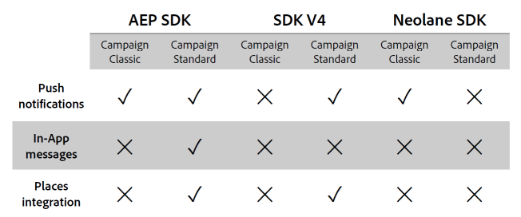

# Experience Platform SDK integration FAQ {#aep-faq}

To send push notifications and In-App messages with Experience Platform SDK application, a mobile application has to be set up in Adobe Experience Platform SDK and configured in Adobe Campaign.

The section below lists common questions about this synchronization.

For more information on Push or In-App, refer to the following FAQs:

* [Push notification FAQ](../../channels/using/about-push-notifications.md#push-faq)
* [In-App FAQ](../../channels/using/about-in-app-messaging.md#in-app-faq)
* [Sync with Launch technical workflow FAQ](../../administration/using/syncwithlaunch-faq.md)

## Useful resources before starting {#resource-mobile-property}

Check out the resources below for more information on the Adobe Experience Platform SDK and Campaign Standard integration:

* Launch/Mobile [Overview Video](https://www.adobe.com/experience-platform/launch.html#acpl-mobile-video)
* Launch/Mobile [Tips & Tricks Guide](https://www.adobe.com/content/dam/www/us/en/experience-platform/launch-tag-manager/pdfs/adobe-cloud-platform-launch-tips-and-tricks-sheet.pdf)

## Is Adobe Experience Platform SDK integration available for both Adobe Campaign Standard and Adobe Campaign Classic? {#aep-validity}

Yes, [!DNL Adobe Experience Platform SDK] integration is available for both Adobe Campaign Standard and Adobe Campaign Classic. You need to install the corresponding **[!UICONTROL Extension]** via [!DNL Adobe Launch] to enable the integration.

For more on this, refer to this [page](https://aep-sdks.gitbook.io/docs/using-mobile-extensions/adobe-campaign-standard).

## What capabilities does Adobe Experience Platform SDK integration facilitate in Adobe Campaign? {#aep-capabilities}

Refer to the table below to learn more about these capabilities.

>[!NOTE]
>
>[!DNL Places] integration includes places events as triggers for In-App messages (N/A for Push notifications), enriching profiles with [!DNL Places] data and local notifications support. Refer to this [page](../../channels/using/preparing-and-sending-an-in-app-message.md) for more information.  [!DNL Places] limited integration includes enriching profiles with [!DNL Places] data.

## What use case does Adobe Experience Platform SDK integration facilitate in Adobe Campaign Standard? {#aep-use-cases}

The following use cases are supported:

* Acquire a **[!UICONTROL Mobile Profile]** in Campaign (identified by ECID in **[!UICONTROL Administration]** > **[!UICONTROL Channels]** > **[!UICONTROL Mobile app (AEP SDK)]** > **[!UICONTROL Mobile Application subscribers]** tab)
* Enrich a **[!UICONTROL Mobile Profile]** in Adobe Campaign (requires **[!UICONTROL Custom resource Extension]** of appSubscriberRcp table)
* Acquire a Push token for sending Push messages (requires user opt-in to receive Push messages)
* Send Push and In-App Messages
* Track user's interaction with Push and In-App Messages and provide reports on that

## What do I have to do in order to acquire a Mobile Profile in Campaign? {#mobile-profile-campaign}

To do so, follow the steps below:

1. Configure a **[!UICONTROL Mobile property]** in [!DNL Launch].
1. Install Adobe Campaign Standard extension. Note that Adobe Campaign Standard extension also requires **[!UICONTROL Mobile Core]**, **[!UICONTROL Profile]** and **[!UICONTROL Lifecycle]** extensions which are installed by default in [!DNL Launch].
    * Users should configure Session timeout in **[!UICONTROL Mobile Core]** extension which impacts the frequency of lifecycle events.
    * Once the extension is configured, users should add appropriate dependencies in the Mobile App using Cocoapods for iOS and Gradle for Android. Follow the directions [here](https://aep-sdks.gitbook.io/docs/using-mobile-extensions/adobe-campaign-standard).
    * Always take the latest versions of the libraries.
    * In Mobile App, register **[!UICONTROL Campaign]**, **[!UICONTROL UserProfile]**, **[!UICONTROL Identity]**, **[!UICONTROL Lifecycle]** and **[!UICONTROL Signal]** extensions. Follow the directions [here](https://aep-sdks.gitbook.io/docs/using-mobile-extensions/adobe-campaign-standard#register-the-campaign-standard-extension-with-mobile-core).
    * Once extensions are registered, start ACPCore. For Android, be sure to setApplication onCreate(). Follow the exact instructions provided in Mobile Install Instructions for your Mobile Property in Launch.
    * Following SDK APIs will also be required. Implement Lifecycle Start and Pause APIs as described [here](https://aep-sdks.gitbook.io/docs/using-mobile-extensions/mobile-core/lifecycle/lifecycle-extension-in-android) for Android and here for iOS. 
1. Configure a **[!UICONTROL Mobile Property]** in Adobe Campaign Standard. Follow the procedure [here](../../administration/using/configuring-a-mobile-application.md#channel-specific-config).

## What do I have to do in order to enrich a Mobile Profile in Campaign? {#enrich-mobile-profile}

You need to configure a CollectPII postback (refer to this [page](https://helpx.adobe.com/campaign/kb/config-app-in-launch.html#PIIpostback)) and implement CollectPII API from SDK (refer to this [page](https://aep-sdks.gitbook.io/docs/using-mobile-extensions/mobile-core/mobile-core-api-reference#collect-pii)).

## How frequently should a CollectPII call be fired? {#collect-pii}

The objective of CollectPII call is to enrich the Mobile Profile in Campaign. It should be fired whenever there is new meaningful information that customers would like to add to the profile depending on their use cases and business needs.

## Can CollectPII calls be fired in response to multiple trigger events? {#collect-pii-calls}

Yes. Depending on your business need, you may fire CollectPII calls in response to user logging in the app, or purchasing something or lifecycle event or user entering a geofence etc. To sum up, an interaction of user with the app that generates information you would want to use for Profile enrichment.

## Can I just fire CollectPII calls in response to all Mobile events? {#collect-pii-events}

Frequency and design of CollectPII calls should be dictated by business needs and shouldn't be fired blindly as it creates extra load on the DB.

### When I try to access Adobe Experience Platform Apps in Campaign or Launch, I sometimes get a property not available error. {#aep-error}

This is a known issue and happens due to token expiration. You should try login out and in.

## What would be some useful resource recommendations to learn more about Adobe Experience Platform SDK (formerly known as SDK V5)?{#resource-aep}

Check out the resources below:

* Experience Platform SDK [documentation](https://aep-sdks.gitbook.io/docs/)
* Getting Started with Launch & Experience Platform SDK [documentation](https://aep-sdks.gitbook.io/docs/getting-started/create-a-mobile-property)
* Upgrading to Experience Platform SDK [documentation](https://aep-sdks.gitbook.io/docs/resources/upgrading-to-aep)
* Github Experience Platform SDK [documentation](https://github.com/Adobe-Marketing-Cloud/acp-sdks/)

## I am getting error "You do not have write access on delivery" while creating a push notification delivery. {#write-access-error}

You should check the following:

* The mobile app should be mapped to the organization unit of the user that needs to create and send push deliveries. User of a child organizational unit can not create a push delivery using an app mapped to the parent organizational unit.

* Campaign or program within which the push delivery is created should be mapped to the organizational unit of the user that needs to create and send push deliveries. User of the child organizational unit can not create a push delivery in a campaign or program mapped to the parent organization unit.