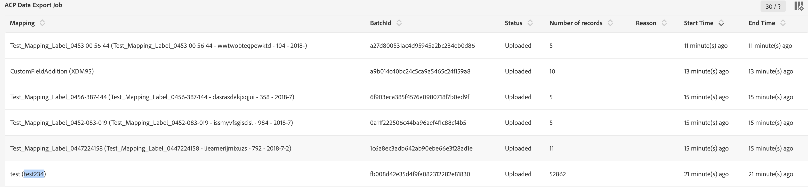

# Mapping activation {#mapping-activation}

>[!IMPORTANT]
>
>Adobe Experience Platform Data Connector is currently in beta, which may be subject to frequent updates without notice. Customers are required to be hosted on Azure (currently in beta for North America only) to access these capabilities. Please reach out to Adobe Customer Care if you would like access.

When the mapping definition is completed, you can publish the mapping. After the deployment step, the data replication between Campaign Standard and Adobe Experience Platform is automatically started. At any time, you can stop the replication by clicking on the **[!UICONTROL Stop]** button.

Depending on your mapping modifications, you can choose to resend all your records to Adobe Experience Platform.

From the deployment tile, you can access publication log and exports logs.

In the **[!UICONTROL Export jobs]** tab, you can monitor the export job for the published mapping.

If you want to monitor all the data export jobs, go to **[!UICONTROL Administration]** > **[!UICONTROL Development]** > **[!UICONTROL Platform]** > **[!UICONTROL Status of data export to platform]** menu.

Data ingestion job statuses:

* **[!UICONTROL Created]**: A data ingestion job is created and data ingestion is in progress.
* **[!UICONTROL Failed]**: A data ingestion job has failed. The reason field describes the reason for the failure. Failure can be transient or permanent. In case of transient failures, a new ingestion job is created after a configured interval. As a first step to troubleshooting, user can check the reason field of the failure. If the reason redirects a user to Adobe Experience Platform UI, user can login to Adobe Experience Platform and can check the batch status in the dataset to determine exact failure reason. 
* **[!UICONTROL Uploaded]**: A batch is first created in Adobe Experience Platform and data is then ingested to the batch. Batch ID field shows the batch id for the batch in Adobe Experience Platform. Adobe Experience Platform also performs a post validation on the batch. The batch is first marked as uploaded until Adobe Experience Platform completes the post validation step. A job keeps polling Adobe Experience Platform for the status of the batch after uploading. A batch can go either in Failed or in Success state post validation in Adobe Experience Platform.
* **[!UICONTROL Success]**: After a batch is uploaded to Adobe Experience Platform, the status of the job (post validation in platform) is checked after a configured interval. A status ‘Success’ identified a successful ingestion of data in Adobe Experience Platform.
