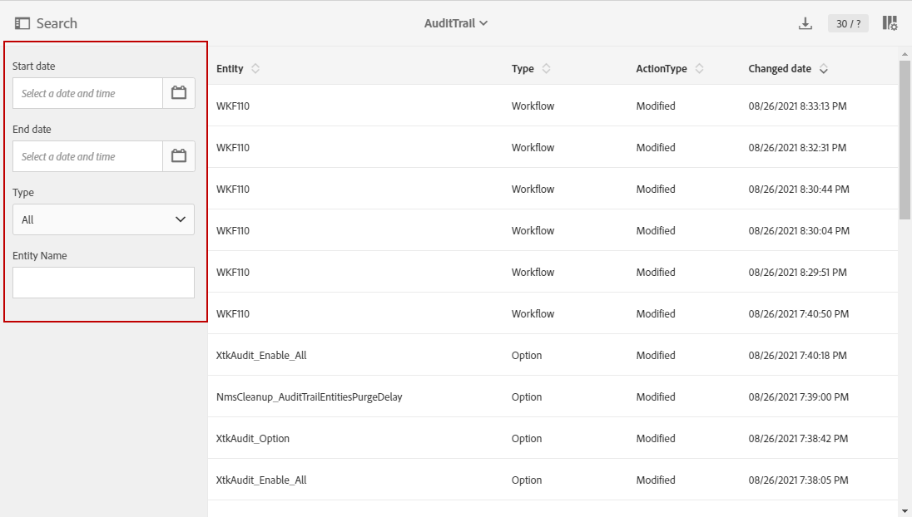
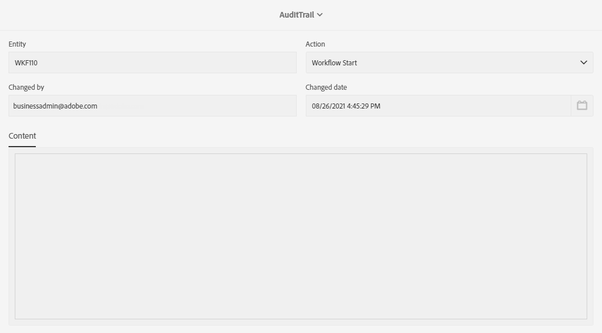

# Audit trail {#audit}

The **[!UICONTROL Audit trail]** gives you access to the complete history of changes made within your instance.

**[!UICONTROL Audit trail]** captures, in real-time, a comprehensive list of actions and events occurring within your Adobe Campaign Standard instance. It includes a self-serve way to access a history of data to help answer questions such as: what happened to your workflows, custom resources and options, who last updated them or what did your users do in the instance.

**[!UICONTROL Audit trail]** consists of three components:

* **Custom Resources Audit trail**: check the activity and last modification done to custom resources.

    For more information on **[!UICONTROL Custom resources]**, refer to this [page](../../developing/using/key-steps-to-add-a-resource.md).

* **Workflow Audit trail**: check the activity and last modification done to workflows, and additionally, the state of your workflows such as:

  * Created
  * Modified
  * Deleted
  * Workflow Start
  * Workflow Pause
  * Workflow Stop
  * Workflow Restart
  * Workflow Cleanup
  * Workflow Simulate
  * Workflow Wakeup
  * Workflow Immediate Stop
  * Workflow Restart with same user
  * Workflow Restart Unknown command

  For more information on **[!UICONTROL Workflows]**, refer to this [page](../../automating/using/get-started-workflow.md).

* **Option Audit trail**: check the activity and last modification done to options.

    For more information on **[!UICONTROL Options]**, refer to this [page](../../administration/using/about-campaign-standard-settings.md).

Note that, by default, retention period is 30 days.

# Accessing Audit trail {#audit-access}

To access your instance's Audit trail:

1. In Adobe Campaign Standard, from the advanced menu, select **[!UICONTROL Administration]** > **[!UICONTROL Audit trail]**.

    

1. The **[!UICONTROL Audit trail]** window opens with the list of your entities. Adobe Campaign Standard will audit the create, edit and delete actions for workflows, options and custom resources.

    From the **[!UICONTROL Search]** menu, you can filter your entity on:
    
    * **[!UICONTROL Start date]**
    * **[!UICONTROL End date]**
    * **[!UICONTROL Type]**: Entity's type between All, Workflow, Custom Resource and Option.
    * **[!UICONTROL Entity name]**: ID of your workflow, option or custom resource

    

1. Select one of the entities to learn more about the last modifications.

1. The Audit entity window gives you more detailed information on the chosen entity such as:

    * **[!UICONTROL Entity]**: ID of your workflow, option or custom resource.
    * **[!UICONTROL Action]**: Last action performed on this entity.
    * **[!UICONTROL Changed by]**: Username of the last person who last modified this entity.
    * **[!UICONTROL Changed date]**: Date of the last action performed on this entity.
    * **[!UICONTROL Content]**: Code block which gives you more information on what was changed exactly in your entity.

    In this example, we can see that the workflow WKF110 has been started on August 26th by the Business administrator of this instance.

    
