# Branding{#branding}

## About brand identity {#about-brand-identity}

Every company has brand visual and technical guidelines. With Adobe Campaign, you can define a set of specification to present a consistent brand to your customers, from logos to technical aspects, such as email sender, URL or domains.

Technical administrators can define one or several brands to centrally enter the parameters that affect a brand's identity. This includes the brand logo, the domain of the landing pages' access URL, or message tracking settings. With Adobe Campaign, you can create these brands and link them to messages or landing pages. This configuration is managed in templates.

## Configuring and using brands {#configuring-and-using-brands}

The main principle of configuring and using brands is to:

1. Create and configure the brand - this operation requires specific permissions and is carried out by the Adobe Campaign technical administrator. Steps to get a new brand in Campaign are detailed [in this section](#creating-a-brand).
1. Create one or several delivery and landing page templates for this brand. Refer to the [Creating a template](../../start/using/marketing-activity-templates.md) section.
1. Create messages and landing pages based on this template. Refer to the [Creating an email](../../channels/using/creating-an-email.md) and [Creating a landing page](../../channels/using/designing-a-landing-page.md) sections.

>[!IMPORTANT]
>
>Brands cannot be created or modified by end-users: these operations have to be performed by Adobe Campaign technical administrator. For any request, contact Adobe Customer care.
>
>Multi-branding cannot be used in the context of transactional messaging. For more on this, see [Transactional messages and branding](../../channels/using/transactional-messaging-limitations.md#permissions-and-branding).

Brands can be found in the **[!UICONTROL Administration > Instance settings > Brand configuration]** menu.

By default, a newly created brand is visible only to users assigned with the corresponding rights by the administrator.

A **Brand** is defined by the following characteristics:

* An **Identity**, which defines and personalizes your brand. This section contains the following fields:

  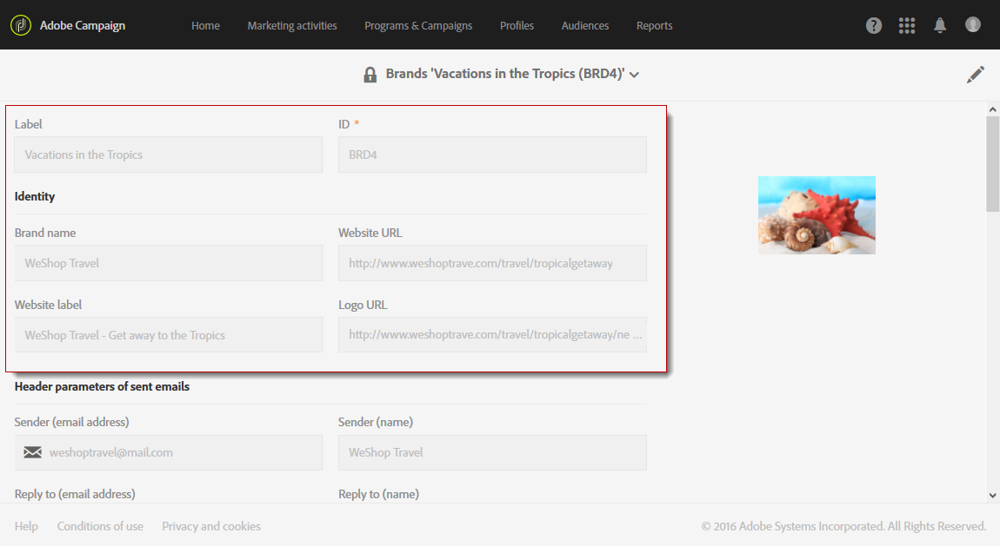

    * **Label** visible in the interface
    * **Brand name**
    * **Website URL** and **Website label** of the brand
    * **Brand logo**

* **[!UICONTROL Header parameters of sent emails]** which personalizes what the recipients of your campaigns will see. This section contains the following fields:

  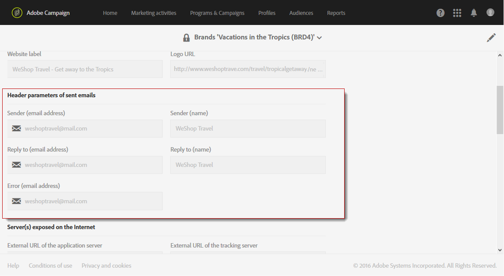

    * **Sender (email address)** with the brand's email address.
    * **Sender (name)** with the brand's name.
    * **Reply to (email address)** with the email address the customer can reply to.
    * **Reply to (name)** with the brand's name.
    * **Error (email address)** with the email address to use in case of an error.

  >[!IMPORTANT]
  >
  >After having updated the header parameters of the emails, if the name and email address of the sender have not changed in the email created from the template, check the template's advanced settings.

* **Server(s) exposed on the internet** defines the servers used for tracking but also for landing page access. This section contains the following fields:

  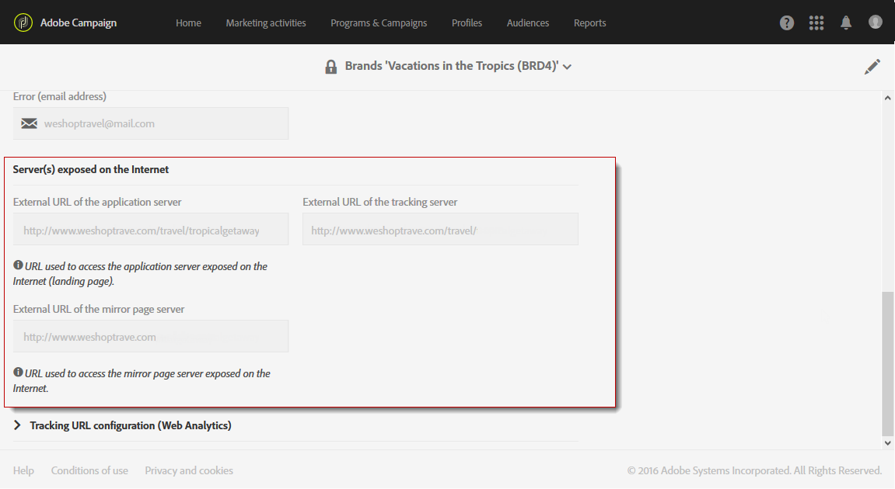

    * **External URL of the application server** used for hosting and accessing the different landing pages you create.
    * **External URL of the tracking server** used as the tracked URL during the deliveries.
    * **External URL of the mirror page server** used as the default mirror page in your deliveries.

    >[!NOTE]
    >
    >To display the landing page preview and the mirror page rendering in the Campaign user interface, the application server and mirror page server URLs must be secure. In that case, use https:// rather than http:// when setting up these URLs.

* **[!UICONTROL Tracking URL configuration (Web Analytics)]**, which defines the configuration of the URLs tracking for your brand.

  The additional parameters that allow the links to be tracked on external systems such as Web Analytics tools like Adobe Analytics or Google Analytics are defined here.

  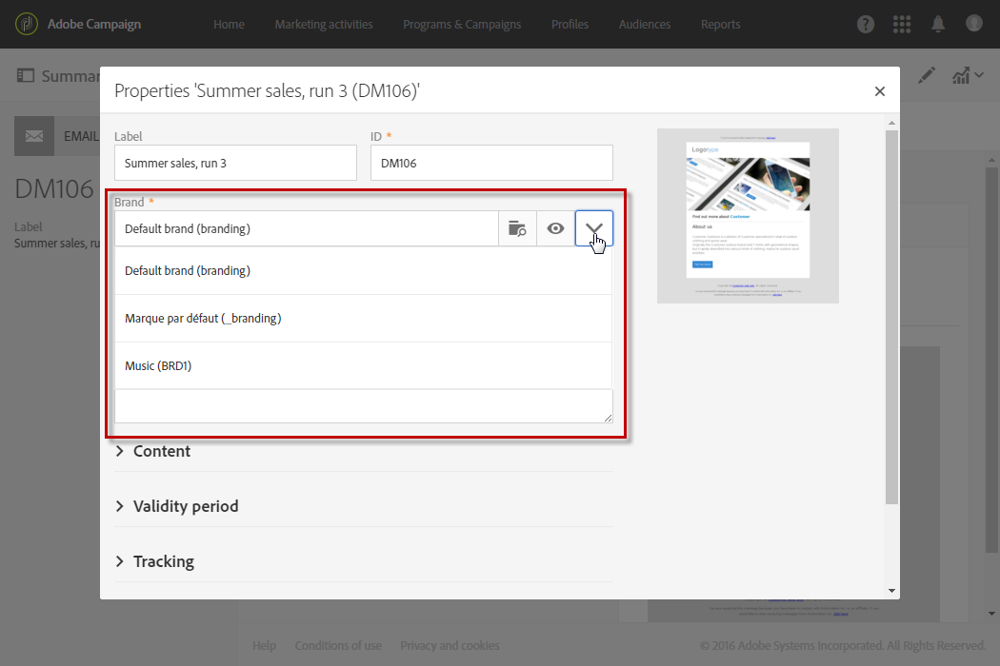

## Creating a new brand {#creating-a-brand}

You can add new entities of your organization in Campaign, or create a new type of email which you need to send under a different subdomain. To perform this, follow the steps below:

1. **Delegate a new subdomain** - For any new subdomain to be used by Adobe, the first step will be to delegate it. You can perform this through [Campaign Control Panel](https://docs.adobe.com/content/help/en/control-panel/using/subdomains-and-certificates/subdomains-branding.html) or reach out to your Adobe technical contact. Learn more about subdomain delegation [in this article](https://helpx.adobe.com/campaign/kb/domain-name-delegation.html).

1. **Create a ticket** - Once the subdomain is delegated, Adobe will need to set it up in the your production environment. To request this, [create a ticket to Client Care](https://helpx.adobe.com/enterprise/using/support-for-experience-cloud.html) with the following information:

   * Subject: [ACS] New brand set up
   
   * Content: A new domain has been delegated to Adobe and we would like to get it set up in our ACS platform
   
   * Domain: XXX
   
   * Production URL: XXX.campaign.adobe.com

1. **Create a delivery template** - Once the new brand is available, best practice is to create at least one new blank delivery template which reference this new brand. [Learn more](#linking-a-brand-to-a-template).

1. **Check deliverability guidelines** - Before starting using the new domain, the strategy should be discussed with Adobe Deliverability team. They will help to define the best practices, if a new affinity should be created to split the IPs between domains for example, and/or if a ramp up plan should be defined. Learn more about Deliverability best practices [in this section](../../sending/using/about-deliverability.md).

## Assigning a brand to an email {#assigning-a-brand-to-an-email}

### Linking a brand to a template {#linking-a-brand-to-a-template}

To use the parameters defined for a brand, it must be linked to a delivery template or landing page template. To do this, you have to create or edit a template.

>[!NOTE]
>
>For more information about creating a template, refer to the [Creating a template](../../start/using/marketing-activity-templates.md) section.

Once your template has been created, you can link it to a brand. To do this:

1. Click the **[!UICONTROL Edit properties]** button to access the template properties.

   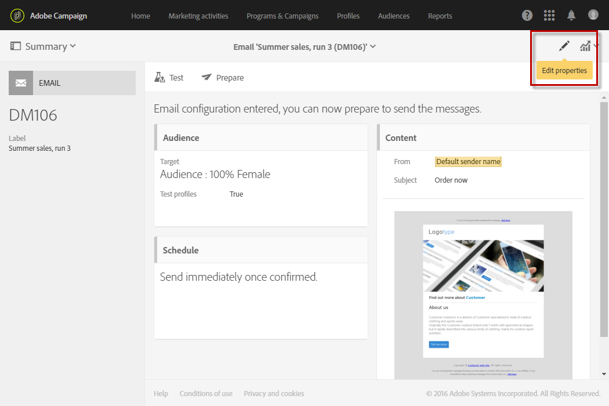

1. Use the drop-down list to select the brand that you want to link to the template.

   >[!NOTE]
   >
   >By default, the **[!UICONTROL Default brand (branding)]** is selected.

   

   To view how the brand selected is configured, click the **[!UICONTROL Navigate to the detail of the element selected]** icon.

   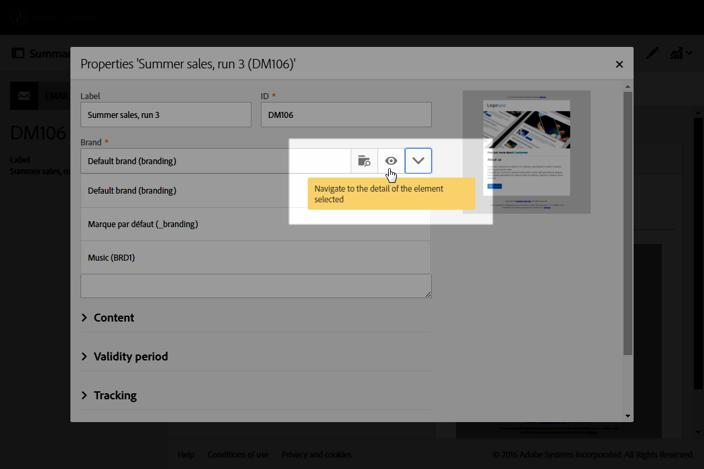

1. Confirm your selection and save your template.

Your template is linked to the brand. In the email editor, the elements such as the **Email address of default sender**, the **Default sender name**, or the **Logo** will use the configured brand data.

### Branding use case {#branding-use-case}

In this example, we are going to create a new travel-related brand, and use it in an email.

#### Configure a new brand {#configure-a-new-brand}

>[!IMPORTANT]
>
>Brand configuration is managed by Adobe only as it requires specific permissions and technical settings.

1. The Adobe Campaign administrator creates the brand in **[!UICONTROL Administration > Instance settings > Brand configuration]**. He adds the **Vacations in the Tropics** element from the advanced menu and configures the **[!UICONTROL ID]** and the **[!UICONTROL Header parameters of sent emails]** of the brand.

   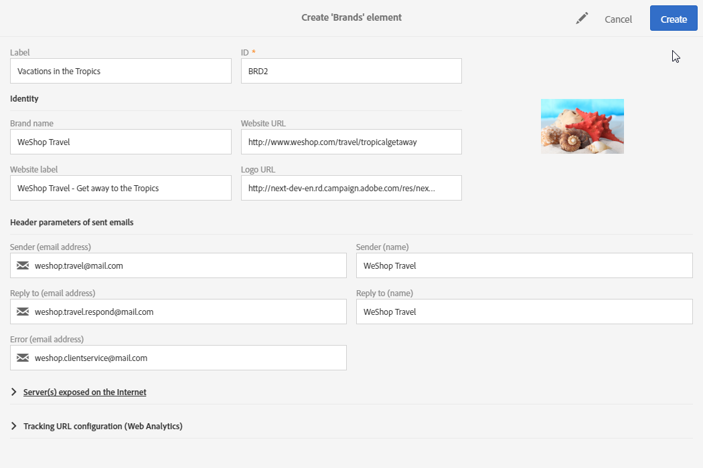

1. The administrator then configures the URL of the **Server(s) exposed on the Internet** so that landing pages can be used, then the tracking URLs.

   In this example, the **Web Analytics** tool used is **Google Analytics**. The administrator configures the tracking URL as follows:

   

The brand is correctly created and configured. It can now be used by the marketing teams.

#### Implement a new brand {#implement-a-new-brand}

As a delivery manager, you are in charge of creating the delivery templates to use the new brand. To achieve this, follow the steps below:

1. In the advanced menu **[!UICONTROL Resources > Templates > Delivery templates]**, duplicate a built-in template to configure a new delivery template.

   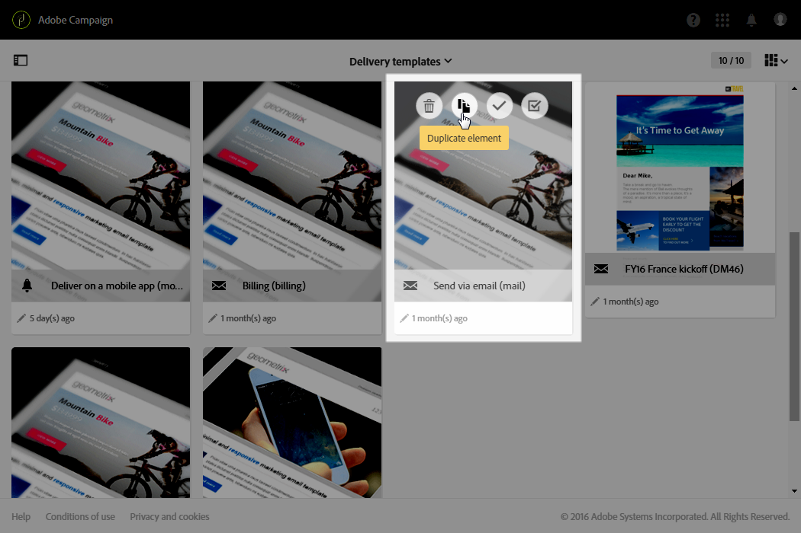

1. To link this template to the **Vacations in the Tropics** brand, edit the template properties and select the brand from the drop-down list. 

   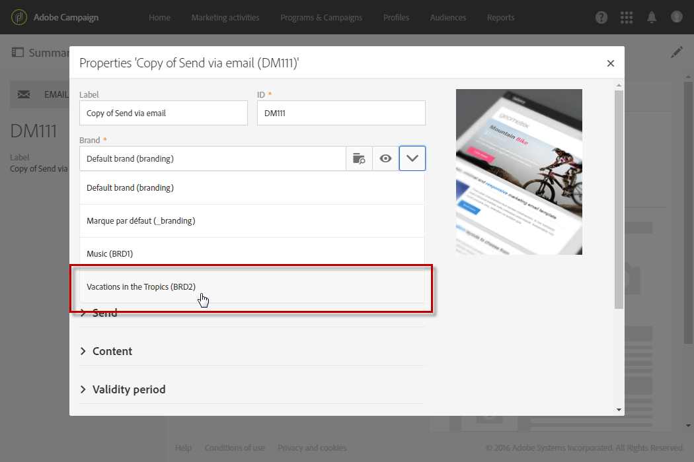

1. Configure this email template to reflect the brand identity.
1. Once the template is completed, you can save it.

   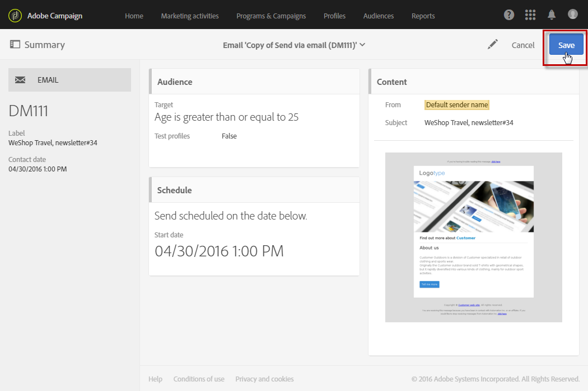

   The delivery template can now be used to create emails that will be sent to an audience.

#### Use the new brand in a delivery {#use-the-new-brand-in-a-delivery}

To create an email linked to a brand, follow the steps below:

1. Click the **[!UICONTROL Create]** button from the **[!UICONTROL Marketing activities]** menu.

   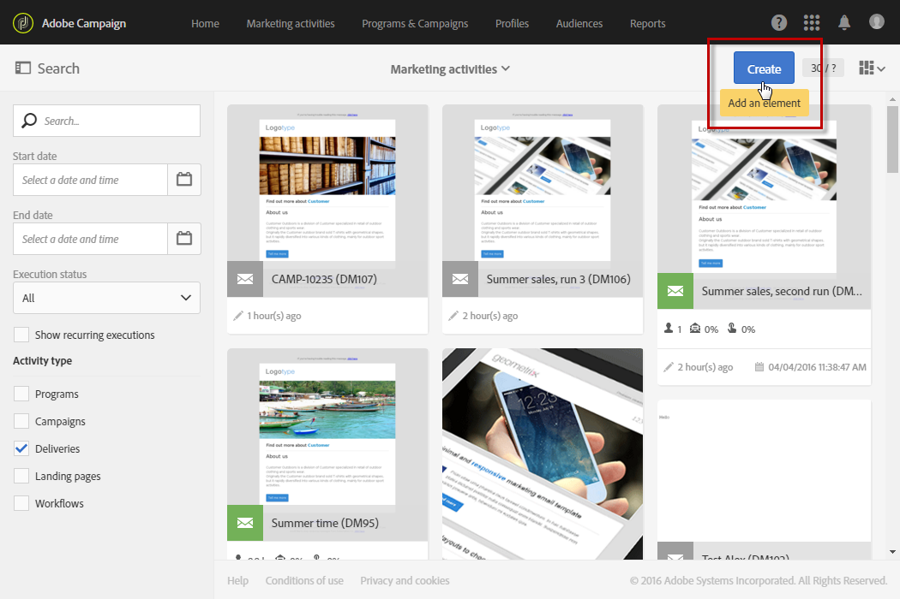

1. Select the **[!UICONTROL Email]** activity, then choose the template linked to the new brand.

   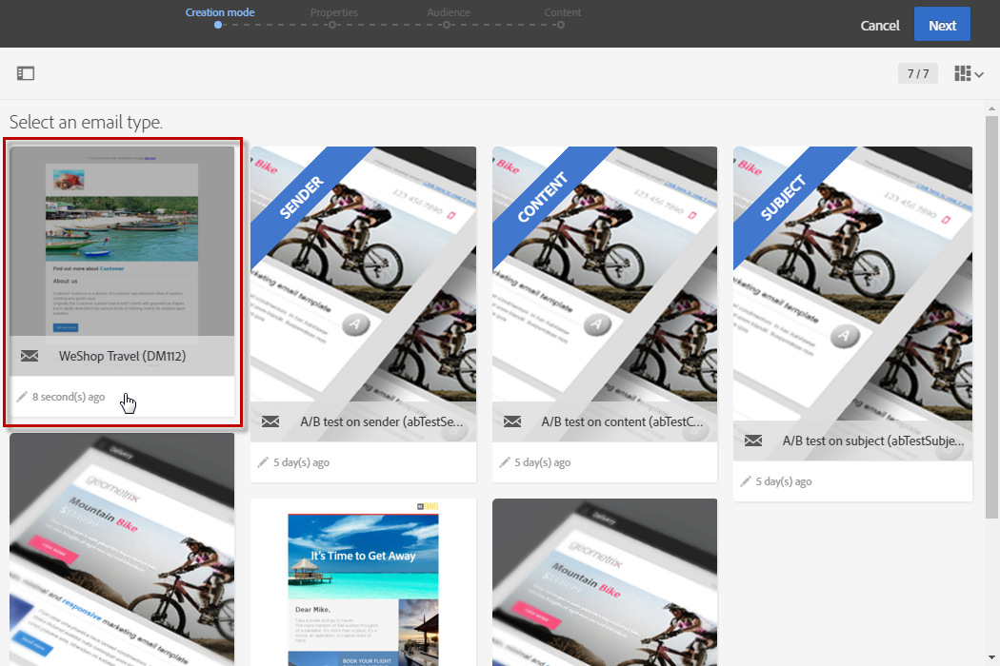

1. Your email is already configured. You can check the information before testing it using the test profiles, then sending it to your audience.

   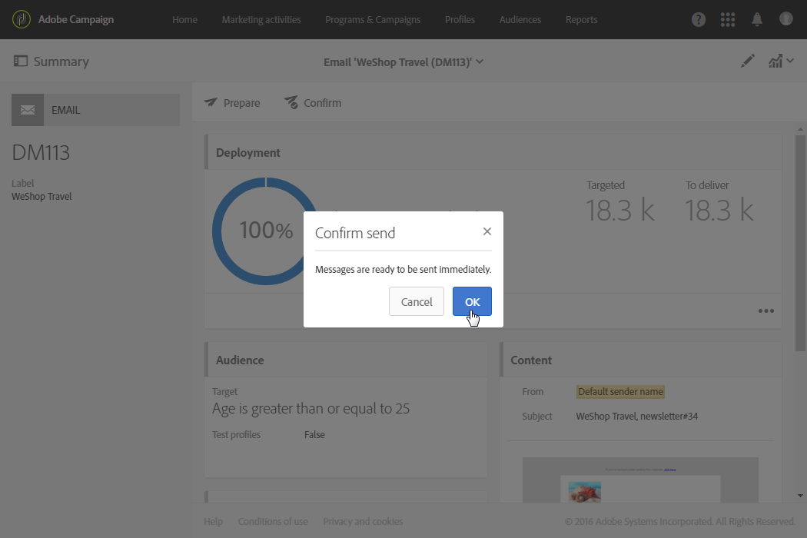

