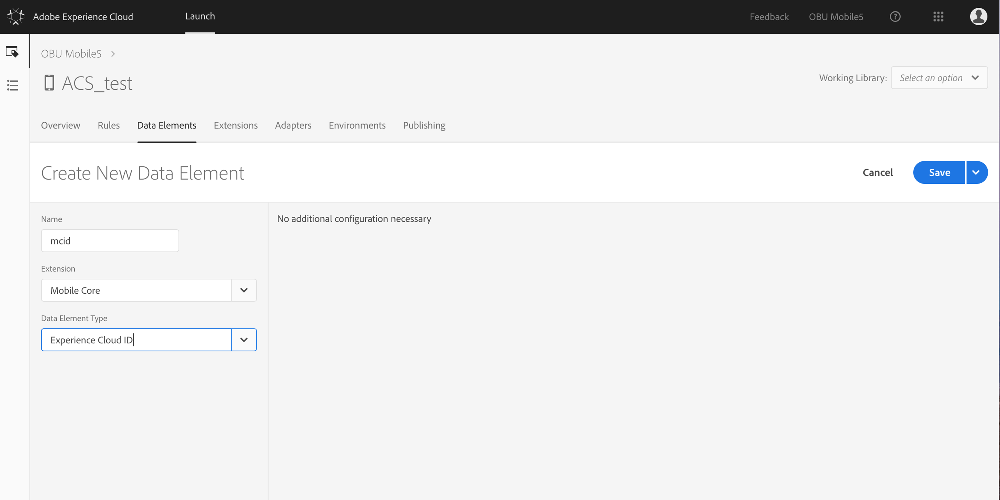
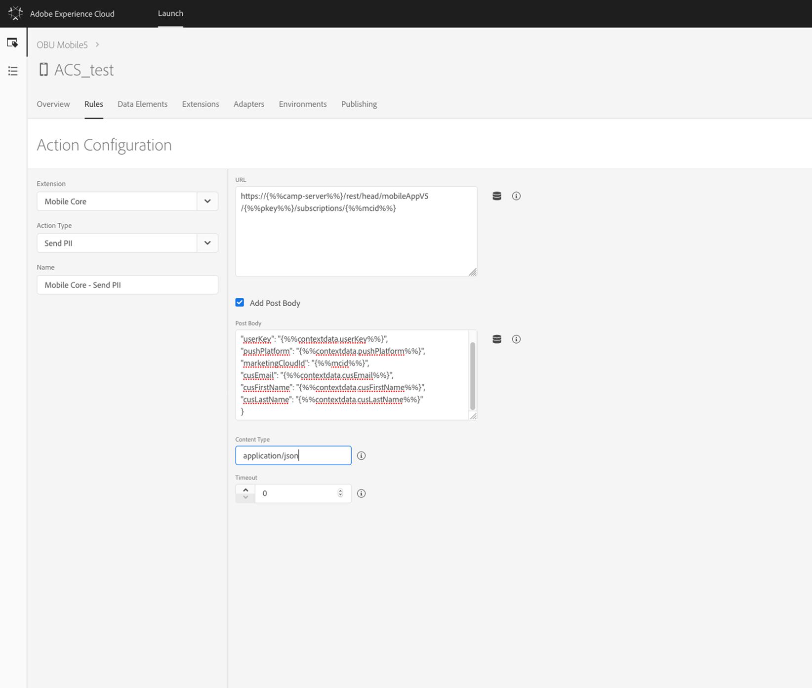
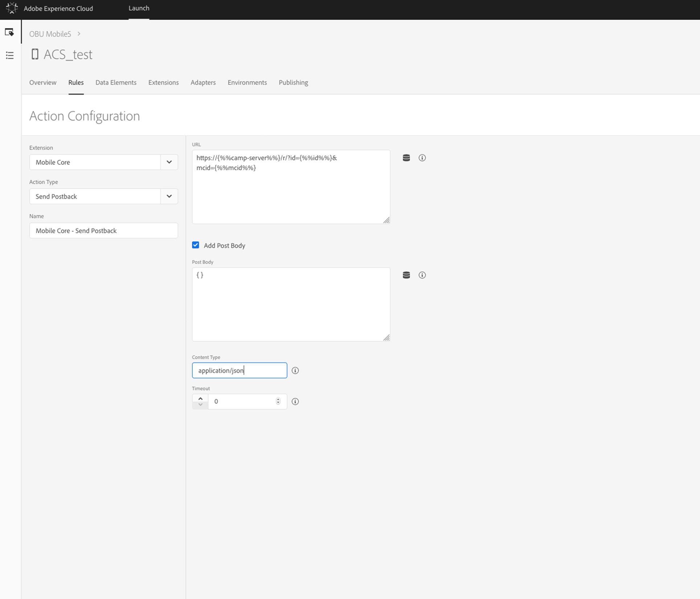

# Configuring a mobile application using Adobe Experience Platform SDKs{#configuring-a-mobile-application-using-adobe-experience-platform-sdks}

Configuring a mobile application using Experience Platform SDKs

Customers leveraging SDK V4 in their Mobile Apps may require some additional configuration to enable their user base to incrementally upgrade to Experience Platform SDK-version of the App. This configuration will be provided with In-App GA release.

>[!NOTE]
>
>Both push notifications and In-app messages are supported by Experience Platform SDKs. This feature is optional and currently a Beta feature which can be subject to future changes.

To send push notifications and In-App messages with an Experience Cloud SDK application, a mobile app has to be set up in Adobe Experience Platform Launch and be configured in Adobe Campaign.

To start the configuration, complete the following steps:

1. In Adobe Campaign, ensure that you can access the following mobile** **channels:

    * Push notification
    * In-App message

   If you cannot access these channels, contact your account team.

1. In Launch, create the mobile application by creating a mobile property.

   For more information, see [Set up a mobile property](https://aep-sdks.gitbook.io/docs/getting-started/create-a-mobile-property).

1. In Launch, click the Extensions tab, search for, and install the **[!UICONTROL Adobe Campaign (Beta)]** extension.

   For more information, see [Adobe Campaign Stadard (Beta)](https://aep-sdks.gitbook.io/docs/using-mobile-extensions/adobe-campaign-standard-beta).

1. In Launch, configure rules for your application.

   For more information, see [Configuring your application in Adobe Launch](../../administration/using/configuring-a-mobile-application-using-sdk-v5.md#configuring-your-application-in-adobe-launch).

1. In Adobe Campaign Standard, configure your Launch application.

   For more information, see [Setting up your Adobe Launch application in Adobe Campaign](../../administration/using/configuring-a-mobile-application-using-sdk-v5.md#setting-up-your-adobe-launch-application-in-adobe-campaign).

1. Add channel-specific configuration to your Mobile Application set up.

   For more on this refer to [Channel specific application configuration in Adobe Campaign](../../administration/using/configuring-a-mobile-application-using-sdk-v5.md#channel-specific-application-configuration-in-adobe-campaign).

1. If needed, you can later on delete your Adobe Launch property. For more on this, refer to [Deleting your Adobe Launch application](../../administration/using/configuring-a-mobile-application-using-sdk-v5.md#deleting-your-adobe-launch-application).

## Configuring your application in Launch {#configuring-your-application-in-launch}

In Launch, you need to create data elements and rules to send PII and other data from mobile apps to Campaign.

>[!CAUTION]
>
>To ensure that all configuration changes in Launch take effect, you must publish these changes. For more information, see [Publishing](https://docs.adobelaunch.com/publishing).

To configure your application in Adobe Launch, follow these steps:

* [Step 1: Create data elements](../../administration/using/configuring-a-mobile-application-using-sdk-v5.md#step-1--create-data-elements)
* [Step 2: Create rules for PII postback](../../administration/using/configuring-a-mobile-application-using-sdk-v5.md#step-2--create-rules-for-pii-postback)
* [Step 3: Create rules for In-App tracking postback](../../administration/using/configuring-a-mobile-application-using-sdk-v5.md#step-3--create-rules-for-in-app-tracking-postback)
* [Step 4: Create rules for push notifications tracking postback](../../administration/using/configuring-a-mobile-application-using-sdk-v5.md#step-4--create-rules-for-push-notifications-tracking-postback)

### Step 1: Create data elements {#step-create-data-elements}

Here are the data elements we recommend creating in Adobe Launch:

* **Experience Cloud ID**, which will be mapped to Identity.Experience Cloud Id.
* **Pkey**, a unique key for refencing mobile application in Adobe Campaign, which will be mapped to `Mobile Core.State:com.adobe.module.configuration/campaign.pkey`.

* **Campaign server**, which will be mapped to `Mobile Core.State:com.adobe.module.configuration/campaign.server`.

To create these data elements:

1. In Launch, from your mobile application dashboard, click the **Data Elements **tab.
1. To create the **Experience Cloud ID** data element, click the **Create new data element**.
1. Complete the following steps:

    1. In the **Name** field, for example, type in **mcid**.
    
    1. From the **Extension** drop-down, select **Mobile Core**.
    
    1. From the **Data element type** drop-down, select **Experience Cloud ID**.

   

1. Click **Save**.
1. To create the **Pkey** data element, click **Add Data Element**.
1. Complete the following steps:

    1. In the **Name** field, for example, type in **pkey**.
    
    1. From the **Extension** drop-down, select **Mobile Core**.
    
    1. From the **Data element type** drop-down, select **[!UICONTROL Free Form]**.
    
    1. In **[!UICONTROL Path]**, type `~state.com.adobe.module.configuration/campaign.pkey`.

1. Click **Save**.
1. To create the **Campaign server** data element, click **[!UICONTROL Add Data Element]**.   

1. Complete the following steps:

    1. Type a name, for example, `camp-server`.
    1. From the **[!UICONTROL Extension]** drop-down, select **[!UICONTROL Mobile Core]**.
    
    1. From the **[!UICONTROL Data element type]** drop-down, select **[!UICONTROL Free Form]**.
    
    1. In **[!UICONTROL Path]**, type `~state.com.adobe.module.configuration/campaign.server`.

1. Click **Save**.
1. Click **Save**.

### Step 2: Create rules for a PII postback {#step-create-rules-for-a-pii-postback}

To send PII to Campaign, create a rule in Launch.

1. In Launch, from your mobile application dashboard, click the **Rules** tab.
1. Click **Create New Rule**.
1. Type a name, for example, **Mobile Core - Collect PII**.
1. In the **Events** section, click **Add**.
1. Complete the following steps:

    1. From the **Extension** drop-down, select **Mobile Core**.
    
    1. From the **Event type** drop-down, select **Collect PII**.

1. Click the **Keep changes** button.
1. In the **Actions** section, click **Add**.
1. Complete the following steps:

    1. From the **Extension** drop-down, select **Mobile Core**.
    
    1. From the **Action type** drop-down, select **Send PII**.

1. In **[!UICONTROL URL]**, enter the following URL:

   ```
   https://{%%camp-server%%}/rest/head/mobileAppV5/{%%pkey%%}/subscriptions/{%%mcid%%}
   ```

1. Select the **Add Post Body** check box.
1. **[!UICONTROL In Post Body]**, type the following:

   ```
   {
   "userKey":
   "{%%contextdata.userKey%%}",
   "pushPlatform":
   "{%%contextdata.pushPlatform%%}",
   "marketingCloudId":
   "{%%mcid%%}",
   "cusEmail":
   "{%%contextdata.email%%}",
   "cusFirstName":
   "{%%contextdata.firstName%%}",
   "cusLastName":
   "{%%contextdata.lastName%%}" }
   ```

1. In **[!UICONTROL Content Type]**, type `application/json`.
1. In **Timeout**, select **[!UICONTROL 0]**.

   

1. Click **Keep changes** and then **Save**.

Your user data is now configured to be sent to Campaign.

### Step 3: Create rules for In-App tracking postback {#step-create-rules-for-in-app-tracking-postback}

To send tracking data to Campaign and track your In-App deliveries and your users interact with your mobile application, create a rule in Launch.

1. In Launch, from your mobile application dashboard, select the **Rules** tab.
1. Click **Add Rule**.
1. Type a name, for example, **Adobe Campaign - In-App click tracking**.
1. In the **Events** section, click **Add**.
1. Complete the following steps:

    1. From the **Extension** drop-down, select **[!UICONTROL Adobe Campaign Standard]**.
    
    1. From the **Event type** drop-down, select **In-App click tracking**.

1. Click **Keep changes**.
1. In the **Actions** section, click **Add**.
1. Complete the following steps:

    1. From the **Extension** drop-down, select **Mobile Core**.
    
    1. From the **Action type** drop-down, select **Send postback**.

1. Add your environment URL in the URL sandbox in the following format:

   ```
   https://{%%camp-server%%}/r/?id={%%id%%}mcid={%%mcid%%}
   ```

1. Select the **Add post body** check box.
1. In **[!UICONTROL Post Body]**, type `{ }`.
1. In **Content Type**, type **`application/json`**.
1. In **[!UICONTROL Timeout]**, select `0`.

   

1. Click **Keep changes **and then **Save**.

The tracking data will now be sent to Adobe Campaign.

### Step 4: Create rules for push notifications tracking postback {#step-create-rules-for-push-notifications-tracking-postback}

To send tracking data to Campaign and track your Push notification deliveries and how your users interact with your mobile application, create a rule in Launch.

1. In Launch, from your mobile application dashboard, click the **Rules** tab.
1. Click **Add Rule**.
1. Type a name, for example, **Adobe Campaign - push click tracking**.
1. In the **Events** section, click **Add**.
1. Complete the following steps:

    1. From the **Extension** drop-down, select **Mobile Core**.
    
    1. From the **Event type** drop-down, select **Track Action**.

1. From the **Action** drop-down, select **Action**, select **[!UICONTROL equals]**, and type `tracking`.
1. Click **Keep changes**.
1. In the **Actions** section, click **Add**.
1. Complete the following steps:

    1. From the **Extension** drop-down, select **Mobile Core**.
    
    1. From the **Action type** drop-down, select **Send postback**.

1. Add your environment URL in the URL sandbox in the following format:

   ```
   https://{%%camp-server%%}/r/?id={%%broadlogId%%},{%%deliveryId%%},{%%action%%}
   ```

1. Select the **Add Post Body** check box, and in **[!UICONTROL URL]**, type `{ }`.  

1. In **[!UICONTROL Content Type]**, type `application/json`. 
1. In **Timeout**, select `0`.
1. Click **Keep changes **and then **Save**.

## Setting up your Adobe Launch application in Adobe Campaign {#setting-up-your-adobe-launch-application-in-adobe-campaign}

To use an Launch mobile property in Campaign, you also need to configure this property in Adobe Campaign. To ensure that these properties are visible in Adobe Campaign, set them up with the same IMS org that you used in your Adobe Campaign instance.

1. From the advanced menu, select **Administration** > **Channels **> **BETA:Mobile app (SDK V5)**.

   

1. Select the mobile application you created in Adobe Launch.

   Its **Property Status** should be **Ready to configure**.

   

1. To make the connection between Campaign and Adobe Launch, click **Save**.
1. From the previous window, you can now see that its **Property Status** has been changed to **Configured**.

   When the Adobe Launch Campaign extension shows that the pkey has been set up successfully, you can also verify that the property has been set up successfully in Campaign.

   >[!NOTE]
   >
   >The pkey is a unique key that is used to reference a mobile application in Adobe Campaign.

   

1. For this configuration to take effect, the changes need to be published in Launch. For more information, see [Publishing](https://docs.adobelaunch.com/publishing).

## Channel-specific application configuration in Adobe Campaign {#channel-specific-application-configuration-in-adobe-campaign}

Your mobile application is now ready to be used in Campaign for push notification or In-app deliveries. You can now further configure it if needed to create events that will trigger your in-app messages and/or upload Push certificates.

1. From the advanced menu, select **Administration** > **Channels **> **BETA:Mobile app (SDK V5)**.
1. Select the mobile application you created and configured in Adobe Launch.
1. In the **Mobile application properties** tab, you can start adding event available in your mobile application for you In-app messages.
1. To start configuring your events, click **Create Element**.

   

1. Type a name and a description.

   

1. Click **Add**.

   Your event is now available in the **[!UICONTROL Triggers]** tab when creating an In-App message. For more on this, refer to this [section](../../channels/using/preparing-and-sending-an-in-app-message.md).

1. In the **Device-specific settings** section of a mobile application dashboard, for each device, provide the application details, including the certificate for iOS and the server key for Android.

   Once your certificate is uploaded, a message will let you know if the upload was successful and will display the expiration date of your certificate.

1. Click the **Mobile application subscribers** tab to see the subscribers and other information on them for example if they opted out of your notifications.

## Deleting your Adobe Launch application {#deleting-your-adobe-launch-application}

To delete your Adobe Launch application, you first need to follow the steps detailed . Please note that this cannot be reversed.

Once your application is deleted, you can check in Adobe Campaign if your application's **Property status** has been correctly updated to **Deleted in Launch**.

By clicking on your application in Adobe Campaign, you can choose to completely remove this application from Adobe Campaign by clicking the **Delete from Campaign** button.


