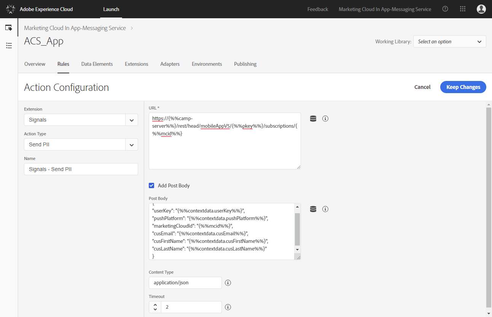
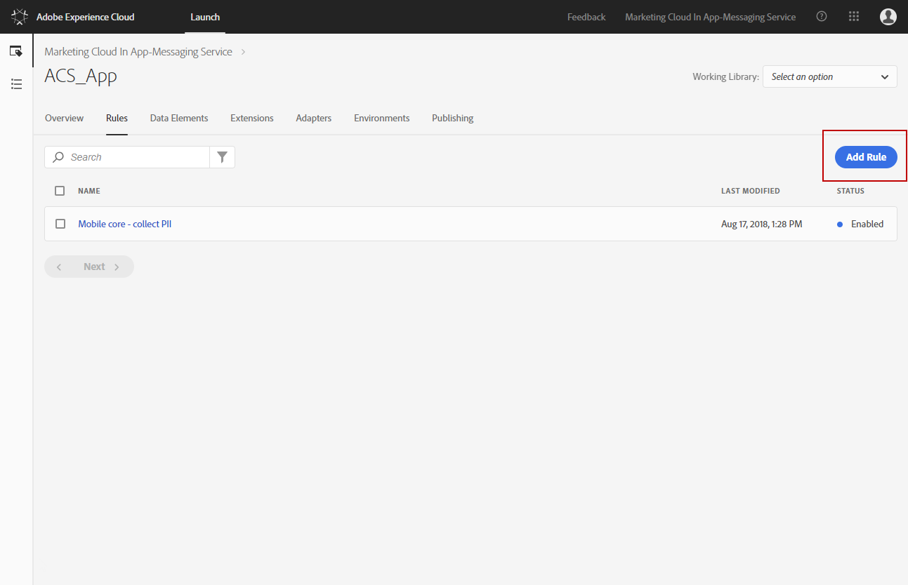
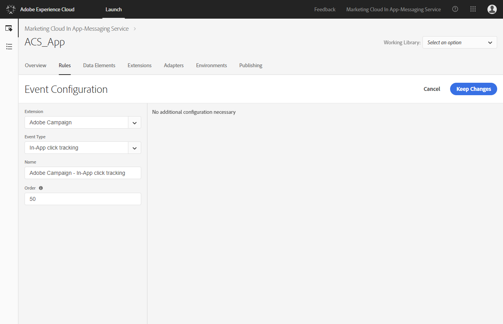
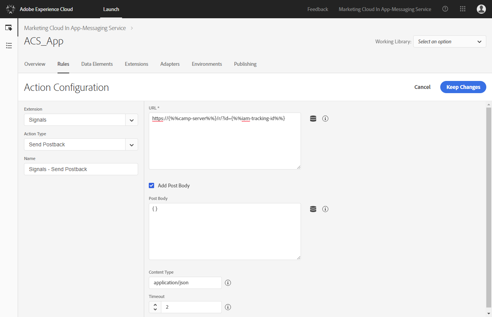
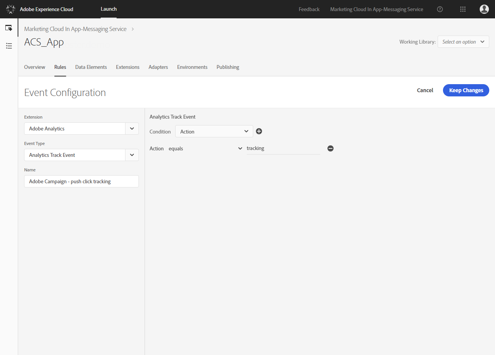
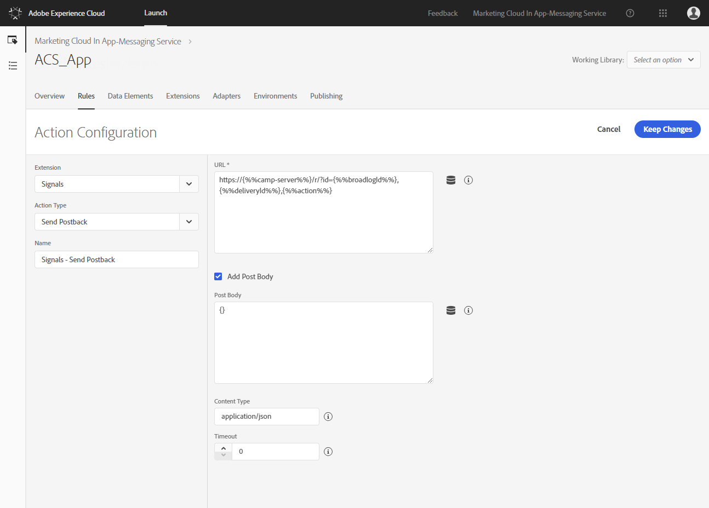
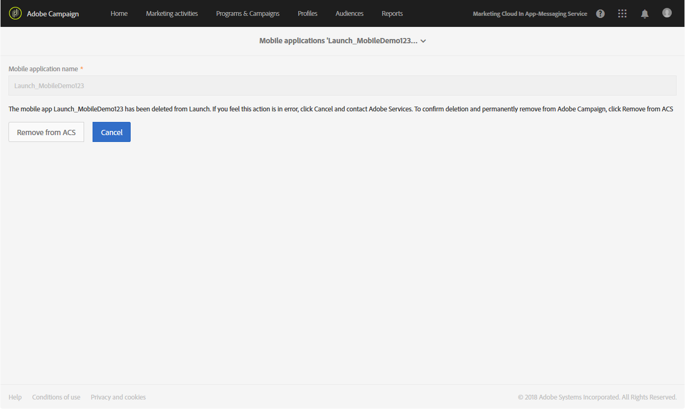

# Configuring a mobile application using SDK V5

Configuring a mobile application using SDK V5

Customers leveraging SDK V4 in their Mobile Apps will require some additional configuration to enable their user base to incrementally upgrade to SDK V5 version of the App. This configuration will be provided with In-App GA release.

>[!NOTE]
>
>Both push notifications and In-app messaging are supported by SDK V5 mobile applications. This feature is optional and currently a Beta feature which can be subject to future changes.

In order to send push notifications and In-App messages with SDK V5 application, a Mobile App has to be set up in Adobe Launch and configured in Adobe Campaign. Follow the steps below to start the configuration:

1. Make sure you can access the **Mobile app** channel in Adobe Campaign.
1. Create the mobile application in Adobe Launch by creating a property of Mobile type. For more info, refer to the [Adobe Launch](https://docs.adobelaunch.com/administration/companies-and-properties#create-a-property) documentation.
1. Install the following extensions for your mobile app in Adobe Launch:

    * Analytics
    * Campaign
    * Identity
    * Mobile Core
    * Signals

   For more information on extensions, refer to the [Adobe Launch](https://launch.gitbook.io/marketing-mobile-sdk-v5-by-adobe-documentation/) documentation.

1. Configure rules for your application in Adobe Launch. For more on this refer to [Configuring your application in Adobe Launch](../../administration/using/configuring-a-mobile-application-using-sdk-v5.md#main-pars_header_59).
1. Configure your Adobe Launch application in Adobe Campaign Standard. For more on this, refer to [Setting up your Adobe Launch application in Adobe Campaign](../../administration/using/configuring-a-mobile-application-using-sdk-v5.md#setting-up-your-adobe-launch-application-in-adobe-campaign).
1. Add channel specific configuration to your Mobile Application set-up. For more on this refer to [Channel specific application configuration in Adobe Campaign](../../administration/using/configuring-a-mobile-application-using-sdk-v5.md#channel-specific-application-configuration-in-adobe-campaign).
1. Implement SDK V5 in your Mobile application. For more on this refer to [Adobe Launch](https://launch.gitbook.io/marketing-mobile-sdk-v5-by-adobe-documentation/) documentation.

## Configuring your application in Adobe Launch

In Adobe Launch, we need to create data elements and rules to send PII, users' interaction with Push and In-App messages and other data to Campaign.

>[!CAUTION]
>
>All configuration changes in Adobe Launch require publishing for them to take effect. For more on this, refer to the [Adobe Launch](https://docs.adobelaunch.com/publishing) documentation.

To configure your application in Adobe Launch, follow these steps:

* [Step 1: Create data elements](../../administration/using/configuring-a-mobile-application-using-sdk-v5.md#step-1--create-data-elements)
* [Step 2: Create rules for PII postback](../../administration/using/configuring-a-mobile-application-using-sdk-v5.md#step-2--create-rules-for-pii-postback)
* [Step 3: Create rules for In-App tracking postback](../../administration/using/configuring-a-mobile-application-using-sdk-v5.md#step-3--create-rules-for-in-app-tracking-postback)
* [Step 4: Create rules for push notifications tracking postback](../../administration/using/configuring-a-mobile-application-using-sdk-v5.md#step-4--create-rules-for-push-notifications-tracking-postback)

### Step 1: Create data elements

Here are the data elements we recommend creating in Adobe Launch:

* **Marketing ID**, which will be mapped to Identity.Marketing Cloud Id.
* **Pkey**, a unique key for refencing mobile application in Adobe Campaign, which will be mapped to Mobile Core.State:com.adobe.module.configuration/campaign.pkey. 
* **Campaign server**, which will be mapped to Mobile Core.State:com.adobe.module.configuration/campaign.server.
* **In-app tracking ID**, used to track ID for users' interaction with the In-app message, which will be mapped to Mobile Core.Event Trigger Data:Trigger ID.

To create these data elements:

1. Select the **Data Elements **tab from your mobile application dashboard in Adobe Launch.
1. Click the **Create new data element **button to create the **Marketing ID** data element.

   

1. Enter the following data:

    * In the **Name** field, for example, type in **marketing-Id**.
    * From the **Extension** drop-down, select **Identity**.
    * From the **Data element type** drop-down, select **Marketing Cloud ID**.

   

1. Click **Save**.
1. Then, click **Add data element** to create the **Pkey** data element.
1. Enter the following data:

    * In the **Name** field, for example, type in **pkey**.
    * From the **Extension** drop-down, select **Mobile Core**.
    * From the **Data element type** drop-down, select **State**.
    * Add the following URL:

      ```    
      com.adobe.module.configuration/campaign.pkey
      ```

   

1. Click **Save**.
1. Then, click **Add data element** to create the **Campaign server** data element.
1. Enter the following data:

    * In the **Name** field, for example, type in **camp-server**.
    * From the **Extension** drop-down, select **Mobile Core**.
    * From the **Data element type** drop-down, select **State**.
    * Add the following URL:

      ```    
      com.adobe.module.configuration/campaign.server
      ```

   

1. Click **Save**.
1. Then, click **Add data element** to create the **In-app tracking ID** data element.
1. Enter the following data:

    * In the **Name** field, for example, type in **inapp-tracking**.
    * From the **Extension** drop-down, select **Mobile Core**.
    * From the **Data element type** drop-down, select **Event Trigger Data**.
    * From the **Select option** drop-down, select **Trigger ID**.

   

1. Click **Save**.

### Step 2: Create rules for PII postback

To send PII to Campaign to enrich a user's profile with additional data, you need to create a rule in Adobe Launch.

1. Select the **Rules** tab from your mobile application dashboard in Adobe Launch.

   

1. Click the **Create new rule** button.
1. In the **Name** field, for example, type in **Mobile Core - Collect PII**.
1. Under the **Events** category, click the **Add** button.

   

1. Enter the following data:

    * From the **Extension** drop-down, select **Mobile Core**.
    * From the **Event type** drop-down, select **Collect PII**.
    * From the **Order** field, type in 50.

   

1. Click the **Keep changes** button.
1. Under the **Actions** category, click the **Add** button.

   

1. Enter the following data:

    * From the **Extension** drop-down, select **Signals**.
    * From the **Action type** drop-down, select **Send PII**.

1. Add your environment URL in the URL sandbox in the following format:

   ```
   https://{%%camp-server%%}/rest/head/mobileAppV5/{%%pkey%%}/subscriptions/{%%mcid%%}
   ```

1. Check the **Add post body** box to add information on what user’s information should be sent to Campaign. For example:

   ```
   {
   "userKey": "{%%contextdata.userKey%%}",
   "pushPlatform": "{%%contextdata.pushPlatform%%}",
   "marketingCloudId": "{%%mcid%%}",
   "cusEmail": "{%%contextdata.cusEmail%%}",
   "cusFirstName": "{%%contextdata.cusFirstName%%}",
   "cusLastName": "{%%contextdata.cusLastName%%}"
   }
   ```

1. Fill the **Content Type **and **Timeout** fields.

   

1. Click the **Keep changes** button then **Save**.

Your user data is now configured to be sent to Campaign.

### Step 3: Create rules for In-App tracking postback

To send tracking data to Campaign to help track your In-App deliveries and your users’ interaction with your mobile application, your need to create a rule in Adobe Launch.

1. Select the **Rules** tab from your mobile application dashboard in Adobe Launch.
1. Click the **Add rule** button.

   

1. In the **Name** field, for example, type in **Adobe Campaign - In-App click tracking**.
1. Under the **Events** category, click the **Add** button.
1. Enter the following data:

    * From the **Extension** drop-down, select **Adobe Campaign**.
    * From the **Event type** drop-down, select **In-App click tracking**.
    * From the **Order** field, type in 50.

   

1. Click the **Keep changes button**.
1. In the **Actions** category, click the **Add** button.
1. Enter the following data:

    * From the **Extension** drop-down, select **Signals**.
    * From the **Action type** drop-down, select **Send postback**.

1. Add your environment URL in the URL sandbox in the following format:

   ```
   https://{%%camp-server%%}/r/?id={%%iam-tracking-id%%}
   ```

1. Check the **Add post body** box and add your post body, such as:

   ```
   {}
   ```

1. Fill the **Content Type **and **Timeout** fields.

   

1. Click the **Keep changes **button then **Save**.

The tracking data will now be sent to Adobe Campaign.

### Step 4: Create rules for push notifications tracking postback

To send tracking data to Campaign to help track your Push notification deliveries and your users’ interaction with your mobile application, your need to create a rule in Adobe Launch.

1. Select the **Rules** tab from your mobile application dashboard in Adobe Launch.
1. Click the **Add rule** button.

   

1. In the **Name** field, for example, type in **Adobe Campaign - push click tracking**.
1. Under the **Events** category, click the **Add** button.
1. Enter the following data:

    * From the **Extension** drop-down, select **Adobe Analytics**.
    * From the **Event type** drop-down, select **Analytics track event**.

   

1. In the **Select an option** drop-down, select **Action** and click the  

   button.
1. Select the **equals** action in the drop-down and type in tracking in the field.

   

1. Click the **Keep changes button**.
1. In the **Actions** category, click the **Add** button.
1. Enter the following data:

    * From the **Extension** drop-down, select **Signals**.
    * From the **Action type** drop-down, select **Send postback**.

1. Add your environment URL in the URL sandbox in the following format:

   ```
   https://{%%camp-server%%}/r/?id={%%broadlogId%%},{%%deliveryId%%},{%%action%%}
   ```

1. Check the **Add post body** box and add your post body, such as:

   ```
   {}
   ```

1. Fill the **Content Type **and **Timeout** fields.

   

1. Click the **Keep changes **button then **Save**.

## Setting up your Adobe Launch application in Adobe Campaign

In order to use a Adobe Launch Mobile property in Campaign, you need to further configure it in Adobe Campaign. Mobile application properties should be set up with the same IMS org used in your Adobe Campaign instance for them to be visible in Adobe Campaign.

1. From the advanced menu, select **Administration** > **Channels **> **BETA:Mobile app (SDK V5)**.

   

1. Select the mobile application you created in Adobe Launch. Its **Property Status** should be **Ready to configure**.

   

1. To make the connection between Campaign and Adobe Launch, click **Save**.
1. From the previous window, you can now see that its **Property Status** has been changed to **Configured**. You can also verify that property has been set up successfully in Campaign, if Adobe Launch Campaign extension shows that the pkey, a unique key for refencing mobile application in Adobe Campaign, has been set up successfully.

   

1. For this configuration to take effect, the changes need to be published in Adobe Launch. For more on this, refer to the [Adobe Launch](https://docs.adobelaunch.com/publishing) documentation.

## Channel specific application configuration in Adobe Campaign

Your mobile application is now ready to be used in Campaign for push notification or In-app deliveries. You can now further configure it if needed to create events that will trigger your in-app messages and/or upload Push certificates.

1. From the advanced menu, select **Administration** > **Channels **> **BETA:Mobile app (SDK V5)**.
1. Select the mobile application you created and configured in Adobe Launch.
1. In the **Mobile application properties** tab, you can start adding event available in your mobile application for you In-app messages
1. Click the **Create Element** button to start configuring your events.

   

1. Fill in the **Name** and **Description** field.

   

1. Click **Add**. Your event is now available in the Triggers tab when creating an In-App message. For more on this, refer to this [section](../../channels/using/creating-an-in-app-message.md).
1. In the **Device-specific settings** section of a mobile application dashboard, for each device, provide the application details, including the certificate for iOS and the server key for Android.

   Once your certificate is uploaded, a message will let you know if the upload was successful and will display the expiration date of your certificate.

1. Click the **Mobile application subscribers** tab to see the subscribers and other information on them for example if they opted out of your notifications.

## Deleting your Adobe Launch application

To delete your Adobe Launch application, you first need to follow the steps detailed [here](https://docs.adobelaunch.com/administration/companies-and-properties#delete-a-property) . Please note that this cannot be reversed.

Once your application is deleted, you can check in Adobe Campaign if your application's **Property status** has been correctly updated to **Deleted in Launch**.

By clicking on your application in Adobe Campaign, you can choose to completely remove this application from Adobe Campaign by clicking the **Remove from ACS** button.



