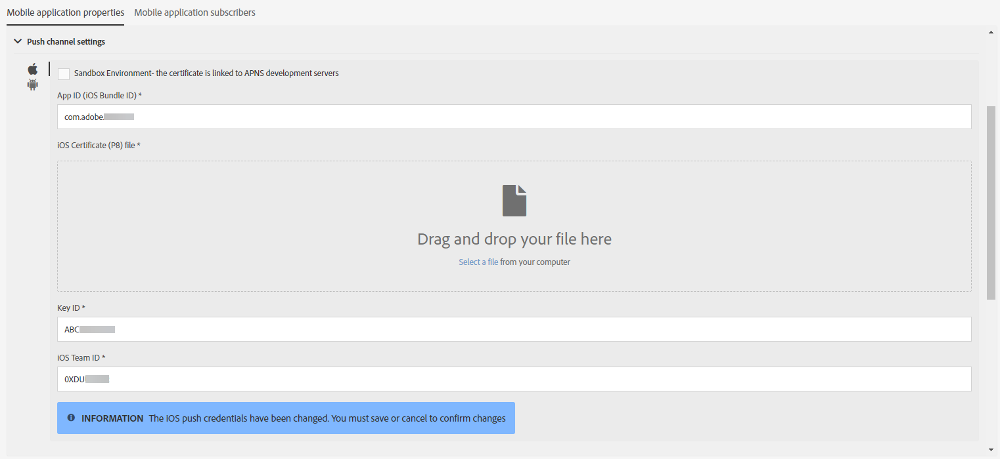
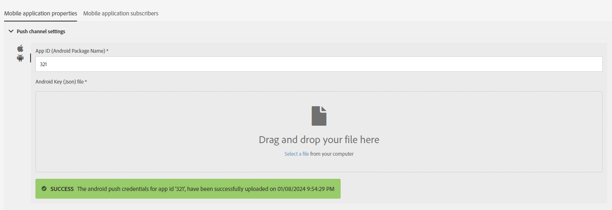

# Configuring a mobile application{#configuring-a-mobile-application}

## Configuring a mobile application using Adobe Experience Platform SDKs {#using-adobe-experience-platform-sdk}

>[!IMPORTANT]
>
> Adobe Experience Platform Launch has been rebranded as a suite of data collection technologies in Adobe Experience Platform. Several terminology changes have rolled out across the product documentation as a result. Please refer to the [following document](https://experienceleague.adobe.com/docs/experience-platform/tags/term-updates.html) for a consolidated reference of the terminology changes.

Note that Push notification and In-App implementations have to be performed by expert users. For assistance, contact your Adobe Account executive or Professional services partner.

To send push notifications and In-App messages with Experience Platform SDK application, a mobile application has to be set up in the Data Collection UI and configured in Adobe Campaign.

Once a mobile application is set up, you can retrieve the PII data it collected to create or update profiles from your database. For more on this, refer to this section: [Creating and updating profile information based on mobile application data](../../channels/using/updating-profile-with-mobile-app-data.md).

To learn more on the different mobile use cases supported in Adobe Campaign Standard by using the Adobe Experience Platform SDKs, refer to this [page](../../administration/using/supported-mobile-use-cases.md).

To complete the configuration, complete the following steps:

1. In Adobe Campaign, ensure that you can access the following:
   * **[!UICONTROL Push notification]**
   * **[!UICONTROL In-App message]**
   * **[!UICONTROL Adobe Places]**

   If not, contact your account team.

1. Check that your user has the necessary permissions in Adobe Campaign Standard and tags in Adobe Experience Platform.
   * In Adobe Campaign Standard, ensure that the IMS user is part of the Standard User and Administrator Product Profiles. This step allows the user to log in to Adobe Campaign Standard, navigate to the Experience Platform SDK mobile app page, and view the mobile app properties that you created in the Data Collection UI.

   * In the Data Collection UI, ensure that your IMS user is part of a Experience Platform Launch product profile.
   This step allows the user to log in to the Data Collection UI to create and view the properties. For more information about product profiles in the Data Collection UI, see [Create your product profile](https://experienceleague.adobe.com/docs/experience-platform/tags/admin/manage-permissions.html#gain-admin-rights-for-a-tags-product-profile). In the product profile, there should be no permissions set on the company or the properties, but the user should be able to still log in.

   To complete additional tasks like installing an extension, publishing an app, configuring environments, and so on, you need to set permissions in the product profile.

1. In the Data Collection UI, create a **[!UICONTROL Mobile property]**. For more information, see [Set up a mobile property](https://developer.adobe.com/client-sdks/documentation/getting-started/create-a-mobile-property).

1. In the Data Collection UI, click the **[!UICONTROL Extensions]** tab, go to **[!UICONTROL Catalog]**, and search for the **[!UICONTROL Adobe Campaign Standard]** extension. For more information, see [Adobe Campaign Standard](https://developer.adobe.com/client-sdks/documentation/adobe-campaign-standard).

1. To support location use cases in Campaign Standard, install the **[!UICONTROL Places]** extension in the Data Collection UI. Refer to this [page](https://developer.adobe.com/client-sdks/solution/places).

1. In Adobe Campaign Standard, configure the mobile property that you created in the Data Collection UI. Refer to [Setting up your Adobe Experience Platform Launch application in Adobe Campaign](../../administration/using/configuring-a-mobile-application.md#set-up-campaign).

1. Add the channel-specific configuration to your mobile application set up.
   For more information, see [Channel-specific application configuration in Adobe Campaign](../../administration/using/configuring-a-mobile-application.md#channel-specific-config).

1. If required, you can delete your tag property.
   For more information, see [Deleting your application](../../administration/using/configuring-a-mobile-application.md#delete-app).

## Sync Mobile app AEPSDK from Launch technical workflow {#aepsdk-workflow}

After creating and configuring your mobile property in the Data Collection UI, the **[!UICONTROL Sync Mobile app AEPSDK from Launch]** technical workflow will now synchronize the tag mobile properties imported in Adobe Campaign Standard.

By default, the technical worflow starts every 15 minutes. If needed, it can be manually restarted:

1. In Adobe Campaign Standard, from the advanced menu, select **[!UICONTROL Administration]** > **[!UICONTROL Application Settings]** > **[!UICONTROL Workflows]**.
1. Open the **[!UICONTROL Sync Mobile app AEPSDK from Launch (syncWithLaunch)]** workflow.

   

1. Click on the **[!UICONTROL Scheduler]** activity.

1. Select **[!UICONTROL Immediate execution]**.

   

Your workflow will now restart and synchronize the tag mobile properties imported in Adobe Campaign Standard.

## Setting up your application in Adobe Campaign {#set-up-campaign}

To use a tag mobile property in Campaign, you must also configure this property in Adobe Campaign. In Adobe Campaign, ensure that the IMS user is part of the Standard User and Administrator Product Profiles.

You must wait for the technical workflow to run and sync the tag mobile property to Adobe Campaign. You can then configure it in Adobe Campaign.

For more information on Sync Mobile app AEPSDK from Launch technical workflow, refer to this [section](../../administration/using/configuring-a-mobile-application.md#aepsdk-workflow).

>[!NOTE]
>
>By default, administrators with organizational unit set to ALL can edit the mobile application. 

1. From the advanced menu, select **[!UICONTROL Administration]** > **[!UICONTROL Channels]** > **[!UICONTROL Mobile app (AEP SDK)]**.

   

1. Select the mobile application that you created in the Data Collection UI.
   Its **[!UICONTROL Property Status]** should be **[!UICONTROL Ready to configure]**.

   >[!NOTE]
   >
   >By default, to retrieve the list of mobile applications created in the Data Collection UI, Campaign Standard uses the value defined in the NmsServer_URL option to look for matching properties.
   >
   >In some cases, the Campaign endpoint for a mobile application may be different from the one defined in NmsServer_URL. In that case, define the endpoint in the `Launch_URL_Campaign` option. Campaign will use the value from this option to look for matching properties in the Data Collection UI.

   

1. You can change the organizational unit of your mobile application under the **[!UICONTROL Access Authorization]** section to limit access to this mobile application to specific organization units. For more information, refer to this page.

   Here, the administrator can assign sub organizational units by selecting them from the drop-down.

      

1. To make the connection between Campaign and tags in Adobe Experience Platform, click **[!UICONTROL Save]**.

1. Verify that the status of the mobile app has changed from **[!UICONTROL Ready to Configure]** to **[!UICONTROL Configured]**.

   When the Campaign extension shows that the pkey has been set up successfully, you can also verify that the property has been set up successfully in Campaign.

      

1. For this configuration to take effect, the changes need to be published in the Data Collection UI.

   For more information, see [Publish configuration](https://developer.adobe.com/client-sdks/documentation/getting-started/create-a-mobile-property/#publish-the-configuration)

## Channel-specific application configuration in Adobe Campaign {#channel-specific-config}

Your mobile application is now ready to be used in Campaign for push notification or In-App deliveries. You can now further configure it if needed to create events that will trigger your In-App messages and/or upload Push certificates.

1. From the advanced menu, select **[!UICONTROL Administration]** > **[!UICONTROL Channels]** > **[!UICONTROL Mobile app (AEP SDK)]**.

1. Select the mobile application you created and configured in the Data Collection UI.

1. On the **[!UICONTROL Mobile application properties]** tab, you can start adding events that are available in your mobile application for your In-App messages.

1. To configure your events, click **[!UICONTROL Create Element]**.

      

1. Type a name and a description.

      

1. Click **[!UICONTROL Add]**.

   Your event is now available on the Triggers tab when you create an In-App message. For more information, see [Preparing and sending an In-App message](../../channels/using/preparing-and-sending-an-in-app-message.md).

1. In the **[!UICONTROL Device-specific settings]** section of a mobile application dashboard, for each device, provide the application details.

   * +++ For iOS

      Enter the following application details:

      * **App ID (iOS Bundle ID)**: Refer to [Apple documentation](https://developer.apple.com/documentation/appstoreconnectapi/bundle_ids) for more information on Bundle ID.
      * **iOS Certificate (P8) file**: Drag and drop your .p8 auth key.
      * **Key ID**: Refer to [Apple documentation](https://developer.apple.com/help/account/manage-keys/get-a-key-identifier/) for more information on Key ID.
      * **iOS Team ID**: Refer to [Apple documentation](https://developer.apple.com/help/account/manage-your-team/locate-your-team-id//) for more information on iOS Team ID.
      
         
      +++

   * +++ For Android

      Enter the following application details:

      * **App ID (Android Package Name)**: Refer to [Android documentation](https://support.google.com/admob/answer/9972781?hl=en#:~:text=The%20package%20name%20of%20an,supported%20third%2Dparty%20Android%20stores) for more information on Package name.
      * **Android Key (Json) file**: Drag and drop your .json private key file.

         
      +++

1. After your certificate is uploaded, a message notifies you that the upload was successful and displays the expiration date of your certificate.

   >[!NOTE]
   >
   >After successfully adding the certificate in Adobe Campaign Standard, you will no longer be able to change your settings back since only one APNS platform (production or sandbox) can be added to the MCPNS app.

1. Click the **[!UICONTROL Mobile application subscribers]** tab to see a list of subscribers and other information about these subscribers, for example, whether they opted out of your notifications.

## Deleting your application {#delete-app}

>[!CAUTION]
>
>Deleting your application cannot be reversed.

To delete your application, complete the steps in [Deleting mobile properties](https://developer.adobe.com/client-sdks/documentation/adobe-campaign-standard/#deleting-mobile-properties-in-the-data-collection-ui).

After your application is deleted, in Adobe Campaign, verify whether your application's Property status has been correctly updated to Deleted in Launch.

By clicking on your application in Adobe Campaign, you can choose to completely remove this application from Adobe Campaign by clicking Delete from Campaign.

