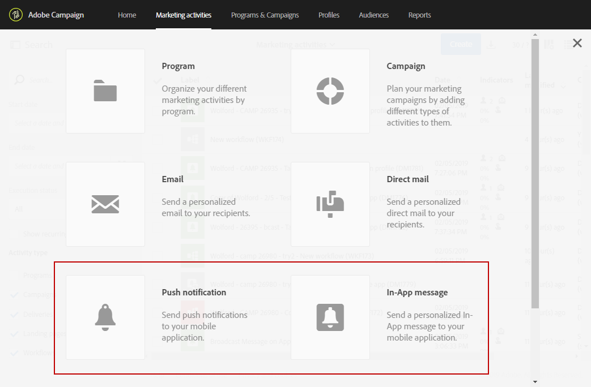

# Configuring a mobile application{#configuring-a-mobile-application}

## Using SDK V4 {#using-sdk-v4}

Push notification is supported by SDK V4 and Adobe Experience Platform SDKs unlike In-App. For the detailed steps to use push notifications with your mobile app, refer to this [page](https://helpx.adobe.com/campaign/kb/configuring-app-sdkv4.html).

The mobile applications receiving push notifications must be configured by an administrator in the Adobe Campaign interface. By configuring both Adobe Campaign and Adobe Mobile Services, you will be able to use your mobile application's data for your campaigns.

To be able to send push notifications, you need to:

1. Make sure you can access the **[!UICONTROL Mobile app]** channel in Adobe Campaign.
1. Configure your mobile application in:

    * [Adobe Campaign](https://helpx.adobe.com/campaign/kb/configuring-app-sdkv4.html#SettingupamobileapplicationinAdobeCampaign) .
    * [Adobe Mobile Services](https://helpx.adobe.com/campaign/kb/configuring-app-sdkv4.html#ConfiguringamobileapplicationinAdobeMobileServices) .

1. Perform the mobile application's specific setup:

    * Package the configuration file downloaded from the Adobe Mobile Services interface with the mobile application.
    * Integrate the Experience Cloud Mobile SDK into your mobile application.

1. Define the data that you want to collect from your application's subscribers. The mobile application's subscribers who have a profile in the Adobe Campaign database are reconciled based on the criteria that you defined.

   For more on this, refer to this [page](https://helpx.adobe.com/campaign/kb/configuring-app-sdkv4.html#Collectingsubscribersdatafromamobileapplication) .

1. Make sure that the setup has been completed successfully by launching your mobile application on your device and signing in. Make sure you opt in to receive notifications.
1. Then, in Adobe Campaign's advanced menu, select **[!UICONTROL Administration]** > **[!UICONTROL Channels]** > **[!UICONTROL Mobile app]**.
1. Select your mobile application from the list to display its properties. Your subscription information is displayed under the subscribers list.

   

1. To check the mobile applications a profile has subscribed to, in the **[!UICONTROL Profiles & Audiences > Profiles]** menu, select a profile and click the **[!UICONTROL Edit profile properties]** button on the right. The mobile applications are listed in the **[!UICONTROL Mobile App Subscriptions]** tab.

   

## Using Adobe Experience Platform SDK {#using-adobe-experience-platform-sdk}

To send push notifications and In-App messages with Experience Platform SDK application, a mobile application has to be set up in Adobe Experience Platform Experience Platform Experience Platform Launch and configured in Adobe Campaign. For the detailed steps to configure your mobile application using Experience Platform SDK, refer to this [page](https://helpx.adobe.com/campaign/kb/configuring-app-sdkv4.html).

Follow the steps below to start the configuration:

1. Make sure you can access the **[!UICONTROL Mobile]** channels: Push notification and In-App message in Adobe Campaign. If not, contact your account team.

   

1. Create the mobile application in Experience Platform Launch by creating a property of Mobile type. For more info, refer to the [Experience Platform Launch](https://aep-sdks.gitbook.io/docs/getting-started/create-a-mobile-property#create-a-new-mobile-property) documentation.
1. Install the **[!UICONTROL Adobe Campaign (Beta)]** extension for your mobile application in Experience Platform Launch:

   For more information on extensions, refer to the [Experience Platform Launch](https://aep-sdks.gitbook.io/docs/using-mobile-extensions/adobe-campaign-standard-beta) documentation.

1. Configure rules for your application in Adobe Launch, see [Configuring your application in Launch](https://helpx.adobe.com/campaign/kb/configuring-app-sdk.html#ConfiguringyourapplicationinLaunch) 
1. Configure your Adobe Launch application in Adobe Campaign Standard, see [Setting up your Adobe Launch application in Adobe Campaign](https://helpx.adobe.com/campaign/kb/configuring-app-sdk.html#SettingupyourAdobeLaunchapplicationinAdobeCampaign) .
1. Add channel specific configuration to your Mobile Application set-up, see [Channel-specific application configuration in Adobe Campaign](https://helpx.adobe.com/campaign/kb/configuring-app-sdk.html#ChannelspecificapplicationconfigurationinAdobeCampaign) .

   

