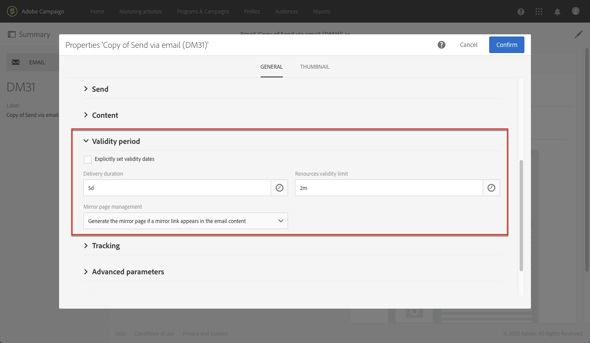
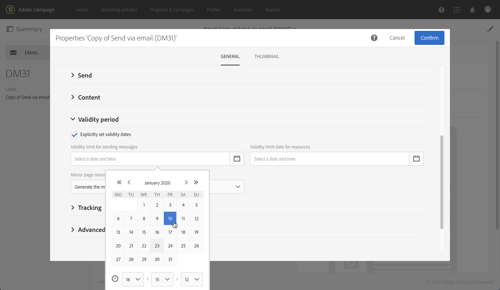

# Configuring email channel{#configuring-email-channel}

As a Campaign [administrator](../../administration/using/users-management.md#functional-administrators), you can configure email channel settings. These advanced settings include general email channel parameters, email routing accounts, email processing rules and email properties. On this page, you will learn how to edit the default values for the general email and sending parameters.

Note that some email settings are now managed by the Adobe Campaign Enhanced MTA. Therefore:
* Some configurations in the Campaign user interface are no longer applied:
  * The **[!UICONTROL Retries]** settings in the [Configuration menu](#email-channel-parameters) and in the [Sending parameters](#retries-parameters) of the email properties.
  * The **[!UICONTROL MX management]** and **[!UICONTROL Domain management]** rules in the [Email processing rules menu](#email-processing-rules).

* Other parameters are now partially managed by Enhanced MTA, while some configuration can still be done within Campaign. The impacted settings are as follows:
  * The **[!UICONTROL Message delivery duration]** parameter in the **[!UICONTROL Configuration]** menu. For more on this, see [this section](#email-channel-parameters).
  * The **[!UICONTROL Delivery duration]** or **[!UICONTROL Validity limit for sending messages]** parameter in the **[!UICONTROL Validity period]** section. For more on this, see [this section](#validity-period-parameters).
  * The **[!UICONTROL Bounce mails]** rules in the **[!UICONTROL Email processing rules]**. For more on this, see [this section](#email-processing-rules).

## Email channel parameters {#email-channel-parameters}

The email configuration screen allows to define the parameters for the email channel. Administrators can access these configurations in the **[!UICONTROL Administration] > [!UICONTROL Channels] > [!UICONTROL Email] > [!UICONTROL Configuration]** menu.

* **Authorized masks fields**

  The **[!UICONTROL Header parameters of sent emails]** section lists the authorized email addresses that you can use to send emails to your recipients (sender address) and to enable them to send back automated replies like asynchronous bounces, out-of-office replies, etc. (error address).  Adobe Campaign checks that the addresses entered are valid during the message preparation stage. This operating mode ensures that no addresses are used that could trigger deliverability issues.
    * Both sender and error addresses are set up by Adobe. Those fields cannot be empty.
    * You cannot edit those fields. To update an address, contact the Adobe Customer Care team.
    * To add another address, you can use the [Control Panel](https://docs.adobe.com/content/help/en/control-panel/using/subdomains-and-certificates/setting-up-new-subdomain.html) to set up a new subdomain, or contact the Adobe Customer Care team. Note that if several masks are used, they will be separated by commas.
    * It is a good practice to set addresses using a star such as *@yourdomain.com: it enables you to use any address ending with your subdomain name.

* **Deliverability**

  The **[!UICONTROL Delivery reports ID]** is provided by the Adobe Customer Care team. It identifies each instance with a deliverability ID which is used in the technical deliverability reports.
  <!--The Technical Deliverability report is not accessible through the UI in ACS. It will be replaced with 250ok in the future (project starting).-->

* **Delivery parameters**

  Adobe Campaign sends the messages beginning on the start date. The **[!UICONTROL Message delivery duration]** field allows you to specify the time frame in which any message in the delivery that encounters a temporary error or soft bounce will be retried.

  >[!IMPORTANT]
  >
  >**This parameter in Campaign is now only used if set to 3.5 days or less.** If you define a value higher than 3.5 days, it will not be taken into account as it is now managed by the Adobe Campaign Enhanced MTA.

  The **[!UICONTROL Online resources validity duration]** field is used for uploaded resources, mainly for the mirror page and images. The resources on this page are valid for a limited time (to save disk space).

* **Retries**

  Temporarily undelivered messages are subject to an automatic retry. For more on this, see [Retries after a delivery temporary failure](../../sending/using/understanding-delivery-failures.md#retries-after-a-delivery-temporary-failure).

  >[!NOTE]
  >
  >The maximum number of retries to be performed and the minimum delay between retries are now managed by the Adobe Campaign Enhanced MTA, based on how well an IP is performing both historically and currently at a given domain. The **Retries** settings in Campaign will be ignored.

  <!--This section indicates how many retries should be performed the day after the send is started (**Number of retries**) and the minimum delay between retries (**Retry period**). By default, five retries are scheduled for the first day with a minimum interval of one hour, spread out over the 24 hours of the day. One retry per day is programmed after that and until the delivery deadline, which is defined in the **[!UICONTROL Delivery parameters]** section.-->

* **Email quarantine parameters**

  In the **[!UICONTROL Time between two significant errors]** field, enter a value to define the time the application waits before incrementing the error counter in case of a soft-bounced failure. The default value is **"1d"**, for 1 day.

  When the **[!UICONTROL Maximum number of errors before quarantine]** value is reached, the email address is then quarantined. The default value is **"5"**: the address will be quarantined on the fifth error. This means that the contact will be automatically excluded from subsequent deliveries.
  <!--Actually the way ACS works is that the address is already on the quarantine list on the first bounce, but with a different status meaning that the error count has started.-->

  For more on quarantines, see [Understanding quarantine management](../../sending/using/understanding-quarantine-management.md).

## Email routing accounts {#email-routing-accounts}

The **[!UICONTROL Integrated email routing]** external account is provided by default. It contains the technical parameters that allow the application to send emails.

The account type must always be set to **[!UICONTROL Routing]**, the channel to **[!UICONTROL Email]** and the delivery mode set to **[!UICONTROL Bulk delivery]**.

**Related topic**:

[External accounts](../../administration/using/external-accounts.md)

## Email processing rules {#email-processing-rules}

The **[!UICONTROL Email processing rules]** can be accessed by administrators through the **[!UICONTROL Administration > Channels > Email]** menu.

Note that the email domains and the MX rules are now managed by the Adobe Campaign Enhanced MTA:
* **DKIM (DomainKeys Identified Mail)** email authentication signing is done by the Enhanced MTA for all messages with all domains. It does not sign with **Sender ID**, **DomainKeys**, or **S/MIME** unless otherwise specified at the Enhanced MTA level.
* The Enhanced MTA uses its own MX rules that allow it to customize your throughput by domain based on your own historical email reputation, and on the real-time feedback coming from the domains where you are sending emails.

### Bounce mails {#bounce-mails}

Asynchronous bounces are still qualified by the Campaign inMail process through the **[!UICONTROL Bounce mails]** rules.

These rules contain the list of character strings which can be returned by remote servers and which let you qualify the error (**Hard**, **Soft** or **Ignored**).

>[!NOTE]
>
>For synchronous delivery failure error messages, the Adobe Campaign Enhanced MTA determines the bounce type and qualification, and sends back that information to Campaign.

For more on bounce mail qualification, see this [section](../../sending/using/understanding-delivery-failures.md#bounce-mail-qualification).

<!--Because they are now managed by the Enhanced MTA, the bounce qualifications in the Campaign **[!UICONTROL Message qualification]** table are no longer used. For more on bounce mail qualification, see this [section](../../sending/using/understanding-delivery-failures.md#bounce-mail-qualification).

### Management of email domains {#managing-email-domains}

The email domains are now managed by the Adobe Campaign Enhanced MTA. The Adobe Campaign **[!UICONTROL Domain management]** rules are no longer used.

**DKIM (DomainKeys Identified Mail)** email authentication signing is done by the Enhanced MTA for all messages with all domains. It does not sign with **Sender ID**, **DomainKeys**, or **S/MIME** unless otherwise specified at the Enhanced MTA level.

### MX management {#mx-management}

The MX rules are now managed by the Adobe Campaign Enhanced MTA. The Adobe Campaign **[!UICONTROL MX management]** delivery throughput rules are no longer used.

The Enhanced MTA uses its own MX rules that allow it to customize your throughput by domain based on your own historical email reputation, and on the real-time feedback coming from the domains where you are sending emails.-->

## List of email properties {#list-of-email-properties}

This section details the list of parameters available in the properties screen of an email or email template.

>[!NOTE]
>
>Some parameters are only available in templates. Parameters you can access [depend on your permissions](../../administration/using/users-management.md).

To edit the properties of an email or an email template, use the **[!UICONTROL Edit properties]** button.

### General parameters {#general-parameters}

On the top of the email parameter screen, identify the email using the **[!UICONTROL Label]** and **[!UICONTROL ID]** fields. This information appears in the interface but is not visible to the message recipients.

>[!IMPORTANT]
>
>The ID must be unique.

The **[!UICONTROL Brand]** field allows you to select the brand linked to the delivery. For more information on using and configuring brands, refer to the [Branding](../../administration/using/branding.md) section.

The **[!UICONTROL Campaign]** field allows you to enter the campaign linked to the email.

You can also add a **[!UICONTROL Description]** in the corresponding field and edit the image displayed on the email thumbnail in the lists.

### Sending parameters {#sending-parameters}

The **[!UICONTROL Send]** section is only available for email templates. It contains the following parameters:

#### Retries parameters {#retries-parameters}

Temporarily undelivered messages are subject to an automatic retry. For more on this, see [Retries after a delivery temporary failure](../../sending/using/understanding-delivery-failures.md#retries-after-a-delivery-temporary-failure).

>[!NOTE]
  >
  >The minimum delay between retries and the maximum number of retries to be performed are now managed by the Adobe Campaign Enhanced MTA, based on how well an IP is performing both historically and currently at a given domain. The Campaign **Retries** settings will be ignored.
  
<!--This section indicates how many retries should be performed the day after the send is started ( **[!UICONTROL Max. number of retries]** ) and the minimum delay between retries ( **[!UICONTROL Retry period]** ).

By default, five retries are scheduled for the first day with a minimum interval of one hour, spread out over the 24 hours of the day. One retry per day is programmed after that and until the delivery deadline, which is defined in the [Validity period parameters](#validity-period-parameters) section.

The number of retries can be changed globally (contact your Adobe technical administrator) or for each delivery or delivery template.-->

The **delivery duration setting** (defined in the [Validity period parameters](#validity-period-parameters) section) **set up in Campaign will still be honored but only up to 3.5 days**. At that point, any message in the retry queue will be removed from the queue and sent back as a bounce. For more on delivery failures, see this [section](../../sending/using/understanding-delivery-failures.md#about-delivery-failures).

#### Email format parameters {#email-format-parameters}

You can configure the format of emails to be sent. There are three options available:

* **Use recipient preferences** (default mode): the message format is defined according to the data stored in the recipient profile and stored by default in the **Email format** field (@emailFormat). If a recipient wishes to receive messages in a certain format, this is the format sent. If the field is not completed, a multipart-alternative message is sent (see below).
* **Let recipient mail client choose the most appropriate format (multipart-alternative)**: the message contains both formats: text and HTML. The format displayed upon reception depends on the configuration of the recipient's mail software (multipart-alternative).

  >[!IMPORTANT]
  >
  >This option includes both versions of the message. It therefore impacts the delivery throughput, because the message size is greater.

* **Send all messages in text format**: the message is sent in text format. HTML format will not be sent, but used for the mirror page only when the recipient clicks the link in the message.

#### SMTP test mode {#smtp-test-mode}

The **[!UICONTROL Enable SMTP test mode]** option allows you to test sending emails via an SMTP connection without actually sending messages.
The messages are processed until connection with the SMTP server is achieved, but they are not sent.

This option is available for emails and email templates.

If you enable the SMTP test mode option for an email template, all email messages created from this template will have this option enabled.

  >[!IMPORTANT]
  >
  >When this option is enabled for an email, no messages will be sent until it is unchecked.
  >A warning will be displayed in the email or email template dashboard.

For more information on configuring SMTP, refer to the [List of email SMTP parameters](#list-of-email-smtp-parameters) section.

### Validity period parameters {#validity-period-parameters}

The **[!UICONTROL Validity period]** section contains the following parameters:

* **[!UICONTROL Explicitly set validity dates]**: when this box is unchecked, you must enter a duration in the **[!UICONTROL Delivery duration]** and **[!UICONTROL Resource validity limit]** fields.

  Check this box if you would like to define specific times and dates.

  

* **[!UICONTROL Delivery duration]** / **[!UICONTROL Validity limit for sending messages]**: Adobe Campaign sends the messages beginning on the start date. This field allows you to specify the duration during which the messages can be sent.

  >[!IMPORTANT]
  >
  >This parameter is now managed by the Adobe Campaign Enhanced MTA. **You must define a value up to 3.5 days.** If you define a value higher than 3.5 days, it will not be taken into account.

* **[!UICONTROL Resource validity duration]** / **[!UICONTROL Validity limit date for resources]**: this field is used for uploaded resources, mainly for the mirror page and images. The resources on this page are valid for a limited time (to save disk space).
* **[!UICONTROL Mirror page management]**: the mirror page is an HTML page accessible online via a web browser. Its content is identical to the email content. By default, the mirror page is generated if the link is inserted in the mail content. This field allows you to modify the way in which this page is generated:

  >[!IMPORTANT]
  >
  >HTML content must have been defined for the email for the mirror page to be created.

    * **[!UICONTROL Generate the mirror page if a mirror link appears in the email content]** (default mode): the mirror page is generated if the link is inserted in the mail content. 
    * **Force the generation of the mirror page**: even if no link to the mirror page is inserted into the messages, the mirror page will be created. 
    * **Do not generate the mirror page**: no mirror page is generated, even if the link is in the messages. 
    * **Generate a mirror page accessible using only the message ID**: this option lets you access the content of the mirror page, with personalization information, in the delivery log window.

>[!NOTE]
>
>The **[!UICONTROL Delivery duration]** parameter does not apply to transactional messages. For more on transactional messaging, see [this section](../../channels/using/about-transactional-messaging.md).

### Tracking parameters {#tracking-parameters}

The **[!UICONTROL Tracking]** section contains the following parameters:

* **[!UICONTROL Activate tracking]**: allows you to activate/deactivate message URL tracking. To manage tracking for each message URL, use the **[!UICONTROL Links]** icon in the Email Designer action bar. See [About tracked URLs](../../designing/using/links.md#about-tracked-urls).
* **[!UICONTROL Tracking validity limit]**: allows you to define the duration for which the tracking will be activated on the URLs.
* **[!UICONTROL Substitution URL for expired URLs]**: you can enter a URL to a web page that will be displayed once the tracking has expired.

### Advanced parameters {#advanced-parameters}

The **[!UICONTROL Advanced parameters]** section contains multiple parameters.

The first fields allow you to enter information necessary to elaborate email message headers. You can manage here the reply address and text as well as the sender address (which fills the field "From:"). This information can be personalized.

Click the button to the right of the field that is going to be changed, then add the personalization field, content block or dynamic text.

Inserting and using the personalization content is detailed in the [Personalizing email content](../../designing/using/personalization.md) documentation.

#### Target context {#target-context}

The targeting context allows you to define a set of tables that will be used for email targeting (in the audience definition screen) and personalization (defining personalization fields in the HTML content editor).

#### Routing {#routing}

This field indicates the routing mode used. It references an external account. For example, this can be used if you would like to use an external account containing specific branding configurations.

>[!NOTE]
>
>External accounts are accessible via the **Administration** > **Application settings** > **External accounts** menu.

#### Preparation {#preparation}

Preparing messages is detailed in the [Approving messages](../../sending/using/preparing-the-send.md) section.

* **[!UICONTROL Typology]**: before any send, messages must be prepared in order to validate the content and configuration. The verification rules applied during the preparation phase are defined in a **typology**. For example, for emails, preparation involves checking the subject, URLs and images, etc. Select the typology to apply in this field.

  >[!NOTE]
  >
  >Typologies, which can be accessed via the **[!UICONTROL Administration]** > **[!UICONTROL Channels]** > **[!UICONTROL Typologies]** menu, are presented in [this section](../../sending/using/about-typology-rules.md).

* **[!UICONTROL Compute the label during delivery preparation]**: allows you to calculate the label value of the email during the message preparation phase using personalization fields, content blocks, and dynamic text.

  It is also possible to personalize the delivery label with events variables that have been declared into the workflow's external signal activity. For more on this, refer to [this section](../../automating/using/calling-a-workflow-with-external-parameters.md).

* **[!UICONTROL Save SQL queries in the log]**: this option allows you to add SQL query logs in the journal during the preparation phase.

#### Proof settings {#proof-settings}

This section allows you to configure the default prefix to use in proof's subject line. For more in this, refer to [this section](../../sending/using/sending-proofs.md).

### List of email SMTP parameters {#list-of-email-smtp-parameters}

The **[!UICONTROL SMTP]** section contains the following parameters:

* **[!UICONTROL Character encoding]**: check the **[!UICONTROL Force encoding]** box if you would like to force message encoding, then select the encoding you want to use.
* **[!UICONTROL Bounce mails]**: by default, bounce mails are received in the platform's error inbox (defined in the **[!UICONTROL Administration]** > **[!UICONTROL Channels]** > **[!UICONTROL Email]** > **[!UICONTROL Configuration]** screen). To define a specific error address for an email, enter the address in the **[!UICONTROL Error address]** field.
* **[!UICONTROL Additional SMTP headers]**: this option allows for additional SMTP headers to be added to your messages. The script entered in the **[!UICONTROL Headers]** field must reference one header per line, in the form of **name:value**. Values are encoded automatically if necessary.

  >[!IMPORTANT]
  >
  >Adding a script for inserting additional SMTP headers is reserved for advanced users. The syntax of this script must comply with the requirements of this content type: no unused space, no empty line, etc.

### List of access authorization parameters {#list-of-access-authorization-parameters}

The **[!UICONTROL Access authorization]** section contains the following parameters:

* The **[!UICONTROL Organizational unit]** field allows you to restrict access to this email to certain users. The users associated with the specified unit or parent units will have read and write access to this email. Users associated with child units will only have read access to this email.

  >[!NOTE]
  >
  >You can configure organizational units via the **Administration** > **Users & Security** menu.

* The **[!UICONTROL Created by]**, **[!UICONTROL Created]**, **[!UICONTROL Modified by]** and **[!UICONTROL Last modified]** fields are automatically completed.
