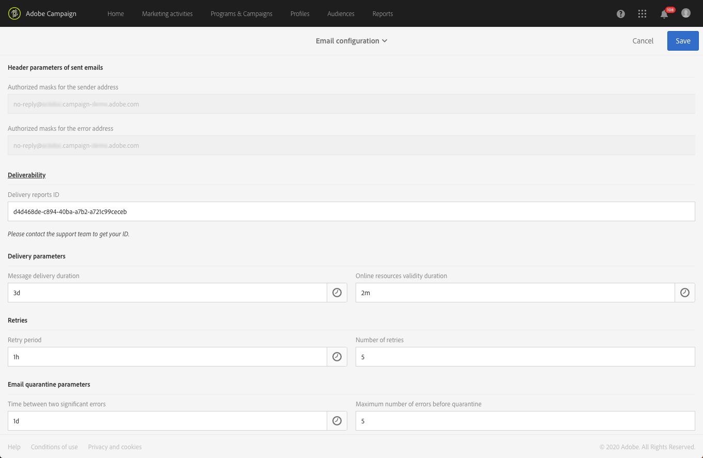
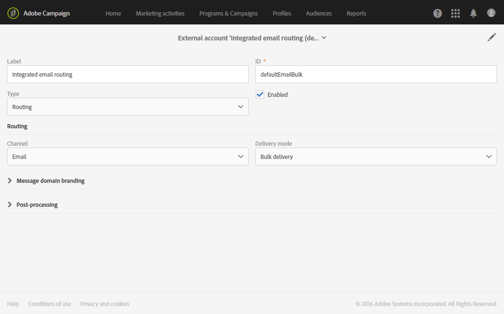
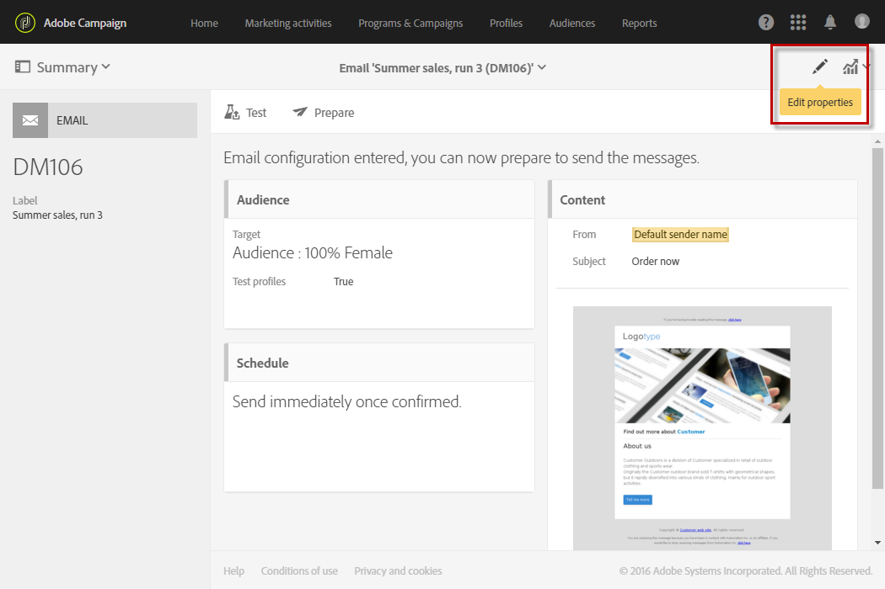
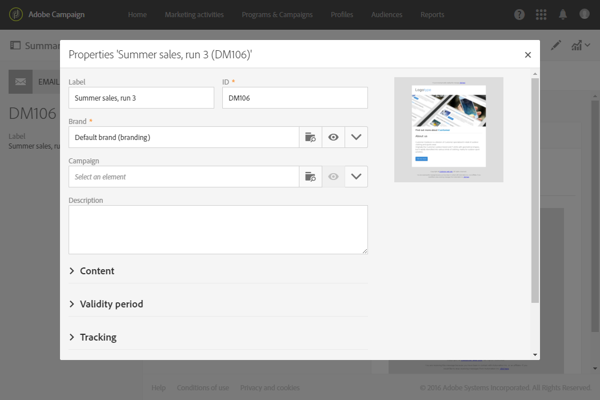
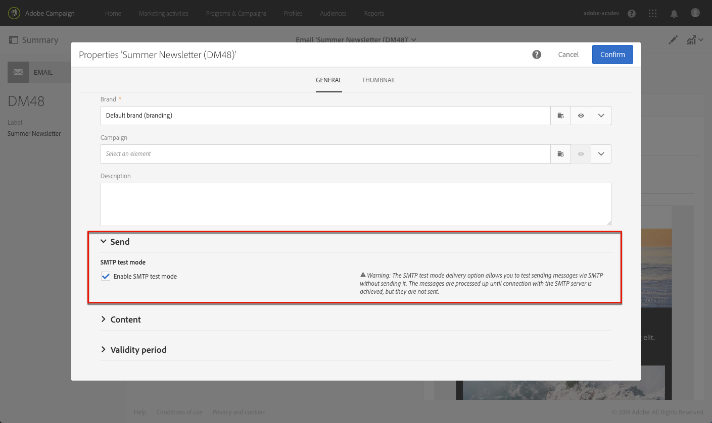
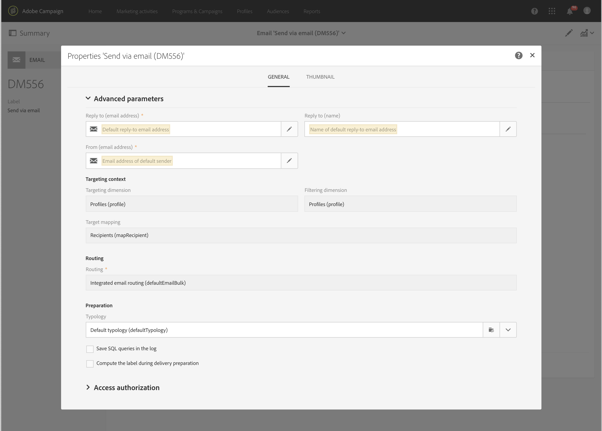
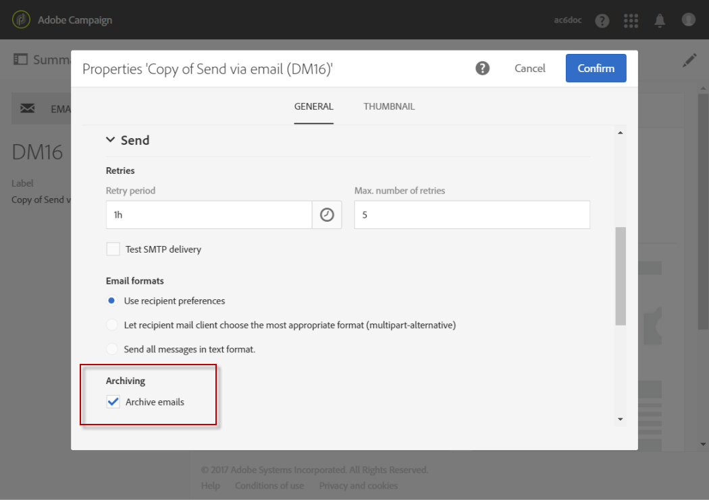

# Configuring email channel{#configuring-email-channel}

## Email channel parameters {#email-channel-parameters}

The email configuration screen allows you to define the parameters for the email channel.

* **Header parameters of sent emails**

  In this section, you can specify the **[!UICONTROL masks]** authorized for the sender address and the error address. If necessary, these masks can be separated using commas. This configuration is optional. When these fields are entered, during the message preparation stage, Adobe Campaign checks that the addresses entered are valid. This operating mode ensures that no addresses are used that could trigger deliverability issues. Delivery addresses must be configured on the delivery server.

* **Deliverability**

  This ID is provided by support. It is necessary for deliverability reports to work correctly.

* **Delivery parameters**

  Adobe Campaign sends the messages beginning on the start date. The **[!UICONTROL Message delivery duration]** field allows you to specify the duration during which the messages can be sent.

  The **[!UICONTROL Online resources validity duration]** field is used for uploaded resources, mainly for the mirror page and images. The resources on this page are valid for a limited time (to save disk space).

* **Retries**

  Temporarily undelivered messages are subject to an automatic retry. This section indicates how many retries should be performed the day after the send is started (**Number of retries**) and the minimum delay between retries (**Retry period**).

  By default, five retries are scheduled for the first day with a minimum interval of one hour, spread out over the 24 hours of the day. One retry per day is programmed after that and until the delivery deadline, which is defined in the **[!UICONTROL Delivery parameters]** section. 

* **Email quarantine parameters**

  In the **[!UICONTROL Time between two significant errors]** field, enter a value to define the time the application waits before incrementing the error counter in case of failure. Defaut value: **"1d"**, for 1 day.

  When the **[!UICONTROL Maximum number of errors before quarantine]** value is reached, the email address is then quarantined. Default value: **"5"**: the address will be quarantined on the sixth error. This means that the contact will be automatically excluded from subsequent deliveries.

**Related topic**:

[Understanding quarantine management](../../sending/using/understanding-quarantine-management.md)

## Email routing accounts {#email-routing-accounts}

The **[!UICONTROL Integrated email routing]** external account is provided by default. It contains the technical parameters that allow the application to send emails.

The account type must always be set to **[!UICONTROL Routing]**, the channel to **[!UICONTROL Email]** and the delivery mode set to **[!UICONTROL Bulk delivery]**.

**Related topic**:

[External accounts](../../administration/using/external-accounts.md)

## Email processing rules {#email-processing-rules}

These rules contain the list of character strings which can be returned by remote servers and which let you qualify the error (**Hard**, **Soft** or **Ignored**).

The default rules are as follows:

**Bounce mails**

When an email fails, the remote message server returns a bounce error message to the address specified in the application settings. Adobe Campaign compares the content of each bounce mail to the strings in the list of rules, and then assigns it one of the three error types.

The user can create his own rules.

>[!CAUTION]
>
>When importing a package and when updating data via the **Update for deliverability** workflow, the user-created rules are overwritten.

**Managing email domains**

The domain management rules are used to regulate the flow of outgoing emails for a specific domain. They sample the bounce messages and block sending where appropriate. The Adobe Campaign messaging server applies rules specific to the domains, and then the rules for the general case represented by an asterisk in the list of rules. Rules for the Hotmail and MSN domains are available by default in Adobe Campaign.

To configure domain management rules, simply set a threshold and select certain SMTP parameters. A **threshold** is a limit calculated as an error percentage beyond which all messages towards a specific domain are blocked.

For example, in the general case, for a minimum of 300 messages, the sending of emails is blocked for three hours if the error rate reaches 90%.

The **SMTP parameters** act as filters applied for a blocking rule.

* You can choose whether or not to activate certain identification standards and encryption keys to check the domain name, such as **Sender ID**, **DomainKeys**, **DKIM**, and **S/MIME**.
* **SMTP relay**: lets you configure the IP address and the port of a relay server for a particular domain.

**MX Management**

Each rule defines an address mask for the MX. Any MX whose name matches this mask is therefore eligible. The mask can contain "&#42;" and "?" generic characters.

For example, the following addresses:

* a.mx.yahoo.com 
* b.mx.yahoo.com 
* c.mx.yahoo.com

are compatible with the following masks:

* &#42;.yahoo.com
* ?.mx.yahoo.com

These rules are applied in sequence: the first rule whose MX mask is compatible with the targeted MX is applied.

The following parameters are available for each rule:

* **[!UICONTROL Range of IDs]**: this option lets you indicate the ranges of identifiers (publicId) for which the rule applies. You can specify:

    * A number: the rule will only apply to this publicId.
    * A range of numbers (number1-number2): the rule will apply to all publicIds between these two numbers.

  If the field is empty, the rule applies to all IDs.

* **[!UICONTROL Shared]**: this option indicates that the highest number of messages per hour and of connections applies to all MXs linked to this rule. 
* **[!UICONTROL Maximum number of connections]**: maximum number of simultaneous connections to an MX from a given address. 
* **Maximum number of messages**: maximum number of messages that can be sent by one connection. After this amount, the connection is closed and a new one is reopened. 
* **[!UICONTROL Messages per hour]**: maximum number of messages that can be sent in one hour for an MX via a given address.

>[!CAUTION]
>
>* The delivery server (MTA) must be restarted if the parameters have been changed. 
>* The modification or creation of management rules is for expert users only. 
>

## List of email properties {#list-of-email-properties}

This section details the list of parameters available in the properties screen of an email or email template.

>[!NOTE]
>
>Some parameters are only available in templates. Parameters you can access [depend on your permissions](../../administration/using/users-management.md).

To edit the properties of an email or an email template, use the **[!UICONTROL Edit properties]** button.

### General parameters {#general-parameters}

On the top of the email parameter screen, identify the email using the **[!UICONTROL Label]** and **[!UICONTROL ID]** fields. This information appears in the interface but is not visible to the message recipients.

>[!CAUTION]
>
>The ID must be unique.

The **[!UICONTROL Brand]** field allows you to select the brand linked to the delivery. For more information on using and configuring brands, refer to the [Branding](../../administration/using/branding.md) section.

The **[!UICONTROL Campaign]** field allows you to enter the campaign linked to the email.

You can also add a **[!UICONTROL Description]** in the corresponding field and edit the image displayed on the email thumbnail in the lists.

### Sending parameters {#sending-parameters}

The **[!UICONTROL Send]** section is only available for email templates. It contains the following parameters:

#### Retries parameters {#retries-parameters}

Temporarily undelivered messages are subject to an automatic retry. This section indicates how many retries should be performed the day after the send is started ( **[!UICONTROL Max. number of retries]** ) and the minimum delay between retries ( **[!UICONTROL Retry period]** ).

By default, five retries are scheduled for the first day with a minimum interval of one hour, spread out over the 24 hours of the day. One retry per day is programmed after that and until the delivery deadline, which is defined in the [Validity period parameters](#validity-period-parameters) section.

The number of retries can be changed globally (contact your Adobe technical administrator) or for each delivery or delivery template

#### Email format parameters {#email-format-parameters}

You can configure the format of emails to be sent. There are three options available:

* **Use recipient preferences** (default mode): the message format is defined according to the data stored in the recipient profile and stored by default in the **Email format** field (@emailFormat). If a recipient wishes to receive messages in a certain format, this is the format sent. If the field is not completed, a multipart-alternative message is sent (see below).
* **Let recipient mail client choose the most appropriate format (multipart-alternative)**: the message contains both formats: text and HTML. The format displayed upon reception depends on the configuration of the recipient's mail software (multipart-alternative).

  >[!CAUTION]
  >
  >This option includes both versions of the message. It therefore impacts the delivery throughput, because the message size is greater.

* **Send all messages in text format**: the message is sent in text format. HTML format will not be sent, but used for the mirror page only when the recipient clicks the link in the message.

#### SMTP test mode {#smtp-test-mode}

The **[!UICONTROL Enable SMTP test mode]** option allows you to test sending emails via an SMTP connection without actually sending messages.
The messages are processed until connection with the SMTP server is achieved, but they are not sent.

This option is available for emails and email templates.

If you enable the SMTP test mode option for an email template, all email messages created from this template will have this option enabled.

  >[!CAUTION]
  >
  >When this option is enabled for an email, no messages will be sent until it is unchecked.
  >A warning will be displayed in the email or email template dashboard.

For more information on configuring SMTP, refer to the [List of email SMTP parameters](#list-of-email-smtp-parameters) section.

### Validity period parameters {#validity-period-parameters}

The **[!UICONTROL Validity]** section contains the following parameters:

* **[!UICONTROL Explicitly set validity dates]**: when this box is unchecked, you must enter a duration in the **[!UICONTROL Delivery duration]** and **[!UICONTROL Resource validity limit]** fields. Check this box if you would like to define specific times and dates.
* **[!UICONTROL Delivery duration]**: Adobe Campaign sends the messages beginning on the start date. This field allows you to specify the duration during which the messages can be sent.
* **[!UICONTROL Resource validity duration]**: this field is used for uploaded resources, mainly for the mirror page and images. The resources on this page are valid for a limited time (to save disk space).
* **[!UICONTROL Mirror page management]**: the mirror page is an HTML page accessible online via a web browser. Its content is identical to the email content. By default, the mirror page is generated if the link is inserted in the mail content. This field allows you to modify the way in which this page is generated:

  >[!CAUTION]
  >
  >An HTML content must have been defined for the email for the mirror page to be created.

    * **[!UICONTROL Generate the mirror page if a mirror link appears in the email content]** (default mode): the mirror page is generated if the link is inserted in the mail content. 
    * **Force the generation of the mirror page**: even if no link to the mirror page is inserted into the messages, the mirror page will be created. 
    * **Do not generate the mirror page**: no mirror page is generated, even if the link is in the messages. 
    * **Generate a mirror page accessible using only the message ID**: this option lets you access the content of the mirror page, with personalization information, in the delivery log window.

>[!NOTE]
>
>The **[!UICONTROL Explicitly set validity dates]** and **[!UICONTROL Delivery duration]** parameters do not apply to transactional messages. For more on transactional messaging, see [this section](../../channels/using/about-transactional-messaging.md).

### Tracking parameters {#tracking-parameters}

The **[!UICONTROL Tracking]** section contains the following parameters:

* **[!UICONTROL Activate tracking]**: allows you to activate/deactivate message URL tracking. To manage tracking for each message URL, use the **[!UICONTROL Links]** icon in the Email Designer action bar. See [About tracked URLs](../../designing/using/links.md#about-tracked-urls).
* **[!UICONTROL Tracking validity limit]**: allows you to define the duration for which the tracking will be activated on the URLs.
* **[!UICONTROL Substitution URL for expired URLs]**: you can enter a URL to a web page that will be displayed once the tracking has expired.

### Advanced parameters {#advanced-parameters}

The **[!UICONTROL Advanced parameters]** section contains multiple parameters.

The first fields allow you to enter information necessary to elaborate email message headers. You can manage here the reply address and text as well as the sender address (which fills the field "From:"). This information can be personalized.

Click the button to the right of the field that is going to be changed, then add the personalization field, content block or dynamic text.

Inserting and using the personalization content is detailed in the [Personalizing email content](../../designing/using/personalization.md) documentation.

#### Target context {#target-context}

The targeting context allows you to define a set of tables that will be used for email targeting (in the audience definition screen) and personalization (defining personalization fields in the HTML content editor).

#### Routing {#routing}

This field indicates the routing mode used. It references an external account. For example, this can be used if you would like to use an external account containing specific branding configurations.

>[!NOTE]
>
>External accounts are accessible via the **Administration** > **Application settings** > **External accounts** menu.

#### Preparation {#preparation}

Preparing messages is detailed in the [Approving messages](../../sending/using/preparing-the-send.md) section.

* **[!UICONTROL Typology]**: before any send, messages must be prepared in order to validate the content and configuration. The verification rules applied during the preparation phase are defined in a **typology**. For example, for emails, preparation involves checking the subject, URLs and images, etc. Select the typology to apply in this field.

  >[!NOTE]
  >
  >Typologies, which can be accessed via the **[!UICONTROL Administration]** > **[!UICONTROL Channels]** > **[!UICONTROL Typologies]** menu, are presented in the [Typologies](../../administration/using/about-typology-rules.md) section.

* **[!UICONTROL Compute the label during delivery preparation]**: allows you to calculate the label value of the email during the message preparation phase using personalization fields, content blocks, and dynamic text.

  It is also possible to personalize the delivery label with events variables that have been declared into the workflow's external signal activity. For more on this, refer to [this section](../../automating/using/calling-a-workflow-with-external-parameters.md).

* **[!UICONTROL Save SQL queries in the log]**: this option allows you to add SQL query logs in the journal during the preparation phase.

### List of email SMTP parameters {#list-of-email-smtp-parameters}

The **[!UICONTROL SMTP]** section contains the following parameters:

* **[!UICONTROL Character encoding]**: check the **[!UICONTROL Force encoding]** box if you would like to force message encoding, then select the encoding you want to use.
* **[!UICONTROL Bounce mails]**: by default, bounce mails are received in the platform's error inbox (defined in the **[!UICONTROL Administration]** > **[!UICONTROL Channels]** > **[!UICONTROL Email]** > **[!UICONTROL Configuration]** screen). To define a specific error address for an email, enter the address in the **[!UICONTROL Error address]** field.
* **[!UICONTROL Additional SMTP headers]**: this option allows for additional SMTP headers to be added to your messages. The script entered in the **[!UICONTROL Headers]** field must reference one header per line, in the form of **name:value**. Values are encoded automatically if necessary.

  >[!CAUTION]
  >
  >Adding a script for inserting additional SMTP headers is reserved for advanced users. The syntax of this script must comply with the requirements of this content type: no unused space, no empty line, etc.

### List of access authorization parameters {#list-of-access-authorization-parameters}

The **[!UICONTROL Access authorization]** section contains the following parameters:

* The **[!UICONTROL Organizational unit]** field allows you to restrict access to this email to certain users. The users associated with the specified unit or parent units will have read and write access to this email. Users associated with child units will only have read access to this email.

  >[!NOTE]
  >
  >You can configure organizational units via the **Administration** > **Users & Security** menu.

* The **[!UICONTROL Created by]**, **[!UICONTROL Created]**, **[!UICONTROL Modified by]** and **[!UICONTROL Last modified]** fields are automatically completed.

## Archiving emails {#archiving-emails}

You can configure Adobe Campaign to keep a copy of emails sent from your platform.

However, Adobe Campaign itself does not manage archived files. It does enable you to send the messages of your choice to a dedicated address, from where they can be processed and archived using an external system.

When activated in the delivery template, this feature allows you to send an exact copy of the corresponding sent messages to a BCC email address (invisible to the delivery recipients) that you must specify.

### Recommendations and limitations {#recommendations-and-limitations}

* This feature is optional. Please check your license agreement and contact your account executive to activate it.
* You can only use one BCC email address.
* Only successfully sent emails are taken in account. Bounces are not.
* For privacy reasons, BCC emails must be processed by an archiving system capable of storing securely personally identifiable information (PII).
* When creating a new delivery template, Email BCC is not enabled by default, even if the option has been purchased. You must enable it manually in each delivery template where you want to use it.

### Activating email archiving {#activating-email-archiving}

Email BCC is activated in the [email template](../../start/using/marketing-activity-templates.md), through a dedicated option:

1. Go to **Resources** > **Templates** > **Delivery templates**.
1. Duplicate the out-of-the-box **[!UICONTROL Send via email]** template.
1. Select the duplicated template.
1. Click the **[!UICONTROL Edit properties]** button to edit the template's properties.
1. Expand the **[!UICONTROL Send]** section.
1. Check the **[!UICONTROL Archive emails]** box to keep a copy of all sent messages for each delivery based on this template.

   

>[!NOTE]
>
>If the emails sent to the BCC address are opened and clicked through, this will be taken into account in the **[!UICONTROL Total opens]** and **[!UICONTROL Clicks]** from the send analysis, which could cause some miscalculations.
