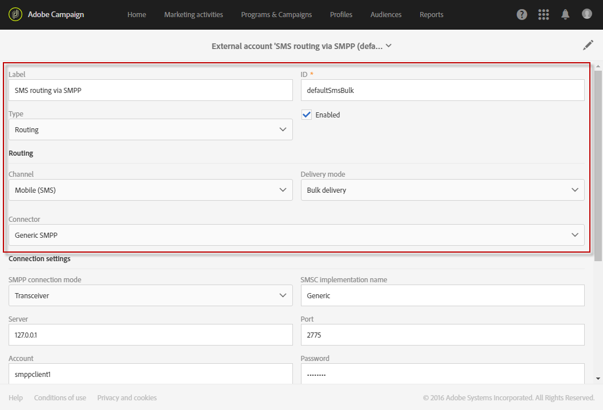
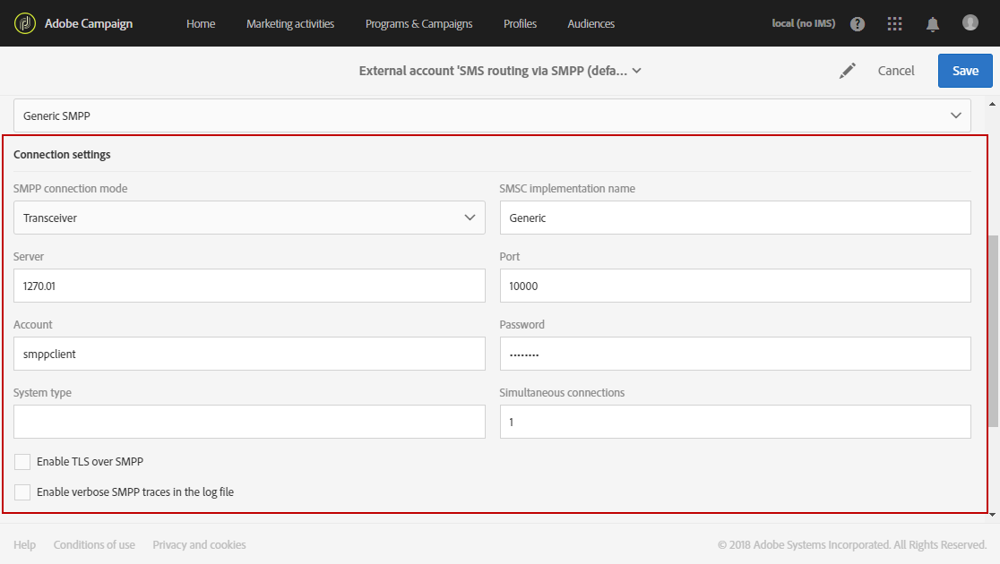
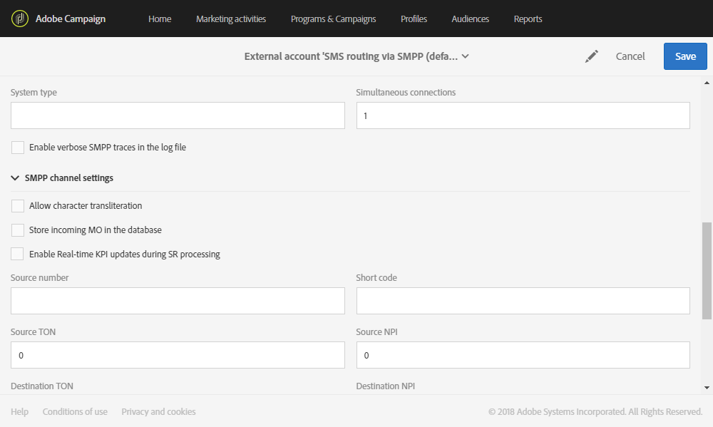
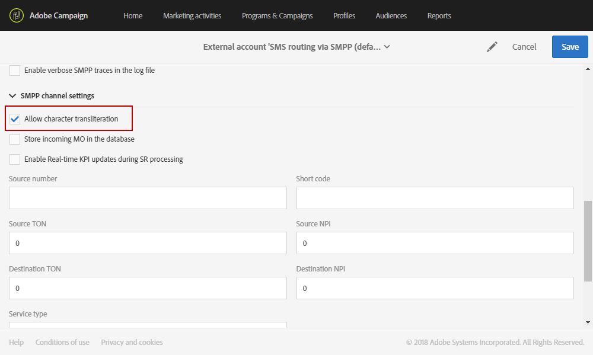
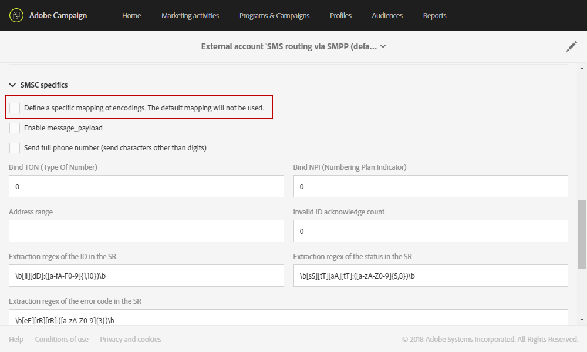
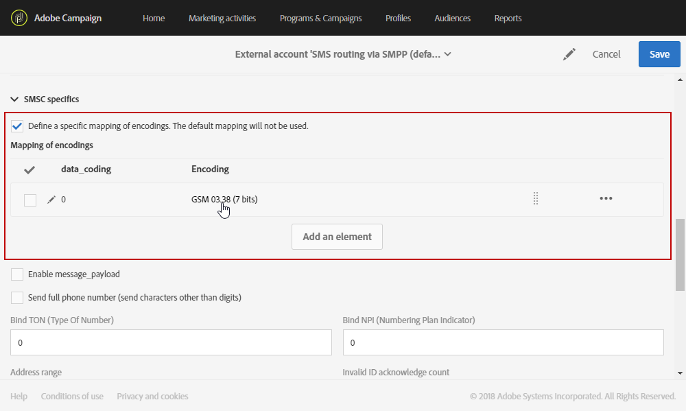
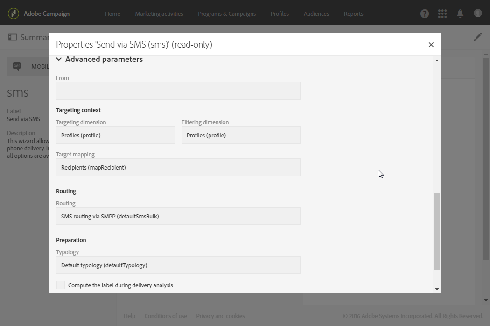
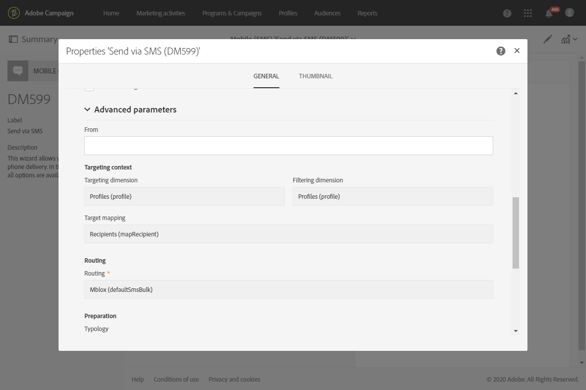
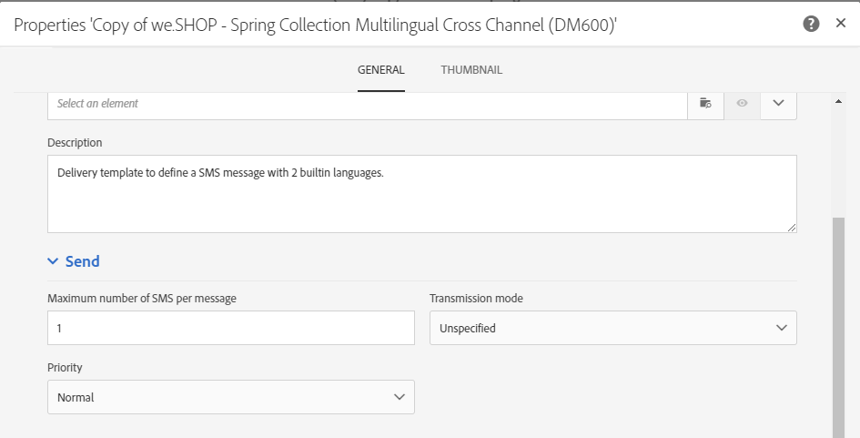

# Configuring SMS channel{#configuring-sms-channel}

To send SMS messages, one or several external accounts must be configured by an administrator under the **[!UICONTROL Administration]** > **[!UICONTROL Channels]** > **[!UICONTROL SMS]** > **[!UICONTROL SMS accounts]** menu.

The steps for creating and modifying an external account are detailed in the [External accounts](../../administration/using/external-accounts.md) section. You will find below the parameters specific to external accounts for sending SMS messages.

## Defining an SMS Routing {#defining-an-sms-routing}

The external account **[!UICONTROL SMS routing via SMPP]** is provided by default, but it can be useful to add other accounts.

If you want to use the SMPP protocol, you can also create a new external account. For more information on SMS protocol and settings, refer to this [technical note](https://helpx.adobe.com/campaign/kb/sms-connector-protocol-and-settings.html).

1. Create a new external account from **[!UICONTROL Administration > Application settings > External accounts]**.
1. Define the account type as **[!UICONTROL Routing]**, the channel as **[!UICONTROL Mobile (SMS)]** and the delivery mode as **[!UICONTROL Bulk delivery]**.

   

1. Define the connection settings.

   To enter the connection settings specific to sending SMS messages, please contact your SMS service provider who will explain to you how to complete the different external account fields.

   

   The **[!UICONTROL Enable TLS over SMPP]** option allows you to encrypt SMPP traffic.

   **[!UICONTROL Enable verbose SMPP traces in the log file]** allows you to dump all SMPP traffic in log files. This option must be enabled to troubleshoot the connector and to compare with the traffic seen by the provider.

1. Contact Adobe who will give you the value to enter into the **[!UICONTROL SMS-C implementation name]** field, depending on the provider chosen.
1. Define the SMPP channel settings. You can learn more in the [SMS encoding and formats](#sms-encoding-and-formats) section.

   Enable the **[!UICONTROL Store incoming MO in the database]** if you want all incoming SMS to be stored in the inSMS table. For more information on how to retrieve your incoming SMS, refer to this [section](../../channels/using/managing-incoming-sms.md#storing-incoming-sms).

   The **[!UICONTROL Enable Real-time KPI updates during SR processing]** option allows the **[!UICONTROL Delivered]** or **[!UICONTROL Bounces + Errors]** KPIs to be updated in real time after sending your delivery. These KPIs can be found in the **[!UICONTROL Deployment]** window and are directly recalculated from the SR (Status Report) received from the provider.

   

1. Define the **[!UICONTROL Throughput and timeouts]** parameters.

   You can specify the maximum throughput of outbound messages ("MT", Mobile Terminated) in MT per second. If you enter "0" in the corresponding field, the throughput will be unlimited.

   The values of all of the fields corresponding to durations need to be completed in seconds.

1. Define the SMS-C specific parameters in case you need to define a specific encoding mapping. For more information, refer to the [SMSC specifics](#smsc-specifics) section.

   Enable the **[!UICONTROL Send full phone number (send characters other than digits)]** option if you don't want to respect the SMPP protocol and transfer the **[!UICONTROL +]** prefix to the server of the SMS provider (SMS-C).

   However, given that certain providers require the use of the **[!UICONTROL +]** prefix, it is advised that you check with your provider and they will suggest that you enable this option if necessary.

1. If needed, define automatic replies to trigger actions based on the content of a reply. For more on this, refer to [this section](../../channels/using/managing-incoming-sms.md#managing-stop-sms).
1. Save the configuration of the SMS routing external account.

You can now use your new routing to send SMS messages with Adobe Campaign.

## SMS encoding and formats {#sms-encoding-and-formats}

### SMS encoding, length and transliteration {#sms-encoding--length-and-transliteration}

By default, the number of characters in an SMS meets the GSM (Global System for Mobile Communications) standards.

SMS messages using GSM encoding are limited to 160 characters, or 153 characters per SMS for messages sent in multiple parts.

>[!NOTE]
>
>Certain characters count as two (braces, square brackets, the euro symbol, etc.). The list of available GSM characters is presented in the [Table of characters - GSM Standard](#table-of-characters---gsm-standard) section.

If you like, you can authorize character transliteration by checking the corresponding box.

Transliteration consists of replacing one character of an SMS by another when that character is not taken into account by the GSM standard.

* If transliteration is **authorized**, each character that is not taken into account is replaced by a GSM character when the message is sent. For example, the letter "ë" is replaced by "e". The message is therefore slightly altered, but the character limit will remain the same.
* When transliteration is **not authorized**, each message that contains characters that are not taken into account is sent in binary format (Unicode): all of the characters are therefore sent as they are. However, the SMS messages using Unicode are limited to 70 characters (or 67 characters per SMS for messages sent in multiple parts). If the maximum number of characters is exceeded, several messages will then be sent, which may create additional costs.

>[!IMPORTANT]
>
>Inserting personalization fields into the content of your SMS message may introduce characters that are not taken into account by the GSM encoding. A content example is offered in the [Personalizing SMS messages](../../channels/using/personalizing-sms-messages.md) section.

By default, character transliteration is disabled. If you would like all of the characters in your SMS messages to be kept as they are, to not alter proper names for example, we recommend that you do not enable this option.

However, if your SMS messages contain a lot of characters that generate Unicode messages, you can choose to enable this option to limit the costs of sending your messages.

### Table of characters - GSM Standard {#table-of-characters---gsm-standard}

This section presents the characters taken into account by the GSM standard. All of the characters inserted into the message body, other than those mentioned below, convert the entire message into binary format (Unicode) and therefore limit it to 70 characters. For more on this, refer to the [SMS encoding, length and transliteration](#sms-encoding--length-and-transliteration) section.

**Basic characters**

<table> 
 <tbody> 
  <tr> 
   <td> @  </td> 
   <td>    </td> 
   <td> SP  </td> 
   <td> 0  </td> 
   <td> ¡  </td> 
   <td> P  </td> 
   <td> ¿  </td> 
   <td> P  </td> 
  </tr> 
  <tr> 
   <td> £  </td> 
   <td> _  </td> 
   <td> !  </td> 
   <td> 1  </td> 
   <td> A  </td> 
   <td> Q  </td> 
   <td> a  </td> 
   <td> q  </td> 
  </tr> 
  <tr> 
   <td> $  </td> 
   <td>    </td> 
   <td> "  </td> 
   <td> 2  </td> 
   <td> B  </td> 
   <td> R  </td> 
   <td> b  </td> 
   <td> r  </td> 
  </tr> 
  <tr> 
   <td> ¥  </td> 
   <td>    </td> 
   <td> #  </td> 
   <td> 3  </td> 
   <td> C  </td> 
   <td> S  </td> 
   <td> c  </td> 
   <td> s  </td> 
  </tr> 
  <tr> 
   <td> è  </td> 
   <td>    </td> 
   <td> ¤  </td> 
   <td> 4  </td> 
   <td> D  </td> 
   <td> T  </td> 
   <td> d  </td> 
   <td> t  </td> 
  </tr> 
  <tr> 
   <td> é  </td> 
   <td>    </td> 
   <td> %  </td> 
   <td> 5  </td> 
   <td> E  </td> 
   <td> U  </td> 
   <td> e  </td> 
   <td> u  </td> 
  </tr> 
  <tr> 
   <td> ù  </td> 
   <td>    </td> 
   <td> &amp;  </td> 
   <td> 6  </td> 
   <td> F  </td> 
   <td> V  </td> 
   <td> f  </td> 
   <td> v  </td> 
  </tr> 
  <tr> 
   <td> ì  </td> 
   <td>    </td> 
   <td> '  </td> 
   <td> 7  </td> 
   <td> G  </td> 
   <td> W  </td> 
   <td> g  </td> 
   <td> w  </td> 
  </tr> 
  <tr> 
   <td> ò  </td> 
   <td>    </td> 
   <td> (  </td> 
   <td> 8  </td> 
   <td> H  </td> 
   <td> X  </td> 
   <td> h  </td> 
   <td> x  </td> 
  </tr> 
  <tr> 
   <td> Ç  </td> 
   <td>    </td> 
   <td> )  </td> 
   <td> 9 </td> 
   <td> I  </td> 
   <td> Y  </td> 
   <td> i  </td> 
   <td> y  </td> 
  </tr> 
  <tr> 
   <td> LF  </td> 
   <td>    </td> 
   <td> *  </td> 
   <td> :  </td> 
   <td> J  </td> 
   <td> Z  </td> 
   <td> j  </td> 
   <td> z  </td> 
  </tr> 
  <tr> 
   <td> Ø  </td> 
   <td> ESC  </td> 
   <td> +  </td> 
   <td> ;  </td> 
   <td> K  </td> 
   <td> Ä  </td> 
   <td> k  </td> 
   <td> ä  </td> 
  </tr> 
  <tr> 
   <td> ø  </td> 
   <td> Æ  </td> 
   <td> ,  </td> 
   <td> &lt;  </td> 
   <td> L  </td> 
   <td> Ö  </td> 
   <td> l  </td> 
   <td> ö  </td> 
  </tr> 
  <tr> 
   <td> CR  </td> 
   <td> æ  </td> 
   <td> -  </td> 
   <td> = </td> 
   <td> M  </td> 
   <td> Ñ  </td> 
   <td> m  </td> 
   <td> ñ  </td> 
  </tr> 
  <tr> 
   <td> Å  </td> 
   <td> ß  </td> 
   <td> .  </td> 
   <td> &gt;  </td> 
   <td> N  </td> 
   <td> Ü  </td> 
   <td> n  </td> 
   <td> ü  </td> 
  </tr> 
  <tr> 
   <td> å  </td> 
   <td> É  </td> 
   <td> /  </td> 
   <td> ?  </td> 
   <td> O  </td> 
   <td> §  </td> 
   <td> o  </td> 
   <td> à  </td> 
  </tr> 
 </tbody> 
</table>

SP: Space

ESC: Escape

LF: Line Feed

CR: Carriage Return

**Advanced characters (counted twice)**

^ { } [ ~ ] | €

### SMSC specifics {#smsc-specifics}

>[!NOTE]
>
>These options allow you to adapt the connector to work with non-standard SMSC (i.e. not following exactly the SMPP 3.4 specification) or specific encoding requirements and should only be configured by advanced users.

When sending an SMS message, Adobe Campaign can use one or several text encodings. Each encoding has its own specific character set and determines the number of characters that fit into an SMS message.

The **[!UICONTROL DATA_CODING]** field allows Adobe Campaign to communicate to the SMS-C which encoding is used.

>[!NOTE]
>
>The mapping between the **data_coding** value and the encoding actually used is standardized. Nevertheless, certain SMS-C have their own specific mapping: in this case, your **Adobe Campaign** administrator needs to declare this mapping. Check with your provider to find out more.

The **[!UICONTROL Define a specific mapping of encodings]** functionality allows you to declare **data_codings** and to force the encoding if necessary: to do this, specify a single encoding in the table.

**Configuration**

* When the **[!UICONTROL Define a specific mapping of encodings]** functionality is not checked, the connector takes on a generic behavior:

    * It will try to use GSM encoding to which it assigns the value **data_coding = 0**.
    * If GSM encoding fails, it will use **UCS2** encoding to which it assigns the value **data_coding = 8**.

  

* When the **[!UICONTROL Define a specific mapping of encodings]** functionality is checked, you can define the encodings that you would like to use as well as the linked **[!UICONTROL data_coding]** field values. Adobe Campaign will try to use the first encoding in the list, then the following, if the first encoding proves impossible.

  The order of declaration is important: it is recommended that you put the list in ascending order **of cost** in order to favor the encodings allowing you to fit as many characters as possible in each SMS message.

  Only declare the encodings that you would like to use. If some of the encodings provided by the SMS-C should not correspond to your purpose of use, do not declare them in the list.

  

### Automatic reply sent to the MO {#automatic-reply-sent-to-the-mo}

When a profile replies to an SMS message which was sent via Campaign, you can configure messages which are automatically sent back to him as well as the action to perform.

For more information, refer to [this section](../../channels/using/managing-incoming-sms.md).

## Configuring SMS properties {#configuring-sms-properties}

This section details the list of parameters unique to SMS in the properties screen of an SMS delivery or an SMS template.

The specific parameters for sending SMS messages are regrouped in the **[!UICONTROL Send]** and in the **[!UICONTROL Advanced parameters]** sections.

From the **[!UICONTROL Advanced parameters]** section:

* The **[!UICONTROL From]** option allows you to personalize the name of the SMS message sender using a string of characters. This is the name that will appear as the sender name of the SMS message on the recipient's mobile telephone.

  If this field is empty, then it will be the source number provided in the external account that will be used. If no source number is provided, it will be the short code that will be used. The external account specific to SMS delivery is presented in the [Defining an SMS routing](#defining-an-sms-routing) section.

  

  >[!IMPORTANT]
  >
  >Please check the legislation in your country regarding modifying the sender address. You should also check with your SMS service provider to see whether they offer this functionality.

From the **[!UICONTROL Send]** section of an SMS template:

* The **[!UICONTROL Maximum number of SMS per message]** option allows you to define the number of SMS messages to use to send a message. If this number is exceeded, the message will not be sent.

  >[!IMPORTANT]
  >
  >If you have inserted personalization fields or conditional text into the content of your SMS message, the length of the message and, as a result, the number of SMS messages to send, may vary from one recipient to another. For more on this, refer to the [Personalizing SMS messages](../../channels/using/personalizing-sms-messages.md) section.

   

* The **[!UICONTROL Transmission mode]** field allows you to determine the delivery method for SMS messages:

    * **[!UICONTROL Saved on SIM card]**: the message is stored on the recipient's telephone SIM card.
    * **[!UICONTROL Saved on mobile]**: the message is stored on the telephone's internal memory.
    * **[!UICONTROL Flash]**: the message is displayed on the recipient's mobile telephone as a notification, then it disappears without being saved.
