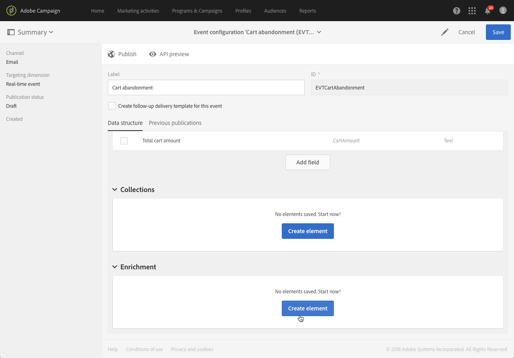
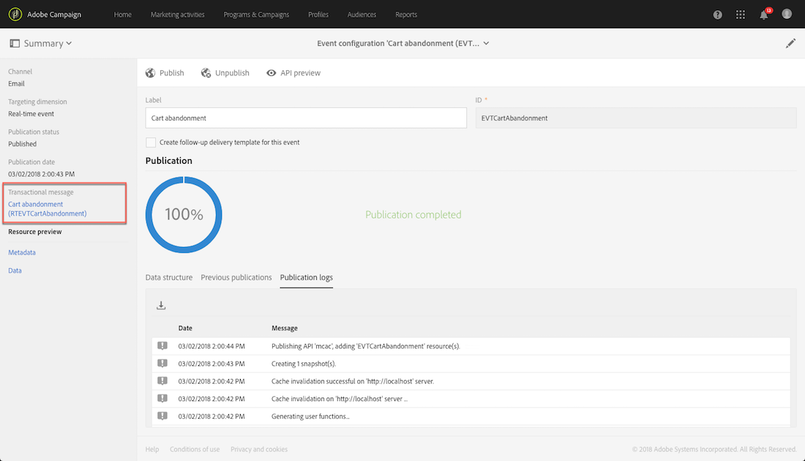
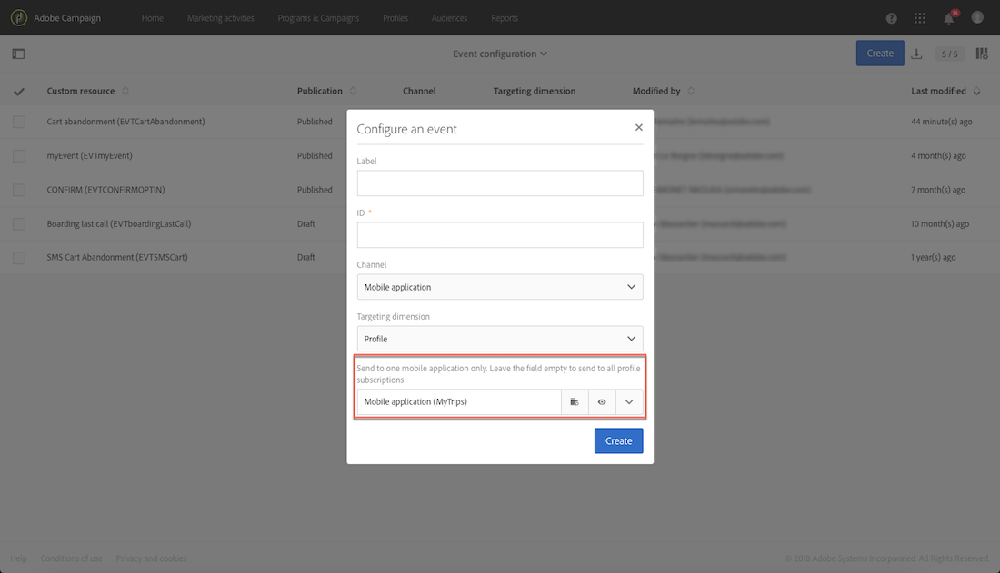
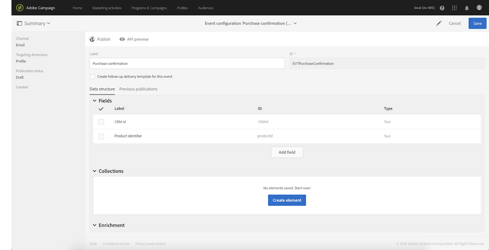
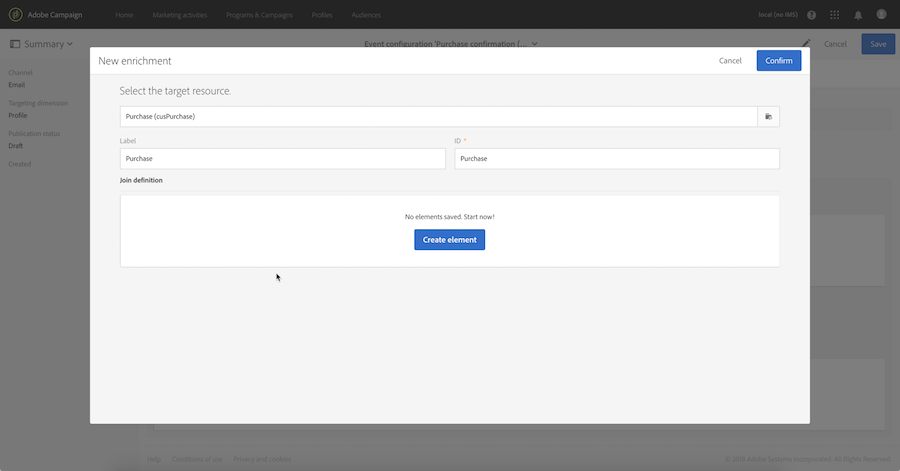
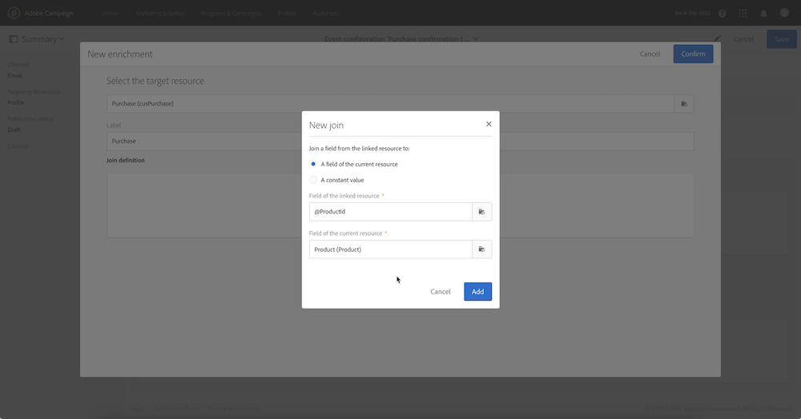

# Configuring transactional messaging{#configuring-transactional-messaging}

Configuring transactional messaging

To send a transactional message with Adobe Campaign, your first need to describe the structure of the event data.

Event configuration must be performed by an **administrator** by following the steps below:

The configuration can vary depending on the type of transactional message you want to send. For more on this, refer to [Transactional event specific configurations](../../administration/using/configuring-transactional-messaging.md#transactional-event-specific-configurations)

Once the event is published, the corresponding transactional message is automatically created. For more on transactional messaging, refer to [this page](../../channels/using/about-transactional-messaging.md).

## Creating an event {#creating-an-event}

Start by creating the event corresponding to your needs.

1. Click the **Adobe Campaign** logo, in the top left corner, then select **Marketing plans** > **Transactional messages** > **Event configuration**.
1. Click the **Create** button.
1. Give a **Label** and an **ID** to the event. The **ID** field is mandatory and should begin with the prefix "EVT". If you do not use this prefix, it is automatically added once you click **Create**. 

   

1. Select the channel that will be used to send your transactional messages **Email**, **Mobile (SMS)** or **Mobile application** (push notification).

   >[!NOTE]
   >
   >Only one channel can be used for each event configuration. Once the event is created, you cannot change the channel.

1. Select the targeting dimension corresponding to the desired event configuration and click **Create**.

   Event-based transactional messages target data contained in the event itself, whereas profile-based transactional messages target data contained in the Adobe Campaign database. For more on this, refer to [Transactional event specific configurations](../../administration/using/configuring-transactional-messaging.md#transactional-event-specific-configurations).

## Defining the event attributes {#defining-the-event-attributes}

In the **Fields** section, define the attributes that will be integrated into the event content and will then be able to be used to personalize the transactional message.

The steps for adding and modifying fields are the same as for [custom resources](../../developing/using/step-2--configure-the-resource-data-structure.md#adding-fields-to-a-resource).

>[!NOTE]
>
>If you want to create a multilingual transactional message, define an additional event attribute with the **AC_language** ID. This only applies to event transactional messages. After the event is published, the steps for editing the content of a multilingual transactional message are the same as for a multilingual standard email. See [Creating a multilingual email](../../channels/using/creating-a-multilingual-email.md).

## Enriching the transactional message content {#enriching-the-transactional-message-content}

Enriching the transactional message content with information from the Adobe Campaign database enables you to personalize your messages. From the last name or CRM ID of each of your recipients, for example, you can recover data such as their address or date of birth or any other custom field added in the Profile table, in order to personalize the information that is sent to them.

It is possible to enrich the transactional message content with information from extended **Profile** or **Service** resources.

This information can also be stored in new resources. In that case, the resource must be linked to the **Profile** or **Service** resources either directly, or via another table. For example, in the configuration below, it is possible to enrich the transactional message content with information from the **Product** resource like the product category or ID, if the **Product** resource is linked to the **Profile** resource.

For more on resource creation and publishing, refer to [this page](../../developing/using/key-steps.md).

1. In the **Enrichment** section, click the **Create element** button.

   

1. Select the resource with which you want to link your message. In our case, the **Profile** resource.

   

1. Use the **Create element** button to link a field from the selected resource to one of the fields you previously added to the event (see [Defining the event attributes](../../administration/using/configuring-transactional-messaging.md#defining-the-event-attributes)).

   

1. In this example, we reconcile the **Last name** and the **First name** fields with the corresponding fields in the **Profile** resource.

   

1. If the event targets the **Profile** resource, select in the **Targeting enrichment** section, the enrichment that will be used as the message target during the delivery execution. In this example, select **Profile**. Selecting a targeting enrichment is mandatory for profile-based events. 

   

Once the event and the message are published, the link with the **Profile** resource will allow you to enrich the content of the transactional message.

**Related topics:**

## Previewing and publishing the event {#previewing-and-publishing-the-event}

Before being able to use the event, you must preview and publish it.

1. Click the **API preview** button to see a simulation of the REST API that will be used by your website developer before it is published. Once the event is published, this button also allows you to see a preview of the API in production. See [Integrating the triggering of the event in a website](../../administration/using/configuring-transactional-messaging.md#integrating-the-triggering-of-the-event-in-a-website).

   

   >[!NOTE]
   >
   >The REST API varies according to the selected channel and the selected targeting dimension. For more details on the various configurations, refer to [Transactional event specific configurations](../../administration/using/configuring-transactional-messaging.md#transactional-event-specific-configurations).

1. Click **Publish** to start publication.

   

1. You can view the publication logs by selecting the corresponding tab.

   

   You can also consult the previous publications by selecting the tab.

>[!NOTE]
>
>Each time you modify the event, you must click **Publish** again to generate the updated REST API that will be used by your website developer.

Once the event has been published, a transactional message linked to the new event is automatically created. In order for this event to trigger sending a transactional message, you must modify and publish the message that was just created. See [Event transactional messages](../../channels/using/event-transactional-messages.md).

You can access the transactional message that was created directly from the link in the left-hand side area.

You also have to integrate this trigger event into your website. See [Integrating the triggering of the event in a website](../../administration/using/configuring-transactional-messaging.md#integrating-the-triggering-of-the-event-in-a-website).

### Unpublishing an event {#unpublishing-an-event}

The **Unpublish** button lets you cancel the publication of the event, which deletes from the REST API the resource corresponding to the event that you previously created. Now, even if the event is triggered through your website, the corresponding messages are not sent anymore and they are not stored in the database.

>[!NOTE]
>
>If you have already published the corresponding transactional message, the transactional message publication is also canceled. See [Unpublishing a transactional message](../../channels/using/event-transactional-messages.md#unpublishing-a-transactional-message).

Click the **Publish** button to generate a new REST API.

## Integrating the triggering of the event in a website {#integrating-the-triggering-of-the-event-in-a-website}

Once you have created an event, you will have to integrate the triggering of this event into your website.

In the example described in the [Transactional messaging operating principle](../../channels/using/about-transactional-messaging.md#transactional-messaging-operating-principle) section, you want a "Cart abandonment" event to be triggered whenever one of your clients leaves your website before purchasing the products in their cart. To do this, your website web developer must use the Adobe Campaign Standard REST API.

See the [REST API Documentation](https://docs.campaign.adobe.com/doc/standard/en/api/ACS_API.html) (**Transactional Messages API** section).

## Transactional event specific configurations {#transactional-event-specific-configurations}

Transactional event configuration may vary depending on the type of transactional message you want to send (event or profile), and the channel that will be used.

The following sections detail what specific configuration should be set according to the desired transactional message. For more on the general steps to configure an event, refer to

### Event-based transactional messages {#event-based-transactional-messages}

To send an event-based transactional message, you first need to create and configure an event targeting the data contained in the event itself.

1. When creating the event configuration, select the **Real-time event** targeting dimension (see [Creating an event](../../administration/using/configuring-transactional-messaging.md#creating-an-event)).
1. Add fields to the event, in order to be able to personalize the transactional message (see [Defining the event attributes](../../administration/using/configuring-transactional-messaging.md#defining-the-event-attributes)).
1. Enrich the transactional message content if you want to use additional information from the Adobe Campaign database (see [Enriching the transactional message content](../../administration/using/configuring-transactional-messaging.md#enriching-the-transactional-message-content)).

   >[!NOTE]
   >
   >Event-based transactional messaging is supposed to use only the data that are in the sent event to define the recipient and the message content personalization. However, you can enrich the content of your transactional message using information from the Adobe Campaign database.

1. Preview and publish the event (see [Previewing and publishing the event](../../administration/using/configuring-transactional-messaging.md#previewing-and-publishing-the-event)).

   When previewing the event, the REST API contains an attribute specifying the email address or mobile phone according to the selected channel.

   Once the event has been published, a transactional message linked to the new event is automatically created. In order for the event to trigger sending a transactional message, you must modify and publish the message that was just created, see [Event transactional messages](../../channels/using/event-transactional-messages.md).

1. Integrate the event into your website (see [Integrating the triggering of the event in a website](../../administration/using/configuring-transactional-messaging.md#integrating-the-triggering-of-the-event-in-a-website)).

### Profile-based transactional messages {#profile-based-transactional-messages}

To send a profile-based transactional message, you first need to create and configure an event targeting data contained in the Adobe Campaign database.

1. When creating the event configuration, select the **Profile event** targeting dimension (see [Creating an event](../../administration/using/configuring-transactional-messaging.md#creating-an-event)).
1. Add fields to the event, in order to be able to personalize the transactional message (see [Defining the event attributes](../../administration/using/configuring-transactional-messaging.md#defining-the-event-attributes)). You must add at least one field to create an enrichment. You do not need to create other fields such as **First name** and **Last name** as you will be able to use personalization fields from the Adobe Campaign database. 
1. Create an enrichment in order to link the event to the **Profile** resource (see [Enriching the transactional message content](../../administration/using/configuring-transactional-messaging.md#enriching-the-transactional-message-content)). Creating an enrichment is mandatory when using a **Profile** targeting dimension.
1. Preview and publish the event (see [Previewing and publishing the event](../../administration/using/configuring-transactional-messaging.md#previewing-and-publishing-the-event)).

   When previewing the event, the REST API does not contain an attribute specifying the email address or the mobile phone as it will be retrieved from the **Profile** resource.

   Once the event has been published, a transactional message linked to the new event is automatically created. In order for the event to trigger sending a transactional message, you must modify and publish the message that was just created, see [Sending a profile transactional message](../../channels/using/profile-transactional-messages.md#sending-a-profile-transactional-message).

1. Integrate the event into your website (see [Integrating the triggering of the event in a website](../../administration/using/configuring-transactional-messaging.md#integrating-the-triggering-of-the-event-in-a-website)).

### Event-based transactional push notifications {#event-based-transactional-push-notifications}

To be able to send transactional push notifications, you need to configure Adobe Campaign accordingly. See [Push configuration](../../administration/using/configuring-a-mobile-application-using-sdk-v4.md).

To send an anonymous transactional push notification to all users who have opted in to receive notifications from your mobile application, you first need to create and configure an event targeting the data contained in the event itself. The corresponding steps are presented below.

The event must contain the three following elements:

* A **registration token**, which is the user ID for one mobile application and one device. It may not correspond to any profile from the Adobe Campaign database.
* A **mobile application name** (one for all devices - Android and iOS). This is the ID of the mobile application configured in Adobe Campaign that will be used to receive push notifications on the users' devices. For more on this, see [Setting up a mobile application in Adobe Campaign](../../administration/using/configuring-a-mobile-application-using-sdk-v4.md#setting-up-a-mobile-application-in-adobe-campaign).
* A **push platform** ("gcm" for Android or "apns" for iOS).

1. When creating the event configuration, select the **Mobile application** channel and the **Real-time event** targeting dimension (see [Creating an event](../../administration/using/configuring-transactional-messaging.md#creating-an-event)).
1. Add fields to the event, in order to be able to personalize the transactional message (see [Defining the event attributes](../../administration/using/configuring-transactional-messaging.md#defining-the-event-attributes)).
1. Enrich the transactional message content if you want to use additional information from Adobe Campaign database (see [Enriching the transactional message content](../../administration/using/configuring-transactional-messaging.md#enriching-the-transactional-message-content)).

   >[!NOTE]
   >
   >Event-based transactional messaging is supposed to use only the data that are in the sent event to define the recipient and the message content personalization. However, you can enrich the content of your transactional message using information from the Adobe Campaign database.

1. Preview and publish the event (see [Previewing and publishing the event](../../administration/using/configuring-transactional-messaging.md#previewing-and-publishing-the-event)).

   When previewing the event, the REST API contains the "registrationToken", "application" and "pushPlatform" attributes that will be used to target the delivery.

   

   Once the event has been published, a transactional push notification linked to the new event is automatically created. To modify and publish the message that was just created, see [Sending a transactional push notification targeting an event](../../channels/using/transactional-push-notifications.md#sending-a-transactional-push-notification-targeting-an-event).

1. Integrate the event into your website (see [Integrating the triggering of the event in a website](../../administration/using/configuring-transactional-messaging.md#integrating-the-triggering-of-the-event-in-a-website)).

### Profile-based transactional push notifications {#profile-based-transactional-push-notifications}

To send a transactional push notification to the Adobe Campaign profiles who have subscribed to your mobile application, you first need to create and configure an event targeting the Adobe Campaign database.

1. When creating the event configuration, select the **Mobile application** channel and the **Profile** targeting dimension (see [Creating an event](../../administration/using/configuring-transactional-messaging.md#creating-an-event)).

   By default, the transactional push notification will be sent to all mobile applications to which the recipients subscribed. To send the push notification to a specific mobile application, select it in the list. The other mobile applications will be targeted by the message but will be excluded from the sending.

   

1. Add fields to the event, if you want to personalize the transactional message (see [Defining the event attributes](../../administration/using/configuring-transactional-messaging.md#defining-the-event-attributes)).

   >[!NOTE]
   >
   >You must add at least one field to create an enrichment. You do not need to create other fields such as **First name** and **Last name** as you will be able to use personalization fields from the Adobe Campaign database.

1. Create an enrichment in order to link the event to the **Profile** resource (see [Enriching the transactional message content](../../administration/using/configuring-transactional-messaging.md#enriching-the-transactional-message-content)). Creating an enrichment is mandatory when using a **Profile** targeting dimension.
1. Preview and publish the event (see [Previewing and publishing the event](../../administration/using/configuring-transactional-messaging.md#previewing-and-publishing-the-event)).

   When previewing the event, the REST API does not contain an attribute specifying the registration token, the application name and the push platform as they will be retrieved from the **Profile** resource.

   Once the event has been published, a transactional push notification linked to the new event is automatically created. To modify and publish the message that was just created, see [Sending a transactional push notification targeting a profile](../../channels/using/transactional-push-notifications.md#sending-a-transactional-push-notification-targeting-a-profile).

1. Integrate the event into your website (see [Integrating the triggering of the event in a website](../../administration/using/configuring-transactional-messaging.md#integrating-the-triggering-of-the-event-in-a-website)).

### Configuring an event to send a follow-up message {#configuring-an-event-to-send-a-follow-up-message}

A follow-up message is a predefined marketing delivery template that can be used in a workflow to send messages to the recipients of a specific transactional message. For more on this, see [Follow-up messages](../../channels/using/follow-up-messages.md).

1. Use the same event configuration that you created to send an event transactional message. See [Event-based transactional messages](../../administration/using/configuring-transactional-messaging.md#event-based-transactional-messages).
1. When configuring your event, check the **Create follow-up delivery template for this event** box before publishing the event.

   

1. Preview and publish the event (see [Previewing and publishing the event](../../administration/using/configuring-transactional-messaging.md#previewing-and-publishing-the-event)).

   Once the event has been published, a transactional message and a follow-up delivery template linked to the new event are automatically created. For more on using follow-up messages, see [Sending a follow-up message](../../channels/using/follow-up-messages.md#sending-a-follow-up-message).

## Use case: configuring an event to send a transactional message {#use-case-configuring-an-event-to-send-a-transactional-message}

In this example, we want to configure an event in order to send confirmation messages after each purchase on our website with the following prerequisites:

As we want to identify our client via his CRM ID, first make sure that the **Profile** resource has been extended with this new field.

In the same way, a custom resource corresponding to purchases must have been created and published, and must be linked to the **Profile** resource. This way, you will be able to retrieve information from this resource to enrich the message content.

For more on resource creation and publishing, refer to [this page](../../developing/using/key-steps.md).

1. Create a new event using the **Email** channel and the **Profile** targeting dimension (see [Creating an event](../../administration/using/configuring-transactional-messaging.md#creating-an-event)).
1. Define the attributes that will be available to personalize the transactional message. In our case, add the "CRM ID" and the "Product identifier" fields (see [Defining the event attributes](../../administration/using/configuring-transactional-messaging.md#defining-the-event-attributes)).

   

1. To enrich the message content with information regarding the client's previous purchases, create an enrichment targeting the **Purchase** resource (see [Enriching the transactional message content](../../administration/using/configuring-transactional-messaging.md#enriching-the-transactional-message-content)).

   

1. Create a join condition between the "Product identifier" field that was previously added to the message, and the corresponding field from the **Purchase** resource

   

1. Preview and publish the event (see [Previewing and publishing the event](../../administration/using/configuring-transactional-messaging.md#previewing-and-publishing-the-event)).
1. Integrate the event in your website (see [Integrating the triggering of the event in a website](../../administration/using/configuring-transactional-messaging.md#integrating-the-triggering-of-the-event-in-a-website)).

