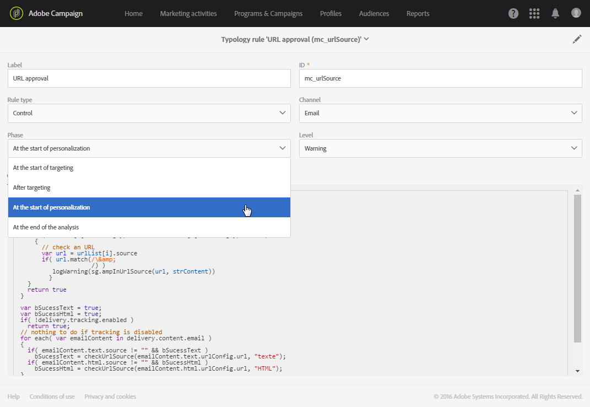

# Control rules{#control-rules}

Control rules

Control rules allow the user to check the validity and quality of the messages before they are sent, such as character display, SMS message size, address format, etc.

A set of default rules available in Adobe Campaign ensures the standard controls:

* **[!UICONTROL Check subject]** (email): checks that the subject and sender address do not contain special characters which may cause problems on certain mail transfer agents, and checks that the message subject has been completed.
* **[!UICONTROL Check URL labels]** (email): checks that each tracking URL has a label.
* **[!UICONTROL Check URLs]** (email): checks the tracking URLs (presence of the "&" character).
* **[!UICONTROL Check proof size]** (all channels): generates an error message if the proof target population exceeds 100 recipients.
* **Check unsubscription link** (email): checks for the presence of at least one unsubscription (opt-out) URL in each content (HTML and Text).
* **[!UICONTROL Check delivery size]** (all channels): checks the size of the messages.
* **[!UICONTROL Check social network sharing link]** (email): checks the presence of a link to a mirror page when including a social network sharing link (ViralLinks) in the content.
* **[!UICONTROL A/B Test]** : extracts the test population for a delivery with an A/B test.

You can choose the moment at which the rule will be applied from one of the phases of the delivery's life cycle. Select the value to apply in the drop-down list from the **[!UICONTROL Phase]** field of the typology rule.

Possible values are:

* **At the start of targeting**

  The control rule can be applied at this phase so that the personalization step is not executed in the event of an error.

* **After targeting**

  If you need to know the volume of the target in order to apply the control rule, select this phase.

  For example, the **Check proof size** control rule applies after the targeting stage: this rule prevents the preparation of message personalization if there are too many proof recipients.

* **At the start of personalization**

  This phase must be selected if the check concerns approving message personalization. Message personalization is carried out during the analysis phase.

* **At the end of the analysis**

  When a check requires message personalization to be complete, select this phase.

