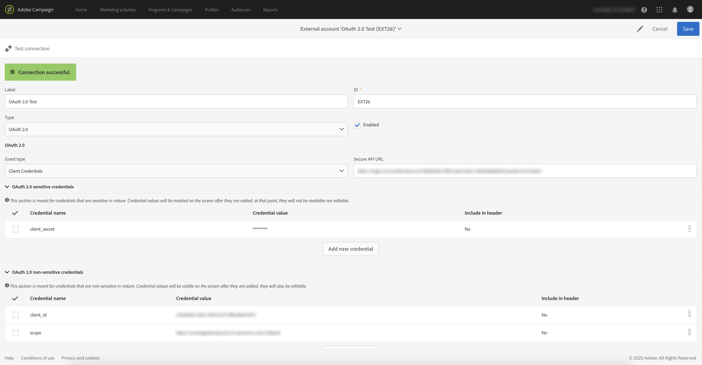
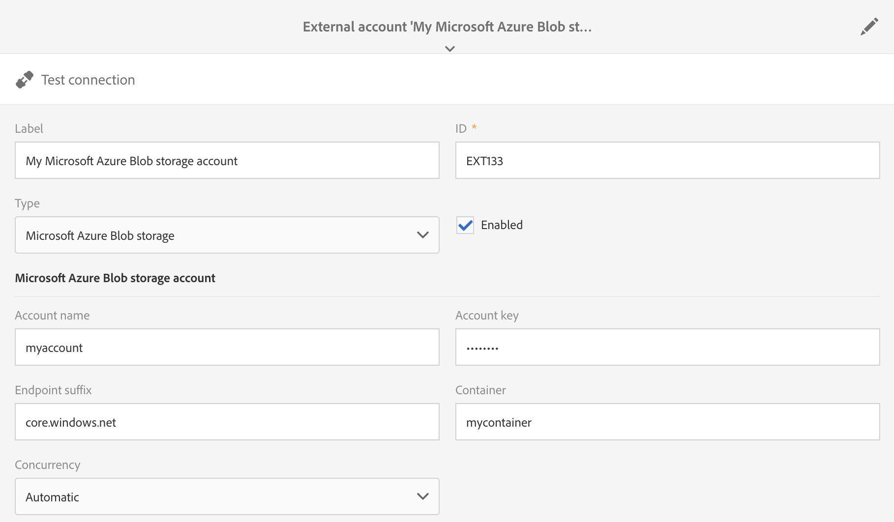

# External accounts{#external-accounts}

An external account is a configuration that allows you to configure and test the access to a server that is external to Adobe Campaign.

These external accounts can be used in Campaign workflows to access and manage data.

You can set up the following types of external accounts:

* SFTP. For more on this, refer to [this section](#sftp-external-account).
* Amazon Storage Service (S3). For more on this, refer to [this section](#amazon-s3-external-account).
* Adobe Experience Manager. For more on this, refer to [this section](#adobe-experience-manager-external-account).
* Adobe Analytics. For more on this, refer to [this section](../../integrating/using/configure-campaign-analytics-integration.md).
* Google reCAPTCHA. For more on this, refer to [this section](#google-recaptcha-external-account).
* Microsoft Azure Blob storage. For more on this, refer to [this section](#microsoft-azure-external-account).
* OAuth 2.0. For more on this, refer to [this section](#oauth-account).

>[!NOTE]
>
>Other types of external accounts are used by Adobe during product provisioning process. From Campaign Standard 17.9 release, FTP external accounts can still be defined but are no longer usable in new workflow activities. If you already had a connection set up, it is still enabled.

External accounts can be configured by administrators under the **[!UICONTROL Administration > Application settings > External accounts]** menu.

## Creating an external account {#creating-an-external-account}

Adobe Campaign comes with a set of pre-defined external accounts. In order to set up connections with external systems such as FTP servers used for file transfers, you can create your own external accounts.

External accounts are used by technical processes such as technical workflows or campaign workflows. When setting up a file transfer in a workflow or a data exchange with any other application (Adobe Target, Experience Manager, etc.), you need to select an external account.

1. Click the **[!UICONTROL Create]** button.
1. Enter a label. The label and the ID will be used when selecting external accounts in workflows.
1. Select the type of account you want to create.
1. Configure the access to the account by specifying credentials, server address, port number, and or keys when relevant.

   The necessary information is usually provided by the provider of the server you are connecting to.

1. Save your account.

The external account is created and added to the account list. It is now available for your data/file transfers or routing configurations in workflow activities and delivery properties.

## SFTP external account {#sftp-external-account}

Different external account types require different information to be specified.

For an SFTP external account, provide the following details:

* Server address. For example, **ftp.domain.com**.
* Port number. For example, **22**.
* SFTP server credentials: account name and password used to connect to the server.

### Adobe hosted SFTP server recommendations {#adobe-hosted-sftp-server-recommendations}

When managing files and data for ETL purposes, these files are stored on a hosted SFTP server provided by Adobe. This SFTP is designed to be a temporary storage space on which you can control retention and deletion of files.

When not correctly used or monitored, this space can quickly fill the physical space available on the server and cause severe problems. It can result in data loss or corruption on your platform.

To avoid such problems, Adobe recommends to follow the best practices below:

* Keep the minimum data possible.
* Use key based authentication to avoid password expiry. Supported formats are **OpenSSH** and **SSH2** only. You will have to provide the public key to Adobe support team to have it uploaded on the Campaign server.
* Keep data for only as long as required. 15 days is the maximum time limit.
* Use workflows to properly delete the data (manage the retention from workflows consuming the data).
* Use batching in SFTP uploads as well as in workflows.
* Handle errors/exceptions.
* Occasionally, log-in to SFTP to directly check what is lying there.
* Remember that SFTP disk management is primarily your responsibility.

Also, note that the public IPs from which you are trying to initiate the SFTP connection must be added to the allowlist on the Campaign instance. Adding IP addresses to the allowlist can be requested via a [support ticket](https://helpx.adobe.com/enterprise/using/support-for-experience-cloud.html), along with providing the public key to use for authentication.

SFTP servers can be managed from the Control Panel. For more information, refer to the [Control Panel documentation](https://experienceleague.adobe.com/docs/control-panel/using/sftp-management/about-sftp-management.html).

>[!NOTE]
>
>Control Panel is accessible to all Admin users. The steps to grant Admin access to a user are detailed in [this page](https://experienceleague.adobe.com/docs/control-panel/using/discover-control-panel/managing-permissions.html?lang=en#discover-control-panel).

## OAuth 2.0 account {#oauth-account}

For a OAuth 2.0 external account, provide the following details:

* A **Grant type**: only **client credentials** is supported. 
* A **Secure API URL**: enter the authorization endpoint.
* **OAuth 2.0 sensitive credentials**: This section is meant for credentials that are sensitive in nature. Credential values will be masked on the screen after they are added; at that point, they will not be readable nor editable. If the authorization endpoint requires a particular credential be inserted into the HTTP authorization header instead of the POST body parameter, you can select the option Include in header for that credential.
* **OAuth 2.0 non-sensitive credentials**: This section is meant for credentials that are non-sensitive in nature. Credential values will be visible on the screen after they are added; they will also be editable.  If the authorization endpoint requires a particular credential be inserted into the HTTP authorization header instead of the POST body parameter, you can select the option Include in header for that credential.

After entering the account information, click on **Test connection** to verify that the external account has been configured correctly.



>[!NOTE]
>
>The credentials "Content-Type: application/x-www-form-urlencoded" and "grant_type=client_credentials" will automatically be added to the API call; therefore, you will not need to add them in the credentials section.

## Amazon S3 external account {#amazon-s3-external-account}

The Amazon S3 server field should be filled as follows:

```

<S3 bucket name>.s3.amazonaws.com/<s3 object path>

```

To store your file in S3 encrypted mode, check the **[!UICONTROL Keep files in S3 encrypted]** box.


The necessary information is usually provided by the provider of the server you are connecting to.

Specify the **[!UICONTROL AWS Region]** associated to your endpoint. You can check the supported regions and signature versions in the official [Amazon S3 documentation](https://docs.aws.amazon.com/general/latest/gr/rande.html#s3_region).

>[!NOTE]
>
>Your **[!UICONTROL Receiver server]** should be entered without your AWS Region, it will later be automatically added to your URL.

### Amazon S3 account recommendations {#amazon-s3-account-recommendations}

To help you set up your Amazon S3 account, we advise you to follow these recommendations:

* Create strict bucket policy to restrict access to S3 buckets. Bucket policy can be configured while creating a bucket. For more information, refer to the [Amazon S3 documentation](https://docs.aws.amazon.com/AmazonS3/latest/dev//example-bucket-policies.html).
* While creating an external account, enable the encryption to store sensitive data in the S3 bucket by checking the **[!UICONTROL Keep files in S3 encrypted]** box.
* Grant bucket permissions to specify who can access the object in a bucket. For more information on bucket permission, refer to the [Amazon S3 documentation](https://docs.aws.amazon.com/AmazonS3/latest/dev//access-control-overview.html).

## Adobe Experience Manager external account {#adobe-experience-manager-external-account}

Adobe Experience Manager external accounts are used when integrating Campaign with Experience Manager.

Process and requirements related to this integration are available in [this document](../../integrating/using/get-started-campaign-integrations.md).

As you are setting up this new external account, you must provide the following details:

* Server: enter the URL of the Adobe Experience Manager server. For example:

  ```
  http://aem.domain.com:4502
  ```

* AEM account credentials: use the account that will access the Adobe Experience Manager instance. It should be an account part of the campaign-remote group in Experience Manager.

## Google reCAPTCHA external account {#google-recaptcha-external-account}

>[!NOTE]
>
>Google reCAPTCHA configuration requires a Google account.

The Google reCAPTCHA mechanism allows you to protect your landing page from spam and abuse caused by bots. This is non-intrusive for your customers since it does not require any interaction from them and is based on interactions with your site. To register your site, refer to this [page](https://www.google.com/recaptcha/admin/create). You must choose the V3 reCAPTCHA type.

To add the Google reCAPTCHA V3 to you landing page, configure it in your external account. For more information on how to add it to your landing page, refer to this [section](../../channels/using/configuring-landing-page.md#setting-google-recaptcha).

For a Google reCAPTCHA V3 external account, provide the following details:

* A **[!UICONTROL Label]** and **[!UICONTROL ID]** of your external account
* **[!UICONTROL Type]**: Google reCAPTCHA
* Your **[!UICONTROL Site key]** and **[!UICONTROL Site secret]**
* A **[!UICONTROL Threshold]** between 0 and 1

  The 0.0 **[!UICONTROL Threshold]** value means that it is likely a bot and 1.0 likely a good interaction. By default, you can use a threshold of 0.5.


## Microsoft Azure Blob storage external account {#microsoft-azure-external-account}

>[!NOTE]
>
>Information needed to configure your external account in Adobe Campaign Standard can be found in the Azure Portal by selecting **[!UICONTROL Settings]** > **[!UICONTROL Access keys]**.

The Azure Blob storage connector can be used to import or export data to Adobe Campaign using a **[!UICONTROL Transfer file]** workflow activity. For more on this, refer to this [section](../../automating/using/transfer-file.md#azure-blob-configuration-wf).

For a Microsoft Azure Blob storage external account, provide the following details:

* A **[!UICONTROL Label]** and **[!UICONTROL ID]** of your external account
* **[!UICONTROL Type]**: Microsoft Azure Blob storage
* Your **[!UICONTROL Account name]** and **[!UICONTROL Account key]**. To know where to find your account name and key, refer to this [page](https://docs.microsoft.com/en-us/azure/storage/common/storage-account-keys-manage).
* Your **[!UICONTROL Endpoint suffix]**. It can be found within your **[!UICONTROL Connection string]** of the **[!UICONTROL Access keys]** menu in the Azure Portal. For more on this, refer to this [page](https://docs.microsoft.com/en-us/azure/storage/common/storage-account-keys-manage).
* Your **[!UICONTROL Container]** name. If you are planning to use more than one container, create as many external accounts as containers.
* The **[!UICONTROL Concurrency]** option lets you fine tune the speed of your file transfers.



Once configured, click **[!UICONTROL Test connection]** to link Adobe Campaign to Microsoft Azure Blob storage.

### Microsoft Azure Blob storage recommendations {#azure-blob-recommendations}

**Encryption**

Adobe Campaign uses a secured connection (HTTPS) to access your Microsoft Azure Blob storage account.

**Account key**

When configuring your external account, you must use one of the **[!UICONTROL Account key]** available in the Azure Portal. For more information on where to find your account keys, refer to this [page](https://docs.microsoft.com/en-us/azure/storage/common/storage-account-keys-manage#view-access-keys-and-connection-string).

**Optimizing the file transfer speed**

The **[!UICONTROL Concurrency]** option lets you fine tune the speed of your file transfers.
It represents the number of threads that will be used to perform the file transfer. Each of these threads will download a portion of about 1MB from the blob. They will then be queued to be written to disk. Note that by increasing the number of threads you will also be increasing the load on the resources used by the application during the file transfer.

After your file transfer completion, you can find performance metrics in the Workflow logs.

**Retries**

By default, the file transfer for Azure Blob will have up to four retries.  If the Azure Storage service returns an error code such as 503 (server busy) or 500 (operation timeout), this may indicate that you are approaching or exceeding the scalability of your storage account. This can happen when using a new account or performing tests.

If the error persists, you can increase the number of retries by creating an option under the advanced menu **[!UICONTROL Administration]** > **[!UICONTROL Application Settings]** > **[!UICONTROL Options]**.

If implemented, the option must be created as follows:

```

ID:        AzureBlob_Max_Retries
Date type: Integer
Default:   <the number of retries needed>

```
