# Fatigue rules{#fatigue-rules}

## About fatigue rules {#about-fatigue-rules}

Fatigue rules allow marketers to set global cross-channel business rules that will automatically exclude over-solicited profiles from campaigns.

To implement fatigue rules, you define a maximum number of messages per profile and select a period on which the rule will apply. During delivery preparation, profiles are excluded from the delivery if applicable, depending on the number of messages already sent to them.

>[!NOTE]
>
>For fatigue rules to apply, you need to define a contact date for your delivery. If you choose to send messages immediately, the fatigue rule will not be applied.

Related topics:

* [Preparation](../../administration/using/configuring-email-channel.md#preparation)
* [Managing typologies](../../administration/using/about-typology-rules.md#managing-typologies)
* [Typology rules](../../administration/using/about-typology-rules.md#typology-rules)

## Creating a fatigue rule {#creating-a-fatigue-rule}

To create and configure a **[!UICONTROL Fatigue]** typology rule, apply the following steps:

1. Click the Adobe Campaign logo, in the top left corner of the interface, then select **[!UICONTROL Administration]** > **[!UICONTROL Channels]** > **[!UICONTROL Typologies]** > **[!UICONTROL Typology rules]**.

   

1. From the list of typology rules, click **[!UICONTROL Create]**.

   

1. In the **[!UICONTROL Rule type]** field, select **[!UICONTROL Fatigue]**.

   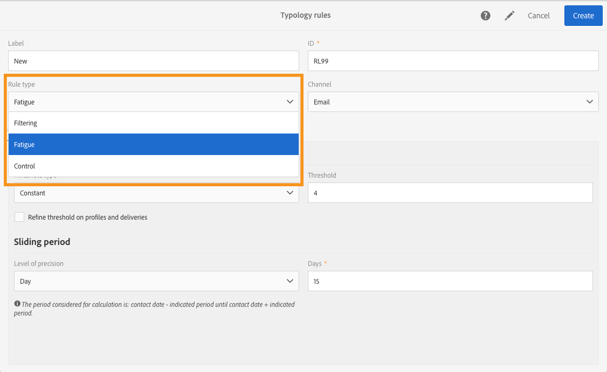

1. In the **[!UICONTROL Channel]** field, select which channel your rule will apply to. You can either select a single channel (email, SMS, direct mail, mobile application) or select **[!UICONTROL All channels]**. See [Choosing the channel](../../administration/using/fatigue-rules.md#choosing-the-channel).

   

1. In the **[!UICONTROL General]** tab, define the method for calculating the maximum number of messages per profile. You can choose either a constant threshold or a variable. You can also refine the threshold on profiles and deliveries. For more on this, refer to [Defining the threshold](../../administration/using/fatigue-rules.md#defining-the-threshold).

   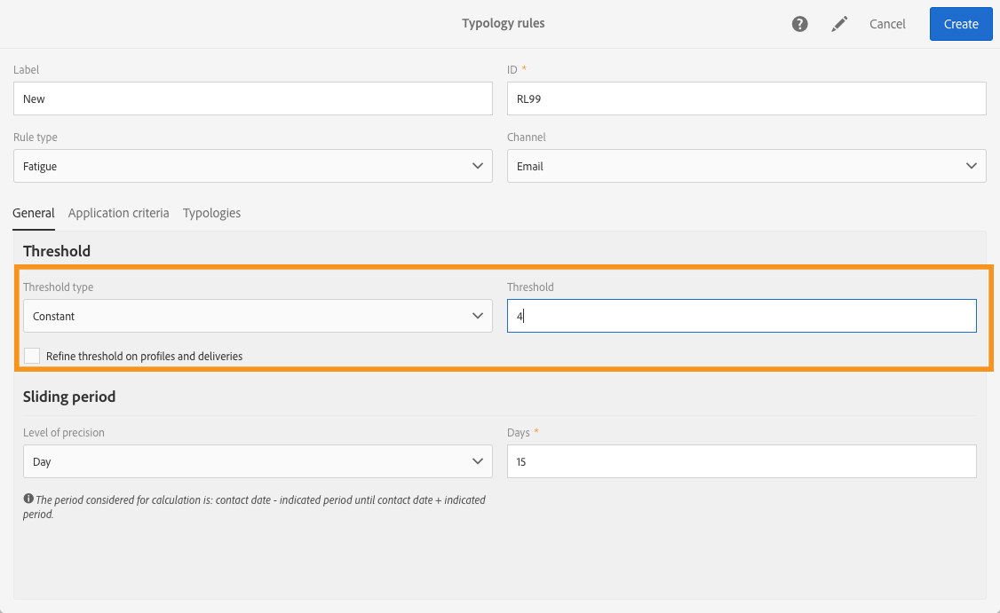

1. Choose a **[!UICONTROL Sliding period]** on which the typology rule will apply. For more on this, refer to [Setting the sliding period](../../administration/using/fatigue-rules.md#setting-the-sliding-period).

   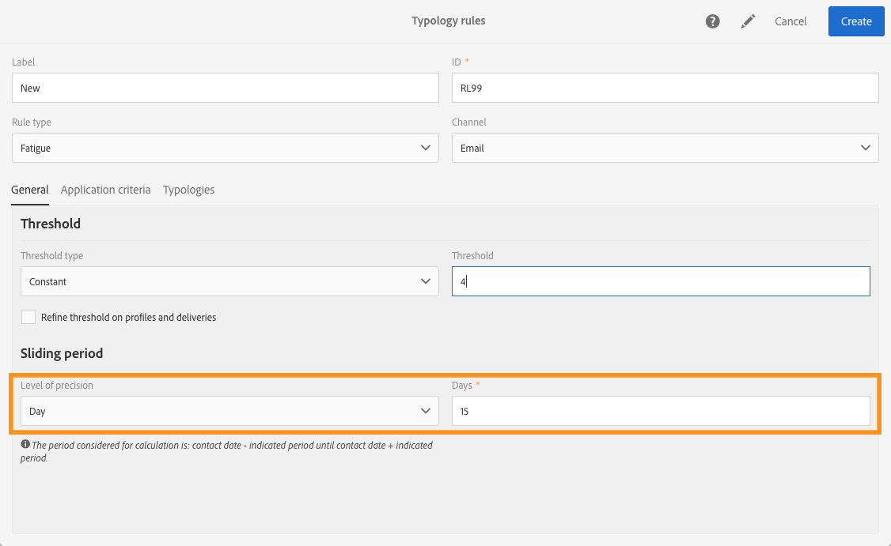

   In this example (see previous screenshots), we choose to send a maximum number of 4 messages over a sliding period of 15 days.

1. In the **[!UICONTROL Application criteria]** tab, you can choose to apply this rule to all deliveries or restrict the applicability of the rule according to the message to send. The rule will only execute if the application condition is met. For example, you can apply the rule only on messages with a label starting with a given word or with an ID containing certain letters. See [Restricting the applicability of a filtering rule](../../administration/using/filtering-rules.md#restricting-the-applicability-of-a-filtering-rule).

   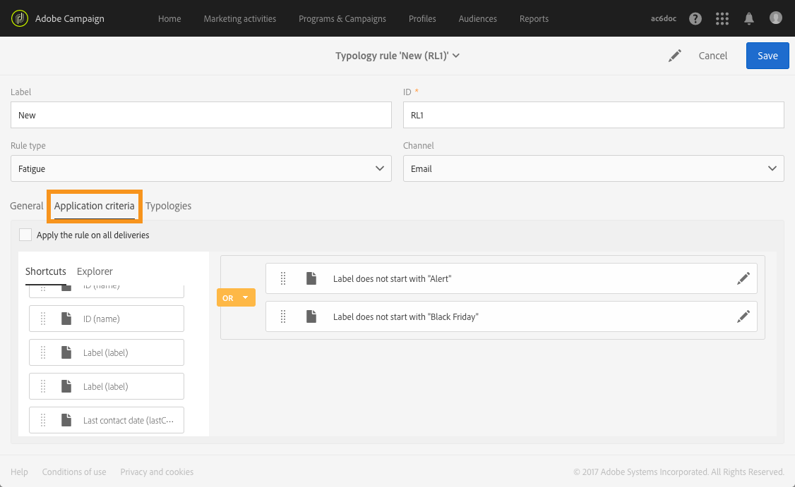

1. Select the **[!UICONTROL Typologies]** tab and link your typology rule to the typology used for your deliveries. See [Managing typologies](../../administration/using/about-typology-rules.md#managing-typologies) and [Typology rules](../../administration/using/about-typology-rules.md#typology-rules).

   

   >[!NOTE]
   >
   >The typology can be defined in the delivery template, to be applied automatically to all deliveries created using this template.

During delivery preparation, profiles are excluded from the delivery if applicable, depending on the number of deliveries already sent to them. You can view the fatigue rule execution results in the delivery logs. See [Viewing the fatigue results](../../administration/using/fatigue-rules.md#viewing-the-fatigue-results).

>[!CAUTION]
>
>For fatigue rules to work, you need to define a contact date for your delivery. If you choose to send messages immediately, the fatigue rule will not be applied.

## Choosing the channel {#choosing-the-channel}

Fatigue rules are available for various channels. The channel is defined in the **[!UICONTROL Channel]** field of the typology rule settings. You can either select a single channel or select **[!UICONTROL All channels]**.

**Available channels**

The following channels are available:

* Email
* Mobile (SMS)
* Direct mail
* Mobile application: this channel allows you to send push notifications to profiles or to app subscribers. If you choose to send notifications to profiles, they will be compatible with multi-channel fatigue rules.

  >[!CAUTION]
  >
  >Fatigue rules are not compatible with push notifications sent to app subscribers. If you're sending messages to app subscribers, fatigue rules will not apply.

* All channels: this option allows you to apply the rule to all channels. For example, you can decide to send a maximum of 3 messages per month on any channel. If you sent 2 emails to a profile last week and you try sending a push notification today, the same profile will be excluded.

**Delivery types**

Fatigue rules are compatible with all delivery types: one-shot deliveries, recurring deliveries, workflow deliveries and transactional messages.

**Transactional messaging** can be used to send service messages targeting an event (rtEvent) as well as marketing messages (targeting profiles), for example a remarketing message. Fatigue rules are compatible with marketing messages only (targeting profiles). Event transactional messages do not contain profile information, therefore they are not compatible with fatigue rules (even in the case of an enrichment with profiles). With the support of marketing messages in transactional messaging, you can **apply a fatigue rule to all channels including marketing transactional messages**.

## Defining the threshold {#defining-the-threshold}

Each fatigue rule defines a threshold, that is to say the maximum number of messages that can be sent to one profile over a given period. Once this threshold has been reached, no more deliveries can take place until the end of the period considered. This process lets you automatically exclude a profile from a delivery if a message exceeds the set threshold, thus avoiding over-solicitation.

Threshold values can be either constant or variable. This means that for a given period, thresholds can vary from one profile to another, or even for the same profile.

**Using a fix threshold**

The threshold represents the highest number of messages that can be sent to a profile during the concerned period.

By default, the threshold is constant and you need to indicate a maximum number of messages authorized by the rule.

**Using a variable threshold**

To define a variable threshold, select the **[!UICONTROL Depends on the recipient]** value in the **[!UICONTROL Threshold type]** field. 

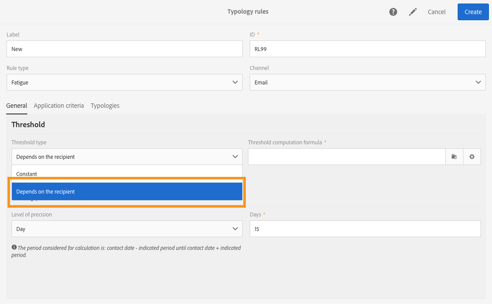

You then have two options:

* select a profile field: the threshold will vary for each profile according to the selected field. For example, if you have extended the profiles resource with a 'Communication frequency' field, click the button on the right of the **[!UICONTROL Threshold computation formula]** field and select your field. For each profile, the threshold will take the value of the 'Communication frequency' field.

  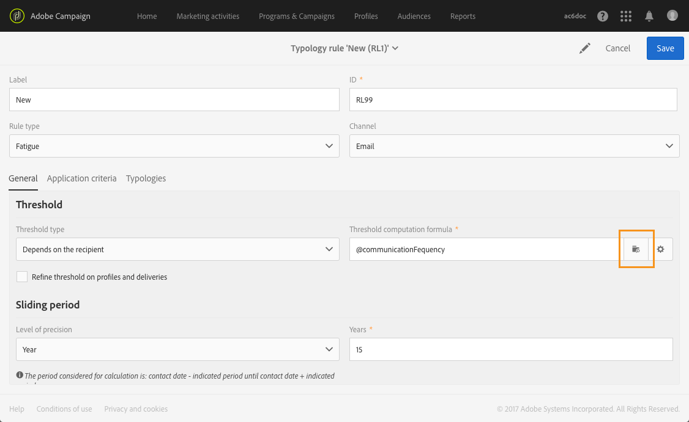

* define a formula: click the second button on the right of the **[!UICONTROL Threshold computation formula]** field to define an advanced threshold calculation formula. For example, you can index the number of authorized messages according to the segment to which the profile belongs. This means that a profile belonging to the 'Web' segment may receive more messages than other profiles. An **[!UICONTROL Iif (@origin='Web', 5, 3)]** type formula authorizes the delivery of 5 messages to profiles of the Web segment and 3 for other segments. 

  

**Refining the threshold on profiles and deliveries**

By default, all messages are taken into account for threshold calculation. Check the **[!UICONTROL Refine Threshold on profiles and deliveries]** box to filter the profiles and deliveries to count when preparing the delivery.

In the following example, only male profiles are counted and only deliveries with a label starting with **Newsletters** are counted.

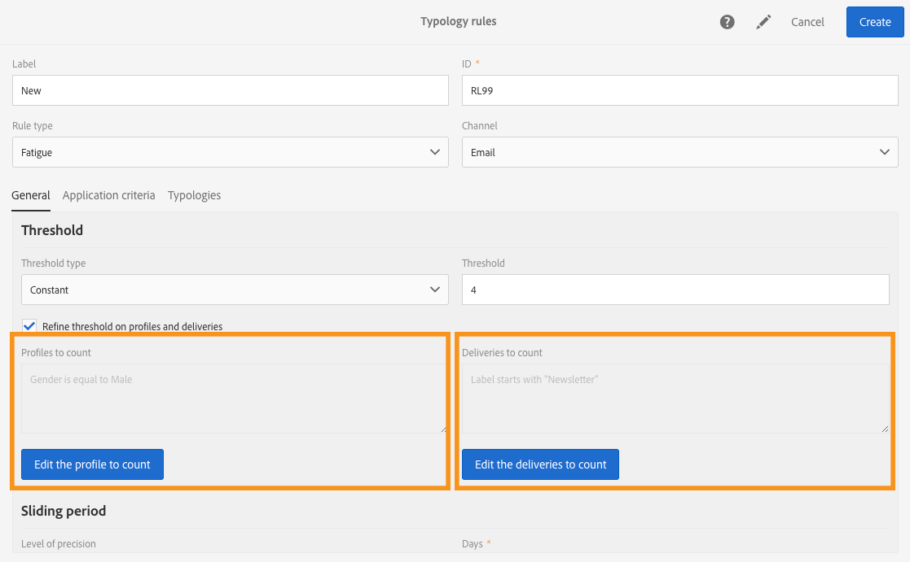

Refining the threshold on deliveries is different than restricting the applicability of the entire rule ( **[!UICONTROL Application criteria]** tab):

* **[!UICONTROL Application criteria]**: you choose to execute the rule or not according to specific criteria. For example, if your application condition is 'Label starts with Newsletter', the rule will only apply to deliveries which respect this condition. If the delivery's label starts with 'Promotion', the rule will not execute at all.
* **[!UICONTROL Refine threshold on profiles and deliveries > Deliveries to count]**: all deliveries using this typology rule will execute the rule, but you decide, among the past and scheduled deliveries, which ones you want to count. For example, if your restriction is 'Label starts with Newsletter', the rule will be executed even if the delivery label starts with 'Promo'. It will count, over the selected sliding period, the number of deliveries whose label starts with 'Newsletter'.

## Setting the sliding period {#setting-the-sliding-period}

Fatigue rules are defined in n-day rolling periods. The period is configured in the **[!UICONTROL Sliding period]** section, for example 2 weeks, 7 days or 5 hours. 

When the rule executes, both past deliveries and scheduled deliveries are taken into account. This guarantees that, on a given sliding period, the threshold is never exceeded.

For example, if you define a 48-hour period, the system will be looking 48 hours **before the contact date** and 48 hours **after the contact date**. So, the selected period is doubled to enable the integration of future deliveries as well as previous ones.

To restrict the deliveries taken into account to a 2-week period, enter **Day** and **7** or 1 week in the **Sliding period** section. Deliveries sent up to 7 days before the delivery date and scheduled up to 7 days after the delivery date on which the rule is applied will be taken into account in the calculation.

## Viewing the fatigue results {#viewing-the-fatigue-results}

During delivery preparation, profiles are excluded from the delivery if applicable, depending on the number of deliveries already sent to them. To view fatigue rule execution results, click the button in the bottom right corner of the **[!UICONTROL Deployment]** block. 

Three tabs are available, showing you the details of the fatigue execution results including the name of the rule that applied:

* Delivery logs:

  

* Exclusion logs:

  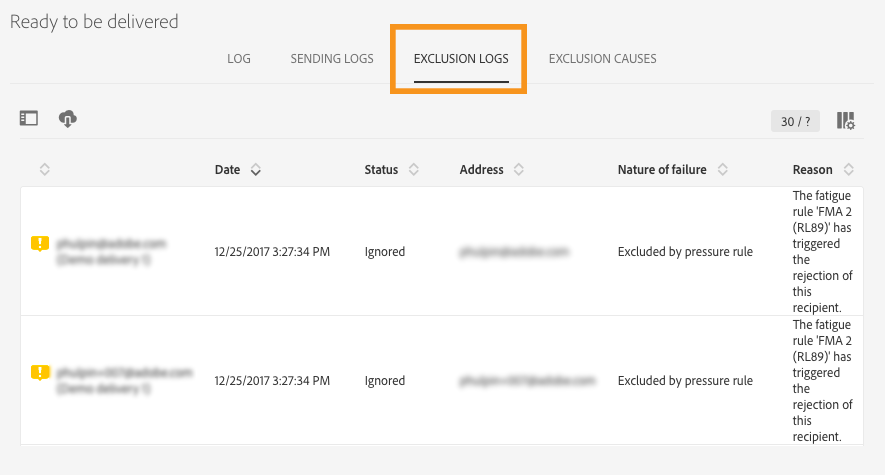

* Exclusion causes:

  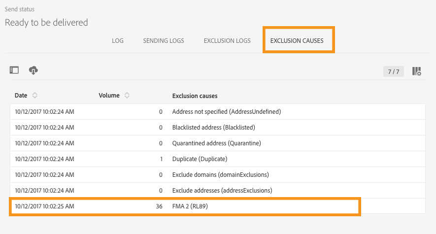

## Viewing the fatigue rule summary report {#viewing-the-fatigue-rule-summary-report}

Adobe Campaign features a dedicated report on fatigue rules to help you understand how they are applied to your campaigns. This allows you to learn how your campaigns impact one another and make the right adjustments.

The **[!UICONTROL Fatigue rules summary]** report can be accessed from the **[!UICONTROL Reports]** button, in the top right corner of each program, campaign, and message.

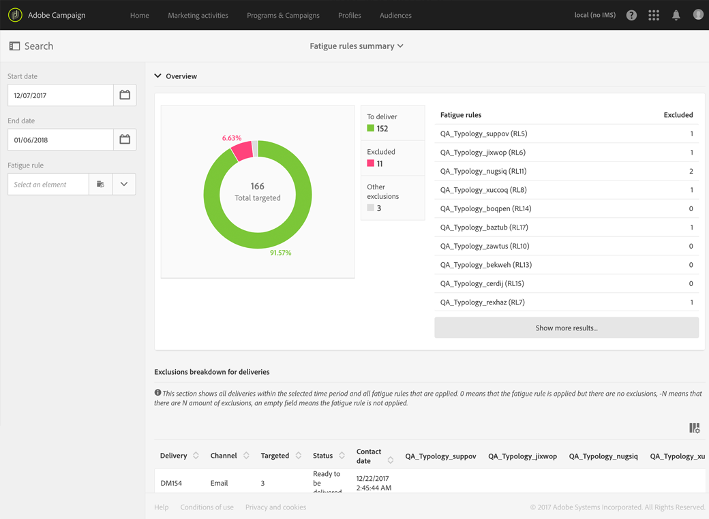

In the left part of the screen, you can filter the report data on the deliveries' contact date. By default, the selected period starts 15 days before the current date and ends 15 days after. You can also filter on a specific fatigue rule.

The pie chart displays the following information on the selected period:

* **[!UICONTROL Total targeted]**: the total target before message preparation
* **[!UICONTROL Excluded]**: the total number of exclusions due to fatigue rule application
* **[!UICONTROL Other exclusions]**: the total number of exclusions due to other typology rules
* **[!UICONTROL To deliver]**: the total number of the messages to be delivered after message preparation ( **[!UICONTROL To deliver]** = **[!UICONTROL Total targeted]** - **[!UICONTROL Excluded]** - **[!UICONTROL Other exclusions]** )

On the right of the chart, you will find the number of exclusions, broken down by fatigue rule.

The bottom table displays all deliveries within the selected period. For each delivery, you can see the fatigue rules that applied and the corresponding exclusions. Deliveries which do not have a contact date are also displayed in the table.

* **[!UICONTROL 0]** means that the fatigue rule applied but there was no exclusion.
* **[!UICONTROL -N]** means that N exclusions occurred.
* an empty field means that the fatigue rule did not apply.

>[!NOTE]
>
>The displayed data is not contextual to the program, message or campaign you access the report from. This report displays all fatigue rules and deliveries for all organizational units. This allows you to get a global view of all deliveries in order to understand how your campaigns are influenced by others.

## Examples {#examples}

There are many possibilities in terms of fatigue management implementation. Here are some examples of what you can do:

* Create a fatigue rule using a **constant threshold** that applies to **all channels**:

  Let's say you create a multi-channel rule, with a constant threshold of 3 over a sliding period of 7 days.

  Last week, your premium profiles received a promotion email and a transactional remarketing email. You also scheduled an SMS that will be sent next week. Today, you decide to send a push notification targeting all your profiles. The premium profiles will be excluded from today's push because their maximum number of messages over a 2-week period has already been reached.

  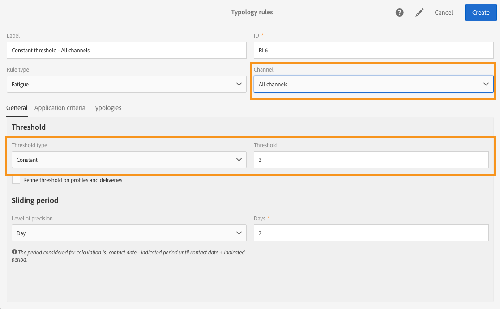

* Create a fatigue rule using a **variable threshold** based on a **profile field**:

  You have extended the profiles resource with a 'Communication limit' field, to define a different threshold for each profile. In your fatigue rule, define a variable threshold based on this field and select a sliding period of 2 days. Let's take two examples of profiles: John has a communication limit of 1 and David has a threshold of 2. Both have already received a newsletter email yesterday. You decide to send them another email today. Only David will receive it, because John has been excluded from the target. 

  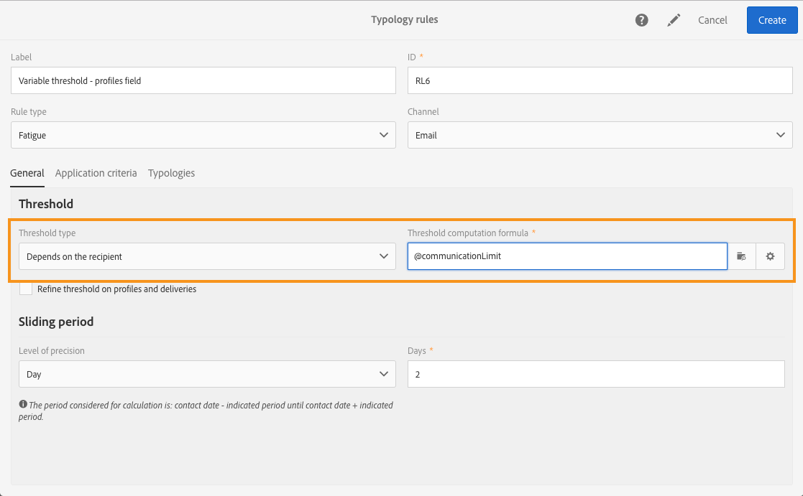

* Create a fatigue rule using a **threshold computation formula**:

  You want to change the threshold according to the age of your profiles. If a profile is under 40, you want to define a limit of 4 and for older profiles, a limit of 2. Instead of defining this threshold for each profile with an extended field, you can create a formula directly in your fatigue rule to calculate the threshold according to the profiles' age. In our example, the formula would be **[!UICONTROL Iif (@age<40, 4, 2)]**. 

  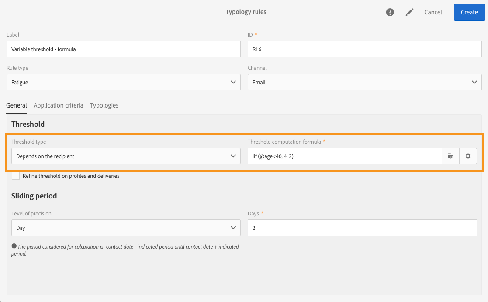

  >[!NOTE]
  >
  >This section also includes a step-by-step example of a fatigue rule using a threshold computation formula.

* Create a fatigue rule that **refines the threshold** on profiles and deliveries:

  You have extended the profiles resource with a 'Score' field and you also have extended the deliveries resource with a 'Type' field. You want to define a constant threshold of 3 but you want to exclude from the count all the deliveries of the type 'Alert' or 'Black Friday' and all the profiles with a score greater than 10. When the rule will execute, it will count, among the past and scheduled deliveries, all the deliveries that are not of the type 'Alert' or 'Black Friday' sent to profiles whose score is smaller than 10. 

  

Here is a step-by-step example of a fatigue rule using a threshold computation formula.

In this use case, we want to create a typology rule to prevent the delivery of more than 2 messages per week to premium profiles and 2 messages per week to standard profiles.

To identify customers and prospects, we extended the profiles resource with the **[!UICONTROL Status]** field, which contains 0 for premium profiles and 1 for standard profiles.

To create the rule, apply the following steps:

1. Create a new **Fatigue** type typology rule.
1. In the **[!UICONTROL Threshold]** section, we want to create a formula to calculate the threshold depending on each profile. Select the **[!UICONTROL Depends on the recipient]** value in the **[!UICONTROL Threshold type]** field, then click the icon the second button on the right of the **[!UICONTROL Threshold computation formula]** field.

   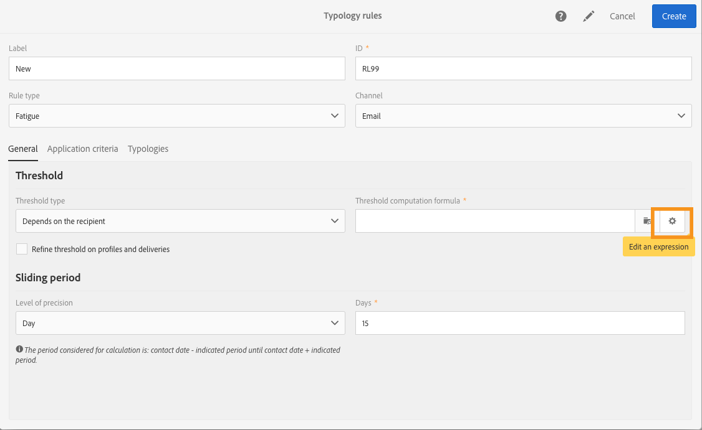

1. In the **[!UICONTROL List of functions]** section, double-click the **Iif** function in the **[!UICONTROL Others]** node.

   

1. Then select the profile's **Status** in the **[!UICONTROL Available fields]** section.

   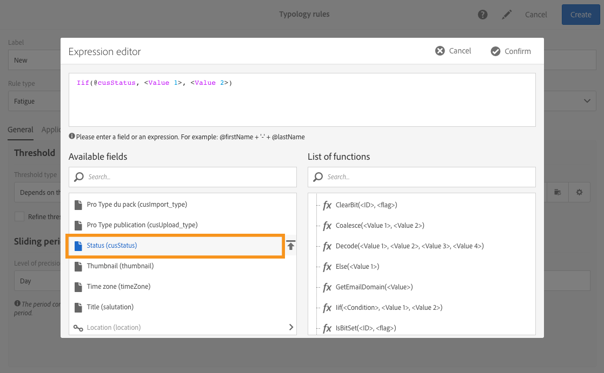

1. Enter the desired values to create the following formula: **Iif(@status=0,2,4)**

   

   This formula lets you assign the value 2 if the status equals 0, and the value 4 for all other statuses.

1. Click **[!UICONTROL Confirm]** to approve the formula. 
1. Indicate the **[!UICONTROL Sliding period]** on which the rule will apply: 7 days in this case, to restrict the deliveries taken into account to a 2-week period.

   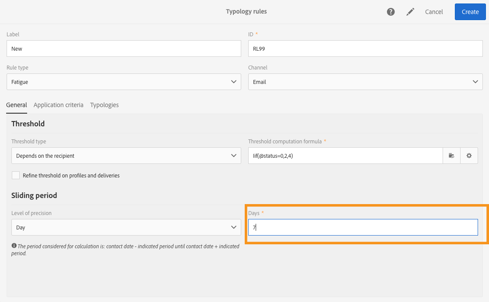

1. Now link the rule which you have just created to a typology in order to apply it to your deliveries. To do this, select the **[!UICONTROL Typologies]** tab, click **[!UICONTROL Create element]** and select the typology used for your deliveries.

   

1. Save the rule to approve creation.

The rule will be applied to all deliveries based on the typology.
