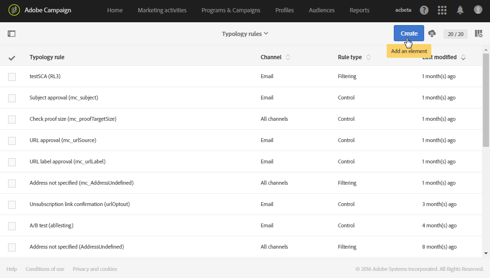
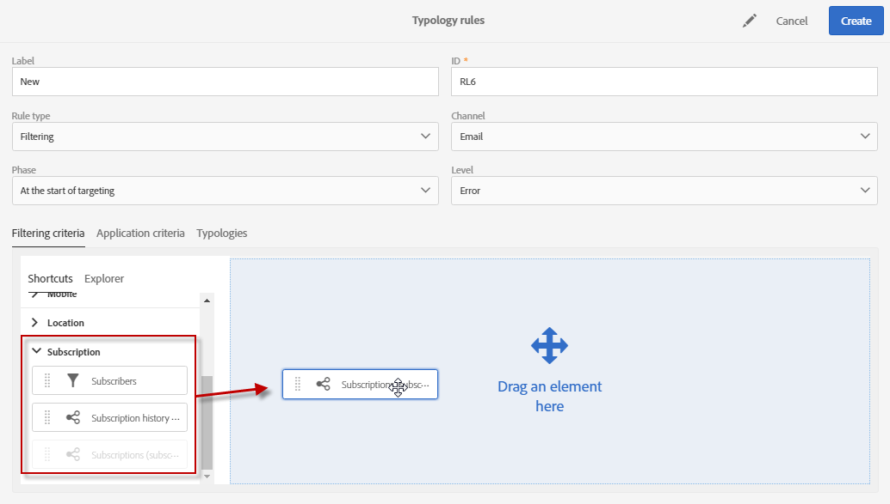
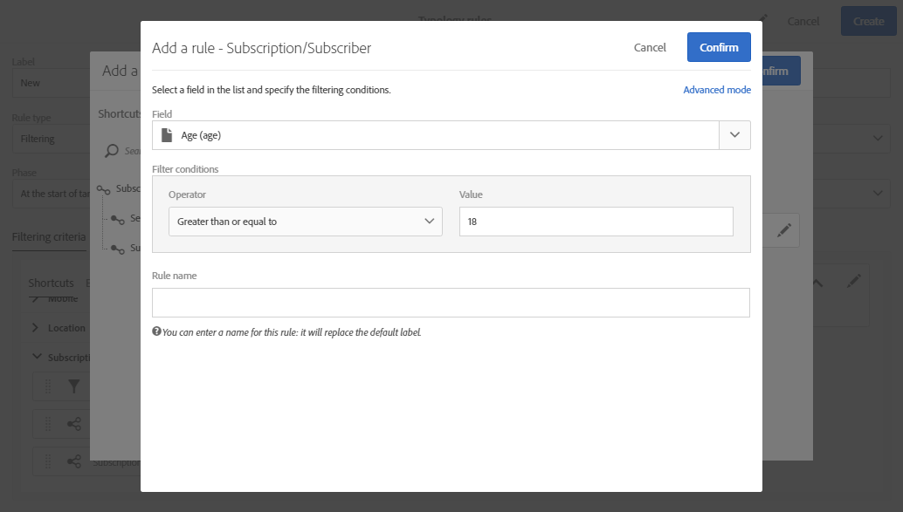
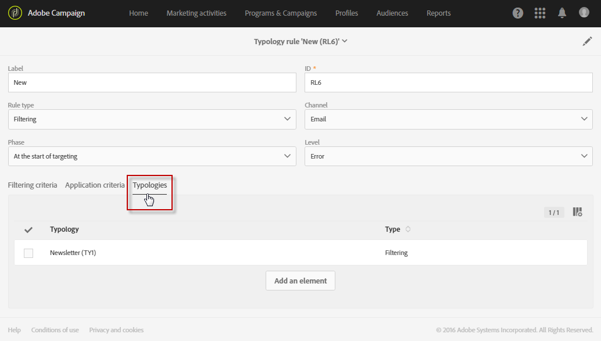
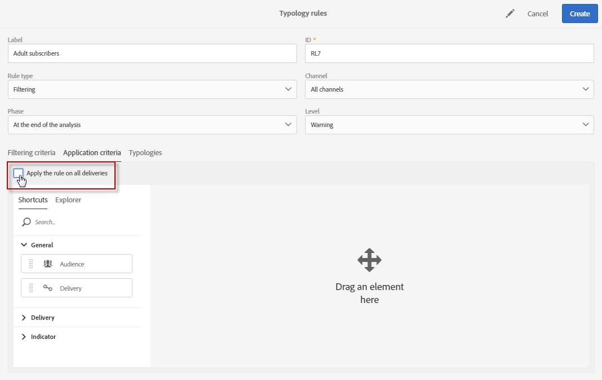
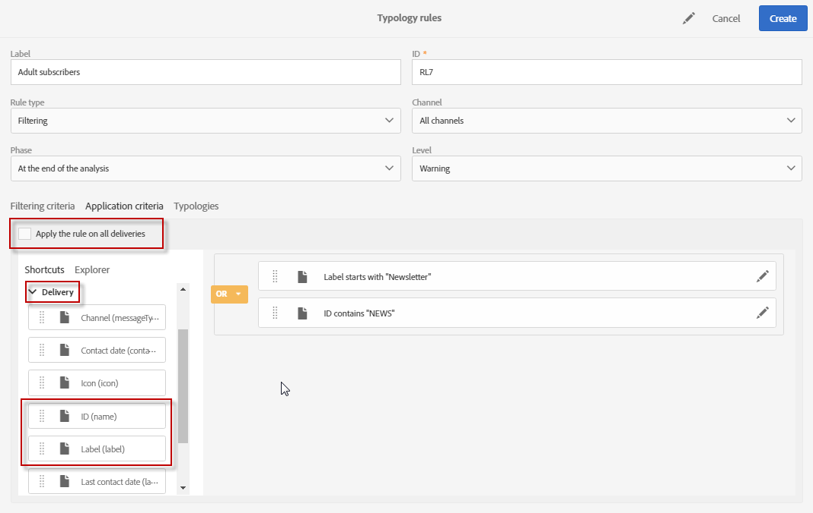

# Filtering rules{#filtering-rules}

Filtering rules allow you to exclude one part of the message target according to criteria defined in a query, such as quarantined profiles or profiles that have already been sent a certain number of emails.

## Default filtering typology rules {#default-filtering-typology-rules}

A set of default filtering rules are available by default in Campaign Standard:

* xx
* xx
* xx

Additionnally to the default filtering rukes, two exclusion rules are available by default: **[!UICONTROL Exclusion of addresses]** ( **[!UICONTROL addressExclusions]** ) and **[!UICONTROL Exclusion of domains]** ( **[!UICONTROL domainExclusions]** ). During the email analysis, these rules compare the recipient email addresses with the forbidden addresses or domain names contained in an encrypted global suppression list managed in the deliverability instance. If there is a match, the message is not sent to that recipient.

This is to avoid being blacklisted due to malicious activity, especially the use of a Spamtrap. For example, if a Spamtrap is used to subscribe via one of your web forms, a confirmation email is automatically sent to that Spamtrap, and this results in your address being automatically blacklisted.

>[!NOTE]
>
>The addresses and domain names contained in the global suppression list are hidden. Only the number of excluded recipients is indicated in the delivery analysis logs.

## Creating a filtering rule {#creating-a-filtering-rule}

For example, you can filter the newsletter subscribers so that the subscribers that are younger than 18 years old never receive communications.

1. Create a **Filtering** typology rule, one that can be applied on all communication channels.

   

1. In the **[!UICONTROL Filtering criteria]** tab, select the subscriptions in the **[!UICONTROL Subscription]** category.

   

1. In the **[!UICONTROL Explorer]** tab of the query editor, drag and drop the **[!UICONTROL Subscriber]** node into the main part of the screen.

   

1. Select the **[!UICONTROL Age]** field and define the filtering conditions so that the age of the subscribers is 18 or above.

   

1. In the **[!UICONTROL Typologies]** tab, link this rule to a typology.

   

1. Make sure that the typology in question is selected in the delivery template that you want to use.

   

   >[!NOTE]
   >
   >To access the delivery templates, select **[!UICONTROL Resources]** > **[!UICONTROL Templates]** in the navigation menu, which can be accessed via the Adobe Campaign logo.

Whenever this rule is used in a message, the subscribers who are considered minors will be automatically excluded.

## Restricting the applicability of a filtering rule {#restricting-the-applicability-of-a-filtering-rule}

You can restrict the applicability of a filtering rule according to the message to send.

1. In the typology rule's **[!UICONTROL Application criteria]** tab, uncheck the **[!UICONTROL Apply the rule on all deliveries]** option, which is enabled by default.

   

1. Use the query editor to define a filter. For example, you can apply the rule only on messages whose label starts with a given word or whose ID contains certain letters.

   

In this case, the rule is only applied to the messages that correspond to the defined criteria.
