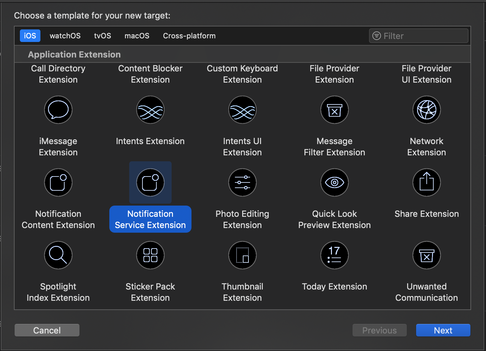

# Adding images and videos iOS {#image-push}

>[!NOTE]
>
>This document applies to iOS device only.

In this document, learn how to display an image from an Adobe Campaign Standard iOS push notification.

## Step 1: Set up push notification {#set-up-push}

Push notification is supported by Experience Platform SDKs.

The mobile applications receiving push notifications must be configured by an administrator in the Adobe Campaign interface.

By configuring both Adobe Campaign and Adobe Mobile Services, you will be able to use your mobile application's data for your campaigns. For more on this, refer to this [page](https://helpx.adobe.com/campaign/kb/configuring-app-sdk.html).

To send push notifications with an Experience Cloud SDK application, a mobile app has to be set up in Adobe Experience Platform Launch and be configured in Adobe Campaign. For more on this, refer to this [page](https://helpx.adobe.com/campaign/kb/configuring-app-sdk.html#ChannelspecificapplicationconfigurationinAdobeCampaign).

## Step 2: Customize your push notification in Adobe Campaign {#customize-push}

To fine-tune your push notification, Adobe Campaign allows you to access a set of advanced options while designing a push notification.

1. Create a push notification. For more on this, refer to this [page](../../channels/using/preparing-and-sending-a-push-notification.md).

1. From your push notification content page, access the **[!UICONTROL Advanced options]** section.

1. Enter the URL of your file in the **[!UICONTROL Rich media content URL]** field.
  For iOS 10 or higher, you can insert image, gif, audio and video files.

    

1. Preview and save your push notification.

## Step 3: Adapt the Mobile application code {#mobile-app-code}

After customizing your push notification in Adobe Campaign, you have to configure your mobile application to display the image on devices.

>[!NOTE]
>
>If your application is in Objective-C, refer to the following [documentation](https://experienceleague.adobe.com/docs/mobile-services/ios/messaging-ios/push-messaging/c-set-up-rich-push-notif-ios.html).

If your app is in [!DNL Swift], follow the steps below:

1. Open your [!DNL Xcode] project.

1. In your [!DNL Xcode] project, select **[!UICONTROL File]** > **[!UICONTROL New]** > **[!UICONTROL Target]**.

1. Select **[!UICONTROL Notification Service Extension]**.

    

1. Check that the **NotificationService.swift** file class is created.

1. Edit this class and replace the default content with the following.
    This allows the application to handle the incoming parameter with the image URL, parse it, copy it locally and then display it from the the push notification.

    ```
    import UserNotifications
 
    class NotificationService: UNNotificationServiceExtension {
     
    var contentHandler: ((UNNotificationContent) -> Void)?
    var bestAttemptContent: UNMutableNotificationContent?
     
    override func didReceive(_ request: UNNotificationRequest, withContentHandler contentHandler: @escaping (UNNotificationContent) -> Void) {
        self.contentHandler = contentHandler
        bestAttemptContent = (request.content.mutableCopy() as? UNMutableNotificationContent)
 
        if let bestAttemptContent = bestAttemptContent {
            var urlString:String? = nil
            if let urlImageString = request.content.userInfo["media-attachment-url"] as? String {
                urlString = urlImageString
            }
             
            if urlString != nil, let fileUrl = URL(string: urlString!) {
                print("fileUrl: \(fileUrl)")
                 
                // Download the attachment
                URLSession.shared.downloadTask(with: fileUrl) { (location, response, error) in
                    if let location = location {
                        // Move temporary file to remove .tmp extension
                        if (error == nil) {
                            let tmpDirectory = NSTemporaryDirectory()
                            let tmpFile = "file://".appending(tmpDirectory).appending(fileUrl.lastPathComponent)
                            let tmpUrl = URL(string: tmpFile)!
                            try! FileManager.default.moveItem(at: location, to: tmpUrl)
                             
                            // Add the attachment to the notification content
                            if let attachment = try? UNNotificationAttachment(identifier: fileUrl.lastPathComponent, url: tmpUrl) {
                                bestAttemptContent.attachments = [attachment]
                                }
                        }
                        if(error != nil) {
                            print("Failed to download attachment: \(error.debugDescription)")
                        }
                    }
                    // Serve the notification content
                    contentHandler(bestAttemptContent)
                }.resume()
            }
        }
    }
     
    override func serviceExtensionTimeWillExpire() {
        // Called just before the extension will be terminated by the system.
        // Use this as an opportunity to deliver your "best attempt" at modified content, otherwise the original push payload will be used.
        if let contentHandler = contentHandler, let bestAttemptContent = bestAttemptContent {
            contentHandler(bestAttemptContent)
        }
    }

    }
    ```

The mobile should receive the following payload while notification is sent.

The image URL is mapped with key media-attachment-url. This is the key/value pair that you have to handle from the application code perspective to download and display the image.

```
userInfo: [AnyHashable("media-attachment-url"): https://pbs.twimg.com/profile_images/876737835314950144/zPTs9b7o.jpg, AnyHashable("_dId"): 1de3ef93, AnyHashable("_mId"): h280a5, AnyHashable("aps"): {
 
    alert =     {
 
        body = "Message Body here";
 
        title = "This a push from Campaign";
 
    };
 
    badge = 1;
 
    "mutable-content" = 1;
 
}]
```

## Step 4: Test sending the push {#test-send-push}

You can now test building your application and the delivery you created in step 2 above. For more information on preparing and sending your push notification, refer to this [page](../../channels/using/preparing-and-sending-a-push-notification.md).


