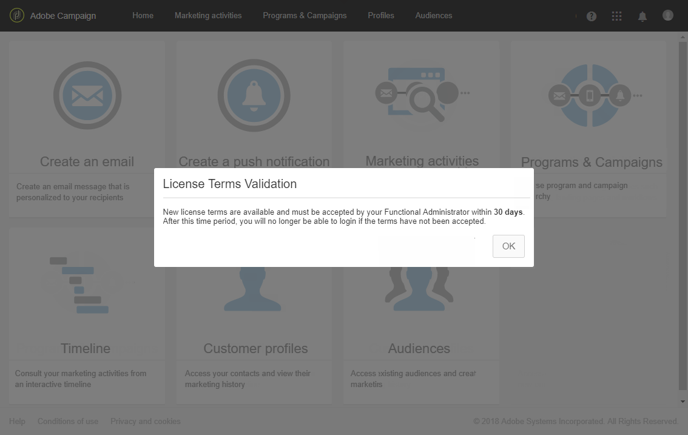
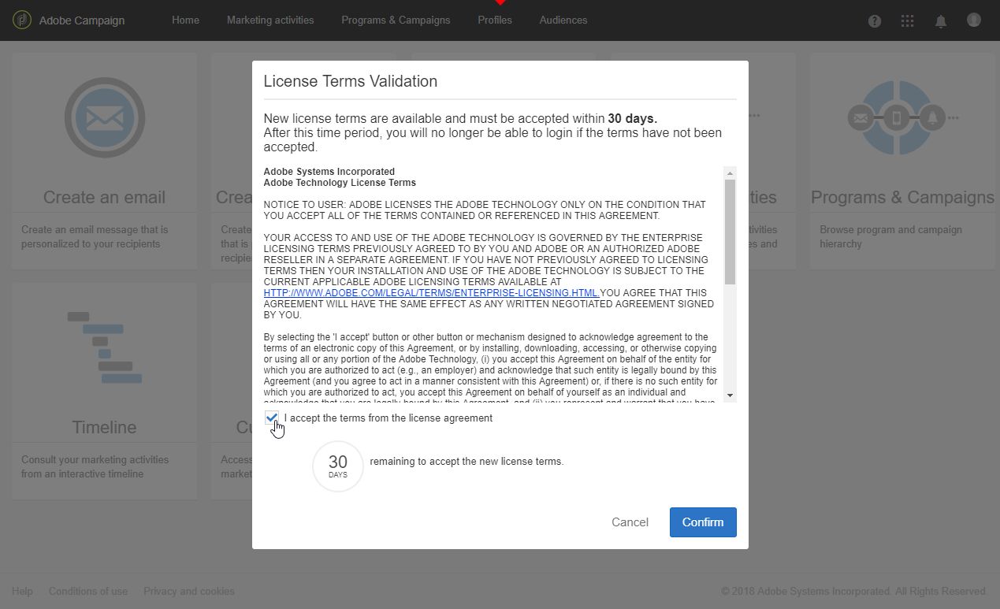
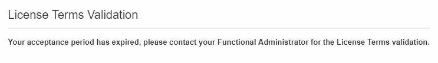

# Licenses{#licenses}

Licenses

The** Licenses** window allows you to view the installed licenses on your instance and different information about it such as the build number, release version or if the terms of agreement have been accepted and by whom.

With a new build or a new feature, license terms may change and need to be accepted by a functional administrator of the instance.

The following window will appear for standard users after logging in, no action is required on their part. They can still work on Adobe Campaign by clicking the **OK** button.

An administrator has to read and confirm the new terms of agreement in the following 30 days of the build installation by checking **I accept the terms from the license agreement** and clicking **Confirm**.

Passed these 30 days if the agreement is not accepted, no users will be able to use this instance. The standard users will not be able to access Adobe Campaign functionalities and will only see the following message until a functional administrator accepts the terms of agreement.

