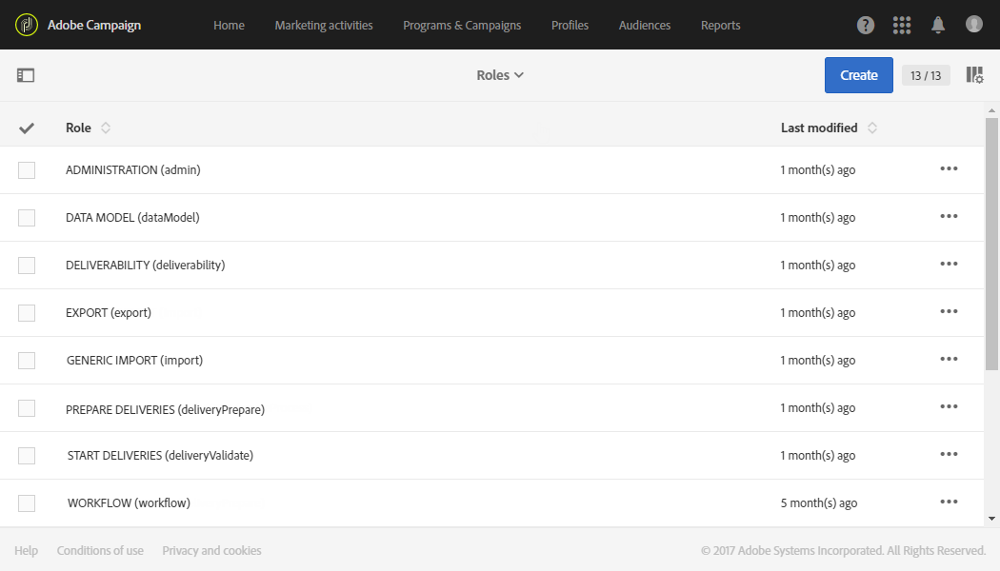

# List of roles{#list-of-roles}

List of roles

By default, Adobe Campaign offers a set of roles which allows you to define unitary authorizations assigned to users and user groups. Combined with organizational and geographical units, roles give users a filtered view of the interface and define their access to the different features. For more on this, refer to this [page](https://docs.campaign.adobe.com/doc/standard/en/Technotes/AdobeCampaign-ACSRights.pdf).

Roles can be managed from the **Administration > Users & Security > Roles** menu.

Default rights are:

* ADMINISTRATION: Generic administration right.
* DATAMODEL: Right to run publications and create custom resources.
* EXPORT: Right to export data.
* GENERIC IMPORT: Right to run a generic import on data. For this to work, you need to link the **Generic import** role to the **Workflow** role.
* PREPARE DELIVERIES: Right to create, edit, start delivery preparation and send proofs.
* START DELIVERIES: Right to validate previously prepared deliveries.
* WORKFLOW: Right to use workflows.

>[!CAUTION]
>
>The DELIVERABILITY role is for Adobe administrators internal use only. It must not be granted to a user.

**Related topics:**

* [About access management](../../administration/using/about-access-management.md)
* [Managing groups and users](../../administration/using/managing-groups-and-users.md)

