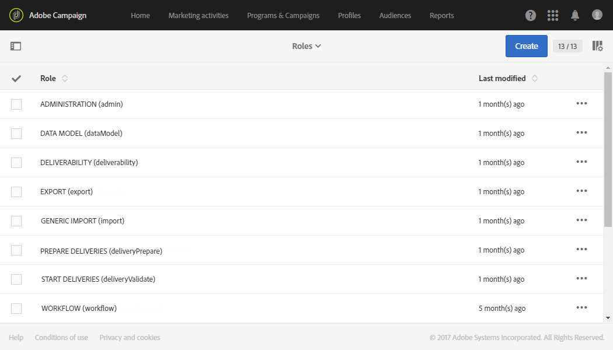

# List of roles{#list-of-roles}

By default, Adobe Campaign offers a set of roles which allows you to define unitary authorizations assigned to users and user groups.

Combined with organizational units, roles give users a filtered view of the interface and define their access to the different features.

Roles can be managed from the **[!UICONTROL Administration > Users & Security > Roles]** menu.

Default rights are:

* **[!UICONTROL Administration]**: Generic administration right.

    >[!NOTE]
    >
    >If you work with Experience Cloud Triggers, you need the **[!UICONTROL Administration]** right to be able to access the Experience Cloud Triggers menu. For more information on Experience Cloud Triggers, refer to this [page](../../integrating/using/about-adobe-experience-cloud-triggers.md).

* **[!UICONTROL Datamodel]**: Right to run publications and create custom resources.
* **[!UICONTROL Generic import]**: Right to run a generic import on data. For this to work, you must link the **[!UICONTROL Generic import]** role to the **[!UICONTROL Workflow]** role.
* **[!UICONTROL Prepare deliveries]**: Right to create, modify, prepare and delete deliveries. Users with this role can prepare the delivery but not send it.
* **[!UICONTROL Start deliveries]**: Right to create, modify, prepare, send, and delete deliveries.
* **[!UICONTROL Workflow]**: Right to manage the execution of workflows (start, stop, pause etc.). Users with this role can not send a delivery even in a workflow.

For more on this, refer to the [Roles and permissions table](/help/administration/using/assets/acs_rights.pdf), which details the functions available in the interface depending on the selected authorizations.

**Related topics:**

* [About access management](../../administration/using/about-access-management.md)
* [Managing groups and users](../../administration/using/managing-groups-and-users.md)
