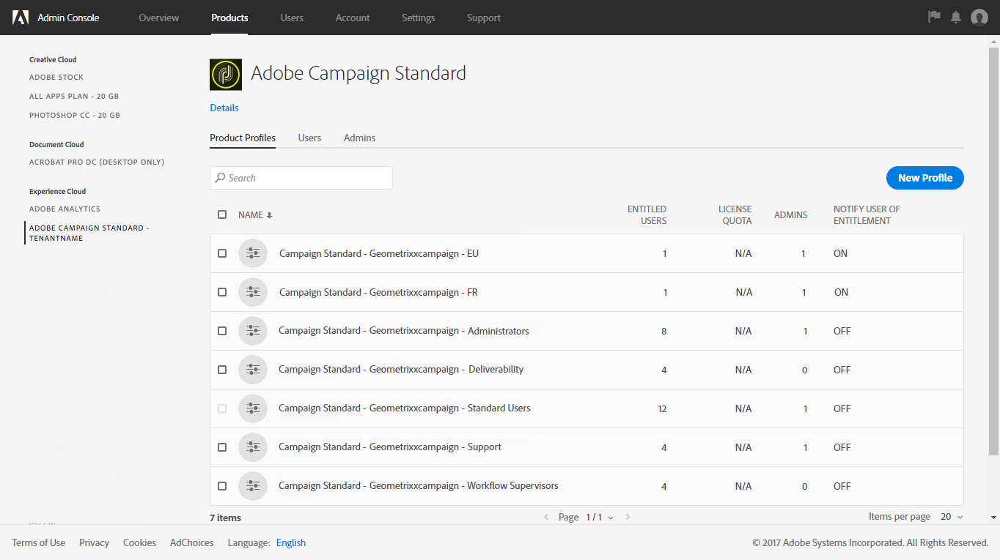
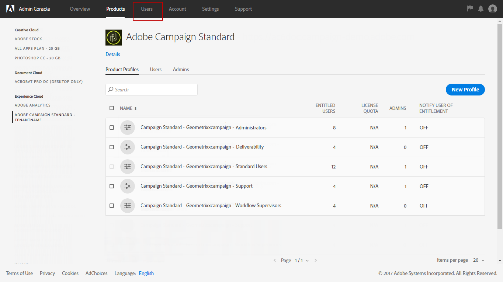
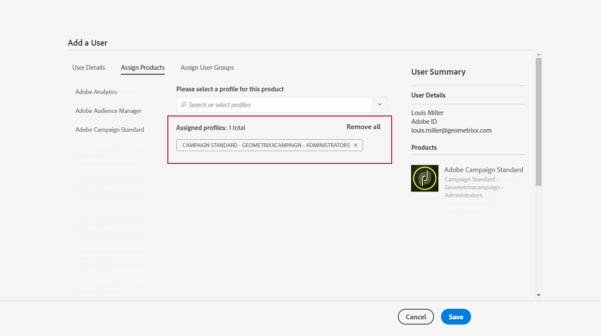
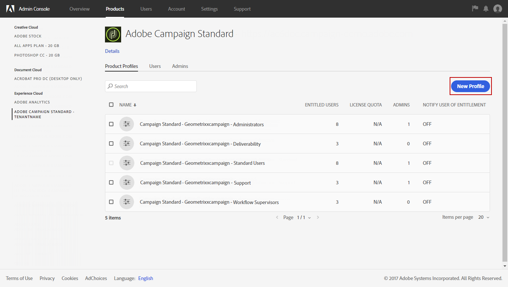
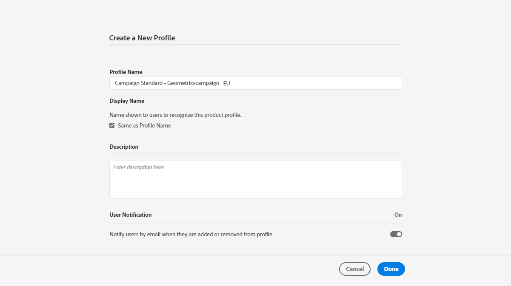
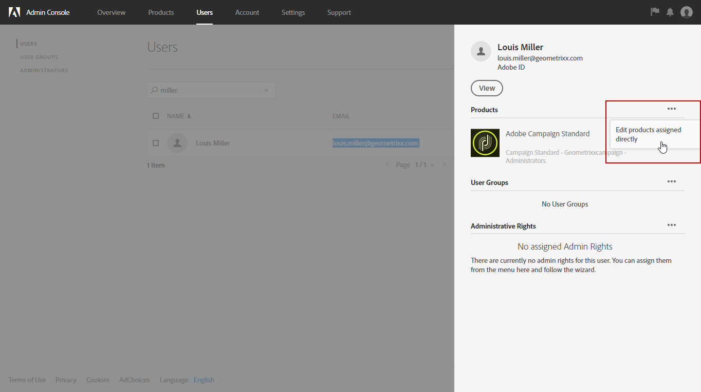
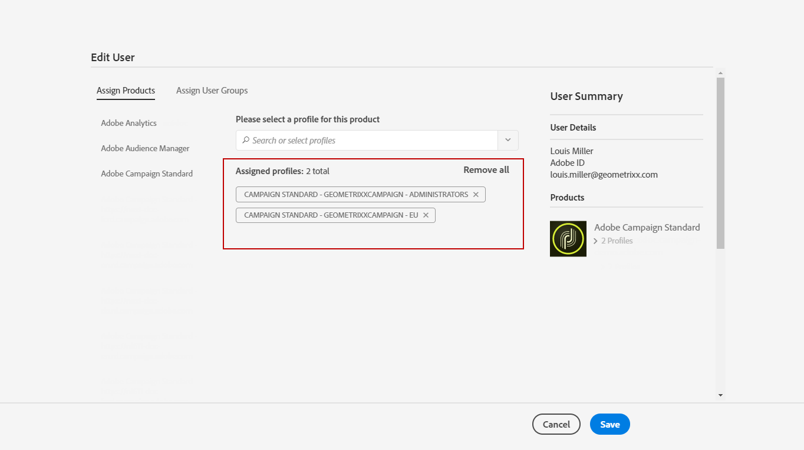
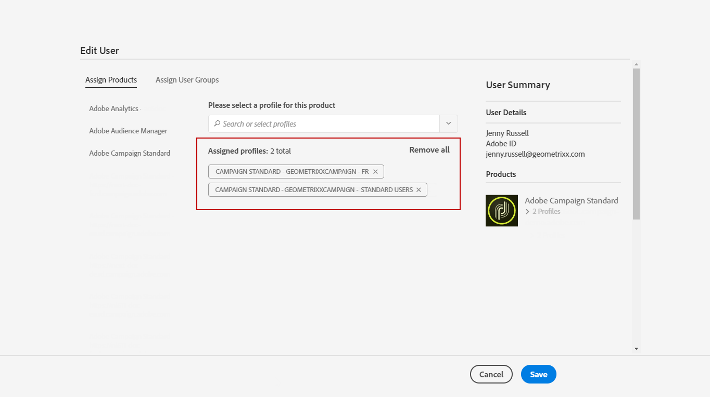
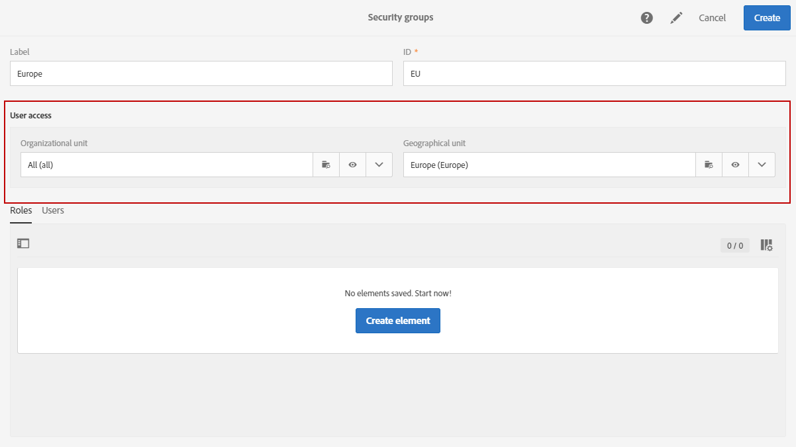
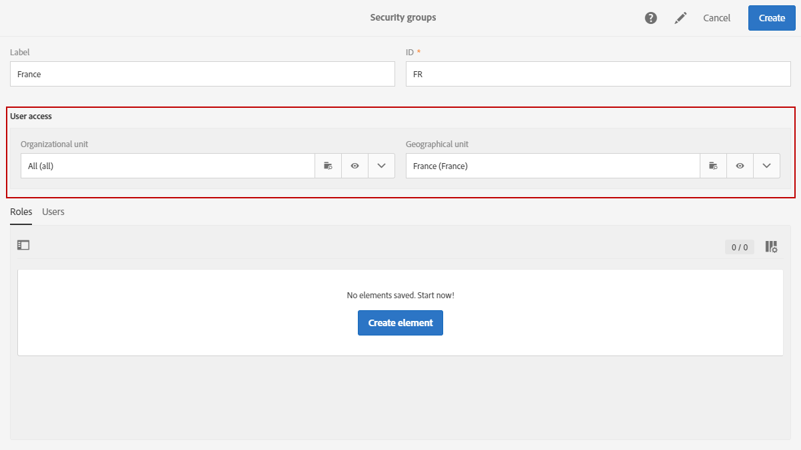

# Managing groups and users{#managing-groups-and-users}

## About security groups {#about-security-groups}

Security groups are sets of users that share the same roles and rights within your organization.

Users must always be linked to a security group. This will allow you to assign them specific roles and organizational units.

For more information on roles, the table in the following page presents possible operations available according to a user's role(s): [Adobe Campaign Standard authorizations](https://experienceleague.adobe.com/docs/campaign-standard/assets/acs_rights.pdf?lang=en).

Default security groups are:

* **[!UICONTROL Administrators]**
* **[!UICONTROL Delivery supervisors]**
* **[!UICONTROL Standard Users]**
* **[!UICONTROL Workflow supervisors]**

>[!IMPORTANT]
>
>The **[!UICONTROL Access to the deliverability parameters (Deliverability)]** and **[!UICONTROL Message Center agents (mcExec)]** security groups are Adobe internal only and should not be assigned to any user.

To be able to access Adobe Campaign, each user must be assigned to a security group.

To restrict a user's access, do not add the user to the Campaign Standard users group as this is linked to **[!UICONTROL All]** organizational unit.

>[!NOTE]
>
>By default, the **[!UICONTROL All (all)]** organizational unit is assigned to the **[!UICONTROL Administrators]** security group. It is read-only and cannot be modified.

## Creating a security group and assigning users {#creating-a-security-group-and-assigning-users}

>[!IMPORTANT]
>
>Please note that in the Admin Console, security groups are referred as profiles.

You can create your own security groups if the out-of-the-box groups are not enough to manage your users. They can be managed by Administrators that have access to both Adobe Campaign administration menus and the Admin Console. For more information on the Admin Console, refer to this [documentation](https://helpx.adobe.com/enterprise/managing/user-guide.html).

Here, we first need to assign the two out-of-the-box groups Standard user and Administrator to our users. These security groups will restrict some functionalities of Adobe Campaign: the Standard User has basics access to Adobe Campaign whereas the Administrator can access the administration menus for example.

Note that any changes made to security groups on the admin console will be synchronized as soon as users log into Adobe Campaign.

Then, we want to create a set of security groups Geometrixx and Geometrixx Clothes that will restrict some access depending on the organizational units of our Standard user and Administrator.

You first need to assign one of the out-of-the-box security group to your users:

1. In the Admin Console, select your instance then the **Users** tab.

   

1. Click the **[!UICONTROL Add user]** button and enter your user's email address.
1. In the **[!UICONTROL Assign Products]** tab, select your instance then the **[!UICONTROL Administrators]** out-of-the-box security group from the drop-down list. This will allow the user to have access to the administration menus and to create the next security groups.

   

1. Click **[!UICONTROL Save]** and follow the same procedures to assign the **[!UICONTROL Standard Users]** out-of-the-box security group to your new user.

   

Once your two users are attached to the **[!UICONTROL Administrators]** and **[!UICONTROL Standard users]** out-of-the-box security groups which assign roles to our users, the Administrator user can now create the two security groups **Geometrixx** and **Geometrixx Clothes** that will assign organizational units to our users in addition to the out-of-the-box security groups.

1. In the Admin Console, select your instance then the **Products** tab.
1. Click the **New Profile** button to create the **Geometrixx** security group.

   

1. Type the **[!UICONTROL Profile name]** by following this exact syntax: **[!UICONTROL Campaign Standard- instance name - ID of the security group]** and click **[!UICONTROL Done]**.

   The ID chosen will then be used while creating the security group in Adobe Campaign.

   >[!NOTE]
   >
   >If the above syntax doesn't seem to work with an older instance, it needs to be replaced by **[!UICONTROL Campaign - instance name - ID of the security group]**.

   

1. Then, follow the same procedures to create the **Geometrixx Clothes** security group.
1. Assign your security group to your user by selecting the **[!UICONTROL Users]** tab.

   

1. Click your previously created user then the  icon in the **[!UICONTROL Products]** category.

   Select **[!UICONTROL Edit products assigned directly]** to start assigning new security group to your user.

   

1. In the **[!UICONTROL Assign Products]** tab, select your instance then your previously created security groups Geometrixx from the drop-down list to assign it to your Administrator user.

   Click **[!UICONTROL Save]**.

   

   If a user is in several groups:

    * The roles of the different groups are cumulated. Here, users are in two different groups: one that will act on roles the other on units.
    * It is the unit that is the highest in the hierarchy that will be used (see example in the [Organizational units](../../administration/using/organizational-units.md) section).
    * The user will no longer be able to connect if units have the same equivalent level and are in parallel branches in the hierarchy.

1. Follow the same procedures to assign the Geometrixx Clothes security group to your Standard user.

   

The newly created security groups are now created in the Admin Console. For them to be completely synced, you also need to create them in Adobe Campaign.

The Administrator user has to create the set of security groups that are used to assign organizational units: Geometrixx and Geometrixx Clothes. To learn how to create organizational units, see [Creating and managing units](../../administration/using/organizational-units.md#creating-and-managing-units) .

1. Click the **Adobe** logo, in the top-left corner, then select **[!UICONTROL Administration > Users & Security > Security groups]**.
1. Create your new security group and specify its **[!UICONTROL Label]** and **[!UICONTROL ID]**.

   The ID needs to be the same as the one chosen in the Admin Console.

1. In the **[!UICONTROL User access]** field, assign organizational unit. Here, the Geometrixx security group is assigned the **[!UICONTROL All]** organizational unit.

   >[!NOTE]
   >
   >If you are assigning an out-of-the-box security group to your users, you will need to reset the organizational unit.

   

1. You can also assign roles to your security group. In our case, this step is not needed since the out-of-the-box security groups **[!UICONTROL Administrators]** and **[!UICONTROL Standard users]** are used to assign roles.
1. Follow the same procedures to create the last security Geometrixx Clothes and assign the Geometrixx Clothes organizational unit.

   

Your users are now assigned to a security group and can connect to Adobe Campaign.

>[!IMPORTANT]
>
>If users are removed from a security group in the Admin Console, they will remain part of the Adobe Campaign security group and will no longer be able to log in Adobe Campaign. In this case, remove the users' email addresses in the admin console to prevent them from receiving sensitive information.
