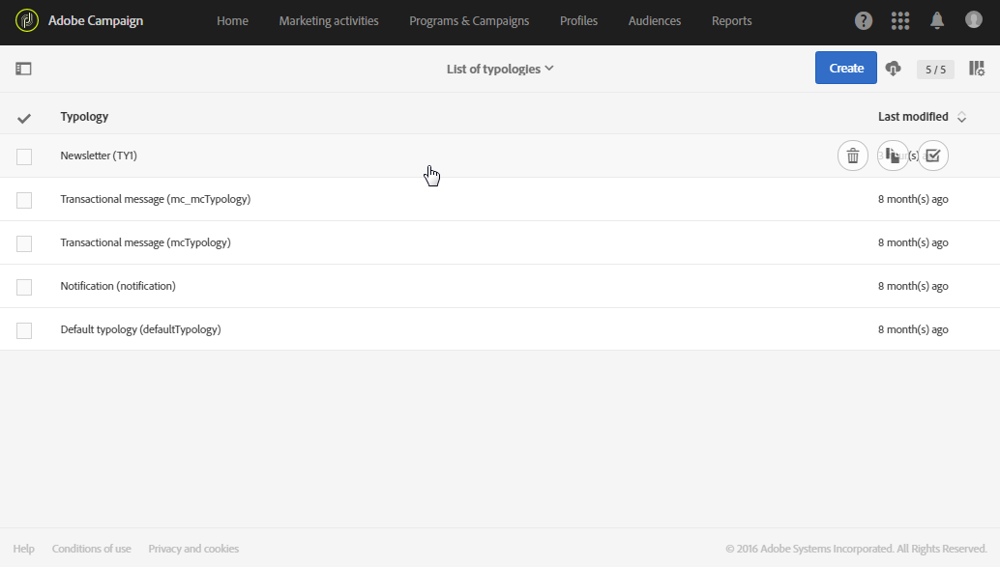

# Managing typologies {#managing-typologies}

typology types

where to access them

out-of-the-box filtering and control available (see.....)

creating a typology

using a typology in deliveries

Several typologies are present by default in the application. Based on your needs, you can create your own typologies or modify existing ones.

1. Access the **[!UICONTROL List of typologies]** from the **[!UICONTROL Administration]** > **[!UICONTROL Channels]** > **[!UICONTROL Typologies]** menu.
1. Select a typology to modify its content and properties or create a new one.

   

1. Define the type of the typology. Typologies can be either Standard or Filtering typologies.
1. Add the typology rules you need using the **[!UICONTROL Add an element]** button or remove the ones you do not want to use.

   You can modify the order in which the rules are applied for a given typology. To do this, move the elements to modify the order in which they appear on the screen. The numbers corresponding to the execution order are then automatically recalculated. The rule application mode is presented in the [Typology rules execution order](#typology-rules-execution-order) section.

   The rules displayed on this screen can be accessed in read-only mode.

Your typology is ready to be used. You can select it in message properties or in message template properties.

>[!NOTE]
>
>The **[!UICONTROL IP affinity]** field allows you to manage the affinities according to your configuration. These are defined in the instance's configuration file. If you want to use the affinities, contact your administrator.
