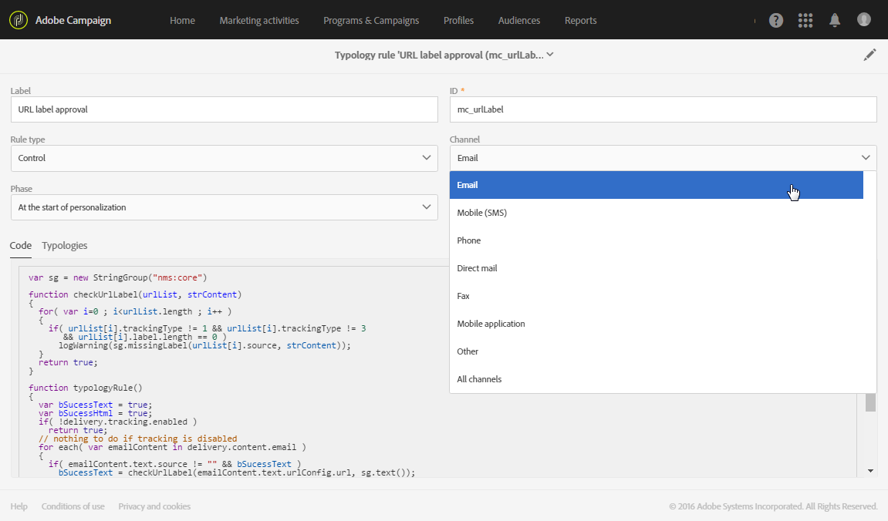
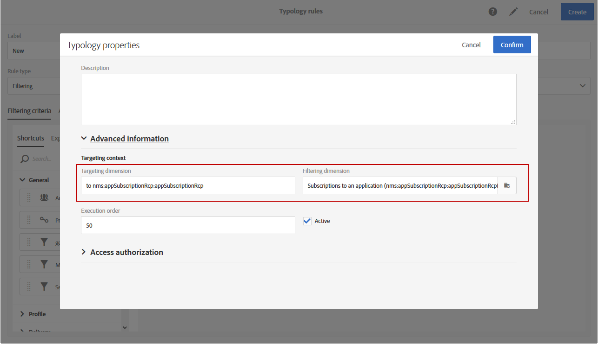
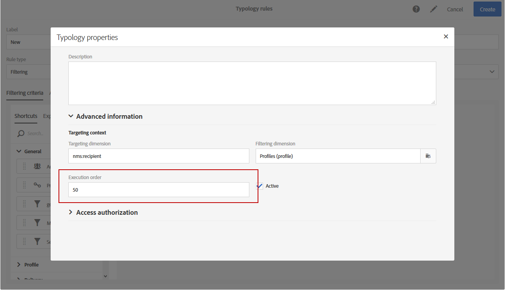

# Managing typology rules {#managing-typology-rules}

## About typology rules {#about-typology-rules}

description

Typology rules are available under the **[!UICONTROL Administration]** > **[!UICONTROL Channels]** > **[!UICONTROL Typologies]** > **[!UICONTROL Typology rules]** menu.

The types of rules are:

* **Filtering** rules: allow you to exclude one part of the message target according to criteria defined in a query, such as quarantined profiles or profiles that have already been sent a certain number of emails. See [Filtering rules](../../administration/using/filtering-rules.md). executed at the start of targeting
* **Fatigue** rules: allow you to define a maximum number of messages per profile to avoid over-soliciting them. See [Fatigue rules](../../administration/using/fatigue-rules.md).
* **Control** rules: allow the user to check the validity and quality of the messages before they are sent, such as character display, SMS message size, address format, etc. See [Control rules](../../administration/using/control-rules.md). are executed at different phases according to the need

Out-of-the-box filtering and control typology rules available by default + detailed in dedicated sections

## Creating a typology rule {#creating-a-typology-rule}

global creation steps (channel, phase selection) + for creation details, ref to sub-sections

1. access list of rules + create button
1. define label and id
1. select the type and channel

>[!NOTE]
>
>A typology rule can be applied to only one channel or to all channels.

	

1. In the **[!UICONTROL Targeting context]** category, you can select the **Targeting dimension** and **Filtering dimension** depending on the data that you want to target.

	By default, filtering is carried out on the **[!UICONTROL Profiles]**. For example, if the rule is aimed at a mobile application, the **[!UICONTROL Filtering dimension]** can be changed to **[!UICONTROL Subscriptions to an application]**.

	

1. Build the rule. For more on this, see sub-sections.
1. Typologies tab: link to one or several typologies (can also be done from the typologes
1. Confirm.

## Typology rules execution order {#typology-rules-execution-order}

The typology rules are executed in an order specified during the targeting, analysis, and message personalization phases.

In standard operation mode, the rules are applied in the following sequence:

1. Control rules, if they are applied at the start of targeting.
1. Filtering rules:

    * Native application rules for address qualification: defined address / non-verified address / blacklisted address / quarantined address / address quality.
    * Filtering rules defined by the user.

1. Control rules, if they are applied at the end of targeting.
1. Control rules, if they are applied at the start of personalization.
1. Control rules, if they are applied at the end of personalization.

However, you can adapt the execution order of the same type of rules in each typology. Indeed, when multiple rules are executed during the same message processing phase, you can choose the order in which they are applied.

For example, a filtering rule whose execution order is positioned at number 20 will be executed before a filtering rule whose execution order is positioned at number 30.

In the **[!UICONTROL Properties]** of a typology rule, you can set its execution order. When several rules have to be applied, the execution order of each rule determines the ones to process first. For more on this, refer to the [Typology rules execution order](#typology-rules-execution-order) section.

A typology rule can be deactivated through its **[!UICONTROL Properties]** if you do not want the rule to be applied at the moment that the messages concerned by the rule are analyzed.

