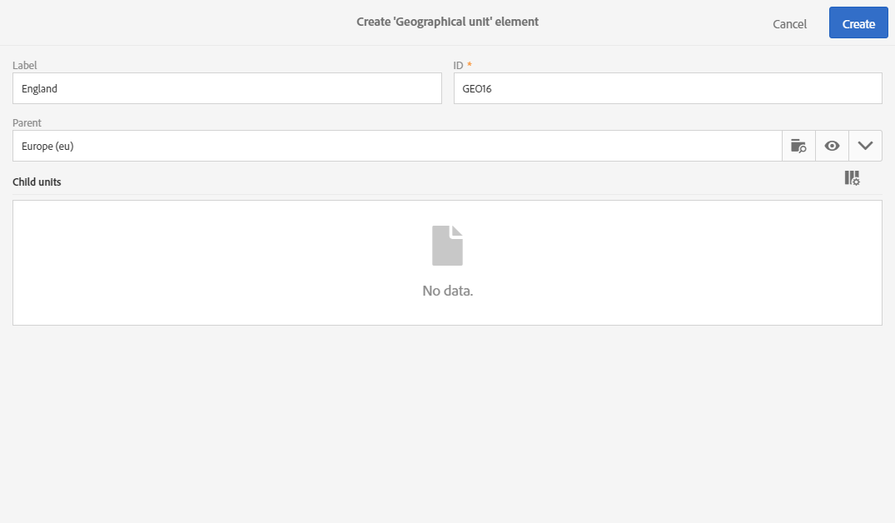
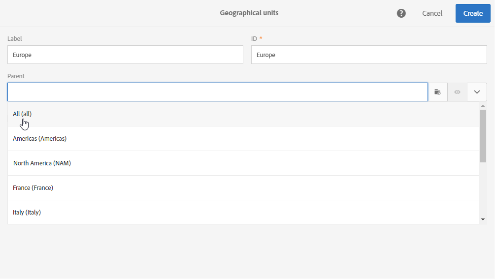
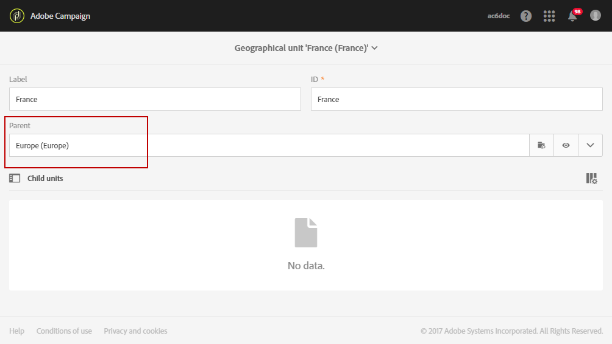
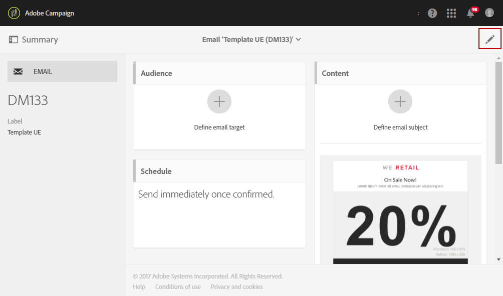
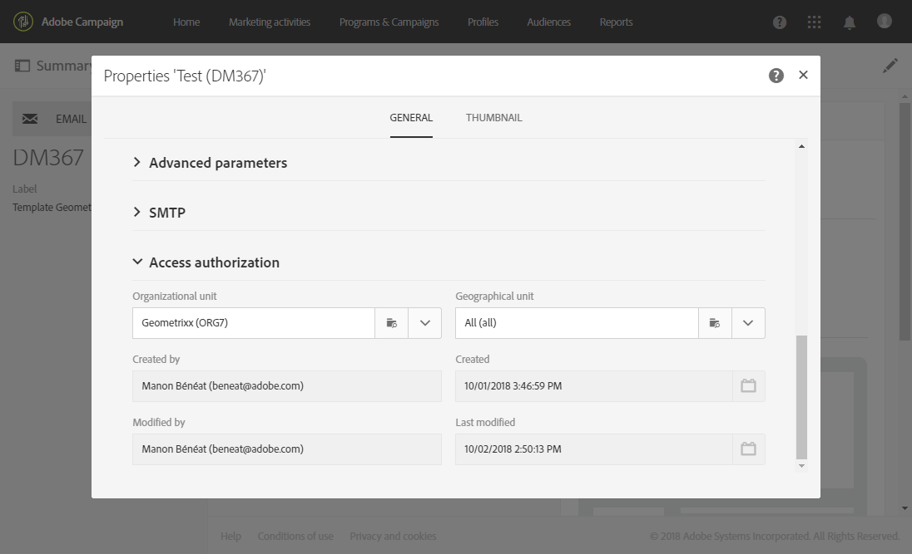
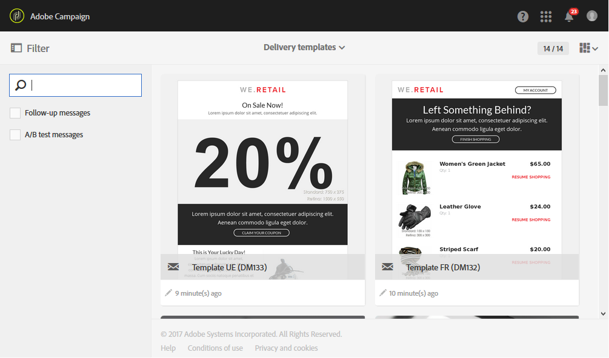
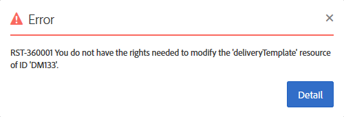
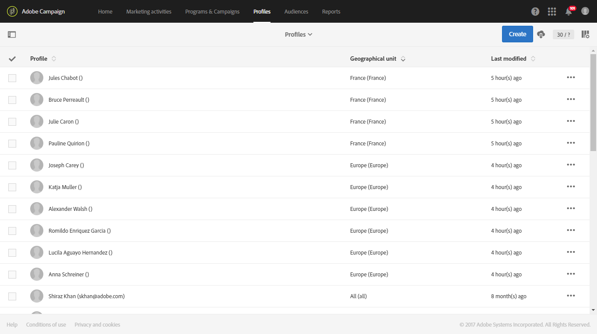
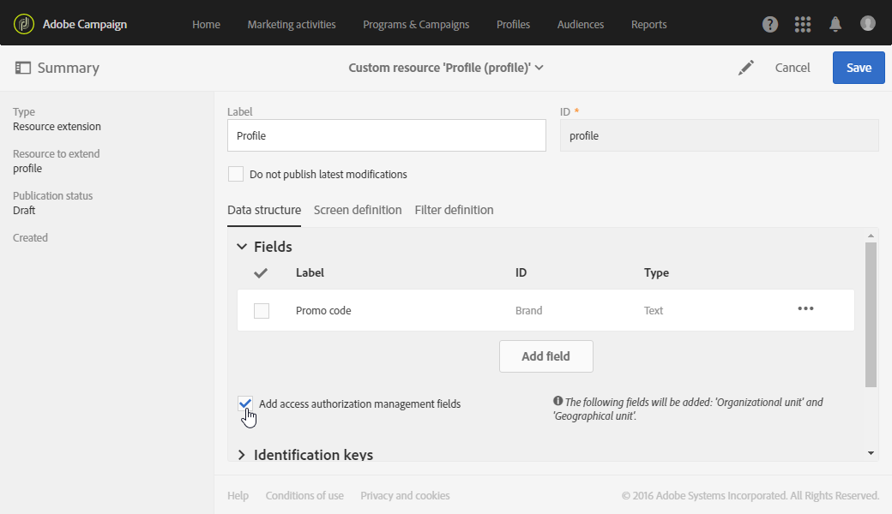
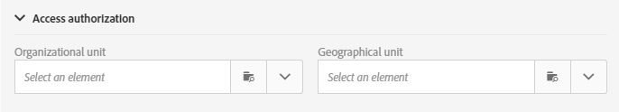

# Organizational units{#organizational-units}

## About units {#about-units}

Each object and user of the platform is linked to an organizational unit. This unit allows a hierarchical structure to be defined in order to give users a filtered view. A user's unit defines their access level for different platform objects.

>[!IMPORTANT]
>
>If a user is not linked to any unit, that user will not be able to connect to Adobe Campaign. If you would like to restrict access for a particular user or group of users, do not link it to the **[!UICONTROL All]** unit. We recommend adding the option **Access authorization management fields** before importing any profiles. For more on this, refer to this [section](../../administration/using/organizational-units.md#partitioning-profiles).
>
>By default, the **[!UICONTROL All (all)]** organizational unit is assigned to the **[!UICONTROL Administrators]** security group. It is read-only and cannot be modified.

A user has read-only access to all of the objects in the parent units. He has read and write access to all objects of his unit and child units. A user does not have access to objects in parallel branches.

By default, only the **[!UICONTROL All]** units are available.

When the user is assigned an organizational unit, this unit will always be applied to the objects the user created.

>[!NOTE]
>
>When a user is in several groups linked to different units, certain rules are applied. For more information, refer to the [Managing groups and users](../../administration/using/managing-groups-and-users.md) section.

## Creating and managing units {#creating-and-managing-units}

Organizational units allow you to filter your instance depending on the organization your users are linked to. This unit can represent a region, country or even a brand in your instance.

Here, we previously created security groups with different roles to two users: one user is assigned the security groups Administrators and Geometrixx, the other user belongs to the security groups Standard user and Geometrixx Clothes See [Creating a security group and assigning users](../../administration/using/managing-groups-and-users.md#creating-a-security-group-and-assigning-users) for the full example.

We now need to create the organizational units for the Geometrixx Clothes and Geometrixx security groups:

1. From Adobe campaign advanced menu, select **[!UICONTROL Administration]** > **[!UICONTROL Users & security]** > **[!UICONTROL Organizational units]**.
1. Click **[!UICONTROL Create]** to start configuring your organizational unit.

   

1. Change the default **[!UICONTROL Label]** and **[!UICONTROL ID]** to Geometrixx.
1. Then, link this unit to a parent unit. Here, we chose **[!UICONTROL All]**.

   

1. Finally, click **[!UICONTROL Create]** to start assigning your new organizational unit to security group.
1. Follow the same procedure for the Geometrixx Clothes unit, except that its parent unit has to be the previously created unit, Geometrixx.

   

To see the impact of assigning different units to different security group, the user assigned to the Administrator and Geometrixx groups will create two email templates to see what the other user assigned to Standard User and Geometrixx Clothes can or cannot access.

1. From the advanced menu, select **[!UICONTROL Resources]** > **[!UICONTROL Templates]** > **[!UICONTROL Delivery Templates]**.
1. Duplicate an existing template and personalize it as needed. For more on this, refer to the [About templates](../../start/using/marketing-activity-templates.md) section.
1. When the template is created, select the **[!UICONTROL Edit properties]** icon to assign units to your template.

   

1. In the **[!UICONTROL Access authorization]** drop down menu, select the organizational unit.

   Here we are going to create one template with the previously created organizational unit Geometrixx.

   

1. Follow the same procedures to create the second template assigned to the previously created Geometrixx Clothes organizational unit.

The user assigned to the Standard User and Geometrixx Clothes groups will be able to see both templates. Because of the hierarchical structure of the organizational units, he will have read and write access to the template linked to the Geometrixx Clothes unit and only read-only access to the template linked to the Geometrixx unit.

Since the Geometrixx Clothes unit is a child unit of Geometrixx, the following message appears when the user tries to modify the Geometrixx template: 

Organizational units can restrict the access to different features such as profiles. For example, if our Geometrixx Clothes user access the **[!UICONTROL Profiles]** tab, he will be able to fully access and modify the profiles with the Geometrixx Clothes organizational unit.

Whereas the profiles with the Geometrixx organizational unit will be read only, the following error will appear if our user tries to modify one profile: **[!UICONTROL You do not have the rights needed to modify the 'profile' resource of ID]**.

## Partitioning profiles {#partitioning-profiles}

>[!IMPORTANT]
>
>We recommend adding this option before importing any profiles since profiles with no organizational units cannot be accessed by users.
 If you have already imported your customer database, an update is necessary in order to set the organizational unit values on the already imported profiles.

If your organization needs to isolate the profiles contacted by each of your different brands, you can partition your profiles by their organizational units.

By default, the organizational unit fields are not available on your profiles and need to be added.

1. From the advanced menu, via the Adobe Campaign logo, select **Administration > Development > Custom resources**.
1. Select **Profile** or create a new custom resource to extend the profiles. For more information on how to extend the profiles, refer to this [page](../../developing/using/extending-the-profile-resource-with-a-new-field.md#step-1--extend-the-profile-resource).
1. Check the **Add access authorization management fields** box to add the organizational units in the **Profile** extension.

   

1. Click **[!UICONTROL Save]**.
1. Update the structure by re-publishing the custom resources. For more information about the publication process, refer to [Updating the structure](../../developing/using/updating-the-database-structure.md) section.

The organizational unit field is added to your profiles in the **[!UICONTROL Access authorization]** section.

**Related topics**:

* [About units](../../administration/using/organizational-units.md#about-units)
* [About access management](../../administration/using/about-access-management.md)

