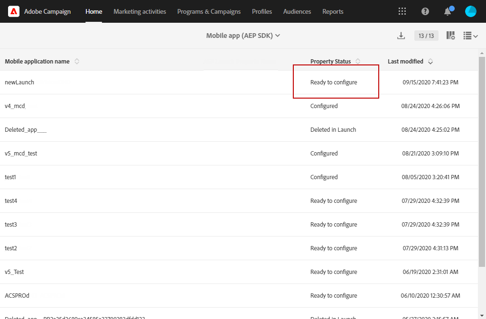

# How to migrate your mobile application from SDK v4 to Adobe Experience Platform SDK {#sdkv4-migration}

>[!IMPORTANT]
>
> The migration process is irreversible.
>
> Please read the document carefully before starting the migration of your SDK V4 mobile application to Adobe Experience Platform SDK.

## About the SDK V4 migration

Adobe Campaign Standard processes mobile applications using SDK V4 as separate applications from those using Adobe Experience Platform SDK.
After upgrading the Adobe SDK version from v4 to Adobe Experience Platform, mobile applications need to continue using existing application subscriber data and campaigns: a migration is therefore needed.

>[!NOTE]
>
> This page documents the migration of a SDK v4 mobile application to a newly created Adobe Experience Platform SDK application. Your SDK v4 mobile applications will not be merged with an Adobe Experience Platform SDK mobile application with a **[!UICONTROL Configured]** **[!UICONTROL Property status]**.

| What will not change after the migration |
|:-:|
| There will be no effect on existing deliveries and campaigns using the migrated SDK V4 application.  |
| The name of the mobile application will remain same. |
| The platform credentials for iOS and Android will be retained.  |
| All the subscribers of the application and their data will be retained. |
| The existing SDK v4 mobile application will continue to send data (PII data, Subscriber & token information) to Adobe Campaign Standard.  |
| The **[!UICONTROL Organizational unit]** of the mobile application will remain same. |

| What will change after the migration |
|:-:|
| The mobile application will be available in **[!UICONTROL Administration]** > **[!UICONTROL Channels]** > **[!UICONTROL Mobile app (Adobe Experience Platform SDK)]**. Before migration, it was available in **[!UICONTROL Administration]** > **[!UICONTROL Channels]** > **[!UICONTROL Mobile app (SDK V4)]**.  |
| The **[!UICONTROL Collect PII Endpoint]** of the application will change. The older **[!UICONTROL Collect PII Endpoint]** will continue to work, sent data will not be lost. |
| The application will be tied to an Adobe Experience Platform Launch **[!UICONTROL Mobile Property]**. It will be processed as a newly created mobile application.  |
| The original Adobe Experience Platform SDK application used in the migration will not exist as a separate application. Only the migrated SDK v4 application will be available. |

## Migrate your mobile application from SDK v4 to Adobe Experience Platform SDK {#how-to-migrate}

Before migrating, you should take into account the following recommendations:

* The migration process is irreversible.
* You should not run migration of multiple application at the same time. You should also make sure the migration of a same application is not triggered by multiple windows at the same time.
* Before migration make sure that you are assigned the **[!UICONTROL Organizational unit]** of the mobile application you want to migrate and of the Adobe Experience Platform application you are using for migration.
* After migration, the application will become an Adobe Experience Platform SDK application. Its changes will be linked to its corresponding Launch **[!UICONTROL Mobile Property]**.

1. Create a new **[!UICONTROL Mobile property]** in the Adobe Experience Platform Launch. For more information on this, refer to [Adobe Experience Platform Launch documentation](https://aep-sdks.gitbook.io/docs/getting-started/create-a-mobile-property#create-a-mobile-property).

1. In Adobe Campaign Standard, from the advanced menu, select **[!UICONTROL Administration]** > **[!UICONTROL Application Settings]** > **[!UICONTROL Workflows]** and open the **[!UICONTROL syncWithLaunch]** workflow. Check if the workflow has ended without error.

1. After workflow completion, from the **[!UICONTROL Administration]** > **[!UICONTROL Channels]** > **[!UICONTROL Mobile app (Adobe Experience Platform SDK)]** menu, check if the mobile application is available in Adobe Campaign Standard and is in **[!UICONTROL Ready to Configure]** state.

    

1. In **[!UICONTROL Administration]** > **[!UICONTROL Channels]** > **[!UICONTROL Mobile app (SDK V4)]**, select the SDK V4 application you want to migrate.

1. Select the **[!UICONTROL Mobile application migration to AEP SDK]** tab.

    

1. From the **[!UICONTROL Select AEP SDK mobile application to merge current application with]** drop-down, select the Adobe Experience Platform SDK mobile application previously created.

1. Click **[!UICONTROL Migrate]**.

    

1. From the **[!UICONTROL Migration application]** window, click **[!UICONTROL Ok]**.

    

1. The successful completion window appears, click **[!UICONTROL Go to Adobe Experience Platform SDK Channel list]**.

1. From the Adobe Experience Platform SDK channel list page, check that your previous V4 mobile application is set to **[!UICONTROL Ready To Configure]**.

1. Select your mobile application and click **[!UICONTROL Save]** to complete the migration.

After this migration, subscribers collected by the V4 version of the mobile application and new subscribers collected by the AEP version of the mobile application will be available in the migrated application.

To distinguish the two different types of subscribers, you can add a new custom field of **[!UICONTROL Text]** type when extending the custom resource **[!UICONTROL Subscriptions to an application (appSubscriptionRcp)]** as `sdkversion` or `appVersion` for example. For more information on how to extend a custom resource, refer to this [page](../../developing/using/creating-or-extending-the-resource.md).
You will then need to configure the associated Launch **[!UICONTROL Mobile property]** to send this custom field value in the Collect PII call and change your mobile application configuration accordingly.

## FAQ {#faq}

### Q: In the SDK v4 mobile application, the Mobile application migration to Adobe Experience Platform SDK tab is not visible. {#tab-not-visible}

A: From the advanced menu **[!UICONTROL Administration]** > **[!UICONTROL Application Settings]** > **[!UICONTROL Options]**, check the value of the **[!UICONTROL Enable migration of mobile app from SDK v4 to Adobe Experience Platform SDK option]** option. It should be set to 1 and enabled by default. Administrator may have disabled it manually.

### Q: From the Mobile application migration to Adobe Experience Platform SDK tab, the message No data appears. {#no-data}

A: Only eligible application of your **[!UICONTROL Organizational unit]** is shown in the list. Please make sure you have the correct Adobe Experience Platform application for the migration. The **[!UICONTROL Property Status]** of your Adobe Experience Platform application should be set to **[!UICONTROL Ready to Configure]**  and the **[!UICONTROL Mobile app migration status]** set to **[!UICONTROL Not Migrated]**.

### Q: Why can't the Adobe Experience Platform SDK application with the Configured Property Status be used for migration? {#property-status}

A: Migration process retains the SDK v4 subscribers and attributes. It only keeps the Launch related information from Adobe Experience Platform SDK application. Subscribers and other data from the Adobe Experience Platform SDK application will be lost. To avoid any data loss, only Adobe Experience Platform SDK applications with the **[!UICONTROL Ready to Configure]** **[!UICONTROL Property Status]** are eligible for migration.

### Q: After the migration, where can I found my previous SDK v4 mobile application? {#v4-app-not-visible}

A: The mobile application after migration will be visible from the advanced menu **[!UICONTROL Administration]** > **[!UICONTROL Channels]** > **[!UICONTROL Mobile app (Adobe Experience Platform SDK)]**.

### Q: After the migration, where can I found my newly created Adobe Experience Platform SDK application? {#aep-not-visible}

A: The newly created Adobe Experience Platform SDK application used for the migration will not exist as a separate application. Only the migrated SDK v4 application will be available.

### Q: If the SDK v4 mobile application Organizational unit is set to A (a child of the Organizational unit ALL) and the Adobe Experience Platform SDK is set to ALL. How can I migrate my mobile application? {#v4-org-unit}

A: Administrators of the **[!UICONTROL Organizational unit]** ALL will have the rights to manage both mobile applications and will be in charge of the migration.

### Q: If the SDK v4 mobile application Organizational unit is set to A and the Adobe Experience Platform SDK application is set to B (a sibling of the Organizational unit A). How can I migrate my mobile application? {#aep-org-unit}

A: Adobe Experience Platform SDK application being the asset of a sibling **[!UICONTROL Organizational unit]**, the mobile application will not be visible to users of the **[!UICONTROL Organizational unit]** A. The mobile application will be available to the Administrators of the **[!UICONTROL Organizational unit]** ALL but we do not recommend these administrators to migrate the mobile application.
In this case, you should move your mobile applications in the same **[!UICONTROL Organizational unit]** or in an **[!UICONTROL Organizational unit]** with a parent link.
For more information on **[!UICONTROL Organizational unit]**, please refer to this [section](../../administration/using/organizational-units.md).

### Q: From your Adobe Experience Platform SDK mobile application (migrated from your v4 mobile application) page, under the Push channel settings drop-down, no information such as uploaded date/name is displayed for the Android key or iOS certificate {#no-information-v5}

A: The system does not store this information when the SDK V4 mobile application is created. When migrating your SDK V4 mobile application to an Adobe Experience Platform SDK mobile application, your migrated mobile application will not have this kind of information either. As soon as a user will upload a new iOS certificate or Android key, the different details of the key or certificate will be stored and displayed correctly under the **[!UICONTROL Push channel settings]** drop-down.
