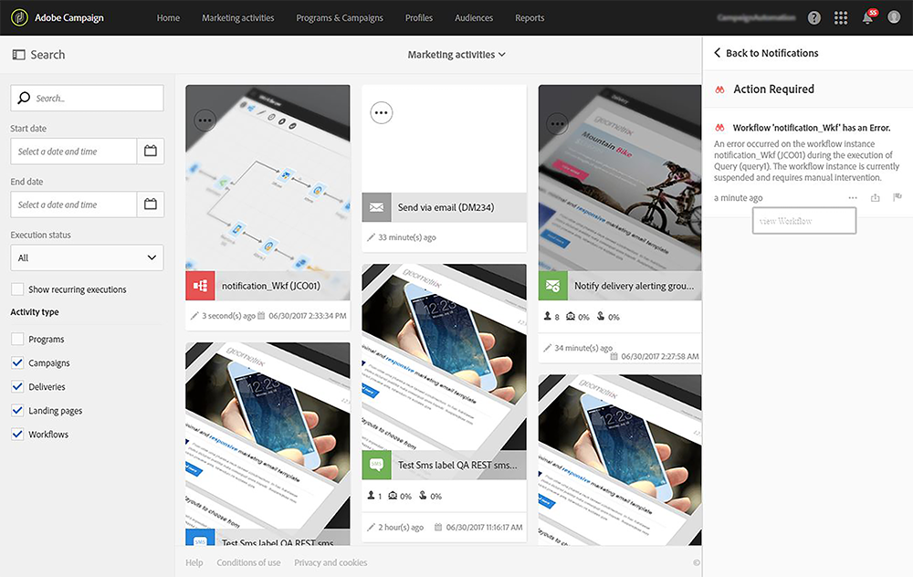
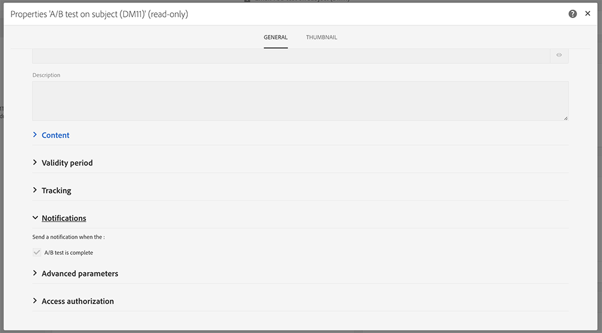
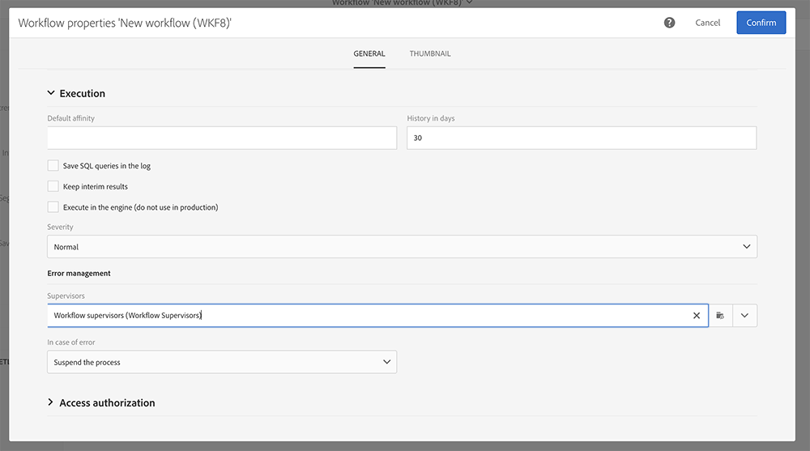

# Sending internal notifications{#sending-internal-notifications}

Adobe Campaign gives you the possibility to receive notifications regarding important system activities directly within the application. Real-time notifications keep relevant stakeholders informed and provide users with the ability to immediately and directly act on activity notifications from within the application. The result for teams is advanced agility, efficiency and smoother execution of campaigns.

You can configure notifications for the following objects:

* **[!UICONTROL A/B Test emails]**: the email creator and modifier(s) are notified that a variant has been chosen (automatic mode) or that a variant needs to be chosen (manual mode). Clicking on the notification displays the corresponding email. Notifications are activated by default in the out-of-the-box A/B Test template. If you want to deactivate them, edit the properties of the email or the email template and uncheck the box located under **General > Notifications**. For more information on A/B Test emails, refer to [Creating an AB Test](../../channels/using/designing-an-a-b-test-email.md). For more on email properties, refer to [List of email properties](../../administration/using/configuring-email-channel.md#list-of-email-properties).

  

* **[!UICONTROL Workflows]**: each member of the selected security group are notified (email and in-app notification) whenever a workflow is in error. Clicking on the notification or on the email link displays the corresponding workflow. Notifications are deactivated by default in the out-of-the-box workflow template. If you want to activate them, edit the properties of the workflow or workflow template and add a security group under **General > Execution > Error management > Supervisors**. For more information on security groups, refer to [Managing groups and users](../../administration/using/managing-groups-and-users.md). For more on workflow properties, refer to [Workflow properties](../../automating/using/managing-execution-properties.md).

  
