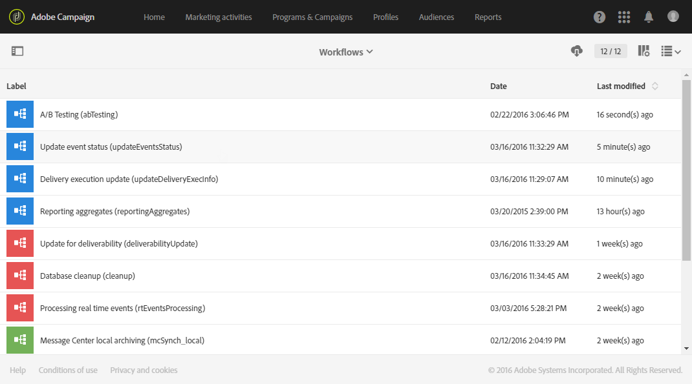

# Technical workflows{#technical-workflows}

Technical workflows are delivered out-of-the-box with Adobe Campaign. Technical workflows are operations or jobs scheduled to be executed on a regular basis on the server.

They allow you to carry out maintenance operations on the database, leverage the tracking information in the deliveries, and update the provisional jobs on the deliveries.

Functional administrators can access technical workflows under the **[!UICONTROL Administration > Application settings > Workflows]** menu.

>[!NOTE]
>
>As a functional administrator, you can restart or pause technical workflows, and modify their properties and structure.

## List of technical workflows {#list-of-technical-workflows}

Technical workflows are used to handle self-triggered background and technical processes in Adobe Campaign.

<table> 
 <tbody> 
  <tr> 
   <td> <strong>Label</strong>  </td> 
   <td> <strong>ID</strong>  </td> 
   <td> <strong>Description</strong>  </td> 
  </tr> 
  <tr> 
   <td> A/B Testing   </td> 
   <td> abTesting   </td> 
   <td> This workflow analyzes the tracking logs of each variant. At the end of the A/B testing period, it automatically calculates the winning variant. By default, it is started every day.  </td> 
  </tr> 
  <tr> 
   <td> Billing   </td> 
   <td> billing   </td> 
   <td> This workflow sends the system activity report to the 'billing' user by email. By default, it is automatically started every day at 1am.  </td> 
  </tr> 
  <tr> 
   <td> Database cleanup   </td> 
   <td> cleanup   </td> 
   <td> This workflow is the database maintenance workflow: it runs different statistics and processes, and deletes obsolete data from the database according to the configuration that has been defined. By default, it is automatically started every day 4am.  </td> 
  </tr> 
  <tr> 
   <td> Forecasting   </td> 
   <td> forecasting   </td> 
   <td> This workflow executes the analysis of the deliveries stored in the provisional forecasting (creation of the provisional logs). By default, it is started every day at 1am.   </td> 
  </tr> 
  <tr> 
   <td> Import a shared audience   </td> 
   <td> importSharedAudience   </td> 
   <td> This workflow synchronizes the Adobe Experience Cloud audience data imported in Adobe Campaign. By default, it is started every hour.  </td> 
  </tr> 
  <tr> 
   <td> Instant Report Sharing   </td> 
   <td> reportSendingNow   </td> 
   <td> This workflow is started as soon as a report is scheduled to be sent. It converts your report into a pdf file then sends it in an email to the targeted recipients.  </td> 
  </tr> 
  <tr> 
   <td> KPIs reconciliation with Adobe Analytics   </td> 
   <td> kpiReconciliation   </td> 
   <td> This workflow fetches the KPIs from Reporting service once a day and reconciles them with the data from Adobe Analytics. It then pushes the difference if needed. By default, it is started every day at 4.20am.  </td> 
  </tr> 
  <tr> 
   <td> Managing NMAC opt-outs   </td> 
   <td> mobileAppOptOutMgt   </td> 
   <td> This workflow updates unsubscriptions to notifications on mobile devices. By default, it is started every 6 hours between 1am and midnight.  </td> 
  </tr> 
  <tr> 
   <td> Message Center local archiving   </td> 
   <td> mcSynch_local   </td> 
   <td> This workflow archives real-time events into a historical table. By default, it is started every hour.  </td> 
  </tr> 
  <tr> 
   <td> Reporting aggregates   </td> 
   <td> reportingAggregates   </td> 
   <td> This workflow updates the aggregates used in the reports. By default, it is automatically started at 2am.  </td> 
  </tr> 
  <tr> 
   <td> Share KPIs with Adobe Analytics   </td> 
   <td> kpiSharing   </td> 
   <td> This workflow pushes KPI data every 15 minutes from Adobe Campaign Standard to Adobe Analytics.  </td> 
  </tr> 
    </tr> 
   <tr> 
   <td> Sync with Launch   </td> 
   <td> SyncWithLaunch   </td> 
   <td> This workflow synchronizes the Adobe Launch mobile properties imported in Adobe Campaign Standard. It is started every 15 minutes.  </td> 
  </tr>
  <tr> 
   <td> Update delivery execution   </td> 
   <td> updateDeliveryExecInfo   </td> 
   <td> This workflow updates the delivery's tracking. By default, it is started every 10 minutes.  </td> 
  </tr> 
  <tr> 
   <td> Update delivery indicators   </td> 
   <td> updateDeliveryIndicators   </td> 
   <td> This workflow updates the delivery's KPIs (Key Performance Indicator). By default, it is started every hour.  </td> 
  </tr> 
  <tr> 
   <td> Update event status   </td> 
   <td> updateEventsStatus   </td> 
   <td> This workflow allows you to attribute a status to an event. The following event statuses are available:  <strong>Pending</strong>: The event is in a queue. No message template has been assigned to it yet.  Pending delivery : The event is in the queue, a message template has been assigned to it and it is being processed by the delivery.  <strong>Sent</strong>: This status is copied from the delivery logs. It means that the delivery was sent.  <strong>Ignored by the delivery</strong>: This status is copied from the delivery logs. It means that the delivery was ignored.  <strong>Delivery failed</strong>: This status is copied from the delivery logs. It means that the delivery failed.  Event not taken into account : The event could not be linked to a message template. The event will not be processed.  </td> 
  </tr> 
  <tr> 
   <td> Update for deliverability   </td> 
   <td> deliverabilityUpdate   </td> 
   <td> This workflow allows you to create the list of bounce rule qualification rules, as well as the list of domains and MX in the platform. This workflow only functions if the HTTPS is open. By default, it is automatically started at 2am.  </td> 
  </tr> 
 </tbody> 
</table>

