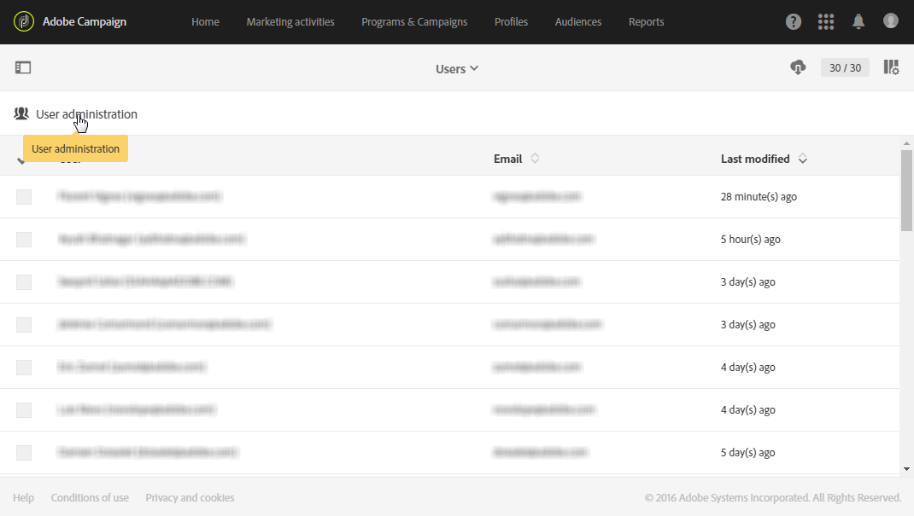
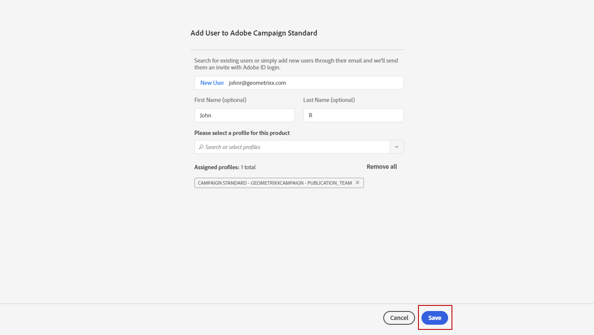
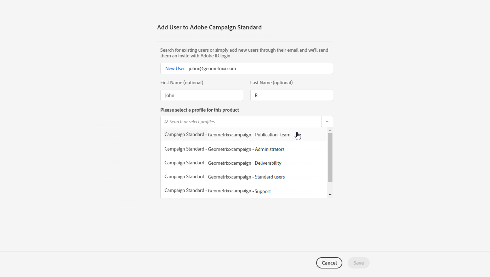
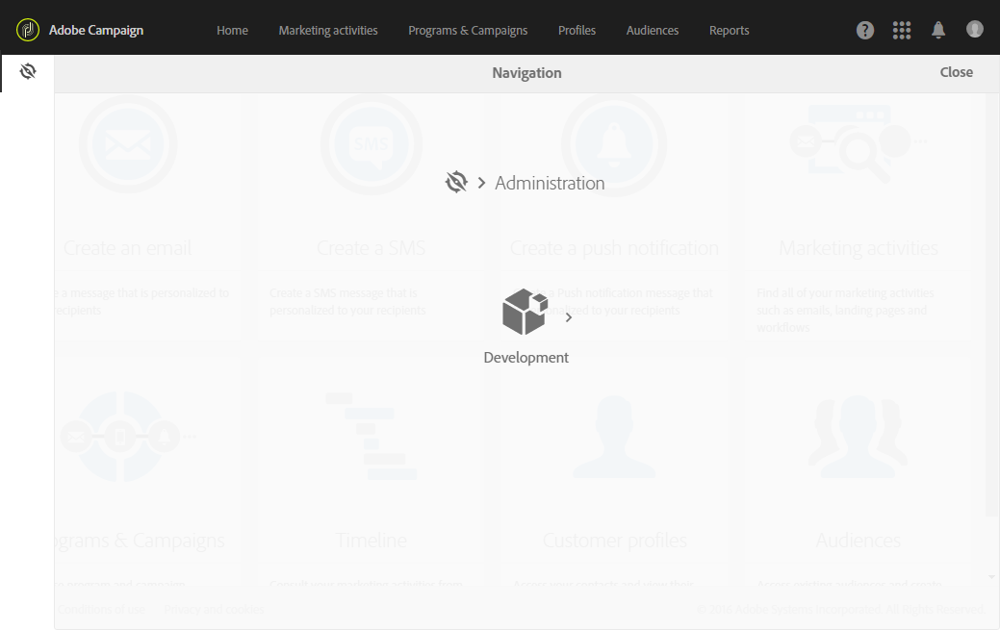
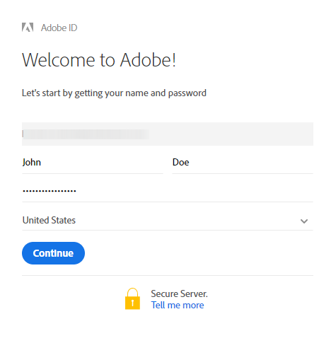
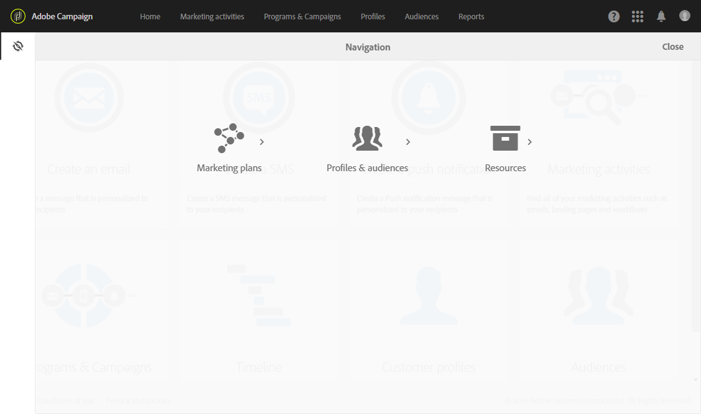

# Users management{#users-management}

## About users {#about-users}

Adobe Campaign allows you to assign a set of roles to your users to define which part of the interface they can access.

The specific roles and the corresponding authorizations are detailed in the following sections: [understanding roles](../../administration/using/list-of-roles.md) and [authorizations](https://docs.campaign.adobe.com/doc/standard/en/Technotes/AdobeCampaign-ACSRights.pdf).

Administrators can manage users from the Admin console. Users are then automatically synchronized with Adobe Campaign. For more on this, refer to the [Admin console](https://helpx.adobe.com/enterprise/using/users.html) documentation.

To view the users in Adobe Campaign, click the **[!UICONTROL Adobe Campaign]** logo, in the top left corner, then select **[!UICONTROL Administration > Users & Security > Users]**.

To access the user management interface from Adobe Campaign, click **[!UICONTROL User administration]**.

**Related topics:**

* [Managing user permissions](https://docs.adobe.com/content/help/en/campaign-learn/campaign-standard-tutorials/getting-started/access-management.html) video
* [List of roles](../../administration/using/list-of-roles.md)
* [List of authorizations](https://docs.campaign.adobe.com/doc/standard/en/Technotes/AdobeCampaign-ACSRights.pdf)

## Type of users {#type-of-users}

This user segmentation is not mandatory, it is only a representation of the most common usage of Adobe Campaign.

This section will help you understand the main types of Adobe Campaign users. Here, we will not go into all the specific roles that a user can hold (start deliveries, export, prepare deliveries, etc.). For more information on roles, refer to [List of roles](../../administration/using/list-of-roles.md) and [Managing groups and users](../../administration/using/managing-groups-and-users.md) pages.

We will rather focus on how the different tasks in Adobe Campaign are split between three main user types:

* [Functional administrators](#functional-administrators): among all your organization's users, they are the most technical.
* [Advanced users](#advanced-users): they setup all the elements that marketers need to send and monitor their deliveries. 
* [Basic users](#basic-users): they are the marketers who personalize, deliver and monitor their campaigns.

>[!NOTE]
>
>Functional administrators are different from the Adobe technical administrators. Adobe technical administrators hold an Adobe internal role which no customer can use. They manage the instance provisioning, hosting, infrastructure monitoring and supervision, technical troubleshooting.

### Functional administrators {#functional-administrators}

Functional administrators are users who can access the most technical parts of the interface. They hold the **[!UICONTROL Administration]** role and make sure that the platform is all set up so that marketers only have to focus on delivering their campaigns.

>[!CAUTION]
>
>Only Functional administrators, with **[!UICONTROL Administration]** role and access to **All** units can access sending logs, message logs, tracking logs, exclusion logs, proposition logs and subscription logs. A non-admin user can target these logs but starting on a linked table (profiles, delivery).

Functional administrators are the only users who can access the **[!UICONTROL Administration]** menu, in the Adobe Campaign interface. Since these users need to access technical resources, more advanced roles should be assigned to them, such as the **[!UICONTROL Administration]** and **[!UICONTROL Datamodel]** out-of-the-box roles. These roles are combined in the **[!UICONTROL Administrators]** out-of-the-box security group. For more on this, refer to this [section](../../administration/using/list-of-roles.md).

Here are the main tasks they can perform:

* [Manage users and permissions](../../administration/using/about-access-management.md): manage the access to the platform (users, roles, security groups, units).
* [Configure the different channels](../../administration/using/about-channel-configuration.md): set up the different platform channels as well as typology and quarantine management.
* [Configure the general application settings](../../administration/using/external-accounts.md): configure the different application elements (external accounts, options, technical workflows).
* [Develop new features to enhance out-of-the-box functionalities](../../developing/using/data-model-concepts.md): manage your custom resources and access diagnostic tools.
* [Set up the instance parameters](../../administration/using/branding.md): define your different brands and configure their settings (logo, manage tracking, URL domain to access the landing pages, etc.).
* [Export and import data packages](../../automating/using/managing-packages.md): exchange resources between different Adobe Campaign instances through structured XML files.
* [Export logs](../../automating/using/exporting-logs.md) and [define import templates](../../automating/using/importing-data-with-import-templates.md#setting-up-import-templates).

### Advanced users {#advanced-users}

Advanced users are marketing users who perform the most technical use cases in Adobe Campaign. They preconfigure all the elements that marketers use to send and monitor their deliveries.

This type of user requires more general roles than functional administrators but should still be able to perform some technical operations. To do so, they should be assigned, for example, the **[!UICONTROL Export]**, **[!UICONTROL Generic import]** or **[!UICONTROL Workflow]** out-of-the-box roles. For more on this, refer to this [section](../../administration/using/list-of-roles.md).

Here are the main tasks they can perform:

* [Create and execute complex data management workflows](../../automating/using/about-data-management-activities.md): import, enrich and transform data to feed your database, or export the data you need in external files to process it in your own tools.
* [Manage templates](../../start/using/marketing-activity-templates.md): manage your templates to pre-configure certain parameters of your marketing activities according to your needs.
* [Create queries](../../automating/using/editing-queries.md#about-query-editor) and [manage your audiences](../../audiences/using/about-audiences.md): create your audiences manually using queries or automatically using dedicated workflows.
* [Perform advanced expression editing](../../automating/using/editing-queries.md#about-query-editor): use advanced functions to manipulate the values used to carry out specific queries such as dates, strings, numerical fields, sorting, etc.
* [Export lists](../../automating/using/exporting-lists.md) and [import data using existing import templates](../../automating/using/importing-data-with-import-templates.md).

### Basic users {#basic-users}

Thanks to the functional administrator and advanced users, marketers can personalize, deliver and monitor their campaigns without having to worry about the technical configuration. To do so, they should be assigned, for example, the **[!UICONTROL Prepare deliveries]**, **[!UICONTROL Workflow]** and **[!UICONTROL Start deliveries]** out-of-the-box roles. These roles are combined in the **[!UICONTROL Standard Users]** out-of-the-box security group. For more on this, refer to this [section](../../administration/using/list-of-roles.md).

Here are the main tasks they can perform:

* [Manage programs and campaigns](../../start/using/programs-and-campaigns.md): create marketing campaigns including different types of activities (emails, SMS messages, push notifications, workflows, landing pages).
* Manage [profiles](../../audiences/using/about-profiles.md) and [test profiles](../../audiences/using/managing-test-profiles.md): manage the identified and test recipients that will be targeted by your deliveries. Add information such as first name, last name, contact information, subscriptions, emails, etc.
* [Create and send messages](../../sending/using/confirming-the-send.md): create your message, select the audience, define the message content and its personalization elements, send proofs and send the final message to your audience.
* [Create and publish landing pages](../../channels/using/getting-started-with-landing-pages.md): create and manage a set of services that you wish to offer your clients, for example subscription or unsubscription forms.
* [Create and execute campaign workflows](../../automating/using/building-a-workflow.md): automate your campaign processes using workflows.
* Monitor your marketing activities through the [available reports](../../reporting/using/defining-the-report-period.md).

## Creating a user {#creating-a-user}

To add a user to your instance, you must first create it in the Admin console before managing it in Adobe Campaign Standard.

1. From the advanced menu, select **[!UICONTROL Administration > Users & Security > Users]** and click **[!UICONTROL User administration]** to access the admin console.

    

1. In the **[!UICONTROL Admin Console]**, click on the **[!UICONTROL Users]** tab.

1. Click **[!UICONTROL Add User]**.

    

1. From the **[!UICONTROL User details]** tab, fill in the user's details such as email address, name and surname.

    

1. From the **[!UICONTROL Assign products]** tab, assign one or multiple security group to your user. For more information on security groups, refer to this [page](../../administration/using/managing-groups-and-users.md).

    Click **[!UICONTROL Save]** when done configuring.

    

Your user is now created and should receive an email redirecting to the following window where the user has to set a password then accept the term of use agreement. This user will then be able to connect to your Adobe Campaign Standard instance.

Your user will be synced to Adobe Campaign Standard as soon as he signs in to your instance.

You can then check if your user has been correctly synced to Adobe Campaign:

1. From the advanced menu **[!UICONTROL Administration > Users & Security > Users]** select your previously created user.

1. Update the **[!UICONTROL Mobile]**, **[!UICONTROL Time zone]** or **[!UICONTROL Regional settings]** if needed.

1. Check your user's security group. Here, you can see that the user has been assigned the **[!UICONTROL Administrators]** security group.

    >[!NOTE]
    >
    >Security groups can only be removed or added to a user in the Admin Console.

    

1. Check **[!UICONTROL Account disabled]** if you want to deactivate this user.

1. In the **[!UICONTROL Authorized connection zone]** field, select through which way your user will connect to this instance, e.g. internal network or VPN.

1. Click **[!UICONTROL Save]**.

Your user is now ready to use Adobe Campaign Standard.
