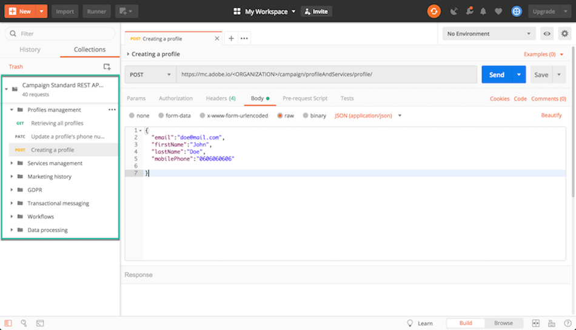

# Why using Campaign Standard APIs {#why-using-campaign-standard-apis}

Adobe Campaign Standard provides APIs which allow existing systems to integrate with the ACS platform to solve real-world problems in real-time.

Public websites like the sign-up or opt-out page need to connect to backend systems to store profile information. Backend systems like Adobe Campaign have the flexibility and power to ingest profile data into and to perform custom operations on it.

Here are some examples:

* Prospects online registration.
* Existing customer profile and marketing communication preference management.
* Event based transactional communication triggering – order confirmation, booking Itinerary, password reset, etc.
* Even cart abandonment email communication.

Sign up landing pages provide a way for customers or prospects to register their name and email address. Once ACS captures the profile information and preferences, Campaign Standard can send personalized messages based on the person’s interests. They are built with the elements below:

1. A registration form with campaign API listeners.

    

1. Custom actions to be taken based on checkboxes. A customer selecting “Email Special Offers” would be sent a different custom mail with a gift coupon compared to normal registration process.

    

1. A profile may change their details after clicking the “Update Details” link in the email. This brings the profile to the “Update your Profile and Preference Details” page. To perform the operation, the profile details (Pkey) are passed to the Campaign server and the profile is retrieved and represented. Once the profile clicks the “Update” button, the information is updated into the system (via a PATCH command).

    

## Use cases

Below are examples of operations you can carry out using Campaign Standard APIs. Each use case is detailed in this documentation through a step-by-step process.

**Profiles**

* Retrieving all profiles
  [Details](#retrieving-profiles)
* Updating the phone field of a profile with a specific email address
  [Details](#updating-profiles)
* Creating a profile
  [Details](#creating-profiles)

**Subscriptions**

* Retrieve the profiles that subscribes a specific service
  [Details](#retrieving-subscriptions)
* Subscription a profile to a service
  [Details](#performing-subscriptions)
* Deleting a profile subscription from a service
  [Details](#deleting-subscriptions)

**Marketing history**

* Retrieving the mirror page for a delivery that was sent to a profile
  [Details](#interacting-with-marketing-history)

**Privacy**

* Creating a privacy request
  [Details](#creating-a-privacy-request)
* Monitoring a privacy request
  [Details](#monitoring-a-privacy-request)
* Retrieving the file containing privacy data
  [Details](#retrieve-a-privacy-data-file)
* Managing CCPA opt-out
  [Details](#managing-ccpa-opt-out)

**Transactional messaging**

* Sending a transactional event
  [Details](#sending-a-transactional-event)

**Workflows**

* Controlling a workflow
  [Details](#controlling-a-workflow)
* Triggering a Signal activity and passing data to a workflow
  [Details](#triggering-a-signal-activity)

## Ready-to-use Postman collection

A collection of requests is available to help you familiarize yourself with Campaign Standard APIs requests. This collection in JSON format provides pre-designed API requests representing common use cases.

The steps below describe a step-by-step use case to import and use the collection to create a profile in Campaign Standard database.

>[!NOTE]
>
>Our example uses Postman. However, feel free to use your favorite REST client.

1. Download the JSON collection by clicking [here](https://helpx.adobe.com/content/dam/help/en/campaign/kb/working-with-acs-api/_jcr_content/main-pars/download_section/download-1/KB_postman_collection.json.zip).

1. Open Postman, then select the **File** / **Import** menu.

1. Drag and drop the downloaded file into the window. Pre-designed API requests display, ready to be used.

    

1. Select the **Creating a profile** request, then update the POST request and the **Headers** tab with your own information (&lt;ORGANIZATION&gt;, &lt;API_KEY&gt;, &lt;ACCESS_TOKEN&gt;). For more on this, refer to [this section](#api-identifiers).

    

1. Fill in the **Body** tab with the information you want to add to the new profile, then click the **Send** button to execute the request.

    

1. Once an object created, a primary key (PKey) is associated to it. It is visible in the resquest response, as well as other attributes.

    

1. Open your Campaign Standard instance, then check that the profile is created, with all the information from the payload.

    
