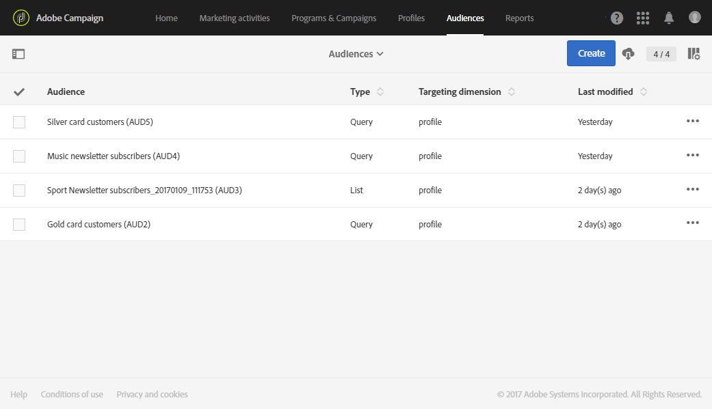

# About audiences{#about-audiences}

About audiences

An audience is a list of profiles based on rules and attributes.

Adobe Campaign allows you to create your audiences manually using queries or automatically using dedicated workflows. You can also use shared audiences from the Adobe Experience Cloud. All of the audiences are regrouped into a list that can be accessed via the **Audiences** card on the Adobe Campaign home page or from the **Audiences** link.

You can manipulate different audience types in Adobe Campaign. The type of an audience corresponds to the way in which it was created:

* **Query**: indicates that the audience was created from a [query](../../automating/using/editing-queries.md#about-query-editor) on data from the Adobe Campaign database from the list of audiences. Audiences defined by a query are recomputed at each further use.
* **List**: indicates that the audience is a fixed list of profiles. These lists are created in a [workflow](../../automating/using/discovering-workflows.md), where the data dimension is known when saving the audience. For example, after targeting activities (especially **Query**) or after the reconciliation of data imported from a file.
* **File**: indicates that the audience has been created directly from a [file import](../../automating/using/load-file.md) workflow and that the data dimension was unknown when saving the audience.
* **Experience Cloud**: indicates that the audience was imported from the Adobe Experience Cloud. This option is only available if the audience sharing functionality has been configured. For more information, see [Importing an audience from the Adobe Experience Cloud](../../integrating/using/sharing-audiences-with-audience-manager-or-people-core-service.md#importing-an-audience).

