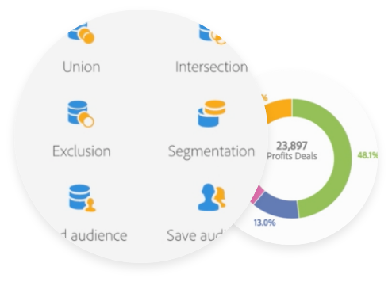

# Get started with profiles and audiences{#about-profiles-and-audiences}

Campaign integrated customer profiles allows you to track every interaction with customers across all channels within one single view, allowing you to deliver relevant and personalized messages to your customers.
Segment your database into audiences to optimize the target of your marketing campaigns.

Manage customers permission and consent using services and landing pages to set up easy opt-in and opt-out mechanisms.

<table>
<tr><td><a href="#segmenting-targeting"> Segmenting and targeting</a></td><td><a href="#permission"> Permission and consent</a></td><td><a href="#privacy"> Privacy compliance</a></td></tr>
</table>

## Segmenting and targeting {#segmenting-targeting}

When you create campaigns or messages, you can specify the target of the deliveries by selecting from contacts in Campaign database, using simple or advanced criteria, or selecting audiences.

Identify customers more effectively across all your channels using integrated customer profiles and customized segments. When you know your customers, interests, demographics, and channel preferences, it’s easier to create personalized experiences that get noticed.

Adobe Campaign builds rich customer profiles in real time, allowing you to deliver more relevant and personalized offers as your customer’s preferences change. In addition, Adobe Campaign integrates advanced analysis, data management and targeting functionalities to build audiences.

**Profiles** are individual contacts stored in the database. Each profile corresponds to one entry in the database which contains the necessary information for that profile to be targeted, qualified and individually tracked: Adobe Campaign can track every interaction from both online and offline channels and merge it into a single profile.

**Audiences** are lists of profiles built on a specific criteria, or set of criteria. Using workflows and the query editor, you can construct audiences that will be targeted by your marketing campaigns, depending on the information that you have on them, their activities, and their marketing history. This allows you to filter subscribed profiles, sample, or create target audiences on an unlimited number of criteria.

Read more

* [About profiles](../../audiences/using/about-profiles.md)
* [Active profiles](../../audiences/using/active-profiles.md)
* [Managing test profiles](../../audiences/using/managing-test-profiles.md)
* [Enriching Campaign database](../../audiences/using/enriching-campaign-database.md)
* [About audiences](../../audiences/using/about-audiences.md)
* [Selecting an audience in a message](../../audiences/using/selecting-an-audience-in-a-message.md)

## Permission and consent {#permission}

Before starting to send messages to a contact, you need to make sure that you get their permission. If not, your emails might be marked as a spam and this will impact your platform deliverability. To make sure to build a healthy profile database, secure this permission as a first step. With Campaign, we recommend you to use easy opt-in and opt-out mechanisms through [services](../../audiences/using/creating-a-service.md), and [landing pages](../../channels/using/getting-started-with-landing-pages.md) to update your contact information and grow your database.

Providing unsubscription links in your messages will enable Profiles to be blacklisted, when necessary, and therefore to improve your platform deliverability. For more on blacklisting, refer to [About opt-in and opt-out in Campaign](../../audiences/using/about-opt-in-and-opt-out-in-campaign.md).

>[!IMPORTANT]
>
>You are required to respect the [Adobe Campaign acceptable use policy](https://www.adobe.com/legal/terms/aup.html).

* [About subscriptions](../../audiences/using/about-subscriptions.md)
* [About opt-in and opt-out in Campaign](../../audiences/using/about-opt-in-and-opt-out-in-campaign.md)

## Privacy compliance {#privacy}

Adobe Campaign offers a set of tools to help you with your Privacy Compliance for GDPR, CCPA, and other privacy laws.

Learn more in this [this article](https://helpx.adobe.com/campaign/kb/campaign-privacy.html) about Privacy Management and the features we provide to manage Right to Access, Right to be Forgotten, consent, data retention and user roles.

You will also find best best practices, to help you with your Privacy compliance when using our service.

## Additional resources

* [Working with Audience Destinations service](../../audiences/using/aep-about-audience-destinations-service.md)
* [Working  with Microsoft Dynamics 365](../../integrating/using/working-with-campaign-standard-and-microsoft-dynamics-365.md)
* [Adobe Shared Audiences](../../integrating/using/sharing-audiences-with-audience-manager-or-people-core-service.md)
* [Using workflows to import  profiles](../../automating/using/importing-data.md) 
* [Creating profiles and audiences  (video)](https://docs.adobe.com/content/help/en/campaign-standard-learn/tutorials/profiles-and-audiences/creating-profiles-and-audiences.html)
