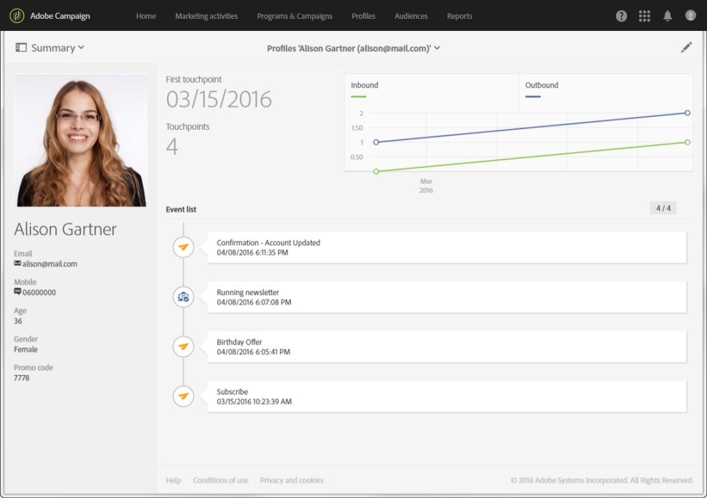

# About profiles{#about-profiles}

About profiles

Adobe Campaign lets you manage contacts throughout their entire life cycle: creation, import, targeting, action tracking, updates, etc. Contacts are stored in the database as profiles containing the information linked to them: last name, first name, address, subscriptions, deliveries, etc.

When you create campaigns, you can define the target of the deliveries by selecting profiles according to simple or advanced criteria. Technically, a profile is an entry in the database that contains all the information required for targeting, qualifying and tracking behaviours.

A profile can be: a client, a prospect, an individual subscribed to a newsletter, a recipient, a user, or any other denomination depending on your organization. To define various types of profiles, use [targeting dimensions](../../automating/using/query.md#targeting-dimensions-and-resources).

