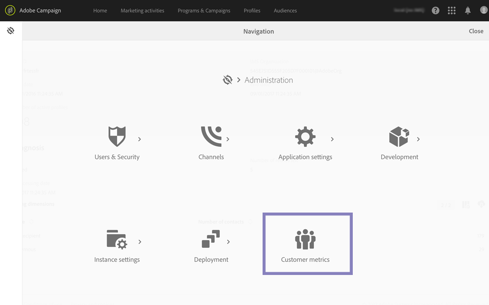
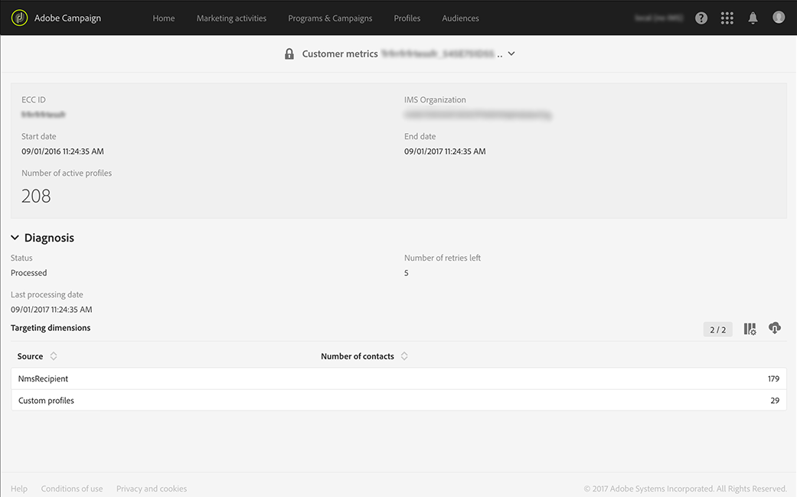

# Active profiles

Active profiles

Adobe Campaign provides a report that displays the number of active profiles. This report is only informative, it doesn't have a direct impact on billing. Only administrators can access this report, under **Administration > Customer metrics**. 

The **Billing** technical workflow generates every month a report containing the number of active profiles that were targeted during the last 12-month rolling period.

The profiles that were excluded during delivery preparation (typology rules, quarantines) are not taken into account. A profile that has been targeted by several deliveries will only be counted once. At the bottom of the report, you will find the list of active profiles for each targeting dimension.

