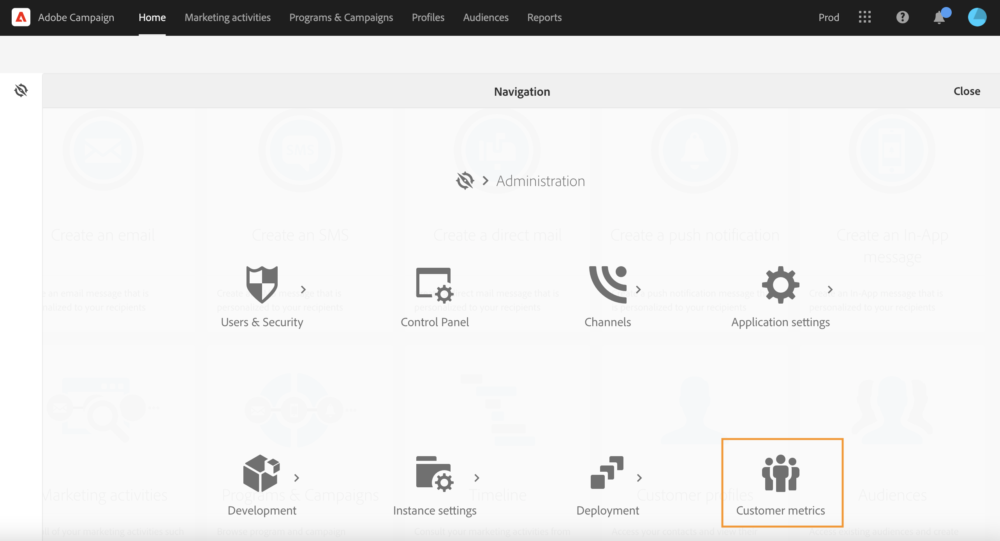
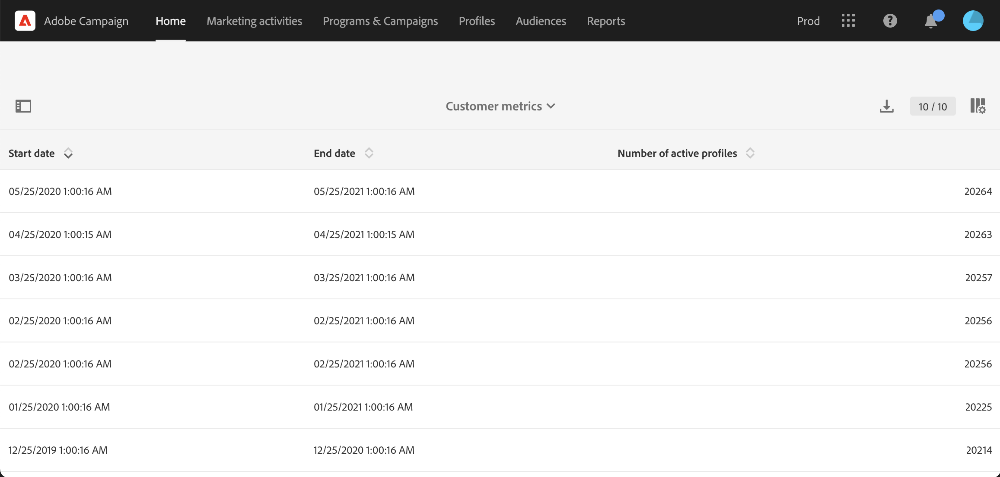

# Active profiles{#active-profiles}

You can access the active profiles details from the **[!UICONTROL Customer metrics]** report. This report is available to Campaign functional administrators only. To access this report, click the Adobe Campaign icon on the top left of the [user interface](../../start/using/interface-description.md#advanced-menu), and browse to **[!UICONTROL Administration > Customer metrics]**. 

This report is generated every month by the **[!UICONTROL Billing]** technical workflow and displays the number of **active profiles**. Learn more about technical workflows in [this page](../../administration/using/technical-workflows.md).

A “Profile” is a record of information representing an end-customer, prospect, or lead. Profiles are considered **active** if they have been targeted by a Campaign delivery within the past 12 months via any channel. 

According to your contract, each of your Campaign instances is provisioned with a specific number of active profiles. Please refer to your licence agreement for reference on number of purchased active profiles.

* The profiles that were excluded during delivery preparation (by typology rules or quarantine mechanism for example) are not taken into account. 

* Transactional Messages recipients are counted towards Active Profiles.

* A profile that has been targeted by several deliveries will only be counted once. 

* This report is only informative, it doesn't have a direct impact on billing. 

At the bottom of the page, the targeting dimensions are listed with the number of profiles for each. Recipients of Transactional messages are associated to the **Anonymous** dimension.

>[!NOTE]
>
>As an Admin user, you can also monitor the number of active profiles used on your instances directly from the Control Panel. For more on this, refer to the [Control Panel documentation](https://experienceleague.adobe.com/docs/control-panel/using/performance-monitoring/active-profiles-monitoring.html).
>
